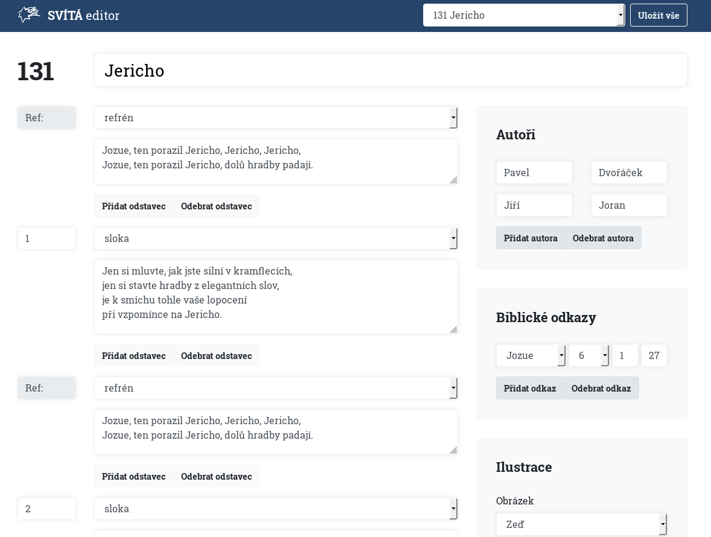

# Songbook Svítá in a machine readable format

Check out the [svita.json](svita.json) file for a JSON representation of the
Svítá song book.

Check out the [svita.md](svita.md) Markdown file to see what can be easily
generated from the JSON file.

**Any errors in the JSON file are most likely caused by the irregularities in
the original source which is this [PowerPoint presentation](https://www.evangnet.cz/materialy/liturgie/683-svita_texty_pro_dataprojektor)**
(not exactly the most reliable source).

## Editor

You can use the included editor to make changes to the JSON file in a very 
comfortable way.

First please clone / download this repo, then install node.js and download all
required dependencies with `npm install`.  Then you can try to launch the
editor with `npm run start`. A browser window should automatically open.
If not, the editor should be accessible at [http://localhost:3000](http://localhost:3000).

All your changes will be written to your copy of the `svita.json` file.
Please create a pull request to incorporate your changes back to the main repo.

