# Svítá 

## 1 A pak

*Slavie Radechovská, Jiří Scheider*

(1) A pak jsi šel a světlo pozhasínal a zanechal mne pustým tmám.

(2) A pak jsi šel a dveře pozavíral a zanechal mne samotám.

(3) A kámen přikryl jenom prach a srdce pod ním nezabuší jen tma, jen samota, jen strach.

(4) A pak jsi šel a řekl: Budiž světlo, a bleskem šlehá tvoje tvář.

(5) A pak jsi šel a řekl: Budiž světlo, a bleskem šlehá tvoje tvář.

(6) A pak jsi řekl: Co je prach a strach a samota a tma? Jsem přece živ a kdo jsou moji, jsou živi se mnou, se mnou stojí. Toť královské, to vyhlášení naděje. Dech jistoty, jež zavěje, dnes, zítra a pak, dnes, zítra a pak.

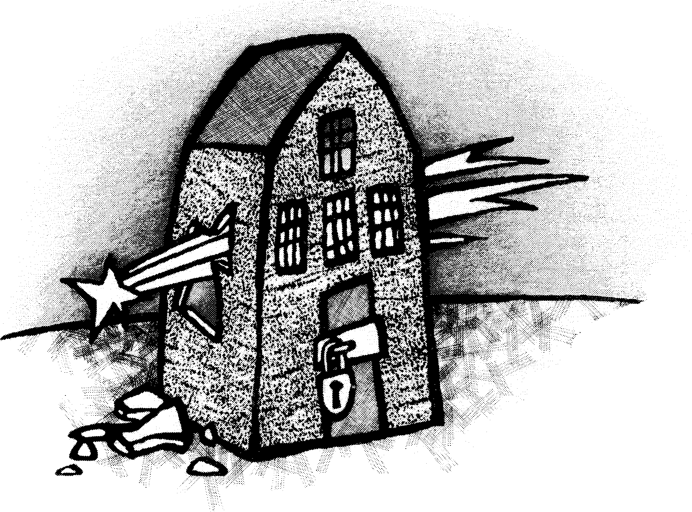

## 2 Kamení

*Zdeněk Šorm*

(1) Aj kamení volati bude až vjíždět bude Král a z lidské slávy nic nezbude hosana hosana dál zní

(2) Aj dveře otevřené v nebi a trouby zazní hlasem svým a rozlámány budou zbylé chleby a verš už nenalezne rým

(3) A trůn byl postaven a na trůnu sedět bude jaspisu obličejem bude podoben a vůkol trůnu duha bude

(4) A roucha starců kolem dvacetčtyři jak sníh bílých a hostina na stolech kolem a nové smlouvy kalich

(5) = 1

## 3 Aj, poslyšte, lidé

(1) Aj, poslyšte lidé, tu radostnou zvěst, že v Betlémě Ježíš se narodil dnes. Neb Bůh tak svět má rád, že Syna nám dal, by každý, kdož věří v něj, spasení vzal. Pán Bůh stále má rád tento svět.

(2) Však pastýři v temné se noci chvěli, když hvězdu nad Betlémem uviděli. Hned anděla Pán Bůh v té chvíli poslal, by více se nebáli, jim zvěstoval. Pán Bůh stále má rád tento svět.

(3) Aj, poslyšte, lidé, co v té zvěsti zní, abyste se nebáli budoucích dní. Vždyť proto dnes zpíváme, že přišel Pán, že v něm život nový je všem lidem dán. Pán Bůh stále má rád tento svět.

## 4 Alelu

*Vlastimil Maláč*

*Ref:* Alelu! Alelu! Sestro, bratře, pěj: Alelu! Neboť Pán vstal z hrobu, věřme mu. Setro, bratře, pěj: Alelu!

(1) Bůh nás slíbil zbavit vin, alelu, alelu, na zemi až bude Syn, aleluja!

(2) V Betlémě se narodil, alelu, alelu, aby do nás život vlil. Aleluja!

(3) Třicet roků šlapal zem, alelu, alelu, svoje ruce dával všem. Aleluja!

(4) Smrtí kříže umíral, alelu, alelu, a tak život za nás dal. Aleluja!

(5) Třetí den však z hrobu vstal, alelu, alelu, věčný život Bůh mu dal. Aleluja!

(6) A když chceme znovu žít, alelu, alelu, stačí v Kristu stále být. Aleluja!

## 5 Ó slyšte lidé

*Ref:* Aleluja, aleluja, aleluja, aleluja.

(1) Ó slyšte lidé přemilí, Ježíš Syn Boží jediný. Z mrtvých vstal v hodinu ranní, aleluja!

(2) Třetí den, když se rozednělo, vyhledat odešli tělo učedníci Ježíšovi. Aleluja.

(3) A Marie Magdalena a Salome i Jakuba pomazat spěchaly Pána. Aleluja.

(4) Před hrobem anděl bílý byl a takto ženy pozdravil: V Galilej šel Pán, pln je sil. Aleluja.

(5) Blažení, kteří nevidí a věrně i přesto věří, těm život nikdy neskončí. Aleluja.

(6) Při této slavnosti svaté teď s námi Boha pozdravte, děkujte, slávu volejte. Aleluja.

(7) Za to, co dobré nám dává, ať žádný z nás nepřestává, oddaně, vroucně dík vzdává. Aleluja.

## 6 Ave Maria

*Miloš Rejchrt*

(1) Ave Maria, Pán buď s tebou, ave, Bůh tě má rád, tobě nebude dítě kletbou, dívko, přestaň se bát.

*Ref:* Služebnice svého Pána požehnaná, ave, ave, ave Maria.

(2) Tebe národy chválit budou, Bůh ti výsadu dal. Přijal na milost dívku chudou z tebe zrodí se Král.

## 7 Ať jen svítí

*Miloš Rejchrt, František Šilar*

*Ref:* Ať jen svítí, ó, ať jen svítí tam na cestu tvou světlo věčné svítí tmou, ať jen svítí, ó, ať jen svítí tam na cestu tvou světlo věčné svítí tmou.

(1) Ať už se shůry, z důly valí světla proud tam na cestu tvou světlo věčné svítí tmou, vše špatné plamenem svým jasným spálí jako troud, tam na cestu tvou světlo věčné svítí tmou.

(2) Na co to světlo padne, to promění, tam na cestu tvou světlo věčné svítí tmou, co bylo nenápadné, je k vidění, tam na cestu tvou světlo věčné svítí tmou.

Verze (na melodii refrénu):

U hrobu stály, bály se bály, tam na cestu tvou světlo věčné svítí tmou, tu anděl Páně promluvil na ně, tam na cestu tvou světlo věčné svítí tmou.

## 8 Ať zvon zní

*Jiří Joran, Jaromír Plíšek*

(1) Ať zvon zní, dál z nebe nám zní, ať zvon zní, dál z nebe nám zní, ať zvon zní, dál z nebe nám zní. Jdi, Petře, rozhoupej zvon.

*Ref:* Jdi, Petře, rozhoupej zvon, jdi, Petře, rozhoupej zvon, ať chválou nebes klenbou zní, jdi, Petře, rozhoupej zvon,

(2) Pán napoví, kam matku mou vzal, Pán napoví, kam si matku mou vzal, Pán napoví, kam matku mou vzal. Jdi, Petře, rozhoupej zvon.

(3) Oh Peter go ringa dem bells. I heard f‘om heav‘n today.

*Ref:* I heard f‘om heav‘n today. I thank God an'I thank you too I heard f‘om heav‘n today.

(4) I wonder where my mother is gone. I heard f‘om heav‘n today.

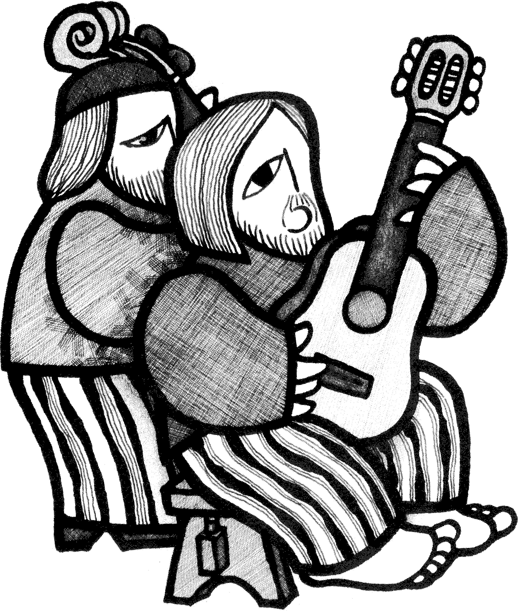
<i>...saka ani srdce nemaj upjatý...</i>

## 9 Amen

*Jaromír Plíšek*

*Ref:* Amen, amen, amen, amen, amen.

(1) Dítě malé, chudé v chlévě leží, svítá věk příští.

(2) Dvanáct roků starý v chrámě moudře mluví, žasnou, kdo to slyší.

(3) Pak na břehu mořském zástup mocné učí, sytí a léčí.

(4) S učedníky svými k večeři si sedá, těší je a hostí.

(5) Poslušný a tichý v zahradě se modlí, v sevření těžkém.

(6) Nevěrným a tupým na smrt se vydává, však z hrobu vstává.

(7) Haleluja, připravil nám místo v království svém!

*Ref:* Amen, amen, amen, amen, amen.

(8) See the baby, lying in the manger, on Christmas morning.

(9) See him in the temple, talking to the elders, how they marvelled at his wisdom.

(10) See him at the seaside, preaching and healing, to the blind and feeble.

(11) See him in the garden, praying to his father, in deepest sorrow.

(12) Yes, he is the Saviour, Jesus died to save us, and he rose on Easter!

(13) Halleluja, in the Kingdom, with my Saviour!

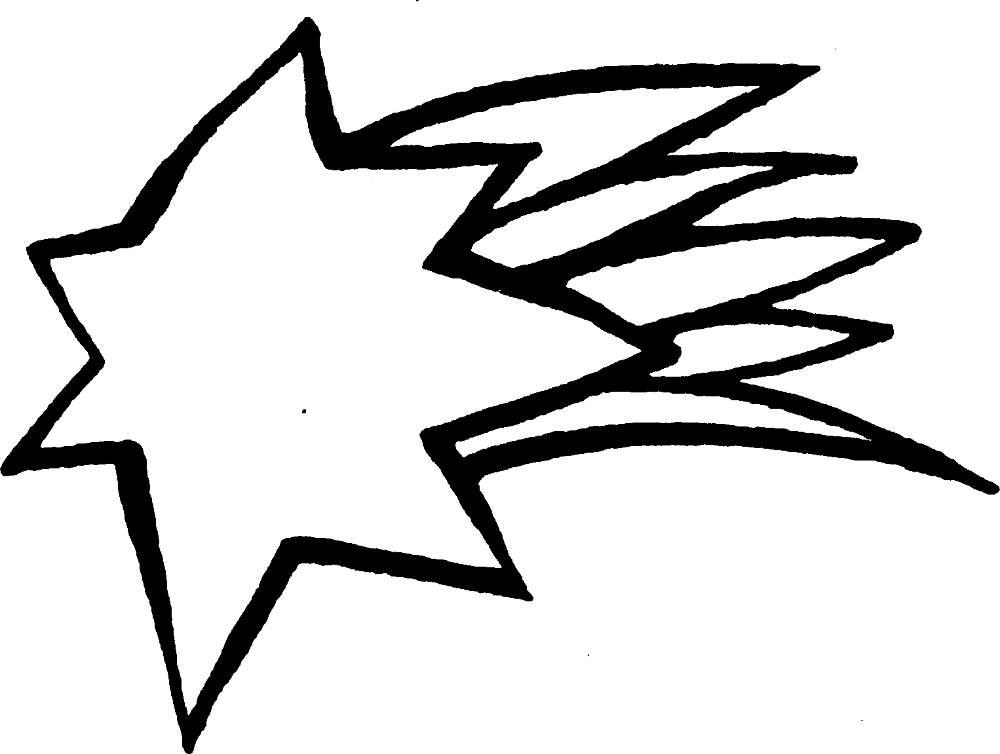

## 10 Až přijdeš Pane znova

*Štěpán Hájek*

(1) Až přijdeš, Pane, znova, na tenhleten svět, pak stáhnou svoje slova i kandidáti věd. Uklizečky začnou zpívat hosana,

a jejich šéfové taky, radujou se plešatý i s vlasama

a jejich manželky taky Až přijdeš, Pane, znova, na tenhleten svět.

(2) Mám jednu velkou starost vo kostelovej lid že nebude mít radost že nebude mít klid protože seš voháknutej nevhodně

a to nám tak trochu vadí působí to na nás jaksi podvodně

a taky nejsme už mladí mám jednu velkou starost vo kostelovej lid

(3) Tak sundej háro mastný a kecku děravou my nemůžem bejt šťastný s nohou smradlavou nám se líbí vymydlená kravata

a taky blejskavý botky tvoje kalhoty jsou samá záplata

pod nima koukaj ti spodky tak sundej háro mastný a kecku děravou

(4) Tak prosím Pane znova za stovky marnejch vět odpusť nám ty slova co nevrátěj se zpět odpusť nám ty naše řeči silácký

tak rádi šlapem a dupem seber nám ty pyšný mozky chytrácký

a hlavy naplň svým duchem tak prosím Pane znova stovky marnejch vět

(5) = 1.

## 11 Večerní modlitba

*Petr Ženatý*

(1) Až se dnes večer sešeří, přijď na kus řeči, Pane, k nám. Budu tě čekat u dveří. Budu v ten večer zcela sám. Ten smutek, který v sobě mám, mé kafe se mnou večeří. Jsem Tomáš, který nevěří, přijď na kus řeči, Pane, k nám.

(2) Slyšel jsem v noci dětský pláč, snad jenom ty jej tišit znáš. Slyšel jsem svištět karabáč. Proč, Pane, slzy v očích máš? Proč obraz svůj tak proklínáš? Voják je jeden rudý fáč, člověk je, Pane, špatný hráč. Snad jenom ty jej tišit znáš.

(3) Když volám v noci z plných plic, tak proč mne stále nechceš znát, do kanónů a pumovnic, že se zde, Pane, musím bát! Vím, že zde musím dále stát a strach je větší čím dál víc, hleď, Pane, co tu stojí svíc, tak proč mne stále nechceš znát?

(4) Až se dnes večer sešeří já zase budu zcela sám, ať už mně někdo uvěří, přijď na kus řeči, Pane, k nám. Ten smutek, který stále mám, mé kafe se mnou večeří. Budu tě čekat u dveří, přijď na kus řeči, Pane, k nám.

## 12 Až svatí půjdou v onen den

*Jaromír Plíšek*

(1) Až svatí půjdou v onen den, až svatí půjdou v onen den, já bych rád při tom byl, můj Pane, až svatí půjdou v onen den.

(2) Až slunce svítit přestane …

(3) Až měsíc svítit přestane …

(4) Až hvězdy svítit přestanou …

(5) Až stane vše před trůnem tvým …

(6) Nebeský band až začne hrát …

(7) Oh when the saints go marchin' in, oh when the saints go marchin' in, I want to be among the number, oh when the saits go marchin' in.

(8) And when the stars begin to shine …

(9) When Gabriel blows in his horn …

(10) And when the sun refuse to shine …

(11) And when they gather round the throne …

(12) And when they crown him King of Kings …

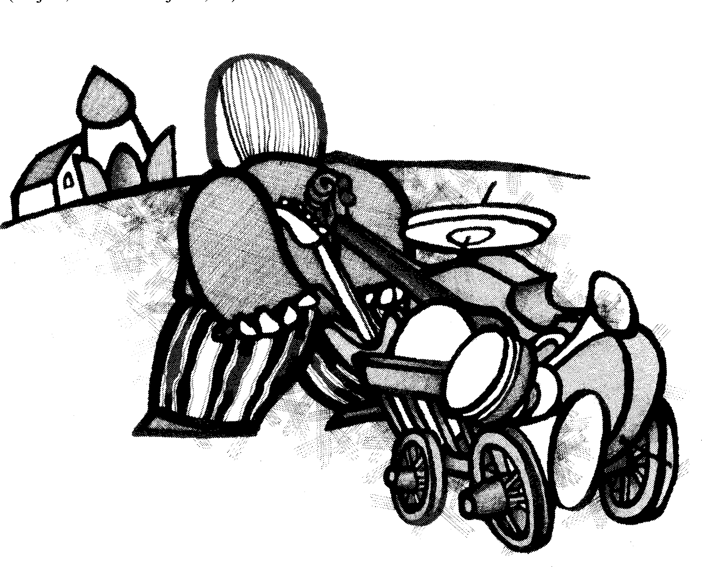

## 13 Až usnu navždy jedenkrát

*Zdeněk Šorm*

(1) Až usnu navždy jedenkrát až usnu navždy jedenkrát na dlouhou cestu se budu brát až usnu navždy jedenkrát

(2) tam najdu novou lepší zem tam najdu novou lepší zem vrata jsou otevřený všem tam najdu novou lepší zem

(3) tam nebudou už pomluvy jó nebudou tam pomluvy nebudem se drbat za zády jó nebudou tam pomluvy

(4) a nebude tam svár a stres jó žádnej žádnej žádnej stres pudem se kouknout do nebes a nebude tam svár a stres

(5) a nikdo tam nebude lhát jó nikdo tam nebude lhát nebude chtít se jiným zdát jó nikdo tam nebude lhát

(6) nebude tam mlčení bezmocný řeči hledání tam každej bude slova mít aby moh lásku vyjádřit

(7) a nebudem mít v srdci hráz jó žádnou žádnou žádnou hráz najít druhýho půjde snáz dyť nebudem mít v srdci hráz

(8) až usnu navždy jedenkrát až usnu navždy jedenkrát jazzband mi pochod musí hrát dyť na dlouhou cestu se budu brát

## 14 Podobenství o hostině

*Pavel Dvořáček*

(1) Báječnej bál uspořádal králů Král všechny pozval dál ten největší sál na to obstaral neboť se bál aby všem moh říct pojďte dál začíná bál bálů bál.

(2) Ó Pane můj proč právě dnes v plánu mám zrovna jinej ples ze všech pozvaných mluvil náhle strach že se připraví zas o jeden tah když ale ten bál byl mimo plán mimo plán.

(3) Král však ten bál neodvolal zvát šel dál než by kdo čekal ani žádná mříž ba ani ten hřích nezabrání tomu kdo vejít chtěl by na ten bál báječnej bál bálů bál.

## 15 Betlémská hvězda

*Jaromír Plíšek*

(1) Betlémské hvězdy zář na nás dotírá, vstávej, pojď za tou hvězdou. Vede nás tam, kde spásy věk začíná, vstávej, pojď za tou hvězdou.

*Ref:* Nech svůj dům a nech svůj hrad, vstávej, pojď za tou hvězdou. Práci svou nech v koutě stát, vstávej, pojď za tou hvězdou. Vstávej, vstávej, vstávej, pojď za tou hvězdou. Betlémská hvězda září tmou. Vstávej, pojď za tou hvězdou.

(2) Pozoruj, co ti říká Bůh,náš Pán. vstávej, pojď za tou hvězdou. Nech svůj spěch, nech ho být, nezůstaň s ním sám, vstávej, pojď za tou hvězdou.

## 16 Píseň Kálefova

*Štěpán Hájek*

(1) Blues unavenejch lidí zní mi teď do uší kdo z vás cestu vidí kdo smutek přeruší v mých očích otázka stojí když putuješ pískem pouští koho se tvé srdce bojí před kým se tvá mysl spouští

(2) Kam poděla se víra v Hospodina živého proč naděje zmírá nespoléhá na něho jenom ať nám neublíží majitelé naší země bázlivě k nim oči vzhlíží a budoucnost vidí temně

(3) Blues unavenejch lidí zní mi teď do uší kdo z vás cestu vidí kdo smutek přeruší v mých očích otázka stojí když putuješ pískem pouští koho se tvé srdce bojí před kým se tvá mysl spouští

## 17 Bojujte, bojujte dál

*Miloš Rejchrt*

*Ref:* Bojujte, bojujte dál, bojujte, bojujte dál. Pohleďte jen, v dálce svítá, pohleďte jen, dne nás vítá, bojujte, bojujte dál.

(1) Zpříma choďte, pozdvihněte hlavu, i když pro vás vavřín neroste, nechte mocným moc a slavným slávu, o jejich se přízeň neproste.

(2) Kdo se ani zlatem koupit nedá, nemlčí a s proudem nepluje, spravedlnost kdo ve světě hledá, v jedné řadě s námi bojuje.

(3) K útěku-li z boje chytrost radí, holubičí mějte prostotu. Opatrní buďte jako hadi, nezběhněte z cesty k životu.

*Ref:* Bojujte, bojujte dál, bojujte, bojujte dál. Pohleďte jen, v dálce svítá, pohleďte jen, dne nás vítá, bojujte, bojujte dál.

(4) Bojujte, však pomstu nechte Pánu, on je soudce a sám určí trest. Prohraje, kdo ranou splácí ránu, k nenávisti kdo se nechá svést.

(5) Neusněte, ať vejdete zítra v zemi novou, v zaslíbenou vlast. Nocí ať vás vede příslib jitra, vládou temna nenechte se zmást.

## 18 Buď Bohu všechna chvála, čest

*Adam z Otradovic Michna, Luděk Rejchrt*

(1) Buď Bohu všechna chvála, čest a požehnání, že uslyšet jsme mohli zvěst o zmrtvýchvstání. V úsvitu ještě ztemnělé velikonoční neděle hrob životu je dán, když vyšel z něj náš Pán.

(2) A od té chvíle život ten už nepřestává. I ve tmách vzchází každý den Otcova sláva. Hle, vzkvétá znovu planý fík a vždycky nový učedník se k církvi přidává, když Krista vyznává.

(3) Království Boží víc a víc k nám všem se blíží. Když on vstal z mrtvých, pak už nic nám neublíží. Jen jemu důvěru dejme a v jeho slibech doufejme, vždyť naši slabost zná moc jeho vítězná.

## 19 Buď stráží ústům mým

*Jana Nagajová*

(1) Buď, prosím tě, Hospodine, stráží ústům mým! Buď, prosím tě, Hospodine, stráží ústům mým! Ať v nich žádná marnost místo nemá, pomluvy ni slova lichotná, pokrytectví, závist, lež a zloba, buď vždy stráží ústům mým. (2x)

(2) Uč mne, Pane, slovo každé velmi vážně brát! Uč mne, Pane, slovo každé velmi vážně brát! Ze slov tobě jednou vydám počet, ty i prázdná slova znamenáš,

usvědčuj můj jazyk vždy, když hřeší, uč mne slovo vážně brát! (2x)

(3) Vyčisť, Pane, moje srdce, pramenem je slov, vyčisť, Pane, moje srdce, pramenem je slov! Vím, že moje ústa jen to řeknou, co je na dně duše ukryto, čím je celé srdce přeplněno, vyčisť, Pane, pramen slov! (2x)

## 20 Buď tobě sláva

*Samuel Verner*

(1) Buď tobě sláva, jenž jsi z mrtvých vstal! Smrt již nemá práva, vítěz tys a král! Jasný jako plamen anděl sestoupil, odvalen je kámen, prázdný hrob tu zbyl.

Buď tobě sláva, jenž jsi z mrtvých vstal! Smrt již nemá práva, vítěz tys a král!

(2) Toť on, toť Ježíš, jejž jsi spatřit chtěl, nepochybuj, věř již! Živ je Spasitel. Vzchop se, stádce malé, v boje pomezí heslem tvým buď stále: Kristus vítězí!

Buď tobě sláva, jenž jsi z mrtvých vstal! Smrt již nemá práva, vítěz tys a král!

(3) On, Kníže míru na věky je živ; silnou má teď víru ten, kdo bál se dřív. Vítězem se stává, kdo zde trpěl s ním. Život v něm i sláva, nic se nebojím.

Buď tobě sláva, jenž jsi z mrtvých vstal! Smrt již nemá práva, vítěz tys a král!

## 21 Přímluva

*Miloš Rejchrt*

(1) Buď vůle tvá, buď vůle tvá, buď vůle tvoje všude tam, kde chudé trápí nouze, hlad, v boji musí umírat, buď vůle tvoje všude tam, kde jiní mají všeho dost, vládne mír a lhostejnost, buď vůle tvoje všude tam.

(2) Buď vůle tvá, buď vůle tvá, buď vůle tvoje všude tam, kde lidé v koutku potají pravdu si jen šeptají, buď vůle tvoje všude tam, kde vládne strach a obavy, násilí, lež, bezpráví, buď vůle tvoje všude tam.

(3) Buď vůle tvá, bud'vůle tvá, buď vůle tvoje všude tam, kde není radost, jásot ztich', zmlkly zpěvy, zmizel smích, buď vůle tvoje všude tam, kde zdá se, že vše marné je, kde vyhasla naděje, buď vůle tvoje všude tam.

(4) Buď vůle tvá, buď vůle tvá, buď vůle tvoje všude tam, kde lidé svoji lidskou tvář kladou modlám na oltář, buď vůle tvoje všude tam, kde otrokem je člověk rád, svobodným se bojí stát, buď vůle tvoje všude tam.

(5) Buď vůle tvá, buď vůle tvá, buď vůle tvoje všude tam, kde únava a zklamání vzaly lásce trvání, buď vůle tvoje všude tam, kde přišly stíny života, bolest, nemoc, samota, buď vůle tvoje všude tam.

## 22 Bůh je naše radost

*Zdeněk Coufal*

*Ref:* Bůh je naše radost: Ať píseň slavně zní! Chval jej všechno stvoření.

(1) Ať jej slunce chválí, měsíc, světlo hvězd, ve vesmírné dáli vzdávají mu čest.

(2) Ať jej bouře chválí, kroupy, vítr, sníh, země s svými králi, zástup v nebesích.

(3) Dospělí i malí, připojte se k nim, každá chvíle chvály je dnem svátečním.

(4) Ne vždy vše se daří, přichází i strach, Boží světlo září ve všech temnotách.

## 23 Bůh je záštita má

*Dana Vejborová-Tesařová*

*Ref:* Bůh je záštita má, Bůh je záštita má. Bůh je záštita má, s ním nemusím se bát.

(1) Nevím, co mi zítřek tají, strasti bez konce se zdají, mraky cestu zakrývají, ale Bůh je spása má.

(2) Každý den od procitnutí k nové honbě štvát mě nutí, nikde místa k spočinutí, jenom v Bohu najdu mír.

(3) Kolem svět se rve a plení lidské vztahy zlato mění, Bože, dej, ať v pokušení vím, že ty se staráš sám.

## 24 Boj na zemi

*Svatopluk Karásek*

*Ref:* Byl boj na nebi, s drakem rval se Michael, byl boj na nebi s drakem zlým, lstivým, drak na zem z nebe je svržen, ten boj na zemi trvá dál.

(1) Michal spolu s anděly, byl boj na nebi, ďábla z nebe shodili, byl boj na nebi. Nezahynul sviňák ten, byl boj na nebi, ale pad na naši zem, je boj na zemi.

(2) Mezi dobrem, mezi zlem je boj na zemi, den co den se všichni rvem, je boj na zemi, v srdcích mužů, v srdcích žen je boj na zemi, ten drak musí být přemožen, je boj na zemi.

(3) Drak to prohrál s Michalem, ten boj na nebi, prohraje i v srdci tvém, ten boj na zemi. Když tě síly opouští je boj na nebi, s Kristem prohrál na poušti svůj boj na zemi.

*Ref:* Byl boj na nebi, s drakem rval se Michael, byl boj na nebi s drakem zlým, lstivým, drak na zem z nebe je svržen, ten boj na zemi trvá dál.

(4) Často musím uznat sám, je boj na zemi, že ten svůj boj prohrávám, je boj na zemi, vždyť to zvíře pitomý, je boj na zemi, ztupilo mi svědomí, je boj na zemi.

(5) Když Ježíš na tvé straně je, je boj na zemi, boj s tebou drak prohraje, je boj na zemi, pak připadnou ti legrační, je boj na zemi, i jeho svody finanční, je boj na zemi.

(6) Bojím se, že v soudný den je boj na zemi, lehkým budu nalezen, je boj na zemi. Snad se v nebi ustrnou, je boj na zemi, nad mou duší hubenou, je boj na zemi.

## 25 Byl jsi tam?

*Miloš Rejchrt*

(1) Byl jsi tam, když byl křižován můj Pán byl jsi tam, když byl křižován můj Pán?

*Ref:* Nezapomeň na tu chvíli, kdy ho všichni opustili, byl jsi tam, když byl křižován můj Pán?

(2) Byl jsi tam, když bděl v Getsemane sám?

(3) Byl jsi tam, když byl Petrem zapíráni

(4) Byl jsi tam, když byl Ježíš bičován?

(5) Byl jsi tam, když klesal pod tíhou ran?

(6) Byl jsi tam, když na kříži skonal Pán?

(7) Byl jsi tam, když byl křižován můj Pán?

## 26 Blues

*Štěpán Hájek*

(1) Byl tu s náma jeden bráška a měl s sebou nákej splín (x2) a pořád smutně koukal, asi něco chybělo mu, ňáká náruč, jo ňáká náruč, ňákej klín.

(2) Byla tady taky holka, jen tak trochu praštěná (x2) a porád chtěla chlapa, že prej bez něj připadá si jak brambora, jó, jak brambora maštěná.

(3) Byl tu s náma taky děda, život ho, prej, votrávil (x2) a porád jenom fňukal, bejt tak ještě jednou mladej, všechno bych to, jo, všechno bych to napravil.

(4) Byla tady taky bába, stará jako tenhle svět (x2) a porád jenom čekala šestadvacátýho vnuka, zatím je jich, jo zatím je jich dvacet pět.

(5) Byl tu s náma taky chlápek, ruce jako lopaty (x2) a porád jenom zuřil, že se u vod jistý doby lepí smůla, jo, lepí smůla na paty.

(6) Byla tady taky ženská, nervy nesla v kyblíku (x2) a porád jenom spala, ale sem tam začala řvát vodprejskni ty, jo, vodprejskni, ty, pytlíku.

(7) Byl tu s náma taky farář, zamračený jelito (x2) a porád něco hledal, radost má na dosah ruky, ale on furt, ale on furt neví to.

(8) Byl tu s náma taky fízl, třetí čaj a noviny (x2) a porád jenom brblal a nadával na poměry, že prej chce bejt, jo, že prej chce bejt bez viny.

(9) A byl tu s náma taky mrzák, chybělo mu toho moc (x2) a porád jenom mlčel, večer si přál, aby byla poslední už, jó, poslední už tahle noc.

(10) . A bylo tady taky děcko, zakřiknutě koukalo (x2) a porád chtělo mámu, a to je právě je ten trapas, vono žádnou, jo, vono žádnou nemělo.

(11) . Byl tu s náma taky jeden, ten byl hrozně žíznivej (x2) a porád jenom skuhral, že když nemá dva dny pivo, cítí pocit, jó, cítí pocit trýznivej.

(12) . Bylo tady lidí moře, jestli pak sis vůbec všim (x2) a tak už něco dělej, nestačí mít jenom pravdu, pravda není, jó, pravda není vůbec vším.

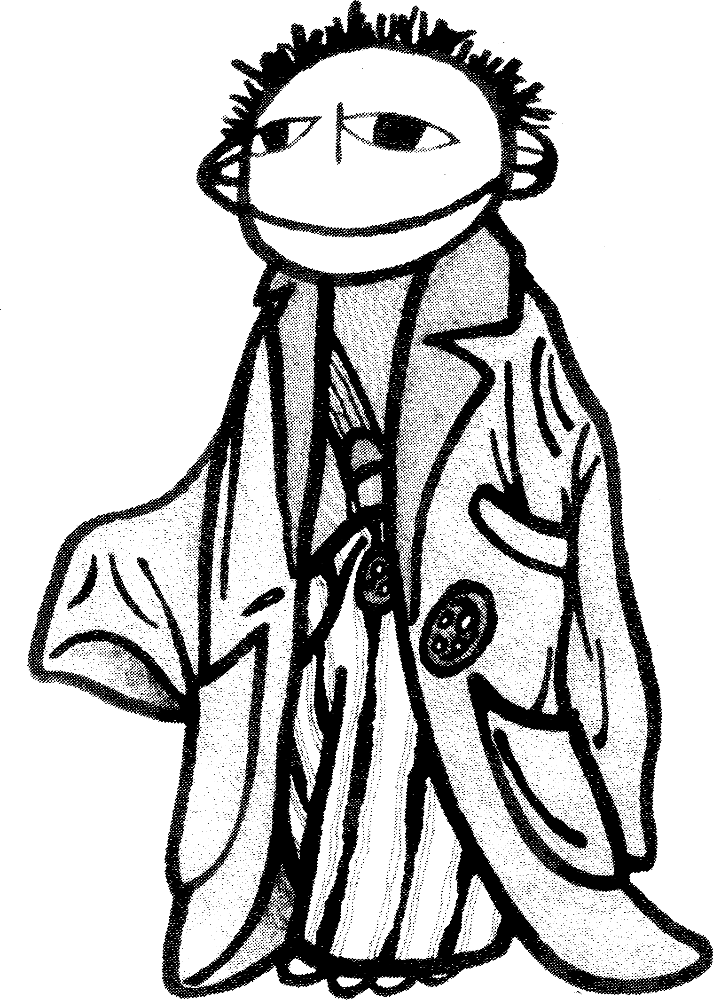

## 27 Rok raz dva

*Bohdan Pivoňka*

*Ref:* Bylo to v roce raz dva ? Ne ! Ne ! V roce raz dva, ó ne, ne, ne ! Vždyť dnes se pro nás Ježíš narodil. Bylo to v roce raz dva ? Ne, ne ! V roce raz dva ? Ó ne, ne, ne ! Vždyť dnes se pro nás Ježíš narodil.

(1) Řekneš si, je to jen žert, dech minulých let. Svět je dneska o kus dál, nemůže jít zpět. Ženeš se zas dopředu, přidáš plyn a pak – když jsi tam, co chtěl jsi být, prázdný klopíš zrak.

(2) Víra se dnes nenosí, jinou módu znáš. Peníze a úspěchy vždycky uvítáš. Předplatíš si blahobyt, nacpeš ledničku. Z marnosti tak dostaneš čistou jedničku.

*Ref:* Bylo to v roce raz dva ? Ne ! Ne ! V roce raz dva, ó ne, ne, ne ! Vždyť dnes se pro nás Ježíš narodil. Bylo to v roce raz dva ? Ne, ne ! V roce raz dva ? Ó ne, ne, ne ! Vždyť dnes se pro nás Ježíš narodil.

(3) K televizi sedneš si, doma začneš snít… V tomhle snu snad zdá se ti, že vše můžeš mít. Vším se pěkně obklopíš, míříš v hvězdný prach. Až tak mocně vyrosteš, poznáš, že máš strach.

(4) Stojíš frontu na kapra, sháníš o stošest, ať ti dárky pod stromkem udělají čest. Vánoce přec svátky jsou, pokoj chceš mít, klid…. Mír jen Kristus přinese, vyprostí tě z bíd.

## 28 Celé věky čekaly

*Václav Renč, Jan (Křtitel) Václav Renč*

(1) Celé věky čekaly, kdy přijde Pán, aby lidem věčný život dal. Celé věky čekaly, kdy přijde Pán, Celé věky čekaly by dál, (: kdyby tvá láska, Pane, nejvyšší, se nevtělila v Kristu Ježíši.:)

(2) Celé věky čekaly, kdy přijde mír, aby tygr s laní svorně pil. Celé věky čekaly, kdy přijde mír, jenž by bouře světa utišil. (: A jen tvá láska, Bože, příteli, mír nepokojným srdcím udělí. :)

(3) Celé věky čekaly na nový chléb, který by i duši nasytil, a Duch Boží praví, že jsi ty ten chléb, pramen světla, pokoje a sil. (: A že tvá láska, Pane jediný, nás očekává u své hostiny. :)

## 29 Sny dojdou dál

*Pavel Dvořáček*

(1) Celou noc hloubám, kudy se dát, k ránu se zouvám, raděj jdu spát.

*Ref:* Mé sny tam dojdou spíš nežli já. Né nemusí zoufat ani doufat, dojdou dál. Mé sny tam dojdou, jsou nad zemí, jít cestou přímou nic nebrání

(2) Kde je má chýše, kde domov můj? Nějaká skrýše, kde bych byl svůj.

(3) Rady si nevím, když slyším tvůj hlas, čím víc se pachtím, tím vyšší dělí nás hráz.

Závěr

V dálce už svítá království tvé, prý se nás týká, jak podivné. Mé sny tam dojdou, já ale též, né nemusím zoufat, dojdeme dál, dojdeme dál, dojdeme dál.

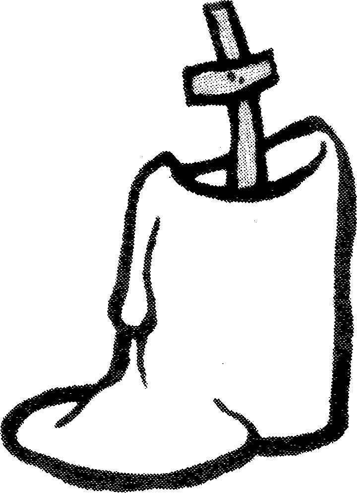

## 30 Žalm Kaifášův

*Miloš Rejchrt*

*Ref:* Co já zkusím, co všechno musím, mějte trochu pochopení, ach, jaké břemeno je na mne vloženo, to snad není k unesení.

(1) To nikdo nedokáže kázat tak jak on káže jeho podobenství by se měly zapsat a blahoslavenství to je soubor zásad co mně mluvěj z duše hezky řek minule že zahynulé přišel zachránit nebo že se vrátí život tomu kdo ho ztratí pro spravedlnost má moje sympatie to je osobnost

*Ref:* Co já zkusím, co všechno musím, mějte trochu pochopení, ach, jaké břemeno je na mne vloženo, to snad není k unesení.

(2) Nemocné hravě léčí a tím právě vzniká nebezpečí lidi jdou za ním nerozvážně co říká začínaj brát příliš vážně má moje sympatie jenomže jsou tu římský legie a Pilát krvavá bestie co říká je krásný ale moc předčasný nechápe že někdy není zbytu že třeba vzít vážně realitu a na tu jsme všichni krátký třeba se držet trochu zpátky má moje sympatie myslíme si totéž oba jenomže je zlá doba neprorazíš hlavou zeď zvláště ne teď.

*Ref:* Co já zkusím, co všechno musím, mějte trochu pochopení, ach, jaké břemeno je na mne vloženo, to snad není k unesení.

(3) Neříkám že není v právu ale ty jeho řeči o meči pletou lidem hlavu mám strach aby nás nezatáh do maléru má moje sympatie ale city musej stranou nemám na vybranou ze dvou zel to menší beru vzhledem k této těžké chvíli s ohledem na situaci abychom ochránili budoucí generaci abychom zachovali chrám měli kde Boha chválit proto pravím vám musí jeden člověk zemřít za lid.

## 31 Úterý končí středou

*Jaromír Plíšek*

(1) Co má se dít, kam mám dnes jít, tak mý myšlenky předou, den proflákat, noc probendit, úterý končí středou. Kam, příteli můj, se potácíš, co trápí, duši tvou? Je spousta cest a já nevím kam vedou...

(2) Na co mám vsadit život svůj? Tak mý myšlenky předou. Mám pivo pít? Či ctnostně žít? Úterý končí středou. Africký děti prej dál maj hlad a já nevím co s tím! Je spousta cest a já nevím kam vedou...

(3) Jak mám po ostří dýky jít? Tak mý myšlenky předou, nespadnout sem, nespadnout tam, úterý končí středou. Mám na místě stát, či blbě se dát, co lepší je, kdo ví? Je spousta cest a já nevím kam vedou...

(4) Mám chlebem se cpát a nevnímat lež, tak mý myšlenky předou. Měj upřímně rád a dělej co chceš, úterý končí středou. Kde lásku vzít a nekrást, jak v mále věrný být? Je spousta cest a já nevím kam vedou...

(5) Pokojně žít, v svých kolejích jít, tak mý myšlenky předou, posvátnej kraj, či urnovej háj, úterý končí středou. Ve jméno Krista doufáme, co to jen znamená? Je spousta cest a já nevím kam vedou…

## 32 Co máme, je od Pána

*Petr Chlouba*

*Ref:* Co máme, je od Pána, všechno dobré on sám zdarma rozdává, haleluja, co máme, je od Pána, všechno dobré on sám zdarma rozdává.

(1) Tak už pojď. Je tu pramen pro ty, kdo žízní. Jen se napij vody jiskřivé. Ty, Pane, dáváš Slovo své tomu, kdo má srdce pokorné.

(2) Hledej tam, kde je láska, radost a pokoj. To, po čem toužíš, věčně můžeš mít. Ty, Pane, dáváš Ducha svého těm, kteří jsou srdce upřímného.

(3) Nečekej, skloň se níž a nabírej čistou vodu života do dlaní svých. Ty, Pane, dáváš dary své těm, kteří chválí jméno Tvé.

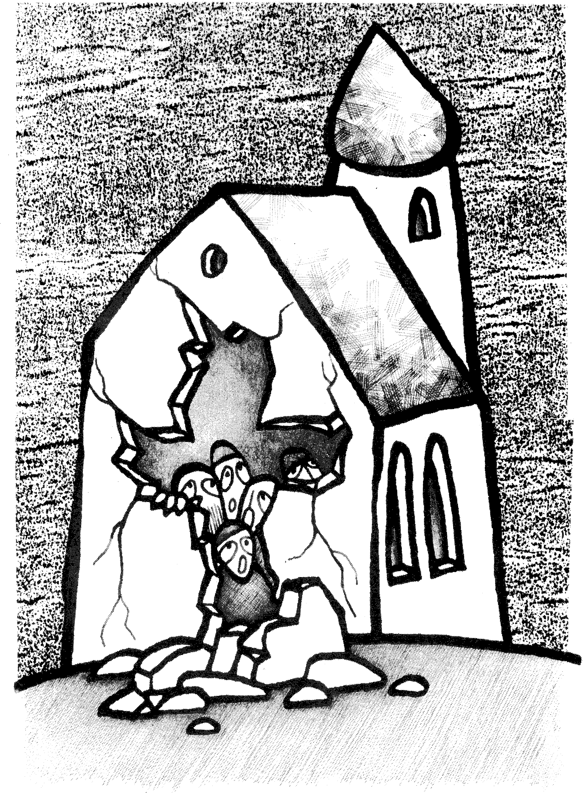
<i>...mám jednu velkou starost o kostelovej lid...</i>

## 33 Lot v Sodomě

*Bohumil Kejř, Jan Kočnar*

(1) Co udělají moudří muži, když stádům pastva nestačí? Abraham nepovede spory, s Lotem se raděj rozloučí. A rozloučí se po přátelsku: ať si Lot klidně vyvolí, který kraj se mu více líbí, hory či dole v údolí.

*Ref:* Kdo vidí smysl svého žití jen v blahobytném živobytí, ten na své počty doplatí, na ně doplatí, lálálálálá, Co ještě dnes tak dobře sype, se v okamžiku rozesype a v troskách budeš plakati, budeš plakati.

(2) Lot cítí: Měl bys nechat strýce, ať zvolí, kam se bude brát. Má strach, že přijde zkrátka, nechce se nechat obehrát. Ta rovina tam i Jordánu jej přitahuje k sobě blíž. Že Sodoma je hříchu hnízdo, Lote, slepý, nevidíš!

*Ref:* Kdo vidí smysl svého žití jen v blahobytném živobytí, ten na své počty doplatí, na ně doplatí, lálálálálá, Co ještě dnes tak dobře sype, se v okamžiku rozesype a v troskách budeš plakati, budeš plakati.

(3) Tak Lot se dostal do Sodomy. Je lepší palác nežli stan. V pohodlí na zlé navykl si, byl srdcem k městu připoután. A nevidí, že Boží ruka‚ nad Sodomou už vztažena, neslyšně trest se k městu blíží, sodomských vina spočtena.

*Ref:* Kdo vidí smysl svého žití jen v blahobytném živobytí, ten na své počty doplatí, na ně doplatí, lálálálálá, Co ještě dnes tak dobře sype, se v okamžiku rozesype a v troskách budeš plakati, budeš plakati.

(4) Co v soudu ohně všechno hyne, co živého je v Sodomě, Lot zázrakem sám zachráněn je, má po majetku, po domě. I žena jeho zkamení tam a dcery jsou teď vdovama. Sodoma byla Lotu léčkou s prázdnýma jde teď rukama.

*Ref:* Kdo vidí smysl svého žití jen v blahobytném živobytí, ten na své počty doplatí, na ně doplatí, lálálálálá, Co ještě dnes tak dobře sype, se v okamžiku rozesype a v troskách budeš plakati, budeš plakati.

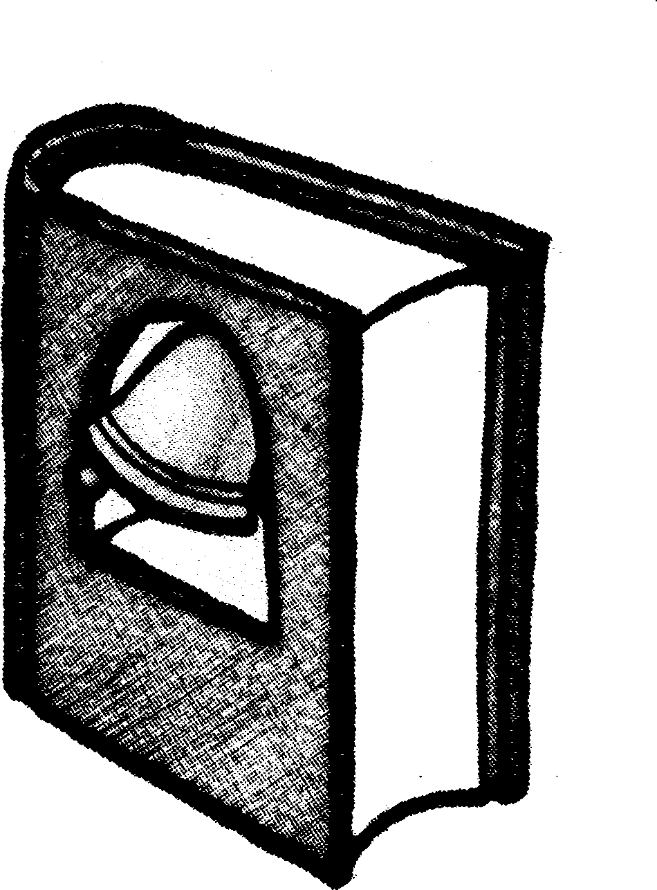

## 34 Miluj a pochopíš

*Jiří Bassano*

Často jsem toužil důvod znát, prosil jsem tebe napořád: Řekni, proč bolest je a žal, proč svět Krista nepřijal? Jedinou větu, řekls‘ mi, Pane, jediné slovo stačí mi již, ucítím sílu, uvidím světlo, ve kterém chápu, proč je zde kříž.

Miluj, mi prostě říká Pán, miluj, a odpověď ti dám: Najdeš i v strastech ruku mou. Odpovíš pak láskou.

(1) Liebe, und du verstehst das Leid, liebe, dan findest du dich Freud, liebe, und du bist endlich frei – und dein Leben wird neu.

(2) Ama, ancora dici a me. Ama, e capirai perche. Ama, non restera il dolor, troverai l‘amor.

(3) Miluj, a nepýtaj sa nič, miluj, a všetko pochopíš. Miluj, bolest sa rozíde, v láske sa ztratíš.

(4) Love! And you‘ll be happy too. Smile! Help one who‘s next to you. Try it! You‘ll find it‘s really true – that your live can be new.

(5) Ljubi meňa, vsegda pobudíš, ljubi, i buděš panimať. Ljubi, balezň potom prajďot, ljubot astanětsja.

(6) Aimer, chaqun comme un ami, aimer jusqu‘a donner sa vie. Aimer per dela les douleurs, c‘est trouver le bonheur.

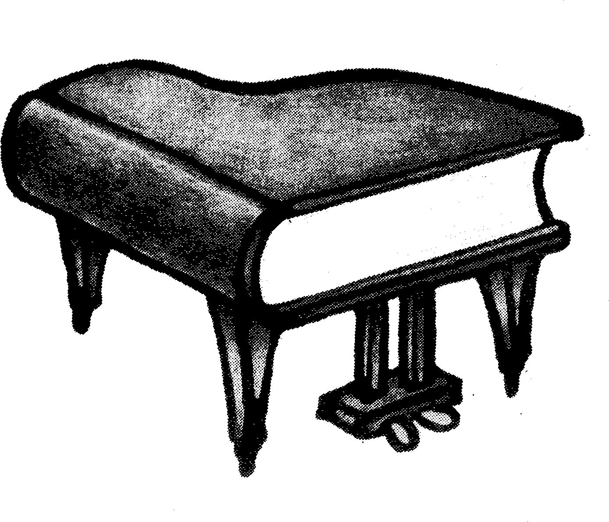

## 35 Čekám na to stále

*Jiří Joran*

*Ref:* Čekám na to stále, čekám na to stále, čekám na to stále, že uzřím Jeruzalém tak jak Jan.

(1) Jan řekl, že město do čtyř stran, uzřím Jeruzalém tak jak Jan, prý až já půjdu z jeho bran, uzřím Jeruzalém tak jak Jan.

(2) Když Petr kázal v letní den, uzřím Jeruzalém tak jak Jan, byl svatým Duchem osvícen, uzřím Jeruzalém tak jak Jan.

## 36 Dál, dál tou vodou

*Jiří Tichota*

*Ref:* (:Dál, dál tou vodou, dál, dál tou vodou, bratří, dál, dál tou vodou, než vítr vlny kalné rozbouří.:)

(1) Bílý zástup spěchá dál, vítr vlny kalné rozbouří, hned v patách vojsko má, které vyslal král, vítr vlny kalné rozbouří.

(2) Blesků zář nám svítí tmou, vítr vlny kalné rozbouří, kdo dojde k cíli, zem spatří svobodnou, vítr vlny kalné rozbouří.

## 37 Čest dej

*Svatopluk Karásek, Miloš Rejchrt*

*Ref:* Čest dej, jen Pánu Bohu svému dej, (4x) Pán jen, Pán jen, jen Pán buď oslaven, Pán, jen Pán buď oslaven.

(1) Přijde k tobě ďábel sám, abys před ním klek! Na to dobrou radu mám, vyzkoušený lék. Moc i slávu, světa říš, vše ti nabídne, ty mu na to odpovíš: ne, ne, ne.

(2) Bez fára a bez vily nemáš úroveň, co tě v mládí učili, na to zapomeň. Celý svět už věří teď‚ v tele zlacené. Dáš jim na to odpověď: ne, ne, ne.

*Ref:* Čest dej, jen Pánu Bohu svému dej, (4x) Pán jen, Pán jen, jen Pán buď oslaven, Pán, jen Pán buď oslaven.

(3) Všední den se promění v cestu do ráje, marjánkový koření věc moc dobrá je. Strach a smutek, šed' a tíž z tebe opadne. Ty jim na to odpovíš: ne, ne, ne.

(4) Kočku chtěla sežrat myš, dvakrát dvě je pět, tak nám to tu podepiš, otevřeš si svět. Však jsou slova, jak sám víš, proutky čarovné. Ty jim na to odpovíš: ne, ne, ne.

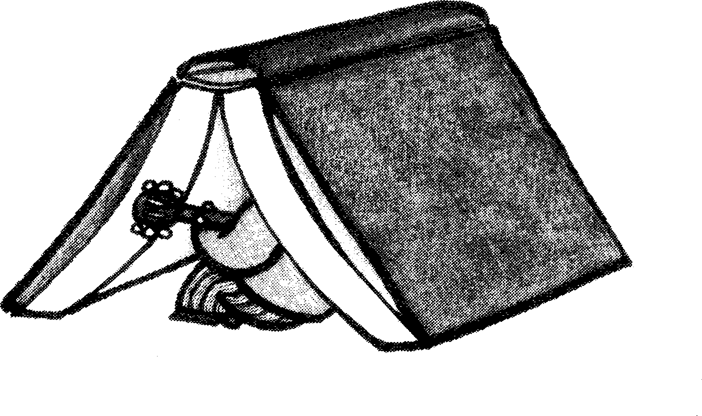

## 38 Dál, jen dál

*Pavel Dvořáček*

Dál, jen dál, leccos opustím, dál, jen dál,

vlak jede, jede, odváží břímě mé. Můj přítel výpravčí už jenom zapískal,

(vlak jede, odváží břímě mé) a já se nezdržoval ani jsem nemával,

(vlak jede, odváží břímě mé) nic víc, nic míň už nečekám,

(vlak jede, odváží břímě mé) hlavní je, že své ruce volné mám,

(vlak jede, odváží břímě mé) jsme celí nesví ze svý volnosti,

(vlak jede, odváží břímě mé) nauč nás, Pane, bláznovství své moudrosti,

(vlak jede, odváží břímě mé) dál, jen dál, dál, jen dál, vlak můj odjíždí, mé ruce volné jsou.

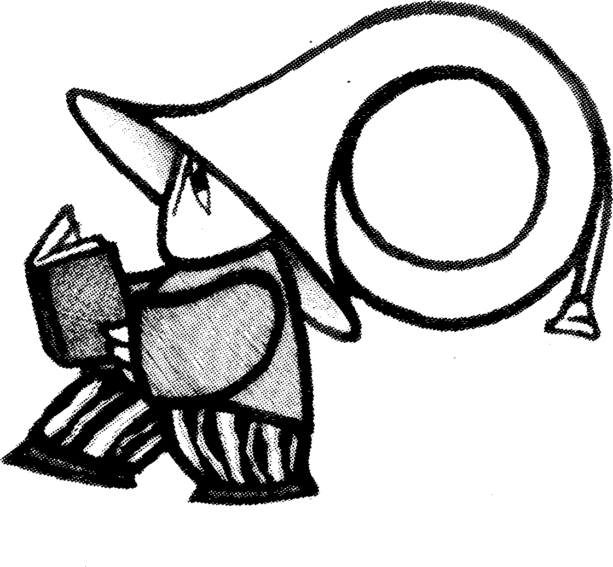

## 39 Dál, přece nejdete sami

*Miloš Rejchrt*

Dál přece nejdete sami,

dál Pán tu zůstává s vámi.

Dál určil cestu svým dětem,

dál tímto světem. Aleluja.

## 40 Daniel kámen zří

*Jiří Joran*

*Ref:* Daniel kámen zří, dál jak se valí, Daniel kámen zří, jak z hory náhle padá sám.

(1) Tohle jsem nikdy neviděl, k chudým kázání když měl.

(2) Silný zůstal v jámě lví, navzdory všemu bezpráví.

(3) U Pána hledal pomoci, než aby vzdával čest vládci.

## 41 Pěj hosana

*Bohumil Kejř*

(1) Dávej radost v srdce mé, ať tě chválím, dávej radost v srdce mé, prosím jen. Dávej radost v srdce mé, ať tě chválím, ať tě chválím celý žití den.

*Ref:* Pěj hosana, pěj hosana, pěj hosana Králi králů všech! Pěj hosana, pěj hosana, pěj hosana Ježíši!

(2) Dávej pokoj v srdce mé, ztiš mou duši, dávej pokoj v srdce mé, prosím jen. Dávej radost v srdce mé, ztiš mou duši, ztiš mou duši celý žití den.

(3) Dávej lásku v srdce mé, ať ti sloužím, dávej lásku v srdce mé, prosím jen. Dávej lásku v srdce mé, ať ti sloužím, ať ti sloužím celý žití den.

## 42 Vyroste z kořenů proutek

*Pavel Kočnar*

(1) Dávno Bůh, náš Pán, měl svůj plán postavit bídným chrám, krásný chrám, prorokům svým ten plán poznat dal.

*Ref:* Vyroste z kořenů proutek a bude ovoce mít, s moudrostí Knížete míru duchem rtů svých se bít, dávno to, dávno to, dávno proroci měli ten sen, nám vyšla naděje zář v městě malém Betlém.

(2) Rek udatný, Rádce, Bůh silný, Kníže míru, Předivný, Otec věčnosti, tu krásu jmen sám život mu dal.

(3) Vlk s beránkem prý tam může spát, s dítětem litý had si hrát, v království tom není proč se bát.

## 43 Dej mi zase nový den

Dej mi zase nový den, dej mi zase nový den, tobě rád díky vzdám a rozbouřeným mořem bez obav se ubírám.

Když tě opustí, co je ti blízké, když tě obklopí smutné cesty nízké, žal hrdlo pálí, zášť duší svírá, tak řekni, má-li cenu tvoje víra.

Byť všechno zahynulo, já zůstal tu sám stát, byť všechno pominulo, já neměl kam hlavu dát, budu zase doufat dál, neboť vím, vůle tvá to není.

Kdyby se země zachvěla a ty bys neslyšel pro rachot padající skály, kdyby vše v ohni tálo a skutků bylo málo a kdyby slepé blesky pekelné se smály, pak dým ti jazyk sváže, zrak vypálí síra, tak řekni, řekni, jaká je to víra.

Byť všechno zahynulo, já zůstal tu sám stát, byť všechno pominulo, já neměl kam hlavu dát, budu zase doufat dál, neboť vím, vůle tvá to není.

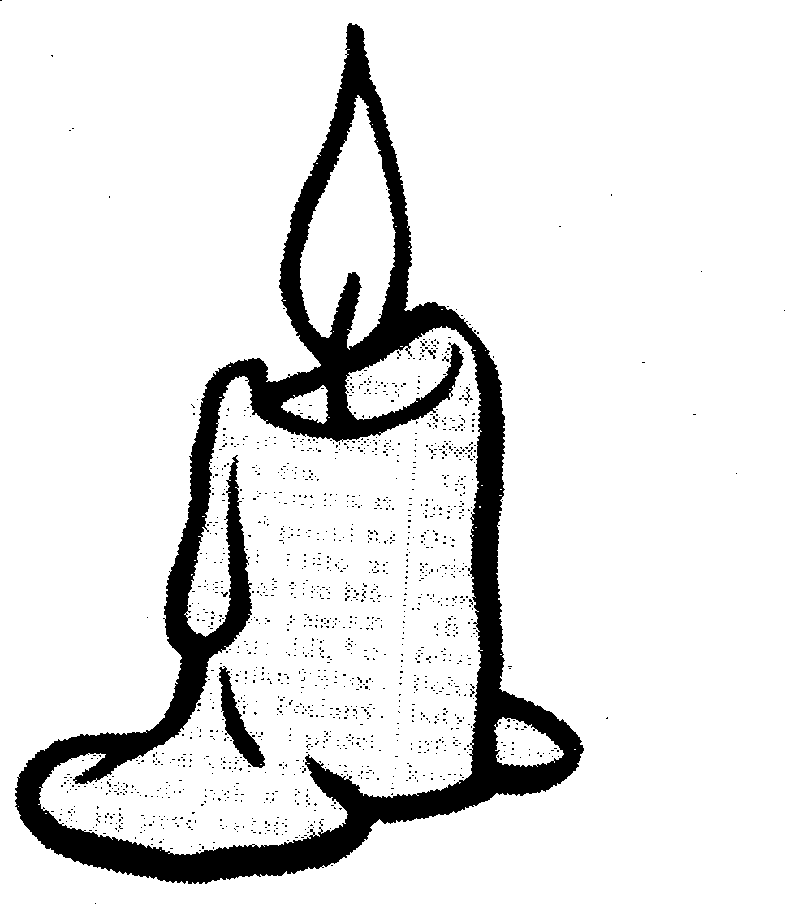

## 44 Prosba

*Ref:* Dej mi, Pane, víru, lásku, sílu, dej mi, Pane, naději a pokoru. (2x)

(1) Takovou víru, která pohne skálou, takovou víru, která po vodě jde, takovou víru, pevnou a stálou, dej mi, Pane, víru v jméno tvé.

(2) Tu lásku, která život v obět' dává, tu lásku, která všechno odpouští, tu lásku, jež svou silou překonává i třeba vedro na poušti.

(3) Chtěl bych mít sílu bojovat se zlem, chtěl bych mít sílu urážky přijímat, chtěl bych mít sílu vytrvat v dobrém a pevně ve své víře stát.

*Ref:* Dej mi, Pane, víru, lásku, sílu, dej mi, Pane, naději a pokoru. (2x)

(4) Naději, která nikdy neumírá, naději ve tvé milosrdenství, naději, která pochybnosti stírá, naději v pravdy vítězství.

(5) Pokoru, která mlčky křivdu přijme, pokoru, která chyby uznává, pokoru, která sebe z chvály vyjme, která se nikdy nehádá.

## 45 Díky

*Miroslav Heryán*

(1) Díky za toto krásné ráno, díky za každý nový den. Díky, za to, co už je za mnou jako těžký sen.

(2) Díky za všechny věrné druhy, díky, ó Pane, za tvůj lid. Díky, že všechny křivdy, dluhy, mohu odpustit.

(3) Díky za moje pracoviště, díky za každý drobný zdar, díky, za všechno krásné, čisté, dík za hudby dar.

(4) Díky, za to, co zarmoutilo, díky za to, co potěší. Díky, že vedeš mne, má sílo, cestou nejlepší.

(5) Díky, že smím tvé slovo chválit, díky, že Ducha dáš mi též. Díky, že nablízku i v dáli lidi miluješ.

(6) Díky, že všem jsi přines spásu, díky, toho se přidržím. Díky, že věřím tvému hlasu, že ti patřit smím.

## 46 Díky za večer

(1) Díky za večer, jenž se stmívá, díky za uplynulý den, díky, mé srdce vděčně zpívá: Budiž veleben!

(2) Díky, že řídíš hvězdy nebe, díky, že bdíš i nad světem, díky, že jsem tak blízko tebe, že v tvé mysli jsem.

(3) Díky za všechno krásné, milé, díky, mé srdce tuší již, díky, že mne i těžké chvíle vedly k tobě blíž.

(4) Díky, že jsi mi dal svou sílu, díky, že jsem směl dobrý být, díky, žes mi dal schopnost k dílu, dej i šťastný klid.

(5) Díky, že jsi mi milost skýtal, díky, že jsi mi odpustil, díky, kdybys mi hříchy sčítal, zavržen bych byl.

(6) Díky, že jsi byl stále se mnou, díky, noc neleká mne víc, díky, až ráno přijdeš jednou, já Ti půjdu vstříc.

(7) Díky, že jsi všem přines spásu, díky, toho se přidržím. (: Díky, že věřím tvému hlasu, že ti patřit smím. :)

## 47 Báby

*Ref:* citativ I viděl farao, Egypta král, že lid Hebrejů plní zem egyptskou, tedy povolal si k sobě porodní báby, které pomáhaly při porodu ženám hebrejským a jejichž jména byla Sefora a Fua. A takto děl Farao, Egypta král, porodním babám hebrejským:

(1) Dítě hned jak opustí matky klín, dítě hned jak opustí matky klín, musíte zabít, bude-li to syn.

(2) Král velí, báby by syny zabily, král velí, báby by syny zabily, Bůh babám velí, aby život hájily.

*Ref:* citativ:

A ty báby bály se Boha otců svých, nečinily tak, jak jim nařídil farao král, ale živé nechávaly pacholíky rodiček svých.

(3) Ty báby se bály Boha jen, ty báby se bály Boha jen, tvým, farao, nebyly nástrojem.

(4) Je lepší jak ta bába se Boha bát, je lepší jak ta bába se Boha bát, než se bát lidí a slepě poslouchat.

## 48 Dítě, o němž zpíváme

*Tomáš Veselý*

(1) Dítě, o němž zpíváme, přišlo kdys k nám. Jméno jeho známo je, byl to Ježíš Pán. Zpívali andělé o něm píseň chval, zpívali andělé o něm píseň chval.

(2) Vánoce čas lásky jsou, pamatujte, o Ježíši, Králi svém, prozpěvujte. Lásku šel dávat všem lidem, také nám, lásku šel dávat všem lidem, také nám.

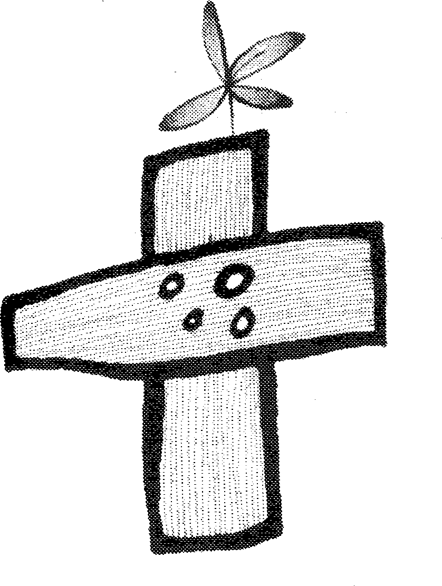

## 49 Bůh se sklonil k nám

*Jaromír Plíšek*

(1) Dítě v chlévě leží, Bůh se sklonil k nám. V slámě místo v peří, Bůh se sklonil k nám. Dítě v chlévě leží, Bůh se sklonil k nám, sklonil k nám, sklonil k nám, sklonil k nám.

(2) Do lží, běd a zmatků, Bůh se sklonil k nám. Do chýší i statků, Bůh se sklonil k nám.

(3) Září hvězda jitřní - blednou vládci pyšní.

(4) K bohatým i chudým - k moudrým, i k těm druhým.

(5) Průvod táhne nocí - jdou obutí, jdou bosí.

(6) K zoufalým i jistým – k špinavým i čistým.

(7) Křehký, zranitelný - živý, silný, věrný.

## 50 Divné to věci dnes

*Miloš Rejchrt*

*Ref:* Divné to věci dnes, dějou se v údolí, dějou se v údolí, dějou se v údolí, divné to věci dnes, dějou se v údolí, tam dole v údolí.

(1) V tom hřbitovním údolí, kosti suché zbělely, v tom hřbitovním údolí, mrtvé kosti bez duší nic a nikdo netuší, mrtvé kosti bez duší.

(2) Posel Boží pospíchá, aby volal do ticha, posel Boží pospíchá, mocným hlasem pronese, kosti líné, vzbuďte se, mocným hlasem pronese.

(3) Žebro, čelist, rameno, loket, kotník, koleno, žebro, čelist, rameno, už si běží naproti, chrastí to a rachotí, už si běží naproti.

*Ref:* Divné to věci dnes, dějou se v údolí, dějou se v údolí, dějou se v údolí, divné to věci dnes, dějou se v údolí, tam dole v údolí.

(4) Už to masem obrůstá od paty až po ústa, už to mase obrůstá, a tentam je mrtvý klid, srdce zase začlo být, a tentam je mrtvý klid.

(5) Když Duch Boží zavěje, vstane z mrtvých naděje, když Duch Boží zavěje, i v tom našem údolí probudí se mrtvoly, i v tom našem údolí.

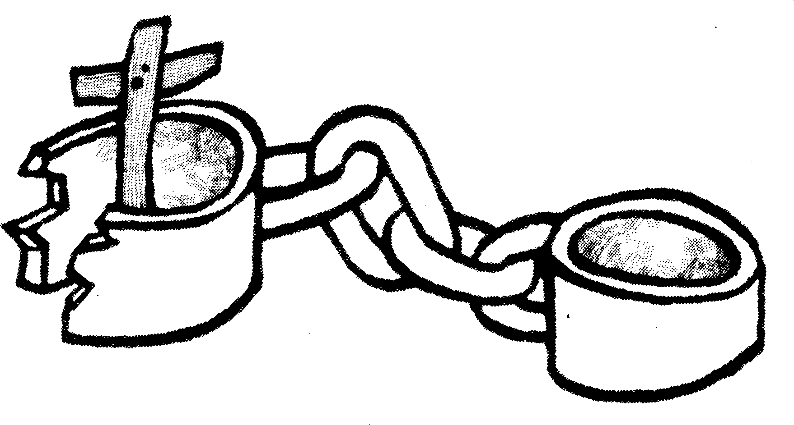

## 51 Dnes jdu k tobě, Pane můj

(1) Dnes jdu k Tobě, Pane můj, tak jak Ty mne zveš, a chválím Tě. Dnes jdu k Tobě, Pane můj, tak jak Ty mne zveš, a chválím Tě. Dnes jdu k Tobě, Pane můj, tak jak Ty mne zveš a vzývám jméno Tvé, chválím Tě, vzývám jméno Tvé.

(2) Staré hříchy odhoďme, Ježíš přišel k nám, víc chvalme jej. (2x) Staré hříchy odhoďme, Ježíš přišel k nám, víc oslavujme jej. Chvalme jej, oslavujme jej.

(3) Zapomeňme na sebe, na něj hleďme jen a chvalme jej. (2x) Zapomeňme na sebe, na něj hleďme jen a oslavujme jej. Chvalme Jej, oslavujme Jej.

(4) Ježíš Kristus je náš Král, život svůj nám dal, tak chválím jej. (2x) Ježíš Kristus je náš Král, život svůj nám dal, i ty mu život dej. Za ním pojď, život svůj mu dej.

(5) K Ježíši se přibližme, ruce zvedněme a chvalme jej. (2x) K Ježíši se přibližme, ruce zvedněme a oslavujme jej. Chvalme Jej, oslavujme Jej.

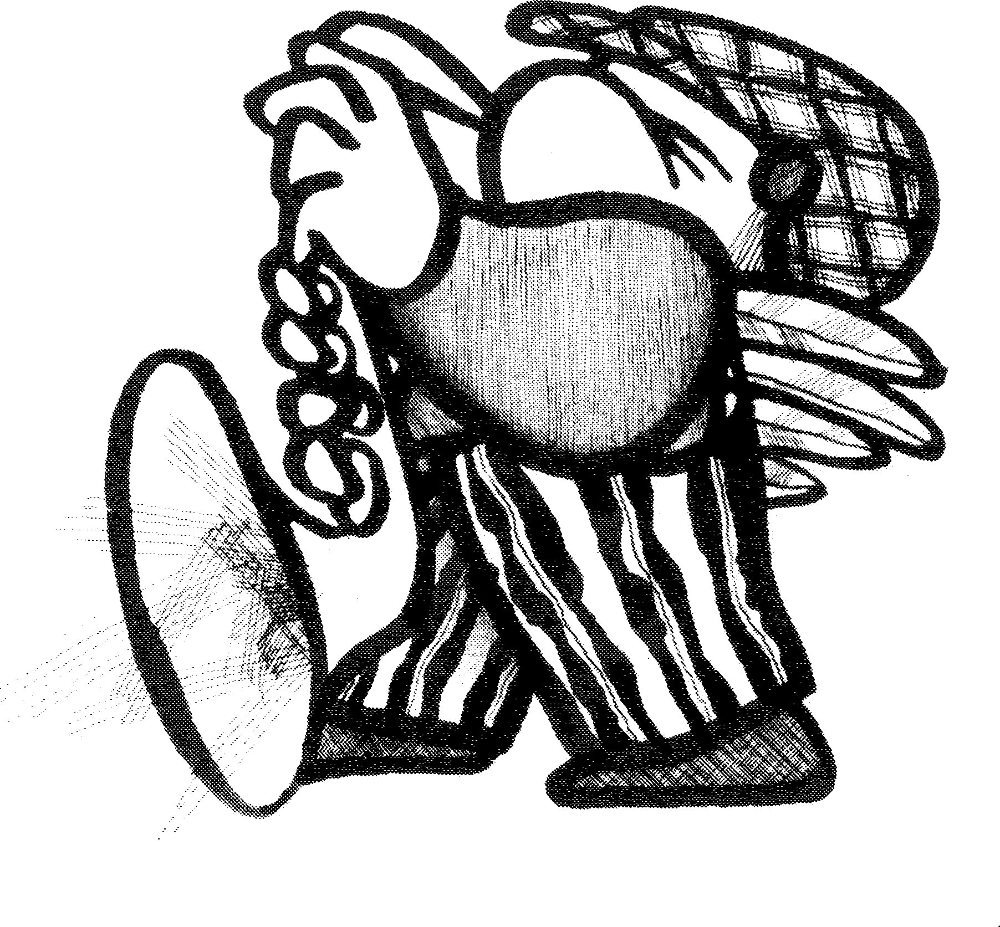

## 52 Dnes tebe volá Pán

*Miroslav Brož*

*Ref:* Dnes tebe volá Pán, abys mládí své Bohu otevřel, tak jako květ se rozvíjí. Dnes tebe volá Pán, abys písní svou Bohu k slávě žil a dobrým byl na cestách všech.

(1) A kdyby přišel jednou den a řek' ti tak už dost, co vlastně na Ježíši máš, v něm není budoucnost, - vzpomeň si!

(2) A kdyby jiné učení ti namlouvalo snad, že bratří sbor máš opustit a víru odvolat - vzpomeň si!

(3) A kdyby slunce, voda, vzduch, ač je v nich plno krás, a kdyby touha po dálkách zastřely Boží hlas - vzpomeň si!

## 53 Sláva halelu

*František Šilar*

Dnes v noci má duše už dohasíná, hale, haleluja,

cítím, že čeká mne země věčná, sláva, halelu.

Toužím svůj těžký život za sebou mít, hale, haleluja,

Tam se svými já budu žít, sláva, halelu.

Tam na konci je náš cíl, hale, haleluja,

Co já už opouštím i ty nech být. Sláva, halelu.

## 54 Sláva, haleluja

*Míla Esterle*

(1) Dneska divnej sen mám, proč slyším tam shůry hrát. Proč? Ó sláva, haleluja, proč, ó sláva, haleluja, sláva, haleluja, narodil se Král. Dnes každýho se ptám, proč vidím noc září plát. Proč? Ó sláva, haleluja, proč, ó sláva, haleluja, sláva, haleluja, narodil se Král.

*Ref:* Proč za hvězdou pouštíš se cestou bláhovou? Proč? Ó sláva, haleluja, proč, ó sláva, haleluja, sláva, haleluja, narodil se Král. Cos chtěl najít v jeslích pod střechou trámovou? Proč? Ó sláva, haleluja, proč, ó sláva, haleluja, sláva, haleluja, narodil se Král.

(2) Dítě našel jsem tam a nad ním anděl hrál. Slyš, ó sláva, haleluja… Pokoj zvěstoval nám, to v uších nám zní dál. Slyš, ó sláva, haleluja …

*Ref:* Proč za hvězdou pouštíš se cestou bláhovou? Proč? Slyš sláva, haleluja, proč, slyš sláva, haleluja, sláva, haleluja, narodil se Král. Cos chtěl najít v jeslích pod střechou trámovou? Proč? Slyš sláva, haleluja, proč, slyš sláva, haleluja, sláva, haleluja, narodil se Král.

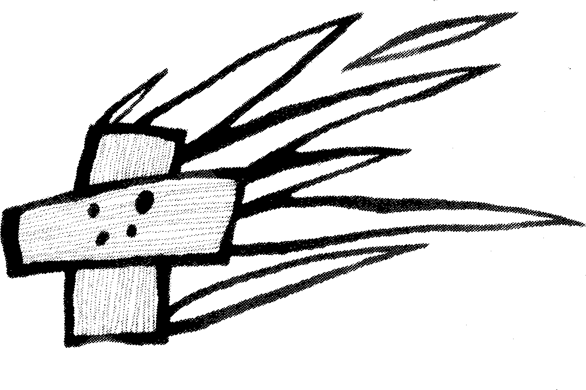

## 55 Eliáš

*Václav Renč, Jan (Křtitel) Václav Renč*

(1) Do Bersabé když Eliáš únavou sklíčen se bral, tam opustil svou věrnou stráž, sám pouští šel dál a dál, prachem cest a potem zbrocen toužil sláb a osamocen už jen spát.

*Ref:* Pane, ty znáš hodinu, kdy se k tobě vrátím, Pane, ty znáš hodinu, kdy v tobě spočinu.

(2) Sám sobě lkal: Jsem prach a dým, syn ubohý otců svých. Nelze se skrýt před soudem tvým, znáš, Pane, můj všechen hřích. Poznávám, že na té zemi žádná spása nekyne mi, toužím spát.

*Ref:* Pane, ty znáš hodinu, kdy se k tobě vrátím, Pane, ty znáš hodinu, kdy v tobě spočinu.

(3) Když pod keřem zdřím Eliáš, anděl se až k němu snes: Vodu a chléb, hle, tady máš, vzbuď se, vstaň, pij a jez! Načerpej z nich nové síly, ještě musíš mnohou míli dál se brát.

(4) Ať netrpí žízeň a hlad, kdo světem jdou, plni ran, víno a chléb všem spěchá dát sám jediný Kristus Pán. Jenom on je silou živých, on je mírem spravedlivých, když jdou dál.

## 56 Modlitba Tomáše Moora

(1) (: Dopřej mi chuť k jídlu, Pane, a také něco, co bych jed.:) (: Dej mi zdravé tělo, Pane, a nauč mě s ním zacházet :)

(2) (: Dej mi zdravý rozum, Pane, ať vidím dobro kolem nás. :) (: Ať se hříchem ne vy děsím a napravit jej umím včas. :)

(3) (: Dej mi mladou duši, Pane, ať nenaříká, nereptá. :) (: Dej, ať neberu moc vážně své pošetilé malé JÁ. :)

(4) (: Dej mi, prosím, humor, Pane, a milost, abych chápal vtip. :) (: Ať mám radost ze života a umím druhé potěšit. :)

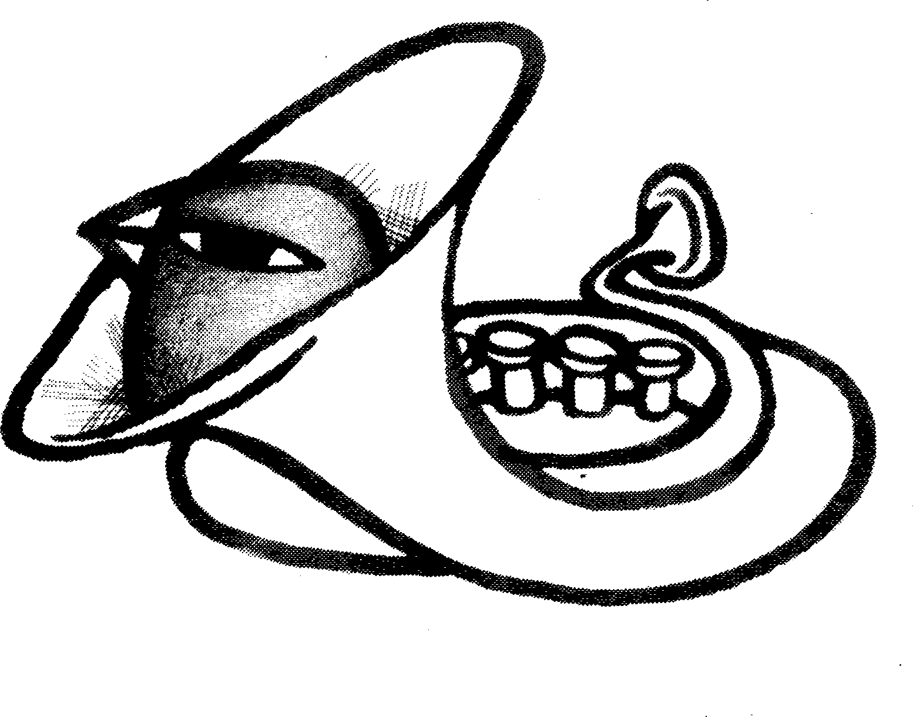

## 57 Vzácný hosti, přijď

*Miloš Rejchrt*

(1) Dům na písku postavený, lampa, která zhasíná, dlouhé chvíle beze změny, smutná svatba bez vína.

*Ref:* Který divy činíš, navštiv naše smutné dny, ty první a poslední vzácný hosti přijď již.

(2) Člun od kotvy utržený, kotva na dně bez lodi, peníz neplatné už měny, strom, který nic nerodí.

(3) Hyne zrno na úhoru, bují plevel na poli, pověra chce přenést horu zmařená sůl nesolí.

(4) Oči halí mlha vlčí, lásku z domu vyhnal strach, naděje už dávno mlčí, sedm duchů přešlo práh.

## 58 Žalm 46

*Tomáš Novotný*

*Ref:* Elohím lánú macha sé váoz ezra b‘cárót nimca meód.

(1) Pane, ty sám, prosím, buď tam, kde potřebujem pomoc tvou.

(2) Sílu dej nám, vždyť jsi náš Pán, my potřebujem pomoc tvou.

(3) Z prachu volám, buď blízko nám, ať vždy najdem pomoc tvou.

## 59 Glory

*Ref:* Glory, glory, glory, glory, glory Pánu zpívám. Glory, glory, glory, glory, glory Pánu zpívám.

(1) Když lid byl opuštěn a sám, Spasitele ma svět poslal Pán, glory Pánu zpívám, to Bůh, a přece člověk byl, on chodil, jedl, zpíval, pil, glory Pánu zpívám.

(2) Ježíš tak rád malé děti měl, s nimi mazlit, hýčkat a hrát si chtěl, glory Pánu zpívám, on lidi k lásce nabádal, víru, Boží milost rozdával, glory Pánu zpívám.

*Ref:* Glory, glory, glory, glory, glory Pánu zpívám. Glory, glory, glory, glory, glory Pánu zpívám.

(3) Jeho pouhý pohled uzdravil, soky usmířil, spory rozřešil, glory Pánu zpívám, pak na kříži on mučen jest, všechnu lidskou bolest musel nést, glory Pánu zpívám.

(4) Já vstávám každé ráno, vždyť i mně je slunce přáno, glory Pánu zpívám, věřím, jednou lidé prohlédnou a pak Pánu svou duši otevřou, glory Pánu zpívám.

## 60 Faraon

*Tomáš Najbrt*

*Ref:* Haleluja, ano haleluja, haleluja, tou vodou šel jsem také já.

(1) Zapřáhnout dal farao n a stíhal Izrael (3x), když z Egypta kolem moře do své země šel.

(2) Řekl Mojžíš lidu svému: Nebojte se dál (3x), stůjte směle, Hospodin dnes spasení vám dal.

(3) Tedy vztáhnul Mojžíš ruku svoji nad mořem (3x), moře se hned rozdělilo až na suchou zem.

(4) Šli synové izraelští v moři prostředkem (3x), vody zavalily faraona s průvodem.

(5) Jako spasil Izrael před faraonem zlým (3x), tak svobodu zachová Hospodin věrným svým.

## 61 Hledejte především

*Zdeněk Coufal*

*Ref:* Haleluja, haleluja, haleluja, haleluja, haleluja.

(1) Hledejte především Boží království se spravedlností jeho, ostatní všechno vám bude přidáno, haleluja, haleluja.

(2) Proste a doufejte, bude dáno vám, hledejte a naleznete, tlucte a bude vám otevřeno včas, haleluja, haleluja.

(3) Ať vaše světlo vždy svítí před lidmi, ti uvidí vaše skutky, slávu a cest vzdají Otci v nebesích, haleluja, haleluja.

## 62 Haleluja, haleluja, chval duše má

*Petr Chlouba*

Haleluja, haleluja, chval duše má Hospodina.

Haleluja, haleluja, chval duše má Hospodina.

## 63 Haleluja, haleluja, on je Pán

*Petr Chlouba*

Haleluja, haleluja,

on je Pán, on je Pán,

haleluja, Ježíš je Pán.

Haleluja, Ježíš je můj Pán.

## 64 Haleluja, haleluja, za naše spasení

*Ref:* Haleluja, haleluja, za naše spasení zpívám haleluja. Haleluja, haleluja, za naše, za odpuštění hříchů pěj haleluja.

(1) Za víru a za naději, kterou mohu mít, za bratry a sestry kolem, s nimiž mohu žít, za lásku, jež provází nás každý nový den, za spasení, které může patřit lidem všem.

(2) Za jistotu spasení, že nemusím se bát, za bibli, za modlitbu, za pevný Boží řád, za veliká zaslíbení, které smíme mít, za společné obecenství, kde můžeme žít.

## 65 Žalm 150

*Miroslav Gallus*

*Ref:* Haleluja, chvalte Pána, haleluja, chvalte Pána, haleluja, chvalte Pána, vším, chval jej celá zem.

(1) Chvalte jej, neboť on je ten silný, chvalte jej, neboť on je ten mocný, chvalte jej, neboť on je ten svatý Pán, haleluja.

(2) Chvalte jej zvukem kytar a louten, chvalte jej zvukem houslí a varhan, chvalte jej, neboť on je ten svatý Pán, haleluja.

(3) Chvalte jej zvukem píšťal a bubnů, chvalte jej zvukem trub a cimbálů, chvalte jej neboť on je ten svatý Pán, haleluja.

(4) Chvalte jej hlasem silným a zvučným, chvalte jej každý, všechno co dýchá, chvalte jej neboť on je ten svatý Pán, haleluja.

## 66 Haleluja, ty jsi Spasitel

*Petr Chlouba*

*Ref:* Haleluja, ty jsi Spasitel, haleluja, náš Pán. Haleluja, tebe slavíme, tys dokonale zachránil nás.

(1) Bůh je láska, pravda a spása. Má rád každého z nás, haleluja.

(2) Bůh sám dává k smíření cestu všem nám v Kristu Synu svém, haleluja.

(3) Chvála Pánu, zvítězil nad smrtí, z hříchu nás vyprostil, haleluja.

(4) Chvála Pánu, svých Duchem působí v nás živou naději, haleluja.

## 67 Herodes

*Miloš Rejchrt*

*Ref:* Hlas z Ráma slyšán jest a naříkání, pláče Ráchel pro syny své, (: naříká matka, mlčí zmordovaní, nářek a pláč a ticho zlé. :)

(1) V erbu Kainovo znamení, už z toho jména dýchá děs, stoupenec rychlých řešení, Herodes, Herodes, nebezpečí či naději kde uviděl bys, že klíčí, raději dřív než později nůž a meč ať zničí, sekej a bodej, řež a nič, s tím, co se hýbe, pryč s tím pryč.

(2) Neházejte hned kamení, schovejte si ho do zásoby, ono Kainovo znamení i jiná čela zdobí, na den žen a na den matek Herodes též slaví svátek, Herodes, vrah neviňátek, muž rázných řešení, sekej a bodej, řež a nič, s tím, co se hýbe, pryč s tím pryč.

*Ref:* Hlas z Ráma slyšán jest a naříkání, pláče Ráchel pro syny své, (: naříká matka, mlčí zmordovaní, nářek a pláč a ticho zlé. :)

(3) Matka pláče a naříká, komisi popravčí prosí, to, co pod svým srdcem nosí, aby vyrvat směla, smilování, mistři kati, vtrhněte do mého těla, vytněte noži a meči kořen nebezpečí, sekej a bodej, řež a nič, s tím, co se hýbe, pryč s tím pryč.

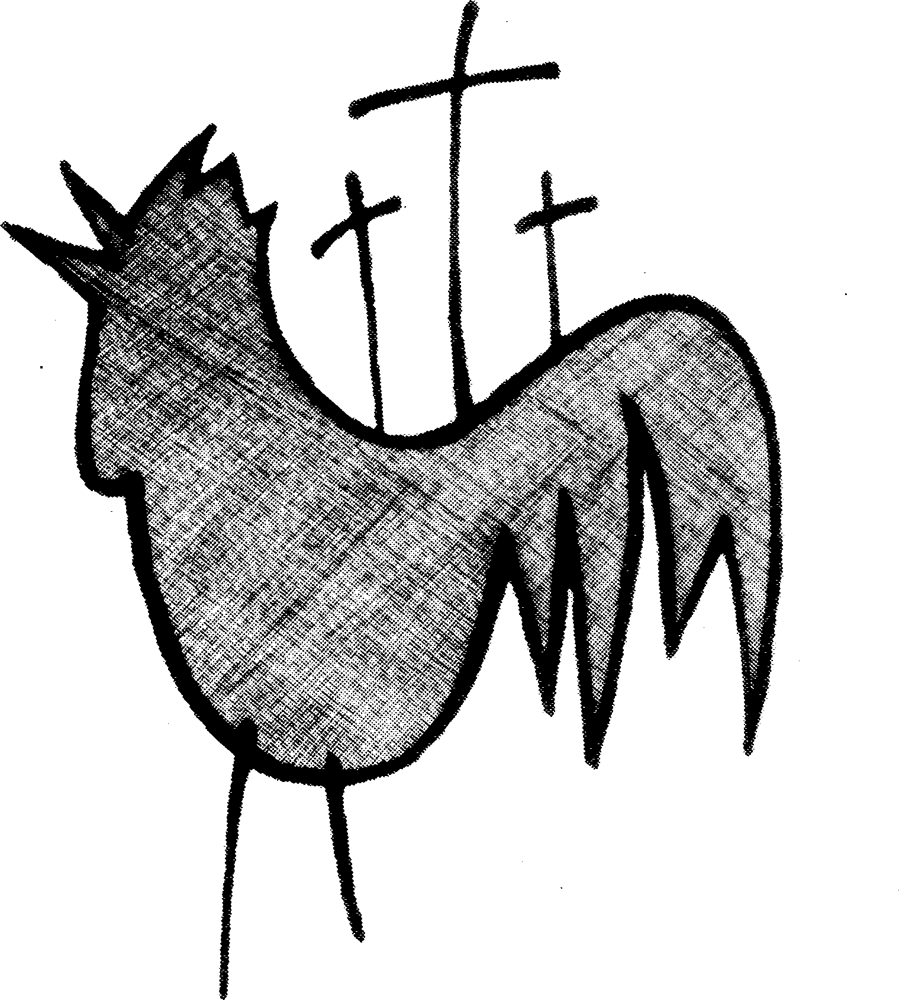
<i>...kouhout už jen chroptí...</i>

## 68 Hle, jak trpěl

*Jiří Joran*

(1) Hle, jak trpěl, ach, můj Pán (3x) ó, hle, jak trpěl, ach, můj Pán, ach, můj Pán, ach, můj Pán, ach, můj Pán, ach, můj Pán.

(2) On snášel trýzeň beze slov

(3) Když on vstal a pak znovu pad

(4) Jej bez ustání vlekli dál

(5) On korunu měl trnovou

(6) A vlekli jej v dům Pilátův

(7) Tam ukrutně byl zbičován

(8) A přibili jej na ten kříž

(9) A tak skonal Kristus Pán

## 69 Hle, příkaz nový

*Zdeněk Coufal*

Hle, příkaz nový, dí Pán, dávám vám: spolu mějte se rádi, jak já mám rád vás, spolu mějte se rádi, jak já mám rád vás.

Tak všichni poznají, že učedníci mí jste, když mezi vámi bude láska. Tak všichni poznají, že učedníci mí jste, když mezi vámi bude láska.

## 70 Jak stromy volily krále

*Svatopluk Karásek*

(1) Hledaj si strom - stromy -, aby byl král, krále stromy chtěj mít. Hle, vždyť ty máš krásný kmen - olivo, vem to ty. Ty vládu vem, ty vládu vem, ty vládu vem, panuj kmenům všem – tvé chcem ruky, kraluj ty.

(2) To by byla moje smrt - náhlá smrt olivy, vždyť já nechci králem být, chci dál nýst plody svý, zvadnu v ten den, zvadnu v ten den, kdy smysl ten, olej můj dávat všem pro moc nad vámi opustím.

(3) Potom králem moh bejt fík namísto olivy Ty žezlo krále vem - vem to fíku ty – čert to vem a čert to vem, i když je králem planý fík, je bez svých plodů jen nešťastník.

(4) Tak šly stromy na vinný kmen, hle, nevzal to fík, za to, abych králem byl, nedám víno svý, dí vinný kmen, dí vinný kmen. Já stvořen jsem jak šašek spiš než král, abych vínem zemi rozesmál.

(5) Žádnej strom nechce bejt král, vem to ty trní. Já chci vpravdě králem být, vždyť jsem tak bezcenný. To byl můj sen, to byl můj sen, ‚ vždyť každý kmen mnou vždy pohrdal, chci bejt na věky všech stromů král.

(6) At žije náš král - ať žije král, jásaj v lese stromy, bacha, tiše, král už má svou řeč úvodní: Zítřejší den, zítřejší den stromu, jenž by rušil vládu mou, já dám korunu trnovou.

(7) Slyšte, cedry libánské, co vám král praví: Když měl bych ztratit vládu svou, sám sebe zapálím. Vzejde oheň, vzejde oheň, v něm každý kmen by ihned vzplál, tak mstí se král, kterým jsi kdysi pohrdal.

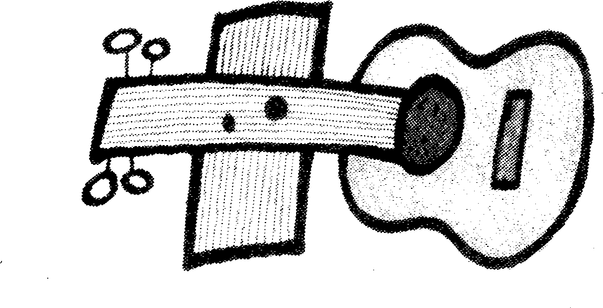

## 71 Hledám to místo

*Eliška Hamerová, Eva Hamerová*

*Ref:* Hledám to místo, kde najít tebe, Pane, ó Pane, Pane můj, hledám to místo, hledám to místo, chci ho hledat dál, Pane, Pane, ó Pane, Pane můj, Pane, ó Pane, Pane můj.

(1) Přítelem mým jsi, Pane, ty, jedině na tebe, na tebe, na tvou moc může se spolehnout kdokoli z nás. Pane, Pane, Pane, Pane.

(2) Přítelem mým jsi, Pane, ty, radost mám z toho, že dáváš sílu všem, kdo na ni čekají v samotě své. Pane, Pane, Pane, Pane.

(3) Přítelem mým jsi, Pane, ty, tu lásku velikou a radost nesmírnou vyzpívat chtěl bych všem, kdo tě má rád. Pane, Pane, Pane, Pane.

## 72 Hluboká řeko

*Jiří Joran*

Hluboká řeko, já přejít chtěl bych Jordán, hluboká řeko, tam, ó Pane můj, kde mě domov čeká.

Nechcete jíti tam, kde je věčný ráj, v tu krásnou zem. Kde vládne mír?

Ó, hluboká řeko tam, ó Pane můj, kde mě domov čeká.

Deep river, my home is over Jordan, deep river, Lord, I want to cross over into capm ground. Ohm, don‘t you want to go to that gospel feast, that promis‘d land whare all is peace? Oh, deep river, Lord, I want to cross over into capm ground.

## 73 Hořká byla noc

*Pavel Javornický*

(1) Hořká byla noc, kohout zradu zpívá třikrát. Hořká byla noc a v pláči svítá den.

(2) Ježíš tiše stál, slyšel moje slovo "neznám".

(3) Třikrát zapírám, klamu, lžu a kdo mi věří.

(4) Jidáš zradil jej, peníz hanby v dlani pálí.

(5) Třicet stříbrných leží v chrámě, zrádce zmírá.

(6) Pane, také já kráčím cestou zrady temné.

(7) Pohled Ježíšův dává slzy pro pokání.

(8) Hořká byla noc, kohout zradu zpíval třikrát. Hořká byla noc, mně v pláči vzešel den.

## 74 Hosana

*Michael Otřísal*

(1) Hosana, hosana, hosana Bohu na nebi! Hosana, hosana, hosana Bohu na nebi! Jméno slavíme Tvé, chválí Tě srdce mé, vyvýšen buď, ó Bože náš. Hosana Bohu na nebi!

(2) Sláva, sláva, sláva všech králů králi! Sláva, sláva, sláva všech králů králi! Jméno slavíme Tvé, chválí Tě srdce mé, vyvýšen buď, ó Bože náš. Sláva tobě Králi náš.

(3) = 1.

## 75 Žalm 8

Hospodine, Pane náš, jak důstojné je jméno tvé. Z úst maličkých mocně dokazuješ síly své protivníkům. Já když spatřuji nebesa tvá , měsíc a hvězdy, vzdávám ti chválu a říkám: Co je člověk, že jej máš tak rád?

Hospodine, Pane náš, jak důstojné je jméno tvé. Z úst maličkých mocně dokazuješ síly své protivníkům.

Ty jsi pánů Pán, ty jsi králů Král, ó Pane, Otče můj. Vzdává ti mé srdce chválu za všechna dobrodiní tvá, jež jsi učinil nám lidem, že jsi nezatratil nás.

## 76 Žalm 8

*Slávek Klecandr*

Hospodine, Pane náš,

jak vznešené je tvoje jméno po vší zemi.

## 77 Žalm 8

*Miloslav Kočnar, Jana Kočnarová-Kaletová*

(1) Hospodine, Pane náš, své jméno po vší zemi v důstojnosti necháváš oslavovati všemi.

(2) Učinil ses přeslavným. I malá nemluvňata tebe vidí všemocným, tvá slova jsou jim svatá.

(3) A já sám ptám se sebe, když vidím vše, co činíš: čím člověk je pro tebe, že k němu s láskou shlížíš?

(4) Neb jak anděla svého jej velkým postavil jsi, pánem všeho živého v své lásce učinil jsi.

(5) Hospodine, Pane náš, své jméno po vší zemi v důstojnosti necháváš oslavovati všemi.

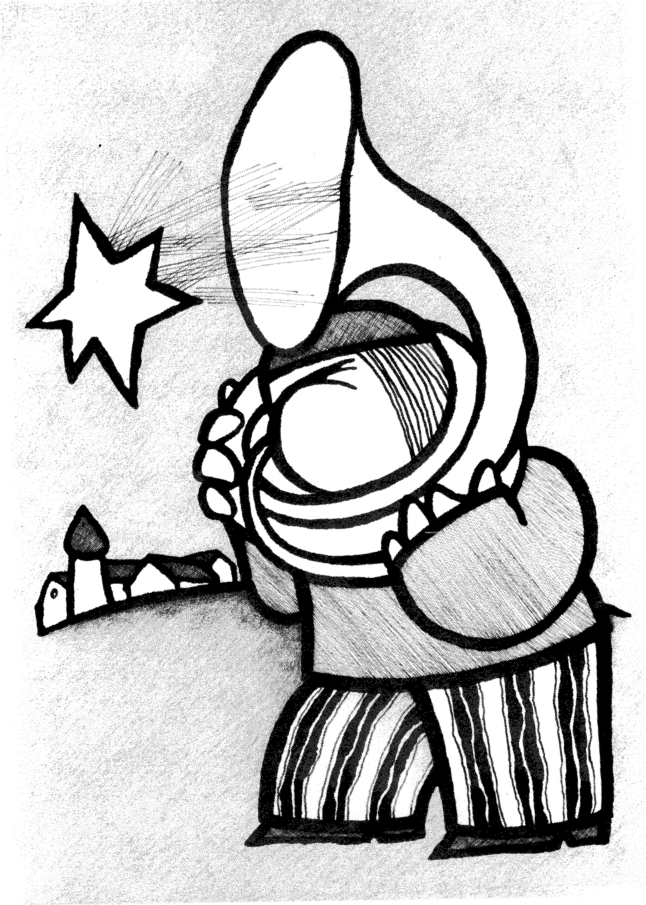

## 78 Žalm 12

*Slávek Klecandr*

Hospodine pomoz, se zbožným je konec, berou za své věrní mezi lidmi.

Jeden druhého svou řečí šálí, mluví úlisnými rty a obojakým srdcem.

Kéž Hospodin zcela vymítí ty úlisné rty, jazyk, co se velikášsky chvástá, ty, kdo říkají:"Náš jazyk převahu nám zaručuje, máme přece ústa. Kdo je naším Pánem?"

"Pro útlak ponížených, pro sténání ubožáků teď povstanu," praví Hospodin, "daruji spásu tomu, proti němuž svévolník soptí."

Co vysloví Hospodin, jsou slova ryzí, stříbro přetavené do kadlubu v zemi, sedmkráte protříbené.

Ty je, Hospodine, budeš střežit, navěky nás budeš chránit před tím pokolením; kolem obcházejí svévolníci a vzmáhá se mezi lidmi neurvalost.

Co vysloví Hospodin, jsou slova ryzí, stříbro přetavené do kadlubu v zemi, sedmkráte protříbené.

## 79 Hříchy

*Míla Esterle*

*Ref:* Hříchy tvý tě jednou doženou, zkoušíš spálit mosty za sebou. Všechno zlý v duši dál si vláčíš tmou, hříchy tvý tě jednou doženou.

(1) Váháš, jestli má cenu se prát, váháš, jestli znova začít hrát, hříchů svých snad začít litovat.

(2) Troufám si ti dát to, oč jsi stál, troufám si tě vést zas o krok dál. Hříchy tvý na sebe jeden vzal, hříchy tvý na sebe jeden vzal.

## 80 Hřmí Jordán, hřmí

*Ref:* Hřmí Jordán, hřmí, hřmí Jordán, hřmí, jak rád bych šel, jak rád bych šel tam, kde můj otec dlí, kde starý Jordán hřmí.

(1) Ó Pane, dravý je ten proud, ó Pane můj, dej sílu nám neutonout, kde starý Jordán hřmí.

(2) Ó bratři jak přál bych vám být, ó Pane můj, tam, kde každý svůj domov má, kde starý Jordán hřmí.

## 81 Hvězdičko, sviť

*Pavel Dvořáček, Josef Křenek*

(1) Hvězdičko sviť, tam na nebi se třpyť, jak jsi tenkrát svítila, když v Betlémě, tam v tom chudém chlévě, matka Dítě složila.

(2) Hvězdičko sviť, tam na nebi se třpyť, pověz to ve světě všem, že láska je víc nežli zlá nenávist, to Dítě zachrání zem.

(3) Hvězdičko sviť, tam na nebi se třpyť, ať země ví, kde je Král, ať ze všech cest můžeme mu dary snést a pak to světlo dál nést.

## 82 Letní chvalozpěv

*Luděk Rejchrt*

(1) Chléb, víno, slunce zářivé nám dáváš z lásky své. Za skutky tvé tě chválíme a dary úžasné. Velebeno buď tvé jméno Pane, na věky. Velebeno buď tvé jméno! Amen.

(2) Vůně a barvy nádherné nám dáváš z lásky své. Za skutky tvé tě chválíme a dary úžasné a dary úžasné. Velebeno buď tvé jméno Pane, na věky. Velebeno buď tvé jméno! Amen.

(3) I píseň, kterou zpíváme, nám dáváš z lásky své. Za skutky tvé tě chválíme a dary úžasné a dary úžasné. Velebeno buď tvé jméno Pane, na věky. Velebeno buď tvé jméno! Amen.

## 83 Chtěl bych být majákem

*Jan Luhan*

(1) Chtěl bych být majákem, v příboji stát, chtěl bych být majákem, lodím směr dát, chtěl bych být majákem uprostřed vln, a bývám sám zbloudilý prám. Chtěl bych být majákem, majákem!

(2) Chtěl bych i zvonem být, svou písní znět, chtěl bych i zvonem být, ať slyší svět, chtěl bych i zvonem být v bouřlivý čas, a bývám sám nejistý hlas. Chtěl bych i zvonem být, zvonem být!

(3) Chtěl bych být plamenem, když zebe chlad, chtěl bych být plamenem, svítit a hrát, chtěl bych být plamenem, noc měnit v den, a bývám sám nezapálen. Chtěl bych být plamenem, plamenem!

(4) Chtěl bych i mostem být pres dravý tok, chtěl bych i mostem být pro pevný krok, chtěl bych i mostem být ve službě všech, a často sám hledám svůj břeh. Chtěl bych i mostem být, mostem být!

## 84 Chtěl bych chválit

*Jan Kočnar*

(1) Chtěl bych chválit, děkovat, veselit se, radovat, zatím s hanbou musím před tebou stát. Musel padnout hluboko, kdo měl vzhlížet vysoko, chci se znovu vrátit, vyznávat a kát.

*Ref:* Já však věřím, že mi dáš, radost, pokoj, jasnou tvář, lásku k bratřím k práci chuť, prosím tebe, se mnou buď.

(2) Chci se modlit den jak den, nechci zůstat jaký jsem, s pokušením nechci pohrávat si dál. Dej mi srdce rozhodné, které rádo poslechne, když mi říkáš, abych hříchu zanechal.

(3) Činy mé jsou rouhání, nemám sílu k pokání, zdá se mi, že jsem tvé lásky nehoden. I když znovu umírám, hříchem skoro utýrán, až mě zvedneš, potom půjdu s pokojem.

## 85 Chuť snů

*Tomáš Novotný*

*Ref:* Chuť snů město má, chuť (hm) snů (hm) město má, kam jen svatí jdou, tam dojít bych chtěl jednou také já.

(1) Tam člověk člověku nešlape na paty a všechny rohy tam jsou kulatý, tam saka ani srdce nemaj upjatý, tam budu bydlet jednou také já.

(2) Všechny výbojky tam budou nahraný, vždyť jedno velký světlo to má vyhraný, nebude tmy ani stínu, to se ví, tam budu bydlet jednou také já.

(3) Co tady bylo malý, bude veliký, a krejčí tam maj látky balíky a každýmu tam dobrou mírou naměří, kdo z nás by tomu nevěřil, tam uvěří.

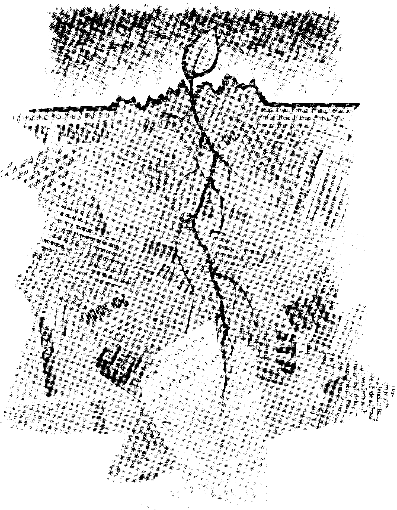
<i>...v kořenech starých pupen prask'...</i>

## 86 Chvála

*Bob Fliedr*

(1) Chvála ti patří, Otče, denně jsi to ty, kdo v Kristu zbavuje nás pout, kdo s vírou nabízí nám jiné jistoty, než může země nabídnout.

Už kdysi Adam ti vzkázal tak si běž, i já tak padám, ty dál mě k sobě zveš. Chvála ti patří, Otče, denně jsi to ty, kdo v Kristu zbavuje nás pout.

A proto chvála tobě Otče, chvála tobě Otče, zpívají tvorečkové tví, chvála tobě Otče, chvála tobě Otče, ať roste tvoje království.

(2) Chvála ti patří, Synu, přemožen je hřích, slavnostně rušíš zemskou tíž. Otvíráš novou cestu v blahoslavenstvích, značkami na ni je tvůj kříž.

Vydatnou stravu mas pro hladový svět, kdo ztratil hlavu, ten dostávají zpět. Chvála ti patří, Synu, přemnožen je hřích, slavnostně rušíš zemskou tíž. A proto

Chvála tobě, Synu, Chvála tobě, Synu, zpívají tvorečkové tví, Chvála tobě, Synu, Chvála tobě, Synu, ať roste tvoje království.

(3) Chvála ti patří, Duchu, vaneš, kudy chceš, do duši seješ Boží klid, bez tebe člověk stěží rozpoznává lež, s tebou za pravdou umí jít.

Roznítíš plamen, kde najdeš jenom dým, strach snímáš z ramen všem učedníkům svým. Chvála ti patří, Duchu, vaneš, kudy chceš, do duši seješ Boží klid. A proto

Chvála tobě, Duchu, Chvála tobě, Duchu, zpívají tvorečkové tví, Chvála tobě, Duchu, Chvála tobě, Duchu, ať roste tvoje království.

(4) Chvála ti patří, Bože, Otče se Synem a s Duchem svatým v trojici. Zdroj pravé jednoty, tři v jednom jediném, zdroj všechny bratry pojící.

Chválu ať, Bože, ti hříšní zapějí, chválu za to, že nám dáváš naději. Chvála ti patří, Bože, Otče se Synem a s Duchem svatým v trojici. A proto

Chvála tobě, Bože, chvála tobě, Bože, zpívají tvorečkové tví, Chvála tobě, Bože, chvála tobě, Bože, ať roste tvoje království.

## 87 Chvalme Pána

*Petr Chlouba*

*Ref:* Chvalme Pána, chvalme jej, celá země dík mu vzdej. Chvalme Pána, s radostí věčný je ve své milosti.

(1) V úzkosti své vzýval jsem Pána, on vyslyšel volání mé, proto jen:

(2) Proč bych se bál, Bůh při mně stojí, rád pomáhá, s ním nejsem sám, proto jen:

(3) Dál budu žít, vzdávat ti chválu. S písní teď smím tvou cestou jít, proto jen:

(4) Zní plesání z úst spravedlivých: „Bůh je síla má i spasení?“ proto jen:

## 88 Chvalte Hospodina

*Marie Čančíková, Karel Kejval, Jaroslav Slováček*

(1) Chvalte Hospodina, chvalte ze vší síly, lidé národů všech, černí, žlutí, bílí! Neboť vzrůstá milost, kterou všem nám dává, neboť pravda jeho věky přetrvává.

(2) Chvalte Hospodina! Věčná věrnost jeho shovívá nám dosud, chce nás zbavit zlého. Když se všechno změní, padnou trůny s králi, neumlknou nikdy ústa plná chvály.

(3) Chvalte Hospodina, jeho pravdu znejte, že je věčná stále, na pamětí mějte! Mladí jako staří ze všech zemí světa, nechť vždy haleluja ze rtů našich vzlétá.

## 89 Chvalte Pána

*Bob Fliedr*

*Ref:* Chvalte Pána, chvalte Pána, chvalte Pána stále, spoutaným on pouta rozvázal, chvalte Pána, chvalte Pána, chvalte Pána stále, mezi králi nejvyšší je král.

(1) Ve všech domech ať ho chválí, ať mu zpívá každý dům, uvolněte místo zvučným cimbálům, jedni chvalte harfou, jedni flétnou, kytarou, do rytmu ať všechny bubny (:pěkně jdou, pěkně jdou, pěkně jdou.:)

(2) Vždyť on stvořil jasné nebe, stvořil malou, dobrou Zem, taky modré moře se vším, co je v něm. Slunci dodal světlo, vypočítal cesty hvězd, člověk, co ho zklamal, dostal od něj křest, (: od něj křest.:)

*Ref:* Chvalte Pána, chvalte Pána, chvalte Pána stále, spoutaným on pouta rozvázal, chvalte Pána, chvalte Pána, chvalte Pána stále, mezi králi nejvyšší je král.

(3) Ať ho duší, tělem každý chválí den ode dne víc, mladí nebo staří pěkně z plných plic. Ukázal nám cestu, stejně ukázal nám cíl, zvítězil nad křížem, kámen odvalil, (: odvalil. :)

## 90 Haleluja zpívej

*Miroslav Gallus*

(1) Chválu, dík, všichni vzdejme Pánu, on je cestou života pro všechny má místo ve svém plánu jeho láska, dobrota.

Chválu, dík, jeho jménu sláva provolejme s radostí. Na každý den své Slovo nám dává provázené milostí.

*Ref:* Haleluja zpívej, haleluja zpívej Bohu Otci, jeho Duchu svatému. Haleluja zpívej, haleluja zpívej jeho Synu za nás v oběť danému.

(2) Chválu, dík provolejme Pánu v radosti či v nečase. Na cestu novou otevřel ti bránu, vejdi, už je načase.

(3) Chválu, dík všichni vzdejme Pánu, on je cestou života, pro všechny má místo ve svém plánu jeho láska, dobrota.

*Ref:* Haleluja zpívej, haleluja zpívej Bohu Otci, jeho Duchu svatému. Haleluja zpívej, haleluja zpívej jeho Synu za nás v oběť danému.

## 91 Druhej dech

*Zdeněk Šorm*

(1) I když jsem denně ve srabu a mráz mi leze po zádech, že co jsem dostal zahrabu s nadějí denně chytám druhej dech.

(2) I když jsem někdy gumovej a přemejšlím jen o pádech i když mi není vůbec hej s nadějí denně chytám druhej dech.

(3) I když mě slova ubíjej a skutky říkaj: Všeho nech a snažení vše rozbíjej s nadějí denně chytám druhej dech.

(4) I když mě někdy škrtí strach a každodenní marnej spěch a hlava vyhlásila krach s nadějí denně chytám druhej dech.

(5) Až přijde jednou soudnej den a Pán už bude na doslech z pekla dá nám cestu ven a dá nám v ten den chytit druhej dech

(6) Vždyť po kříži i v pekle byl milost zvěstovat v plamenech tu naději nám zaslíbil že nikdo z nás už nebude mít pech

## 92 I šli všichni spolu

*Renatus Schiller*

(1) I šli všichni spolu, spolu všichni šli, aby zapsán byli, aby zapsáni byli, do svého města, to dlouhá je cesta, i šli všichni spolu, do Betléma šli.

(2) I šli spolu také Josef s Marií, aby zapsáni byli, aby zapsáni byli, do jejich města, to dlouhá je cesta, i šli spolu také, do Betléma šli.

(3) I my jdeme spolu cestou života, netíží nás samota, netíží nás samota. DO knihy žití chce Pán věrné vzíti. Po námaze cesty jeho dobrota.

## 93 In dulci jubilo

*Bohuslav Vik*

(1) In dulci jubilo a s písní veselou se pojďte klanět Králi, hic in praesepio, ať velcí nebo malí, matris in gremio, alpha es ot o, alpha es et o.

(2) O Jesu parvule, ty jsi má naděje, těš všechny zarmoucené, o puer optime, a dej nám srdce čisté, o priceps gloriae, trahe me post te, trahe me post te.

(3) Ubi sunt gaudia? Jen Pán Bůh nám je dá: hle andělé již pějí nám nova cantica, jen slyšte zvony znějí in regis curia eia qualia, eia qualia.

## 94 Je pozdě

*Svatopluk Karásek*

Oni se k sobě tulej, tulej, tulej, tulej Oni se k sobě tulej, tulej, tulej, tulej Jako by lásky poslední den měl bejt.

Hmm…, ty hoď kamenem Hmm…, ty hoď kamenem Jestliže ´seš bez viny, tak první kámen hoď.

Hmm…, zlámali kříže Hmm…, zlámali kříže Blbost s krutostí se od věků víže

Ty víš, že je pozdě, že jsou věci moc rozjetý. Ty víš, že je pozdě, že jsou věci moc rozjetý. Že sou i věci, který sou v háji navěky.

Hmm…, vyjděte k lidem. Hmm…, řekněte lidem. Ať svou nemoc k smrti už neléčej klidem.

Tady holt nikdo neví, co zejtra se s ním může stát. Tady holt nikdo neví , co zejtra se s ním může stát. Proto tul se a hřej se dokud se máš s kým hřát.

## 95 Poselství ztraceným

*Tomáš Butta*

(1) Já běžím Kriste s poselstvím že ty jsi dobrý Pán, ač jsem ten chromý od ohrad, co neměl být pozván. Já běžím k městům, já běžím k vesnicím, ať všude zní tvá zvěst, nepřišla z říše hvězd, to vrátil se jen marnotratný syn.

(2) Těch, kteří trpí bezprávím, se Ježíš ujímá, ta, jež byla hříšnicí, je opět nevinná. Já běžím k hříšným, já běžím k ztraceným, ať všude zní tvá zvěst, nepřišla z říše hvězd, to vrátil se jen marnotratný syn.

(3) Radujte se, celníci, jásejte hříšnice, zvěst o Božím království je pro vás nejvíce. Já běžím k chudým, já běžím k nemocným, ať všude zní tvá zvěst, nepřišla z říše hvězd, to vrátil se jen marnotratný syn.

## 96 Já hledám

*Tomáš Najbrt*

*Ref:* Já hledám stále dům svůj, já hledám stále dům svůj a čekám, až ke stolu své hosty svolá Pán, tam hledám domov svůj.

(1) Někdy bloudím jako cizí městem, kde jsem roky žil. Padá na mě smutek, únava a necítím dost sil. Už zrádce vede krutý lid a Ježíš zůstal sám, vyšel na horu se pomodlit i já tam domov mám.

(2) Mrtví mají svoje hroby, živý křičí v strachu zlém, vidím světlo v Novém domě, nezůstal jsem sirotkem. Věřím srdcem, důkaz nemám, iluzím se vyhýbám, hledám tiché, hledám plačící a tam svůj domov mám.

(3) Nemám v úmyslu tu zůstat, nechci sedět, nechci stát, běžím k cíli jako o závod a nemusím se štvát. Zanechám vše, co jsem hromadil, opustím rozum svůj, Ježíš neměl, kam by hlavu složil, tam hledám domov svůj.

## 97 Já jdu tam do Boží země

*Jan Luhan*

(1) Já jdu tam do Boží země, kde vládne jas, (3x) kde je na věky mír.

(2) Pane můj, Pane můj, do nebe mne veď, (3x) kde je na věky mír.

(3) Pán Ježíš mi bude světlem na cestě mé, (3x) kde je na věky mír.

(4) Slávou bude korunován, kdo nesl kříž, (3x) kde je na věky mír.

## 98 Přiznání k Ježíši Kristu

*Eliška Hamerová, Eva Hamerová*

(1) Já k vám přicházím s čistým srdcem svým, probouzím se v chladném jitru, radost cítím ve svém nitru, že vás svými bratry zváti smím, že vás svými bratry zváti smím.

(2) Nechte mne tu žít s vámi, k Pánu jít. Slyším, jak mne volá z nebe, přijdu synu spasit tebe, musíš ale cestou kříže jít, musíš ale cestou kříže jít.

(3) Chci být k Tobě blíž, vzít na sebe kříž. Snesu všechno, co mi patří, pomohou mi moji bratři, věřím, že mne, Pane, vyslyšíš, věřím, že mne, Pane, vyslyšíš.

## 99 Přijde

*Jaromír Plíšek*

(1) Já od desíti k pěti všechno vidím jít, to pán tvorů se pyšně začal do prsou bít, víc nechce nad sebou mít nic, a nikoho znát, až se bojím, že svět snad nebude dál už stát.

*Ref:* Přijde, přijde čas, kdy přeci jen si budem blíž, přijde, já to vím, bortí už láska mříž.

(2) Bída, války, hlad, nemoci zlý, ty poslední slovo nebudou mít, maličkej kvásek všechno těsto prokvasí a nikdo už nebude vnucovat názory svý.

(3) I naše slova nebudou tam snad už trapně znít a oči dostanou novýho světla svit. Z malýho zrnka strom vyroste, bude větve mít, tam ve stínu budem sedět a zpívat a bude nám líp.

## 100 Stará archa

*Dušan Vančura*

*Ref:* [: Já mám kocábku náram, náram, náram, kocábku náram, náramnou. :]

(1) Pršelo a blejskalo se sedm neděl, kocábku náram, náramnou, Noe nebyl překvapenej, on to věděl, kocábku ….

M: Archa má cíl, jé, archa má směr, jé, plaví se k Araratu na sever.

*Ref:* [: Já mám kocábku náram, náram, náram, kocábku náram, náramnou. :]

(2) Šem, Cham a Jafet byli bratři rodní, Noe je zavolal ještě před povodní,

(3) Kázal jim naložiti ptáky, savce, ryby nechte, zachrání se samy hladce. - R, M, R

(4) Přišla bouře, zlámala jim pádla, vesla, tu přilétla holubice, snítku nesla.

(5) Na břehu pak vyložili náklad celý, ještě že tu starou dobrou archu měli. - R, M, R

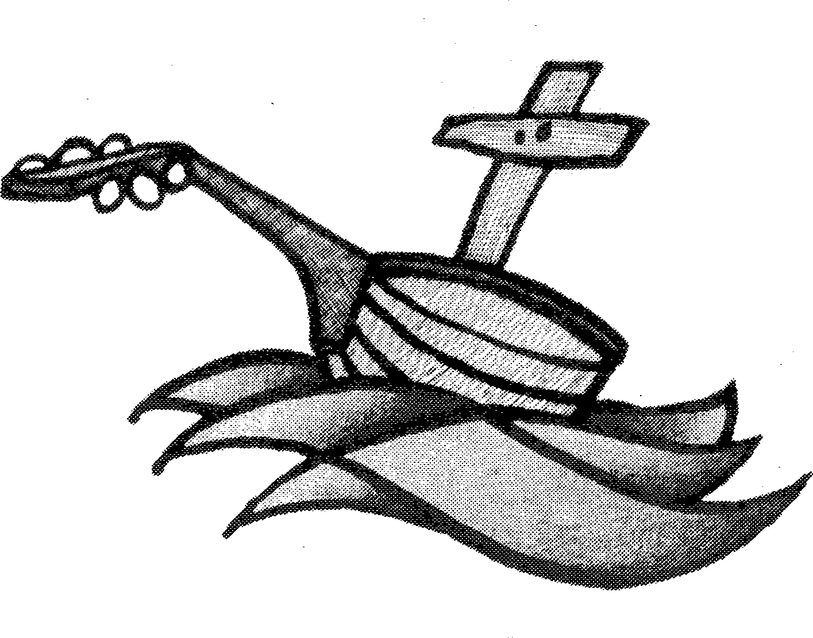

## 101 Přání

*Eva Hřibová-Budzáková, Tomáš Novotný*

(1) Já přeji si by mohli kvést zas růže ve všech zahradách, za lidi prosím, aby z cest svál dobrý vítr zloby prach.

*Ref:* Lásce dej vejít do světa, jež trpělivá umí být, ať v našich srdcích rozkvétá a pro druhé nás učí žít. (2x)

(2) Prosím i za zpěv slavíka, aby zněl lidem pro radost, a za řeku, jež utíká, ať odplaví pryč všechnu zlost.

(3) I za vojáky na stráži, a%ť nemusí tam více stát, a těm, jež dobro uráží, dej, Pane, svoji pravdu znát.

(4) Paprskem slunce jasného obšťastni naši krásnou zem, ve jménu všeho dobrého do bojů života kéž jdem.

(5) Cestou víry a naděje z bludného kruhu veď nás ven, ať láska tvá nám cílem je, ten radostný a šťastný den.

## 102 Zastávka Boží

*Jiří Tichota*

Já přivítat chci Pána, kde svou zastávku má.

*Ref:* (: Už můj vlak v dáli duní, už můj vlak v dáli duní, já přivítat chci Pána tam, kde s ním zůstane stát. :)

(1) I kdybych byl slepý a tmou musel jít, já přivítat chci Pána tam, kde s ním zůstane stát.

(2) I když jak Lazar chromý bych sám nemohl jít, já přivítat chci Pána tam, kde s ním zůstane stát.

## 103 Já sem ňákej stonavej

*Svatopluk Karásek*

*Ref:* (: Já jsem ňákej stounavej :) že v mým žití všude chybí láska z toho já jsem stounavej

(1) A tak jsem šel za farářem, říkám máš-li lék mi dej. Ty o lásce stále jenom mluvíš, já nejsem moc hloubavej.

(2) Dneska ráno potkám bráchu, on byl celej zmazanej, tak jsem se mu honem z dálky vyhnul, z toho já sem stounavej.

(3) Mám se večer učit řeči neb číst román klasickej. Nakonec si zas prohlížím porno, z toho já jsem stounavej.

(4) Půl roku loď v lahvi stavim, lepim špejle je mi hej. Dneska ráno švih sem lahví o zem, z toho já sem stounavej.

(5) V práci se chci zastat pravdy, pak si řeknu pozor dej. Zase držim hubu na špagátě, z toho já sem stounavej.

(: The angel rolled the stone away :)

Early on the Easter Sunday morning the angel rolled the stone away.

## 104 Já v srdci radost mám

*Tomáš Najbrt*

(1) Já v srdci radost mám, já dnes v srdci radost mám, o ní budu zpívat, na Pána se dívat, dnes v srdci radost mám.

(2) Já v srdci vděčnost mám, já dnes v srdci vděčnost mám, za mé vykoupení,hříchů odpuštění, dnes v srdci vděčnost mám.

(3) Já v srdci chválu mám, já dnes v srdci chválu mám, nemohu ji skrývat, musím Pánu zpívat, dnes v srdci chválu mám.

(4) Ježíš je píseň má, Pán Ježíš je píseň má, nadějí je tobě také v dnešní době, Ježíš je píseň má.

## 105 Bratry, sestry potkávám

*Tomáš Najbrt*

(1) Já vyšel z města v dálce za mnou, co měl jsem rád jsem opustil a těším se, že dojdu tam, kde najdu nový pramen sil.

*Ref:* Když bloudím pomoc čekám a vím, že nejsem sám po stejný úzký cestě další jdou – sví bratry sestry potkávám.

(2) A každej si to šlape po svejch nohách, nemůže s davem se jenom vézt. Ale o to víc si můžou pomáhat a navzájem si břímě nést.

(3) A netáhnu už sebou žádnou z věcí, co dřív jsem nutně musel mít, stejně jenom těžký jsou a já už tam chci brzo být.

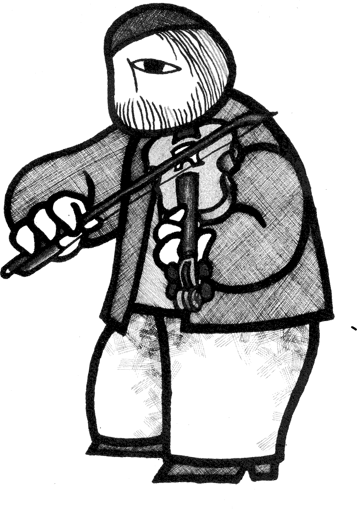

## 106 Jak dítě cítím se opuštěný

*Jiří Joran*

(1) Jak dítě se cítím opuštěný (3x) (: když dálkou jít mám, :) Pána vzývám, (: když dálkou jít mám. :)

(2) Já tím se cítím, kdo svět opouští (3x) (: když vcházím za brány dnů :) Pána vzývám, (: když vcházím za brány dnů. :)

(3) Někdy si jak sirotek připadám (3x) (: že jsem ve světě sám :) Pána vzývám, (: že jsem ve světě sám. :)

(4) Někdy si jak mrtvý připadám (3x) (: jak stoupal bych v nebeskou říš :) Pána vzývám, (: jak stoupal bych v nebeskou říš. :)

## 107 Slávy den

*Pavel Dvořáček*

*Ref:* Jak proudem tvou víru nese čas tam, kde čeká den, ten den, ten den, (2x) Jak proudem tvou víru nese čas tam, kde na nás čeká den, ten den, ten den, (2x) Tak jen pojď a se mnou si zpívej, ten den, ten den. Tak pojď a se mnou si zpívej, ten den, ten den. Já to vím, jednou přijde ten den, ten den. (4x)

(1) Soumrakem slunce nezhasíná, tvou žízní Jordán nevysychá, ve víru jeho svou víru ztratí, kdo neví, že se oheň vrátí.

(2) Utichne pláč, skřípění zubů, vzejde den, kdes čekal záhubu, velikost malejch se provalí, kapela černejch ovcí válí.

(3) A co čert nechtěl není zdání, pravda Páně vyděsí, že duše nejsou volně k mání, i když tu chrastěj řetězy.

Tak vstaň a pojď, zpívej se mnou, slávy den, slávy den (2x) Já to vím, jednou přijde ten den, ten den. (4x)

## 108 Úžasná láska

*Pavel Mareš*

(1) Jak úžasná musí ta láska být, co přišla k nám o všem se rozdělit, dát novou vláhu poušti spálené, přiblížit nám nebe tak vzdálené.

(2) Svou slávy říš opustils kvůli nám, nemusels jít, a přece chtěl jsi sám; tvář přátelskou jsi nikde neviděl, když proklínán jsi k popravišti šel.

(3) Tam místo nás život jsi položil, vrátil se zas, abys ho rozmnožil. Vím, abych já moh věčný život žít, musel můj Pán tou cestou kříže jít.

## 109 Jak vzácnou přízeň

*Jaromír Plíšek*

(1) Jak vzácnou přízeň dáváš nám, jak vzácný dar bídným. Prázdný svět náš za svůj dál máš, slepým výhled vrátíš.

(2) Hlas tvůj nám dává bázeň tvou, hlas tvůj náš strach vzdálí. Prázdný svět náš za svůj dál máš, slabým víru vrátíš.

(3) Já vím, z milosti tvé dýchání mé, já vím, z milosti tvé den můj. Prázdný svět náš za svůj dál máš, lačným chléb a víno dáš.

(4) Amazing Grace, how sweet the sound, that saved a wretch like me. I once was lost, but now I'm found, was blind but now I see.

(5) 't was grace that taught my heart to fear, and grace my fears relieved; how precious did that grace appear the hour I first believed.

(6) Tho's many dangers, toils and snares, I have already come; 'tis grace hath bro't me safe thus far, and grace will lead me home.

(7) How sweet the name of Jesus sounds in an believer's ear. It soothes his sorrows, heals the wounds, and drives away his fear.

(8) Must Jesus bear the cross alone and all the world go free? No, there's a cross for ev'ry one and there's a cross for me.

## 110 Myslete na Kanaán

*Bohuslav Košťák*

(1) Jak zdlouhavě se vlekly dny a obzor zdál se nekonečný, jen z dálky bylo slýchat hlas, jenž únavou se sotva třás.

*Ref:* Ó myslete na Kanaán, kdo jste cestou unaveni! Ó myslete na Kanaán, zemi krásných nadějí.

(2) Tam v poušti pálil slunce žár, že zástup žíznil, nemohl dál, pak místo spánku v noci mráz a ráno kdosi zpíval zas:

(3) Pak přišla vláha, přišel stín, lid zapomínal na bolesti, křik s jásotem se rozléhal, hlas Mojžíšův v něm zanikal:

(4) A národ prošel pustinu, tam žíznil, bloudil, nezahynul, však přece dospěl do země v té písni dávno slíbené.

## 111 Jako po dešti

*Tomáš Najbrt*

(1) Jako po dešti slunce jas přijde a mraků zbaví nás, tak bude den, kdy přijdu tam, kde bude Pán. Na zemi naděj‘ čekat mám, přijde a já mu chválu vzdám. Přijde a v srdcích bude chrám, tam bude Pán. Tam bude Pán, tam bude Pán, přijde a v srdcích bude chrám. Tam bude Pán, tam bude Pán, tam bude Pán, přijde a v srdcích bude chrám, tam bude Pán.

(2) Vejdu do slávy nebes bran, vejdu a budu uvítán, čeká mě věčný život tam, kde bude Pán. Spásu mi Kristus daroval, na sebe moje hříchy vzal, do Nové země zavolal, kde bude Pán. Tam bude Pán, tam bude Pán, do Nové země zavolal, tam bude Pán, tam bude Pán, tam bude Pán, do Nové země zavolal, tam bude Pán.

(3) Krátce a brzy přijde den, kdy bude každý přezkoušen, až zůstanou Boží děti jen, kde bude Pán. Pán Ježíš přijde brzy, vím, a jeho slovům věřit smím, až jeho slávu uvidím, tam bude Pán. Tam bude Pán, tam bude Pán, až jeho slávu uvidím, tam bude Pán, tam bude Pán, tam bude Pán, až jeho slávu uvidím, tam bude Pán.

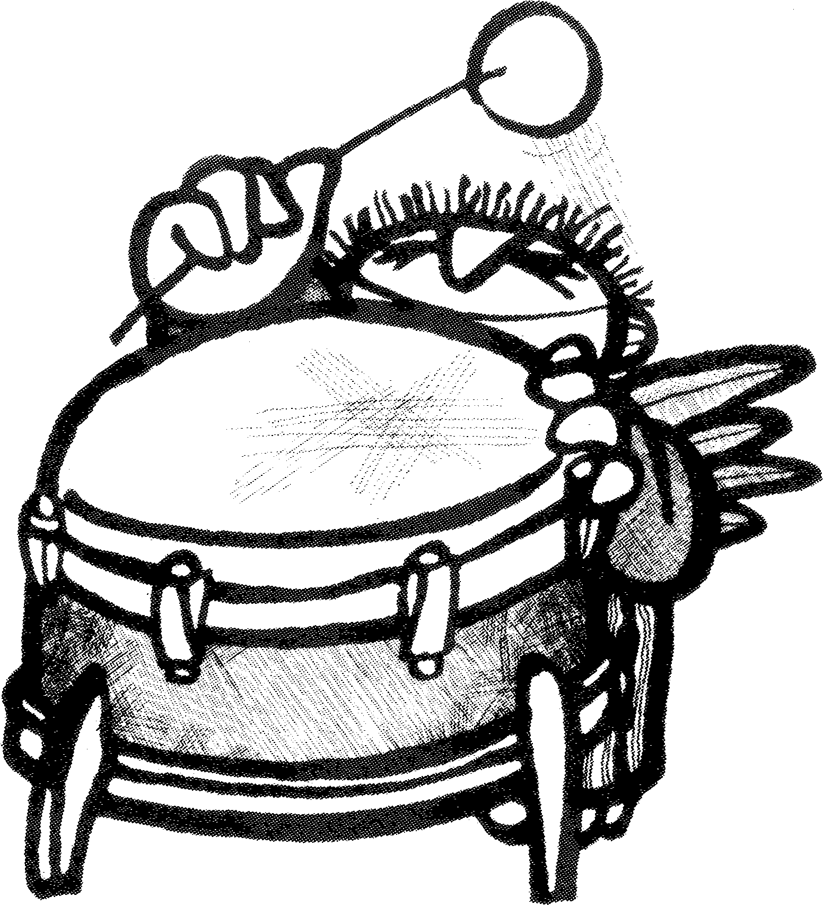

## 112 Jako skála v širém moři

*Jaromír Křivohlavý, Miloš Rejchrt*

Jako skála v širém moři, jako ostrov v mořské bouři, jako svíce, která boří, stojíš, Pane můj.

## 113 Jako slunce je boží láska

*Bohumír Toušek*

*Ref:* Jako slunce je Boží láska, všechno prozáří okolo nás. (2x)

(1) Dej i ty své srdce Pánu, chce ti dát víc, než co můžeš chtít.

(2) Hřích nikdy tvůj mezi tebou a tvým Pánem, ať netvoří stín.

(3) Dej také lásku tu dále i tam, kde tě nikdo nemá rád.

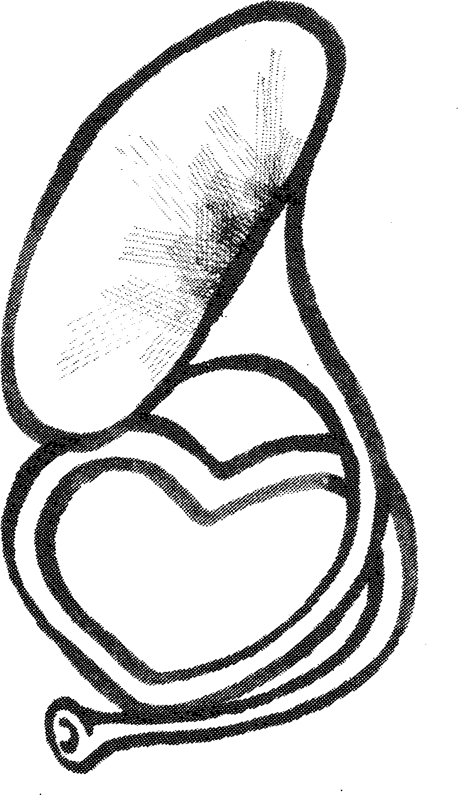

## 114 Jděte dál

*Tomáš Lavický, Tomáš Najbrt*

(1) Jděte dál a zvěstujte mé slovo, jděte dál, nemusí vás být mnoho, (: jděte dál :). Jděte dál, já s vámi budu stále, jděte dál, vždyť stojíte na skále, (: jděte dál :). Žádná bouře ať vás nezastaví, nepečujte o život a zdraví, jděte dál, jděte dál, jděte, jděte dál.

(2) Jděte dál když v kopcích střelba hřímá, jděte dál a napijte se vína, (: jděte dál :). Jděte dál, to víno krev je moje, jděte dál, až tam, kde zuří boje, (: jděte dál :). Mezi zbraněmi je přece třeba, nalít lidem víno a rozdat chleba, jděte dál, jděte dál, jděte, jděte dál.

(3) Jděte tam, kde strach a hlad jsou pánem, jděte tam, kde noc začíná s ránem, (: jděte dál :). Jděte tam, kde v hrůze umítají, jděte tam, kde drogy vládu mají, (: jděte dál :). Jsou to vaši bratři, říká Slovo, můžete je přece dostat u toho, jděte dál, jděte dál, jděte, jděte dál.

## 115 Jdou, stále jdou se zprávou

*Jaromír Plíšek*

*Ref:* Jdou, stále jdou se zprávou, cestou dobrou i po skalách, jdou stále jdou se zprávou: sám Bůh je Pán a Král.

(1) Svět zdávna vládne mocí, sází na moudrost svou a dál jsou nazí, bosí a dál tu jsou, kdo jdou.

(2) Jsou pevné hráze zvyků, lží srázy strmé jsou, jsou křoví z otazníků a dál tu jsou, kdo jdou.

(3) Bití a proklínaní, vábení pěknou mzdou, vnímaní, nevnímaní, a dál tu jsou, kdo jdou.

## 116 Vlnobití

*Jaromír Plíšek, Jiří Scheider*

(1) Je bída tohle bytí, je jako vlnobití, vtáhne tě a nepustí, sem a tam tě hází, rány tobě sází, láme tě až k prasknutí.

*Ref:* Tak zastavte tu jízdu děsnou, chci vzduch, ne vodu slanou vdechnout, tak zastavte ten pád ke dnu kamennému.

(2) A dál se vlny valí, pění se a kalí, ryk, co všechno přehluší. Hrůza ruce poutá, zkáza ze tmy kouká, což to nikdo netuší?

*Ref:* Kdo zkrotí moře zlé? Kdo pevnou ruku dá? Půdu pod nohama?

(3) Marně řvu a vzlykám, marně stébla chytám, síly už mi dochází. Zoufalý a hluchý, nemám ani tuchy kdo po vlnách přichází.

## 117 Je stále přítomná tvoje sláva

Je stále přítomná tvoje sláva.

*Ref:* dostně zpíváme o tvém díle.

Písnička ať zvoní každé chvíle.

Chci tě chválit, Pane můj,

jak Duch dává.

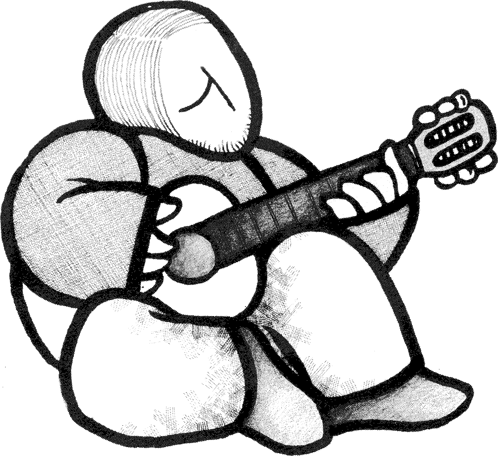

## 118 Je lepší na skále život svůj mít

*Svatopluk Karásek*

(1) (: Je lepší na skále život svůj mít, pamatuj! :) Noemu duhou zjevil Bůh, že už ne voda, příště vzplane vzduch. Je lepší na skále život svůj mít, pamatuj!

(2) Boháč, co vyhnal Lazara ven, ten neměl život svůj na skále postaven, ten neměl na skále život svůj, pamatuj!

(3) Pilát co soudil tak, jak dav řve, a pak si umyl, umyl si ruce své, ten neměl …

(4) Kněz ten, co si dál na mši svou šel, z příkopu sten jakoby neslyšel, ten neměl …

(5) Chlap ten co si to v svým auťáku hnal, stopaře všechny přezíral, ten neměl…

(6) Do šutru vyrytý srdce rukou tvou, nejde smejt vodou mejdlovou, je lepší…

(7) Noemu duhou zjevil Bůh, že už ne voda, příště vzplane vzduch, je lepší…

## 119 Jedno jsme v Duchu svatém

*Vlastimil Maláč*

(1) Jedno jsme v Duchu svatém, všechny nás spojil Pán, jedno jsem v Duchu svatém, všechny nás spojil Pán, ale též všechněm kolem může býti pokoj dán.

*Ref:* Křesťanům stále vládne lásky Pán, lásky Pán, ano, křesťanům vládne lásky Pán.

(2) Půjdem dál jeden s druhým, budem jak jeden val. Půjdem dál jeden s druhým, budem jak jeden val, a tu zvěst "Přišel Ježíš" chceme šířit všechněm dál.

(3) Budem též dělat spolu, při sobě budem stát. Budem též dělat spolu, při sobě budem stát, hájit chcem vždycky právo a na pravdu přitom dbát.

(4) Chválen buď, Otče v nebi, dárce krás kolem nás. Chválen buď, Kriste Synu, vždyť' tvůj kříž spasil nás. Chválen bud', Duchu svatý, v jednotu jsi spojil nás.

*Ref:* Křesťanům stále vládne lásky Pán, lásky Pán, ano, křesťanům vládne lásky Pán.

(5) (: We are one in the spirit,

we are one in the Lord. :) And we pray that the unit may one day be restored.

*Ref:* And they'll know we are Christians by our love, by our love, yes, they will know we are Christians by our love.

(6) (: We will walk with each other,

we will walk hand in hand. :) And together we'll spread the news that God is in our land.

(7) (: We will work with each other,

we will work side by side. :) And we'll guard each man's dignity and save each man's pride.

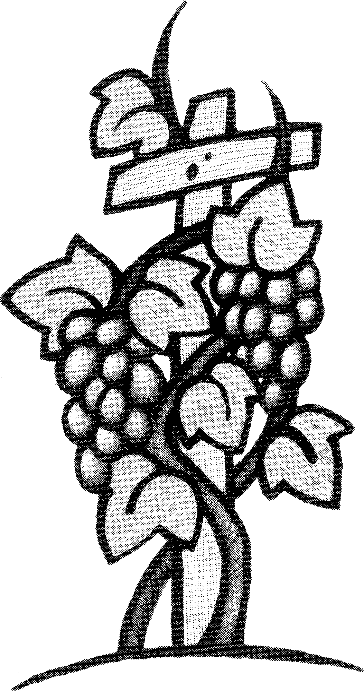

## 120 Jednou budem dál

*Ivo Fischer, Jan Miřejovský*

(1) Jednou bude dál, jednou budem dál, jednou bude dál, já vím, ó, jen víru mít, doufat a jít, jednou bude dál já vím.

(2) Cíl je blízko nás…

(3) Jednou přijde mír…

(4) Není proč se bát…

(5) My to vyhrajem, my to vyhrajem, my to vyhrajem v ten den, ó, srdce mé to ví, už s tím počítá, my to vyhrajem v ten den.

(6) Jenom žádný strach…

(7) Budem svobodní…

(8) Půjde s druhem druh…

(9) Budem v míru žít…

## 121 Jen běžet dál

*Eva Hřibová-Budzáková, Tomáš Novotný*

*Ref:* Jen běžet dál, jen běžet dál, kdo velel k startu zná i cíl. Jen běžet dál, jen běžet dál, s radostnou tváří běžet dál.

(1) K dobrému boji Bůh nás zve, ač slabí jsme pro mládí své, on nechce abys běh svůj vzdal; bez něj by ses však marně štval.

(2) Že klopýtneš se může stát, zlomí tě únava či pád. Tvůj Pán rád pozvedne tě zas či lidskou pomoc pošle včas.

(3) Kristus tě v cíl pozdraví, vítěz a přítel laskavý. Korunou odmění tě král, že‘s se zlem čestně bojoval.

## 122 Jen Bohu věř

*J. Nemanský*

Jen Bohu věř, hleď vzhůru k nebesům, on porozumí starosti tvé i snům.

Jen Bohu věř, naději novou měj, jen Bohu věř, svou lásku jemu dej.

(: Zítřek tě čeká a může šťastný být, předobrý Pán chce s tebou dále jít, jen Bohu věř, svůj život u něj slož, jen Bohu věř, svou ruku v jeho vlož. :)

## 123 Jen mluvte každý pravdu

*Tomáš Novotný*

*Ref:* Jen mluvte každý pravdu s bližním svým a stanete se opět lidem mým já pustý Jeruzalém naplním.

(1) Horlil jsem horlením velikým teď k tobě zpátky zas se navrátím. Ač se to divné zdá, je velká milost má, dává se tam, kde pravda přebývá.

(2) Zas v ulicích si budou děti hrát a v podvečer se budou dívky smát. I starci o holích zas mají v očích smích. Jen vynášejte pravdu v domech svých.

(3) A vinný kmen zas vydá plody své a nastanou ti časy pokojné. I nebesa rosou zas svlaží zemi tvou. Jen nemiluj přísahu falešnou.

*Ref:* Jen mluvte každý pravdu s bližním svým a stanete se opět lidem mým já pustý Jeruzalém naplním.

(4) I kostely si jednou naplním, až církev bude zase lidem mým. Já v nenávisti své mám srdce falešné. I toho, kdo bližnímu chystá zlé.

(5) Jen mluvte pravdu, pravda musí znít. Tak nenechte ji v katakombách shnít. Ať září nad cestou všem jasnou září svou, kdo chtěj‘ jít ze lži rovnou za pravdou.

## 124 Novej den

*Míla Esterle*

*Ref:* Jen ten, kdo doufá, novej den chce žít, doufá, novou sílu mít, doufá.

(1) Kdo dneska hlavu věší od rána a bez boje je bitva prohraná, i novej den máš od Pána, čeká brána nebeská.

(2) To ráno, až mě vzbudí svítání, svý srdce vidím, napřed uhání. Než večer zazní klekání, půjde branou v nebesích.

(3) To ráno, až se k Pánu davy pohrnou, tu černí, bílí, velcí, malí ustrnou. Co dní už vzdal, dneska jdou tou bránou nebeskou.

## 125 Jen ty, Pane můj

*Ref:* Jen ty, Pane můj, jen tys můj štít, má sláva, ty mou hlavu pozvedáš.

(1) (: Mnoho je těch, kteří kolem volají: V Bohu žádnou pomoc nenajdeš.:)

(2) (: Volal jsem k Pánu svému v úzkosti, a on prosbu moji vyslyšel. :)

(3) (: Ty mi dáváš spánek, novou sílu, v novém dni mě znovu podpíráš. :)

(4) (: Nebudu se bát ani tisíců těch, kdo mě pronásledují. :)

## 126 Bdí při nás

*Jaromír Plíšek*

(1) Ještě slepí, plačící, první mléko sající, bděl při nás, měl pro nás dům svůj.

*Ref:* Bůh sám, náš Pán, bděl při nás, měl pro nás dům svůj.

(2) Nadšení a bezhlaví, kdo náš svět sami napraví.

(3) Sobě moudří, nadutí, sytí a dobře obutí.

(4) Zrazení a v nesnázích, ve falešném pokání.

(5) Ubití a neteční, vystrašení, zbyteční.

(6) Svět je zmatek, lež a dým, svět je místem nadějným. Bdí při nás, má pro nás dům svůj.

*Ref:* Bůh sám, náš Pán, bdí při nás, má pro nás dům svůj.

## 127 Ježíš je Pán

*Petr Chlouba*

Ježíš je Pán, jediný a svatý,

Ježíš je Pán, jediný a svatý,

Ježíš je Pán, jediný a svatý.

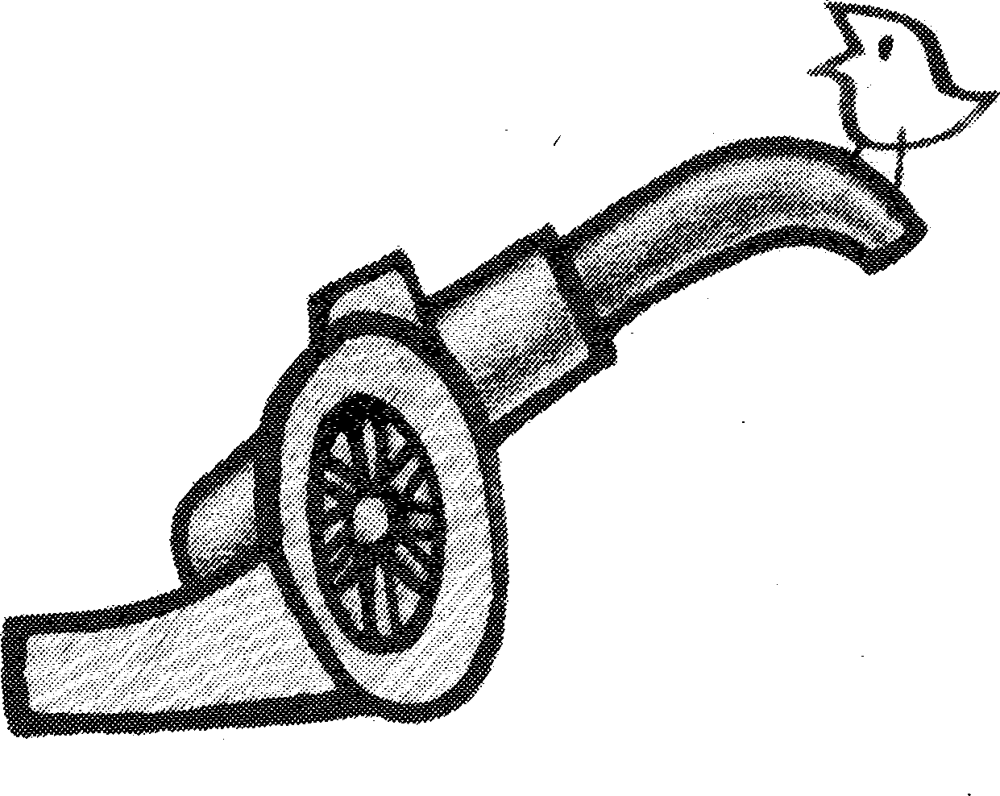

## 128 Ježíši, já jsem slíbil

*Bohumil Kejř*

(1) Ježíši, já jsem slíbil, že život svůj ti dám. Buď při mně vždycky blízko, můj přítel a můj Pán. Nebudu bát se boje, po boku když jsi mém, a nesejdu z tvé cesty, když jsi mým Průvodcem.

(2) Ó, dej mi, Pane, slyšet tvůj tichý, čistý hlas, jenž nad bouře všech vášní zaznívá zas a zas. Upevni mne svým slovem, přemáhej všechno zlé, dej, ať tě dobře slyším, ty strážce duše mé.

(3) Dej, ať tvé stopy vidím, ať řídí kroky mé, a chci-li následovat, ať jdu jen v síle tvé. Jen drž mně, zdvíhej, volej a veď až dojdu tam, kde věrné svoje vítáš, ty Přítel můj a Pán, kde věrné svoje vítáš, ty Přítel, ty můj Pán!

## 129 Vánoční koleda

*Miroslav Brož, Jaromír Plíšek*

(1) Již svítá a světlo přichází k nám a jako ti pastýři pospěšme tam, kde div se stal: Bůh láskou vzplál. Kdo srdce mu přichystá, proč by se bál.

(2) Hle, dítě tu v jeslích, v temnotách jas, to v Betlémě vzešla nám naděje zas. Když chudou stáj proměnil v ráj. Bůh v moci má spasit nás i celý kraj.

## 130 Již za horami v dáli

*Miroslav Brož, Miroslav Rozbořil*

(1) Již za horami v dáli ztemněla jasu zář a v stíny tmy se halí v podvečer země tvář. Kde slunko krátce jen nám milosti své přálo a zimomřivě hřálo, je noc nám domovem.

(2) Však po chvilince malé se vůkol nebes stan jak ke cti svého Krále rozžehne ze všech stran. Přec je to matný svit. Nám stačila by zcela ta hvězda jedna skvělá. Jen na věky ji mít!

(3) Pak už jen zaleskne se ohně neb lampy jas a jeho zář se nese a chce potěšit nás. A tu nám dobře je, když oheň jasně plane. Ač v jiném spásu máme, přec nás zas zahřeje.

(4) Potom i oheň zhasne, řeknem si: dobrou noc. Dík vzdáme za vše krásné, za Boží řád a moc. Slunce i každou z hvězd on v ochraně své chová a svému lidu znova vždy věrným světlem jest.

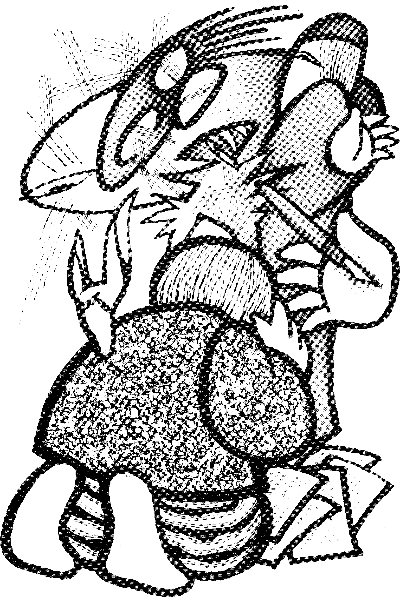
<i>...divné hlasy otázku mi šeptají:
K čemu věrnost, nač pohrdat zradou? ...</i>

## 131 Jericho

*Pavel Dvořáček, Jiří Joran*

*Ref:* Jozue, ten porazil Jericho, Jericho, Jericho, Jozue, ten porazil Jericho, dolů hradby padají.

(1) Jen si mluvte, jak jste silní v kramflecích, jen si stavte hradby z elegantních slov, je k smíchu tohle vaše lopocení při vzpomínce na Jericho.

*Ref:* Jozue, ten porazil Jericho, Jericho, Jericho, Jozue, ten porazil Jericho, dolů hradby padají.

(2) Kampak sestro takhle z rána, kam chvátáš bratře můj. Odlož všechna svá dobrá předsevzetí a troubení připravuj.

(3) Protože Hospodin dal tohle město v ruku tvou, máš šanci, tak se snaž. Rytmus ti udělí dirigent rukou svou a melodii přece znáš. – Refrén

*Ref:* Jozue, ten porazil Jericho, Jericho, Jericho, Jozue, ten porazil Jericho, dolů hradby padají.

(4) A tak dav se tiše prodírá, podél hradeb nepříjemnou houštinou. Nikdo ani nešpitá, pohrdajíc ozvěnou.

(5) Avšak sedmého dne Jozue rozkaz dal ať se nikdo se svým hlasem netají. Nikdo se dělat kravál neostýchal, dolů hradby padají.

*Ref:* Jozue, ten porazil Jericho, Jericho, Jericho, Jozue, ten porazil Jericho, dolů hradby padají.

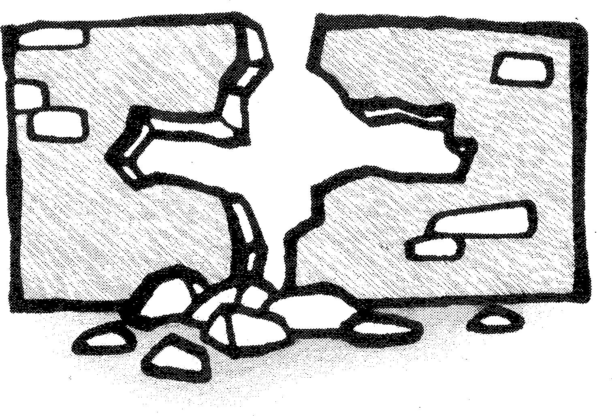

## 132 Jsem všechno, co nemáš

*Jan Kočnar, Miluše Šišková-Kadlecová*

*Ref:* Jsem všechno, co nemáš, jsem všechno, co hledáš, řekni to lidem všem, řekni to lidem všem. Řekni, že v srdci tvém byla tma, černá noc, uprostřed noci té vyšla hvězda na pomoc.

(1) Neměl jsem sílu se s životem rvát, Na půli cesty vždy zůstal jsem stát, zvedal jsem zoufale svůj těžký kříž, náhle jsem uslyšel jméno Ježíš.

(2) Nikdy jsem nevěděl, co je to hřích, poznal jsem v světě jen slzy a smích, až když jsem, Pane můj, našel tebe, viděl jsem jasně, jak hřích můj zebe.

(3) Vezmi svůj kříž a pojď po cestě mé, dej mi své trápení, my dojdeme, tohle mi Ježíš řek a já jsem šel, dneska už dobře vím, že pravdu měl.

## 133 Vánoční

*Miroslav Heryán, Pavel Otter, Miloš Rejchrt*

(1) Jsem zde na zemi poutníkem v prachu zmatených stop. Bloudím, přece však zpívám všem, kdo hledí na svůj hrob.

*Ref:* Zpívám o tom že nalézám cestu již ze smrti do nebe. Bůh sám, který svět stvořil nám, úděl nás lidí vzal na sebe.

(2) Na své pouti, když hledám cíl, skrytý před tváří mnou, v světě, kde člověk ve tmách žil, zřím hvězdu zářivou.

## 134 Jsme světa občané hrdí

*Bohdan Pivoňka*

(1) Jsme světa občané hrdí, tak se to všude dnes tvrdí, přírodě dáváme sbohem, kompjútr je naším bohem.

*Ref:* Žasneš ty a žasnu já, žasnem fakticky, co všechno probíhá automaticky. (2x)

(2) Automat vyřeší lehce, co člověk rozhodnout nechce. Když se však zásoby krátí, člověk se k přírodě vrátí.

(3) Semeno do země padne, nevidíš výsledky žádné. Království Boží však klíčí, ač se to rozumu příčí.

(4) Namísto aby vše zheblo, vyroste ze země stéblo. Nemusíš dělat si vrásky - a je tu království lásky.

(5) Můžeš spát můžeš být bdělý, pole se zatřpytí bělí. Třeba jen pozor si dávat, kdy srpy bude se mávat.

## 135 Posila na cestu

*Jaromír Plíšek*

(1) K svobodě je dlouhé putování, těžké bývá zvednout se a jít. Tolik různých pout, tolik závor v cestě brání, jen sám Bůh je umí rozlomit.

(2) V noci naplněné odhodláním, v noci, která je tou poslední, beránek a chléb, v ruce hůl a žádné spaní za zdmi domů krví značených.

(3) Na úsvitu voda staré splaví stíny zákeřného otroctví, cesta míří dál, celý průvod jde před námi, směr udává nám sloup ohnivý.

(4) Každý, kdo se dlouhou cestou znaví, zadarmo se vína napít smí, dostává i chléb - novou sílu z Božích dlaní, víru, že smrt končí vzkříšením.

## 136 Kam v soudu den

*Jaromír Plíšek*

(1) Kam v soudu den dáš, co dneska sháníš, kam v soudu den dáš, co dneska sháníš, kam v soudu den dáš, co dneska sháníš, v ten soudu den.

(2) Kam v soudu den dáš, co v chůzi brání ....

(3) Kam v soudu den dáš svý srdce prázdný ....

(4) Nejde to skrýt do samoty skalní ....

(5) Nejde to skrýt v města křiku žádným ....

(6) Nejde to skrýt mezi věty krásný ....

(7) Kam v soudu den dáš, co dneska sháníš, kam v soudu den dáš, co v chůzi brání, kam v soudu den dáš, svý srdce prázdný, v ten soudu den.

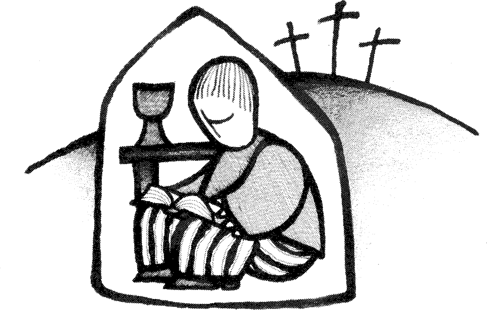

## 137 Čas zaslíbený

*Jiří Gruber*

*Ref:* Každá věc svůj čas mívá, naděje každý den zpívá, nezoufej, když všechno není, jak sis přál.

(1) Je čas rození, čas umírání, čas májový, čas odkvétání, čas ztracený, čas odměřený, čas darovaný, kdy víš, kdo je tvůj Pán.

(2) Je čas hledání, čas oklamání, čas nadějí, čas vyčkávání, čas bloudění, čas promarněný, čas pověření, kdy víš, kde sílu brát.

(3) Je čas válečný, čas ponížených, čas vítězů, čas poražených, čas násilí, čas odplácení, čas odpuštění, kdy víš, kde lásku brát.

*Ref:* Každá věc svůj čas mívá, naděje každý den zpívá, nezoufej, když všechno není, jak sis přál.

(4) Čas posmívání, čas bičování, čas zapření, čas opuštění, čas obětní, čas křižování, čas zmrtvýchvstání, kdy víš, kde víru brát.

(5) Je čas neznámý, čas vyhlížený, čas modlení, čas vyslyšení, čas vykoupení, čas zaslíbený, kdy přijde znovu Pán.

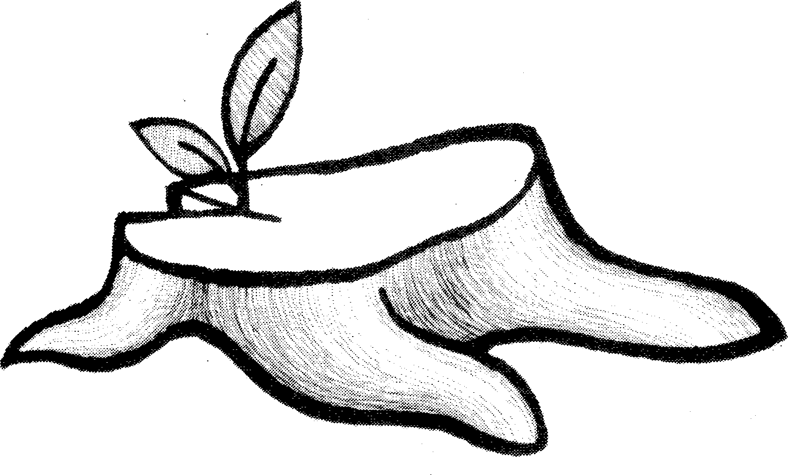

## 138 Pomlouvají mé jméno

*Míla Esterle*

(1) Každej sedmej den v chrámě sedávám a pocit mívám fajnovej. S důvěrou bratrům všem ruku svou podávám, v pondělí úlek hotovej.

*Ref:* Proč jen zlý řeči mluví, lžou, lžou, jen zlý řeči mluví, lžou, lžou, proč jen, to znát mi dej.

(2) Každej sedmej den zrána spěchávám, pak čekám v bráně chrámovej. Všechny starý známý zas rád potkávám, v pondělí úlek hotovej.

(3) Každej sedmej den v chrámě naslouchám a hledám sílu v době zlej. Pondělí — smutnej den, zase sám zůstávám, z toho mám úlek hotovej.

## 139 Zašívák

*Štěpán Hájek, Zdeněk Šorm*

(1) Každej z nás si denně hledá koutek kam by se zašil kde by to co spát mu nedá prostě k ledu uložil kde by uši srdce hlavu něčím zaměstnal aby ho červ ve svědomí dál už nehlodal.

(2) Každej z nás denně hledá koutek zvanej zašívák pro jednoho je to věda pro druhýho slovignag třetí zase buduje si pevnost rodiny kam by utek z nouze světa čestně bez viny.

(3) Stejně čestně bez cavyků ukrejem se v kostele obrníme silou zvyků pánem je nám neděle nad bližního postavíme zákon milosti pouhou věrou zbaveni jsme slibu věrnosti

(4) Zašijem se do ulity spásonosných názorů ideálem dobře krytý tlačíme se nahoru podél cesty necháváme zbitý ve křoví čistota nám brání vidět nuzný hladový

(5) Každej z nás si denně hledá koutek zvanej zašívák příliš příliš práce mu to nedá k pivu stačí otvírák vprostřed světa vidět sebe druhý vodepsat a na jistým teplým fleku zůstat stát

(6) Vyznávám že věřím v Krista kterej s Bohem jedno byl nikde tady neměl místa a přesto se nezašil nevzal roha kolem Boha vprostřed světa stál aby se až na lidskej kříž rozdával

(7) Vyznávám že věřím v Krista kterej s Bohem jedno byl nikde tady neměl místa a přesto se nezašil lidi lišky doupě mají Kristus pude dál aby k sobě do radosti ze všech koutů zval

## 140 Široká brána

*Miloš Rejchrt*

(1) Každýho rána, na každý den, široká brána volá: polez ven, jen dej se s námi cestou vyšlapanou, širokou branou, tam nebudeš sám.

(2) A u té brány převelice hustá tam vzniká tlačenice, proč taky pořád do zdi mlátit hlavou, Když s hlavou zdravou dá se zdravě žít.

(3) Ta slavobrána malovaná, zvečera zrána votvíraná, při spoustě kladů drobnou má jen vadu – otvírá vrata vrátná zubatá.

(4) Kdo vchází branou převelice úzkou, ten ranou do palice obvykle platí cestu, kterou svatí na nebe vzatí prochodili zem.

(5) Každej kdo věří, kdo miluje, do úzkejch dveří se směřuje. Každej kdo lásku má a pevnou víru, kde tesař díru nechal, dobře ví.

(6) Ty úzký dveře všemu světu zanechal tesař z Nazaretu. Každej kdo lásku má a žije vírou, tou těsnou mírou přece projde dál.

## 141 Kde jsi, můj přemilý

*Sušil*

(1) Kde jsi můj přemilý Ježíši Kriste? Kde Tě hledat budu, na kterém místě?

(2) Pusť od sebe světlo, ó slunce jasné; bez tebe nám svíce života hasne.

(3) S tebou se srdce mé žádá spojiti; bez Tebe nemůže dál živo býti.

(4) Dokud tě nenajdu, volat tě budu, ve dne, také v noci volat tě budu.

(5) Ach, pospěš k smutnému, dél neodkládej, můj drahý poklade, pomoci mně dej.

(6) Kdekoli ty půjdeš, za tebou půjdu, tebe se na věky přidržet budu.

(7) Když tebe mít budu, předrahý hosti, nech jiného nemám, na tom mám dosti.

## 142 Kdekdo čeká na zázraky

*Tomáš Najbrt*

(1) Kdekdo čeká na zázraky něco přijde vždyť já vím stojím tu a čekám taky svatbu v Káni zapíjím Na časy se pořád blízká já se vůbec nenudím přihlížím vždy hodně zblízka napjatý co uvidím.

(2) Čekáme jak husa klasu už jsme dolík vystáli zacláníme si zrak dlaní vyhlížíme do dáli. Máme záda votlačený od stálýho sezení když se kolem něco děje oči máme zavřený.

(3) Prý měli jen dvěstě grošů a pak drobtů ze trávy nasbírali dvanáct košů tak se o tom vypráví. Kdekdo čeká na zázraky proč to dělá sotva ví stojím tu a čekám taky i když mě to unaví.

(4) Ani děti nejsou jiné od otců a od matek všichni chceme ihned vidět velkolepej začátek. Chceme rovnou vidět hory jak se vrhaj do moře a když se to náhle stane schováme se v komoře.

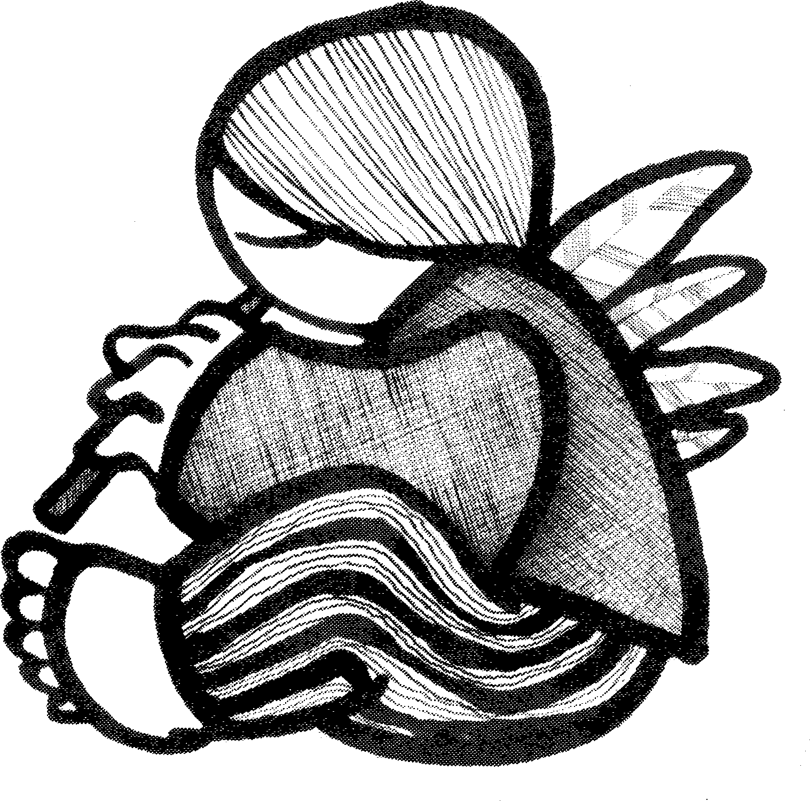

## 143 Kde, Pane, jsi

*Miloš Rejchrt*

*Ref:* Kde, Pane jsi, kde je tvá sláva, dnes v duši mé noc jen je tmavá? Kde, Pane jsi, kde moc je tvoje, jež tiší pláč i nepokoje?

(1) Hledám tě, Pane, na cestách, kde potkávám bloudící, hledám tě v zákoutích města, v potemnělé ulici, hledám tě i v pochybnostech těch, jimž v srdci bodá žal, tuším, Pane, že jsi s těmi, kdož nevědí, kudy dál.

(2) Tam, kde dítě marně touží po náruči matčině, kde svědomí vina souží, tam, kde vězní nevinné, tam, kde druhým ku pomoci podám ruku ochotnou, tam, uprostřed temné noci uzřím, Pane, slávu tvou.

## 144 Kdekdo to zná

*Pavel Dvořáček*

(1) Kdekdo to zná, kdekdo to prožil, jít světem sám bědným a zlým, byť bych se dál sebevíc soužil, teď znám svůj cíl, o zemi vím, kde matku svou já jistě potkám, tam blouděním, tam nepoznám tmu, už nejsem sám, já přejdu Jordán, ten kraj už znám, cestu domů.

(2) … kde otce též já jistě potkám …

(3) … kde sestru svou já jistě potkám …

(4) … kde bratra též já jistě potkám …

(5) … kde Kristus Pán nás všechny potká …

## 145 Kdo bude v nebi žít

*Tomáš Novotný*

(1) Kdo bude v nebi žít? Jen Bůh to ví. (3x) Ale já vím, jak to bude fajnový.

A leckdo se pak podiví, koho to taky v nebi nevidí. Kdo to tady s náma je? Jak se moh‘ tenhle dostal do ráje?

(2) Jak bude v nebi žít? Jen Bůh to ví (3x) Ale já vím, jak to bude fajnový.

Naše lidské myšlení, je dobrý jenom tady na zemi. Na to rozum nestačí, jak nás Bůh uchem jehly protlačí.

(3) Kdy skončí život můj? Jen Bůh to ví! (3x) Ale já vím, jak to bude fajnový.

## 146 Kdo chce dál

*Daniela Novotná-Vojtíčková, Tomáš Novotný, Zdeněk Vojtíšek*

*Ref:* (: Kdo chce dál, ten musí cestou chval :) Všecko ať zní k Boží chvále, dneska zítra a tak dále. Kdo chce dál, ten musí cestou chval.

(1) Mindráky a křivdy samý, city stokrát převoraný, zoufání nad vlastní povahou jsou slepou cestou.

(2) Výhrady a připomínky, utíkání do vzpomínky, rozpaky nad církví Kristovou jsou slepou cestou.

(3) Starání a různý strachy, dostat byt a sehnat prachy, vzdychání nad situací zlou jsou slepou cestou.

## 147 Kdo mě z pout mých

*Miloš Rejchrt*

*Ref:* Kdo mě z pout mých ven vyvodí, kdo ta pouta odstraní, jenom láska vysvobodí, láska bázeň vyhání.

(1) Být jak strom, co plody nese, nejen listí pro krásu, být jak strom, co nepohne se, nebojí se nečasu.

(2) Být jak dům na skále pevné, jako maják na moři, s kterým ani příval nehne, když se na něj oboří. - Ref.

(3) Pramen žití někde najít, neznat, co je únava, třeba sám, dál pravdu hájit, i když právě prohrává.

(4) Kdybych pronik' do atomu, kdybych létal na Měsíc, jako anděl mluvil k tomu, lásku neměl, nejsem nic. - Ref.

## 148 Kdo na kolenou klečí

*Jaromír Plíšek*

(1) Kdo na kolenou klečí, vídá dál. Kdo na kolenou klečí, vídá dál.

*Ref:* Život svůj prý kdo ztratí, jen ten ho zachrání. Dlouhý, těžký je chápání.

(2) Kdo nedělá moc řečí, poví víc.

(3) Kdo dává, zpět nežádá, má dost sám.

## 149 Náš Pán

*Miroslav Gallus*

(: Kdo to byl světu dán,

kdo přišel do tvých vin,

kdo ti dal věčný den.

Náš Pán,

ó náš Pán. :)

(: Ó náš Pán,

přišel k nám

ó náš to Pán,

o nás ví,

ó náš Pán,

zachrání,

ó náš Pán,

ó náš Pán. :)

## 150 Kdo to tam

*Jiří Gruber, Jiří Joran*

(1) Kdo to tam na zeď začal psát? Kdo to tam na zeď začal psát? Ó pojď to písmo přečíst, co říká nám. Kdo to tam na zeď začal psát? Ó Danieli, kdo to tam na zeď začal psát? Kdo řádky ty psal? Kdo to tam na zeď začal psát? Bůh řádky ty psal. Kdo to tam na zeď začal psát? Ó rci: Nebukandezare, jsi zvážšn a shledán byl jsi lehkým. Kdo to tam na zeď začal psát?

(2) Kdo to tam na zem začal psát, kdo to tam na zem začal psát, ó, pojď to písmo přečíst, co říká nám, kdo to tam na zem začal psát? Kdo jsi bez viny, kdo to tam na zem začal psát, kámen vem a hoď, kdo to tam na zem začal psát, kdo znáš vinu svou, kdo to tam na zem začal psát, dál jdi a už nehřeš více, Bůh dává sílu začít znovu žít, kdo to tam na zem začal psát?

(3) Kdo to tam knihu začal psát, kdo to tam knihu začal psát, ó, pojď ta jména přečíst, kdo žít má dál, kdo to tam knihu začal psát? Ó, slyš, člověče, kdo to tam knihu začal psát, kde jsou skutky tvé? Kdo to tam knihu začal psát, kde je věrnost tvá? Kdo to tam knihu začal psát, ó, slyš, pro Ježíše Krista jsi zvážen a shledán byl jsi drahý, kdo to tam knihu začal psát?

Závěr

Kdo to tam knihu začal psát, kdo to tam knihu začal psát, ó, pojď ta jména přečíst, kdo žít má dál. Kdo to tam knihu začal psát?

There's a hand writing on the wall, there's a hand writing on the wall, oh, won't you come and read it, see what it says; there's a hand writing on the wall.

Oh, Daniel there's a hand writing on the wall who write the letter there's a hand writing on the wall. God write the letter there's a hand writing on the wall. Tell old Nebucaneezar that has weighed in the balance and found wanting there's a hand writing on the wall.

There's a hand writing on the wall ...

## 151 Všichni otcové a mámy

*Tomáš Najbrt*

(1) Kdyby chtěli učit tátové svý děti poslouchat hlas, který domů svolává všechny a odevšad. A když skončí den, tma vchází, když se venku zešeří, před domem se všichni srazí, potkají se u dveří. Všichni otcové a mámy, když se venku zešeří, ke stolu tu spolu s námi míří k večeři.

(2) Kdyby všechny mámy mohly svoje děti učit číst v jediné knize života, byl bych si dobrým jist. Že když skončí den a plány, když se venku zešeří, všichni otcové a mámy potkaj děti u dveří. Všichni otcové a mámy, když se venku zešeří, ke stolu tu spolu s námi domů míří k večeři.

(3) Pořád víc a víc se těším, když mi roků přibývá, že svým dětem jasně povím, jak se domů chodívá. Všichni synové a dcery mají slyšet pozvání, že jsou doma dveře dokořán, ať nechaj toulání. A kdo děti svý už zplodil, měl by pravdu taky znát, že je sám vlastně dál dítětem, že má ho Otec rád.

(4) Chtěl bych projít velký město světa, říct všem tulákům, že jsem poznal jeden cíl, tam, kde nás čeká Otcův dům. Už z dáli světla září, i ty hloupé mohou vést, každý pocit má jak doma, když se zpátky vrátil z cest. Všichni otcové a mámy, když se venku sešeří, ke stolu tu spolu s námi domů míří k večeři.

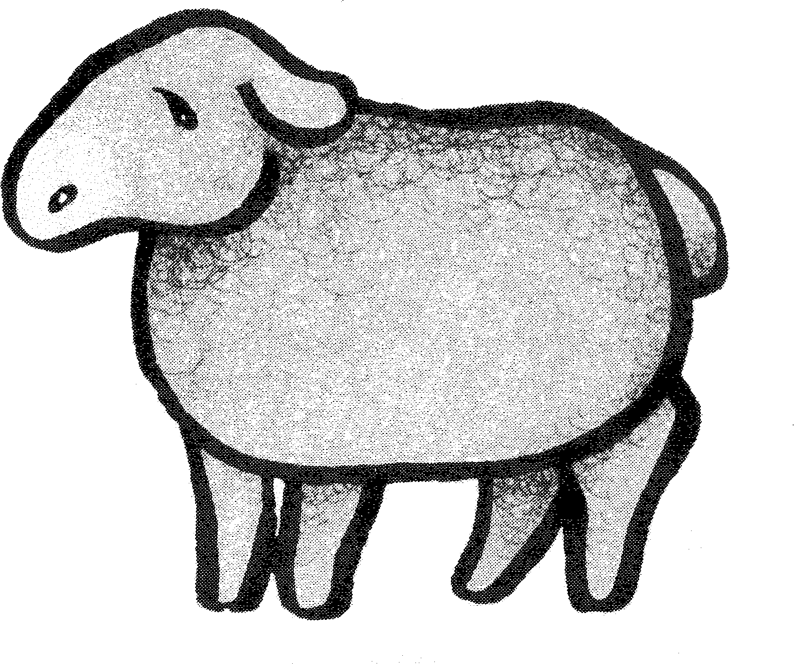

## 152 Kdo zná mě líp

*Bob Fliedr*

(1) Kdo zná mě líp, než máme může znát, kdo ví, kam jdu a kam by se měl brát, kdo čeká dál, až zpátky přijdu jako tolikrát? Díky, Pane, že se k tobě vracím rád.

(2) Kdo vidí tam, kam žádnej člověk ne, kdo cestu zná a tmy se nelekne, kdo čeká dál, až zpátky přijdu jako tolikrát. Díky Pane, že se k tobě vracím rád.

(3) Kdo nedrží se svýho stádečka, když zatoulá se jedna ovečka, kdo hledá dál a život dává v sázku kolikrát. Díky Pane, že se k tobě vracím rád.

(4) Kdo neláme nad nikým z lidí hůl, když člověk sám ho stokrát odmítnul, kdo hledá dál a život dává v sázku kolikrát. Díky Pane, že už nemusím se bát.

## 153 Kdybych znal množství jazyků

(1) Kdybych znal množství jazyků, kdybych znal zpěvy andělů, lásku já kdybych neměl, hluché bude mé zpívání.

(2) Láska je milá, shovívá, láska se nepře, nežárlí, ...

(3) Láska je tichá, nezištná, láska se mírní, nechlubí, ...

(4) Láska vše snáší, uvěří, láska, ta všechno přetrpí, ...

(5) Láska je plná doufání, láska, ta nikdy nekončí, ...

(6) Naděje, víra pominou, láska, však žije do věků, ...

(7) Kdybych znal množství jazyků, kdybych znal zpěvy andělů, …

## 154 Neboj se

*Jaromír Křivohlavý*

(1) Když bouře zuří zlá, když naděj zemdlívá, (: přec nemusíš se bát.:)

*Ref:* On ti praví: „S tebou jsem.“ On ti praví: „Neboj se.“ On ti praví: „Můj jsi ty.“ Praví: „Můj jsi ty.“

(2) Když jít máš přes vody a nikde opory, (:přec nemusíš se bát.:)

(3) Když ohněm projít máš a ochranu nemáš, (:přec nemusíš se bát.:)

## 155 Když hynou stáda

(1) Když hynou stáda, když srdce strádá, (: nenech si víru vzít, nenech si lásku vzít, naději, lásku svou, jež pokoj dává. :)

(2) Když k pravdě brána je zamykána, (: nenech si víru vzít... :)

(3) Když jednou zrána zlá přijde zpráva, (: nenech si víru vzít... :)

## 156 Kázání o svatbě v Káni Galilejské

*Svatopluk Karásek*

(1) Když Ježíš šel přes tu Judskou zem, druhům svým věrným řek pojďte, jdem, [: dneska v Káni je svatba, bude tam i máti má, dnes je v Káni svatba, tak tam jdem, :]

(2) Svatby té veselý ruch a rej, nocí zní přes celou Galilej, [: máti volá na syna - zůstali jsme bez vína a to by byl svatby konec zlej, :]

(3) V Káni maj šest štoudví kamenejch, Ježíš dal do každý vodu vlejt, [: voda v kádích zapění, ve víno se promění, vína dost, hej, správče, nalít dej. :]

(4) Proč dal víc, než hosti vypít chtěj, proč dal víc, než třeba, znát mi dej, [: já čet jsem u Kalvína, že pět set litrů vína, šest štoudví má, Bůh jim požehnej. :]

(5) Podstatný je pití vína sled, nejlepší víno se dává hned [: a jak času přibejvá, to horší se nalejvá, v Káni maj nejlepší naposled. :]

(6) V žití tvém přibývá dalších let, nečekej nejhorší naposled, [: Bůh na sklonku tvého dne, dá ti víno výborné, výborné víno až naposled. :]

(7) V žití tvém dnes každá radost tvá, radost tu úplnou předjímá, [: v své smrti jen přejdeš most, Bůh zavolá další host, novej host k nám vešel na slavnost. :]

(8) Víno tvé, výborné, pít mi dej, říká Bůh jen dnes už ochutnej, hle kalich můj oplývá, v něm čas se ti otvírá, kalich můj oplývá, přijímej, hle kalich můj oplývá, v něm pro všechny dost zbývá, kalich můj oplývá, přijímej.

## 157 Nejsi sám svůj

*Miroslav Gallus*

(1) Když ti schází odvaha, je tu Ten, kdo pomáhá, nejsi sám, nejsi sám, sám svůj, sám svůj. Já vím, já vím, nejsem sám, sám svůj Páně jsem, nejsem sám, sám svůj, sám svůj.

(2) Když tě pýcha zachvátí, je tu Ten, kdo říká ti: nejsi sám nejsi sám, sám svůj, sám svůj. Já vím, já vím, nejsem sám, sám svůj Páně jsem, nejsem sám, sám svůj, sám svůj.

(3) Když jsi spoután řetězy, je tu Ten, kdo vítězí. Nejsi sám nejsi sám, sám svůj, sám svůj. Já vím, já vím, nejsem sám, sám svůj Páně jsem, nejsem sám, sám svůj, sám svůj.

(4) Když sis rakev přichystal, je tu Ten, kdo z mrtvých vstal. Nejsi sám nejsi sám, sám svůj, sám svůj. Já vím, já vím, nejsem sám, sám svůj Páně jsem, nejsem sám, sám svůj, sám svůj.

## 158 Ukřižování

(1) Když trní rozdírá krvavý vlas, kapičky rosy na stoncích řas, davů volání, na pohřeb vyzvání, úsměšky utlumí Ježíšův hlas.

(2) Dav křičí „ukřižuj", Pilát má strach, klid má a koryto, nechce být vrah, zeptá se, kdo je ten nevinný spasitel, Barabáš svoboden, Ježíšův krach.

(3) I z beder strhli prostinký šat, v zápěstích díry, nebude lhát, lidé ho zmlátili, tváře mu poplili, když třetí odbíjí, dostává mat.

(4) A jeho věrní stojí tu dnes, v závitech paměti hoduje rez, hledíme ve strachu na něho, na bráchu a Lukáš píše, že přichází stres.

(5) Vstane, on slíbil to, dobře to vím, v lámání chleba zas budeme s ním, podáme ruce všem, půjdeme životem smutných dní, ozvěny zmizí jak dým.

## 159 Lžeme

*Jiří Scheider*

(1) Když ve tmě chodíme a díme, že jsme s Bohem, lžeme a pravdy v nás není.

(2) Když sami hřešíme a díme, že jsme bez viny, lžeme a pravdy v nás není.

(3) Svýho bratra nenávidíme a díme, že jsme ve světle, lžeme a tápeme ve tmě.

(4) Jeho vůli nečiníme a díme, že jej známe, lžeme a pravdy v nás není.

Když hříchy vyznáváme a rceme, že jsme červi, krví svou smyje naše hříchy, krví svou smyje naše hříchy.

## 160 Fíkový strom

*Miloš Rejchrt*

(1) Když všechno vzdát už velí síla zvyku, přistupte jen ke stromu fíkovníku, fíkový strom, fíkový strom, fíkový strom, Fíkový strom nám bude učitelem, když už se zdá, že z posledního melem, fíkový strom, fíkový strom, fíkový strom.

(2) Když už se zdá, že jedem z vršku dolů, fíkový strom teď otevírá školu - fíkový strom... Když každý ví, že už jsme na tom bledě, fíkový strom teď učí jiné vědě - fíkový strom...

(3) A kdo se dá ke stromu do učení, ten nezoufá, že nebude, co není - fíkový strom … Fíkový strom teď podobenství učí, co znamená, když listí jeho pučí - fíkový strom....

## 161 Veselý chvalozpěv

*Tomáš Najbrt*

(1) Kéž bychom to uměli zpívat písně chvály, i když se nám nedaří vše, jak jsme si přáli. Kéž bychom svou písničkou mohli bližním říci, že je může potěšit Pán Bůh milující.

(2) David skákal radostí, tak jak hudba hrála, třebas k jeho vážnosti nehodná se zdála. Nic si z toho nedělal, i když lidem k smíchu, zpíval Bohu chvalozpěv, nedbal na svou pýchu.

(3) Pavel seděl v žaláři, nohy v těžké kládě, třebaže byl bez viny, nenadával vládě. Do tmavého vězení nerad šel by býval, to však na tom nemění, že si v poutech zpíval.

(4) Tam kde slova nestačí, ještě něco zbývá: Kdo se z víry raduje, ten ať Bohu zpívá. Nemusí o hudbě mít třeba ani zdání, přesto písni vděčnosti nic už nezabrání.

## 162 Přítel

*Bob Fliedr*

(1) Kolik je cest na rozcestí a která z nich vede k štěstí, Tak jsem se ptal světa, žízní vyprahlý.

(2) Proč někdo má cestu úzkou, strmou a mokrou a kluzkou, ..

(3) Proč, kdo má hodně, chce více, zavírá dům na petlice, …

(4) Proč hladoví spousta lidí a sytí tak špatně vidí, … (V)

(5) Proč lidi za sprostý lhaní dostávaj vyznamenání, …

(6) A co až budou ty ceny v urnový háj rozprášeny, …

(7) Kde najít života pramen, v erbu jen bláto a kámen, …

(8) Kolik je cest na rozcestí a která z nich vede k štěstí, … (V)

V: Chodil bych dál křížem krážem po prašných cestách, a ptal se osudu, co mi chystá, hledal bych dál pravdu světa na prašnejch cestách, nepotkat opravdovýho přítele, Ježíše Krista, Ježíše Krista, Ježíše Krista.

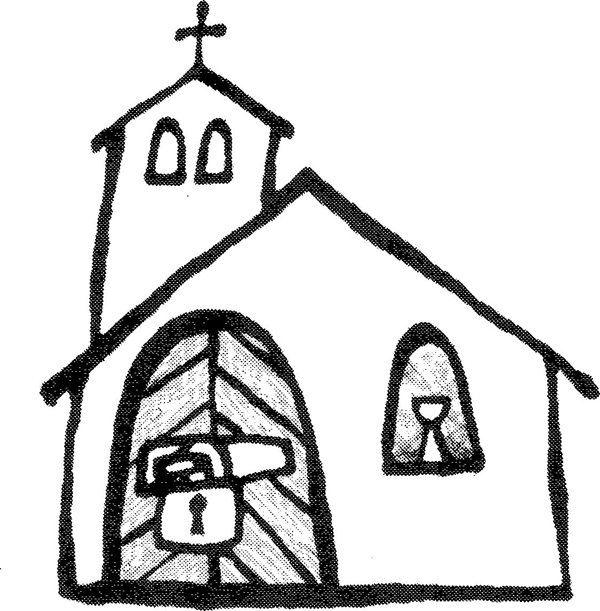

## 163 Poutník a dívka

*Dušan Vančura*

(1) Kráčel krajem poutník, šel sám, (3x) potkal dívku, nesla džbán, přistoupil k ní a pravil: (:Ráchel, Ráchel, žízeň mě zmáhá, Ráchel, Ráchel, žízeň mě zmáhá, Ráchel, Ráchel, žízeň mě zmáhá, přistup blíž, nehodná, a dej mi pít.:)

(2) Řekla: (: Kdo jsi, kdo jsi, že mi říkáš jménem :) já tě vidím poprvé, odkud mě znáš.:)

(3) (: Ráchel, Ráchel, já znám víc, než jméno. :) Pak se napil, ruku zdvih a kráčel dál.:)

(4) (: Ten džbán, ten džbán, z nepálené hlíny, :) v onu chvíli zazářil kovem ryzím.

(5) Kráčel krajem poutník, šel sám, (3x) ač byl chudý, nepoznán, přece byl král.

## 164 Krásná vlast

*Josef Baštecký*

(1) Krásnou vlast připravil pro svůj lid milý náš Spasitel na nebi. Radost jen vládne tam, věčný klid, Tvůrce kde zástupy velebí.

*Ref:* (: Krásnou vlast na nebi připravil věrným svým Spasitel. :)

(2) Efata! Otevři se i nám, bráno ty nebeská z milosti! Pane náš, k nadhvězdným končinám doveď nás, v domě svém uhosti.

(3) Až se náš na zemi zboří stan, příbytek od Boha v nebesích pro svou Krev předrahou dá nám Pán, žít kde s ním budeme ve plesích.

## 165 Náměšť

*Jaroslav Hutka*

(1) Krásný je vzduch, krásnější je moře, (2x) co je nejkrásnější, co je nejkrásnější? Usměvavé tváře.

(2) Pevný je stůl, pevnější je hora, co je nejpevnější, co je nejpevnější? Ta člověčí víra.

(3) Pustá je poušť i nebeské dálky, co je nejpustější, co je nejpustější? Žít život bez lásky.

(4) Mocná je zbraň, mocnější je právo, co je nejmocnější, co je nejmocnější? Pravdomluvné slovo.

(5) Velká je zem, šplouch na ní voda, co je však největší, co je však největší? Ta lidská svoboda.

(6) Krásný je vzduch, krásnější je moře, co je nejkrásnější, co je nejkrásnější? Usměvavé tváře.

## 166 Kristus je má síla

*Kancionál řezníků novoměstských*

(1) Kristus je má síla i spasení, potěšení, ve všem mém zarmoucení; já v jeho moci, ve dne, také v noci žádám pomoci.

(2) Neodloučí mne zde nic od něho, doufám v něho, neb všechno mám od něho. On mne spravuje, řídí, opatruje i ochraňuje.

(3) V něm jsem já živ, smrti se nebojím, tím se kojím, že vždy při něm obstojím. Neumřu věčně, jist jsem tím bezpečně i dostatečně.

(4) Co budu živ, budu ho chváliti, velebiti, skutky jeho slaviti; řeknu vesele: Nuž duše má, směle chval Spasitele!

(5) Ó budiž Tobě chvála svatému Kristu, Pánu našemu jedinému; nebs toho hoden vždycky a každý den na věky. Amen.

## 167 Kristus Pán když na smrt šel

*Štěpán Hájek*

(1) Kristus Pán když na smrt šel, kázání on pověděl.

(2) Dobrý chléb teď lámejte, za něj díky vzdávejte.

(3) Tento chléb je tělo mé, pro hřích lidský zrazené.

(4) Dlouho já tu nebudu, jen krátký čas pobudu.

(5) Když pak jisti budete, na mou smrt tak vzpomnete.

(6) Kristus Pán když na smrt šel, kázání on pověděl.

(7) Dobré víno nalejte, za něj díky vzdávejte.

(8) Tento kalich krev je má, z velké lásky prolitá.

(9) Dlouho já tu nebudu, jen krátký čas pobudu.

(10) Když pak píti budete, na mou smrt tak vzpomnete.

(11) Kristus Pán když na smrt šel, kázání on pověděl.

## 168 Kristus žije

*Ref:* Kristus žije, Kristus žije, všichni lidé ať to vědí, Kristus žije. Kristus žije, Kristus žije, všichni lidé ať to vědí, Ježíš je náš Pán.

(1) Jděte ke všem národům, jděte ke všem národům, jděte ke všem národům, jak on, haleluja, bratři, neste evangelium, ať navštíví každý dům, jděte ke všem národům tak jako on.

(2) V něm je nové stvoření, v něm je nové stvoření, v něm je nové stvoření, jak on, haleluja, sestry, svatý Duch je znamení, víru v život promění, v něm je nové stvoření, tak jako on.

(3) Také z mrtvých vstaneme, také z mrtvých vstaneme, také z mrtvých vstaneme, jak on, haleluja, děti, jednou až se skončí čas, Ježíš Kristus přijde zas a my všichni vstaneme tak jako on.

## 169 Kum - ba - jah

*Jaromír Plíšek*

(1) Kumbajah, my Lord, kumbajah´(3x) oh Lord, kumbajah, my Lord, kumbajah.

(2) V písních slyšíš znít: kum - ba – jah. Přijď k nám. Kum-ba-jah.

(3) V nářcích slyšíš znít: kum-ba-jah. Přijď k nám. Kum .- ba - jah.

(4) V prosbách slyšíš znít: kum- ba-jah. Přijď k nám. Kum - ba - jah.

(5) Kumbajah, my Lord, kumbajah´(3x) oh Lord, kumbajah, my Lord, kumbajah.

(6) Kum ba yah! my Lord, kum ba yah! Kum ba yah! my Lord, kum ba yah! Kum ba yah! my Lord, kum ba yah! O Lord, kum ba yah, my Lord kum ba yah!

(7) Someone's crying, Lord, kum ba yah!

(8) Someone's singing, Lord, kum ba yah!

(9) Someone's praying, Lord, kum ba yah!

## 170 Květina

*Miloš Rejchrt*

La la la la…

Květina vadne, listí opadává, nové se v staré promění. I barva ztmavne, život sbohem dává, běh světa prý se nezmění.

Ačkoli listí dále opadává, já v lásku Boží věřit smím, zpívat ji k chvále, že nám život dává, i když se blíží smrti stín.

La la la la …

Ačkoli listí dále opadává, já v lásku Boží věřit smím, zpívat ji k chvále, že nám život dává, i když se blíží smrti stín.

## 171 Kříž

*Bob Fliedr*

*Ref:* Láskou svou nás, Pane, láskou svou nás, Pane, láskou svou nás pozvedáš, křížem svým dál, Pane, křížem svým nás, Pane, křížem svým zvedáš kříž náš.

(1) Ve chvílích nejistot člověku nabízíš jediný pevný bod na zemi tvůj kříž.

(2) Ovečkám ztraceným záchranu přinášíš, v bloudění kéž je jim majákem tvůj kříž.

## 172 Laudato sii

*František z Assisi*

*Ref:* Laudato sii, o mi Signore, laudato sii, o mi Signore, laudato sii, o mi Signore, laudato sii, o mi Signore,

(1) Dík za všechno, co stvořils Pane, dík za teplo, když slunce plane, dík za hvězdy a vánek svěží, dík za vodu, za hudbu z věží.

(2) Dík za vesmír, planetu Zemi, dík za chvíle, kdy dobře je mi, za přírodu, když všechno vzkvétá, moře, hory, za krásu světa.

(3) Za to všechno díky vzdáme, spolu s bratry žalmy zpíváme, ať každý z nás z blízka i z dáli, celým srdcem, Tě, Pane, chválí.

## 173 Léčí nás

*Jiří Gruber*

*Ref:* Léčí nás, když umírá, ze všechny bezbožné, léčí nás, když otvírá, co nám je nemožné.

(1) Můj život smysl ztrácí, před pravdou utíkám, když tvoje slovo zazní, žít znovu začínám.

*Ref:* : Doufám dál, vždyť temnou tmou svit rána přibývá, doufám dál, vždyť tíseň mou přemáhá blízkost tvá.

(2) Když Petr stal se skálou a Pavel polnicí, i ty můžeš být světlem pro všechny bloudící. (R2)

(3) Já naději už ztrácím, je marná práce má, však vzkřísí mě Duch svatý a zas mi sílu dá. (R2)

## 174 Velikonoční

*Bohdan Pivoňka*

(1) (: Lidé zlatí, nekráčel tudy Kristus, :) lidé zlatí, věřím, že za nás všechny Pán vše zaplatí. (: Lidé zlatí, nekráčel tudy Kristus, :) (: lidé zlatí, :) (: snad víš, zda šel tu Pán i ty. :)

(2) (: Na soudu stál a smál se král i lidé :) na soudu stál věřím, že za nás všechny stál bez hnutí dál (: na soudu stál a smál se král i lidé :) (: na soudu stál :) (: snad smál ses Pánu také ty? :)

(3) (: S křížem se táh' a stáli k němu zády :) s křížem se táh' věřím, že za nás zkusil zášť na všech stranách (: s křížem se táh' a stáli k němu zády :) (: s křížem se táh' :) (: snad stál jsi zády také ty? :)

(4) (: Jej drásal kříž a spílali mu lidé :) jej drásal kříž věřím, že musel za nás vzít i kříže tíž (: jej drásal kříž a spílali mu lidé :) (: jej drásal kříž :) (: snad spílals Pánu také ty? :)

(5) (: Chtěl v žáru pít, nabídli Pánu ocet :) chtěl v žáru pít věřím, že musel za nás sláb, vyprahlý být (: chtěl v žáru pít, nabídli Pánu ocet :) (: chtěl v žáru pít :) (: nabíd jsi ocet snad i ty? :)

(6) (: Mrtvý byl Pán, nestál pak o něj nikdo :) mrtvý byl Pán věřím, že pro nás byl on sám a nepoznán (: mrtvý byl Pán, nestál pak o něj nikdo :) (: mrtvý byl Pán :) (: nestáls pak o něj snad i ty? :)

(7) (: Mrtvý byl Pán, teď právě jsem ho potkal :) mrtvý byl Pán, věřím, že chce pro lidi žít, být přijímán (: mrtvý byl Pán, teď právě jsem ho potkal :) (: mrtvý byl Pán :) (: snad ráno potkáš ho i ty! :)

## 175 Pane, při nás buď

*Miroslav Brož*

(1) Loď, které církev říkáme, vždy musí cíl svůj znát a mořem času s posláním vždy znovu proplouvat. Loď stále bouří zmítaná i v nouzi, v strachu svém, a přece vždy zas v naději, tak pluje den co den. A vždycky znovu ptáme se, jak loď ta obstojí? Zda svého cíle dosáhne? Neklesne v příboji?

*Ref:* Pane, při nás buď, Pane, při nás buď, jinak my sami zůstanem na moři svém. Ó Pane, při nás buď.

(2) Loď, které církev říkáme, vždy musí mužstvo mít. Ten bude sám a ztratí se, kdo chce loď opustit. Ať každý stojí, kde má stát a plní službu svou. Kdo v mále věrný nebude, odplatu vezme zlou. Však mužstvu v lodi sílu dá, ten dobrý Boží Duch. A dá mu víru, důvěru a spojí v pevný kruh.

*Ref:* Pane, při nás buď, Pane, při nás buď, jinak my sami zůstanem na moři svém. Ó Pane, při nás buď.

(3) Loď, které církev říkáme, vždy musí cíl svůj znát a mořem času s posláním vždy znovu proplouvat. Když námi zmítá samota a úzkost přepadá, dá Bůh na cestu věrné své, ti s námi plují dál. To dodá opět odvahu a nejsme sami již. Tu zříme v lodi drží nás vítězný Kristův kříž.

## 176 Má duše Boha velebí

*Miloš Rejchrt*

*Ref:* Má duše Boha velebí, chválu vzdává, Pánem je nejen na nebi, buď mu sláva.

(1) Opuštění budou slouti lidem tvým, poníženým dáváš vládnout královstvím.

(2) Ztrápení a chudí vyjdou z nesnází, bohatý a jistý s prázdnou odchází.

(3) Až do prachu srážíš mocné na trůnu a odnímáš pyšným meč i korunu.

(4) Pro lačné stůl hojný připravený máš, žíznivým pak plný kalich naléváš.

## 177 Má láska

*Daniel Raus*

(1) Má láska jen, Pane můj, ať každý den chudé hledá, nuzné zvedá, ať je tvá. Mou lásku vem s pokorou, než skončí den, všem ať svítí, všechny vznítí láska tvá. Vím, nestačí jenom „žít a nechat žít“, kdo nemá lásku tvou, umírá.

(2) Uč lásku dát tomu, kdo mě nemá rád, v duši sílu, větší víru chtěl bych mít. Stín zažeň z úst, ať tam může láska růst, ať nás léčí, lidem svědčí, že je znáš. Vím, patří všem, nejen blízkým v srdci mém, kdo nemá lásku tvou, umírá.

(3) Až skončí boj, navždy zmizí nepokoj, každou chvíli víra sílí, tebe zná. Má význam žít, mezi lidi lásku sít, jednou vzklíčí, zlobu zničí láska tvá. Vím, budem žít, budem k sobě blízko mít. Ten, kdo má lásku tvou, život má.

## 178 Má modlitba

*Tomáš Butta*

(1) Má modlitba nemívá někdy slova, když v slzách za Ježíšem přicházím, On však mi říká, neplač, zkus to znova, já s tebou budu čelit nesnázím.

*Ref:* Ježíš je pastýř dobrý, i v noci na stráži bdí, když vše jde spát. Život svůj za ovce dá, ztracenou vždy vyhledá, on má mě rád.

(2) Znám oporu, o níž se můžeš opřít, znám přítele, co nikdy nezradí, své starostí hned na něj můžeš vložit, a že jsi na dně, to mu nevadí.

(3) Má píseň vůbec někdy nemá tóny, když svoji radost toužím vyzpívat, zní v duši mojí jak sváteční zvony, když na hruď jeho mohu hlavu dát.

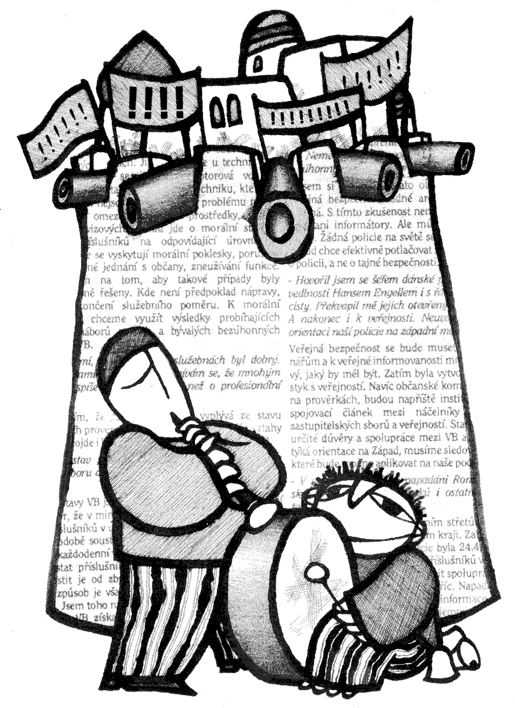
<i>...jen si mluvte, jak silní jste v kramflecích</i>

## 179 Málo mám

*Tomáš Najbrt*

(1) Málo mám, málo znám málo se usmívám, málo jím málo spím a nadranc nervy mám. Málo jím málo spím málo se modlívám chyby mám všude tam kam se podívám. Kde zem je peklo nebe nevím vím že jsem ubohý a náhle co se nezdá pevným staví mě na nohy zvedá mě nad zemi dává mi zázemí láska lidi z hlíny staví zázrak dělá s prachem mým.

(2) Málo mám málo znám málo se modlívám nemluvím nezpívám a vlídný nebývám. Málo jím, málo spím málo se modlívám chyby mám všude tam kam se podívám. Poslední zůstává láska co spoutává uvězní postem svým a já se nebráním zvedá mě nad zemi dává mi zázemí láska lidi z hlíny staví zázrak dělá s prachem mým.

(3) Málo mám, málo znám málo se usmívám, málo se modlívám a nadranc nervy mám. Málo jím málo spím málo se modlívám chyby mám všude tam kam se podívám. Když volně dolů padám když nevím kudy dál kdosi mi ruku dává abych zas pevně stál Zvedá mě nad zemi dává mi zázemí láska lidi z hlíny staví zázrak dělá s prachem mým.

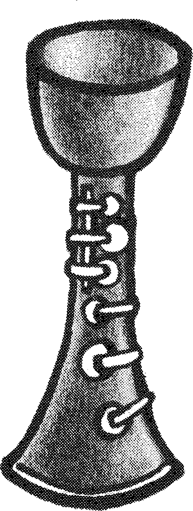

## 180 Maran atha

*Ref:* Maran atha, Pane, přijď opět v nádheře své, Maran atha, na konci časů sestup k nám zase.

(1) Jako rosa na vyprahlou zem, jako chleba v hladu mém.

(2) Jako blesk, jenž protíná tmu od východu až k západu.

(3) Jako Dítě v betlémskou stáj, jako vanutí Ducha v světa kraj.

(4) V církvi své, jež stále nová je, ve svátosti těla a krve.

(5) Když svou lásku dáváme všem, přicházíš, Pane, každým dnem.

## 181 Marie má dítě

*Jiří Joran, Jaromír Plíšek*

(1) Marie má dítě, Pane, Marie má dítě, Pane můj, Marie má dítě, Pane, hle, průvod stále přichází a zas jde dál.

(2) Jaké jméno dá mu, Pane, …

(3) Dá mu jméno Ježíš, Pane, …

(4) Dá mu jméno Rádce, Pane, …

(5) Kdepak narodil se, Pane, …

(6) Narodil se v jeslích, Pane, …

(7) Marie má dítě, zpívej, Marie má dítě, zpívej dál, Marie má dítě, zpívej, lidé valí se v proudu jen a vlak jel dál.

(8) Jaké jméno dá mu, zpívej, …

(9) Dá mu jméno Ježíš, zpívej, …

(10) Král, zastánce mnohých, …

(11) Hvězdy jasně září, zpívej, v Betlémě nad stájí, zpívej, z míst odešly dávných, zpívej, lidé se valí lidé valí se v proudu jen a vlak jel dál.

(12) Marie má dítě, zpívej, …

## 182 Mezi hvězdami

*Miroslav Brož*

*Ref:* Mezi hvězdami, tvoje jméno zapsal si Pán, mezi hvězdami, nahoře, kde má svůj chrám, mezi hvězdami život tvůj je zakotven již, mezi hvězdami, kde svůj ráj pak uvidíš.

(1) Tu noc, kdy toužil Pán pro tebe žít, tu noc, tu noc, kdy život tvůj daroval sám ti Bůh, tu noc, kdy poprvé na tebe láskou zřel, byl s námi Pán.

(2) Ten den, kdy věrný Pán vykoupil nás, ten den, ten den, navěky svým zvolil tě dítětem, ten den, kdy v srdci tvém přebýval k slávě své, je s námi Pán.

(3) Večer, kdy volá Pán k domovu své, večer, večer, kdy staré dny odejdou dál jak sen, večer, kdy každý z nás setká se s Pánem svým, buď s námi Pán.

## 183 Michale, člun k břehu veď

*Jiří Joran*

*Ref:* Michale člun k břehu veď, haleluja, Michale člun k břehu veď, haleluja.

(1) (: Michalův člun — hudby člun, haleluja! :)

(2) (: Sestro, pomoz plachtu vznést, haleluja! :)

(3) K břehu dlouhou cestu mám, haleluja, matku svou však uzřím tam, haleluja!

(4) Jordán kalný, chladný je, haleluja, tělo zhubí, duši ne, haleluja!

## 184 Mír na zemi daruj nám

*Karel Trusina*

(1) Mír na zemi daruj nám! Nezřekni se nás! Ať tvá láska drží s námi dnes a zítra zas: Jen ty sám, Bože, náš, jen ty sám, Bože náš, lidský život v rukou máš! Nezřekni se nás!

(2) Svobodu též daruj nám! Nezřekni se nás! Ať odvážně dokážeme stavět zlobě hráz! Jen ty sám, Bože náš, jen ty sám, Bože náš, svobodu nám všude dáš! Nezřekni se nás!

(3) Radost pravou daruj nám! Nezřekni se nás! Ať i pouhé maličkosti vzbudí díků hlas! Jen ty sám, Bože náš, jen ty sám, Bože náš, i náš život v rukou máš! Nezřekni se nás!

## 185 Samuelova prosba

*Luděk Rejchrt*

Mluv, Pane můj, tvůj služebník slyší,

mluv, Pane můj, slovo své,

Mluv, Pane můj, tvůj služebník slyší,

mluv, Pane můj, ke mně slovo své.

## 186 Moc předivná

*Dagmar Pokorná, Petr Pokorný*

(1) Moc předivná nás tiše obestírá, a proto čekám příští uklidněn. Bůh je dnes s námi, svědčí naše víra, a bude s námi každý nový den.

(2) Ta divná dobrá moc svou sílu dá mi a věrně povede můj každý krok. Jí obklopen i dnes chci zůstat s vámi a s vámi prožít tento nový rok.

(3) Mé staré srdce ještě prudce buší a těžce nese zlobu těchto chvil; ach, Pane, podej vyplašené duši svou spásu, již jsi pro ni připravil.

(4) Máš-li však pro nás hořký kalich strastí, jež trpce přetékají přes kraje, my přijmeme jej, nechceme se třásti, vždyť s námi vždy tvá dobrá ruka je.

(5) A kdybys dopřál, Bože milostivý, na světě radost v jasu slunečním, pak prožitého dobře pamětlivi svůj život celý dáme službám tvým.

(6) Své tiché světlo, jež se jasné skvěje nech teple prozařovat naši noc. A dej, ať smíme spatřit obličeje svých milých, které provází tvá moc.

(7) Když po vichřici soumrak plyne tiše, rád chorálu bych lidstva naslouchal a za zdmi slyšel nést se výš a výše tvých věrných dětí vděčnou píseň chval.

(8) Moc předivná nás tiše obestírá, a proto čekám příští uklidněn. Bůh je dnes s námi, svědčí naše víra, a bude s námi každý nový den.

## 187 Mosty

*Luboš Svoboda, Zdeněk Svoboda*

(1) Moc rád bych stavěl nové mosty, kde dosud zejí propasti, moc rád bych přijal jako hosty lidi od nichž mě dělí zdi.

*Ref:* Nechci jen poznat povrch luny, chci jít tam, kde je nepřítel, uklidnit rozbouřené vlny a přinést pokoj, to bych chtěl.

(2) Moc rád bych podal svoji ruku tomu, kdo zná jen tvrdou pěst, toužím jít do lidského hluku a všude usmíření nést.

*Ref:* Nechci jen poznat povrch luny, chci jít tam, kde je nepřítel, uklidnit rozbouřené vlny a přinést pokoj, to bych chtěl.

(3) Moc rád bych začal mluvit znova tam, kde dřív bylo mlčení, ať všechny pohledy a slova nenávist v lásku promění.

(4) Kéž, Pane, umím stavět mosty, ať první kroky udělám, až na ty mosty pozvu hosty, buď, prosím, s námi také tam.

## 188 Vostnatej drát

*Miloš Rejchrt*

(1) Mou duši svírá, mou duši dusí, marně se vzpírá, škrtí ji had, srdce mi trhá na krvavý kusy šedivej drát, vostnatej drát, vostnatej drát.

(2) Kam až se může, kam dál o krok ani, nepřítel - přítel, koho smíš mít rád, černý či bílý - zbytečný je ptaní, slovo má drát, vostnatej drát, vostnatej drát.

(3) Co už je shnilý, dá se přikrejt víkem, a co je puklý, dá se sdrátovat. Zlatý dno láká stát se učedníkem u firmy drát, vostnatej drát, vostnatej drát.

(4) Nesahej, brácho, na drát padlej na zem, vždyť shůry dolů spolu s ďáblem pád, s čertem si žertem hraje jenom blázen, tak nech ten drát, vostnatej drát, vostnatej drát.

(5) Až přijde příval ohnivýho deště, ohnivý keře budou v ten den plát, sestoupej s nebe velký Boží kleště, rozstříhaj drát, vostnatej drát, vostnatej drát.

## 189 Modlitba krále Šalamouna

*Luděk Rejchrt*

Moudrost mi, Pane, dávej, abych po Tvé cestě chodil,

moudrost mi, Pane, dávej, ať ve tmě nebloudím.

Moudrost mi dávej, sám ji nemám, moudrost mi dávej, ať Tě hledám.

Moudrost mi, Pane, dávej, ať ve tmě nebloudím.

## 190 On má mne rád

*Tomáš Novotný*

(1) (: Můj Pán mne pozval ke stolu svému, to protože on má mne rád.:)3x on má mne, má mne rád.

(2) (: On ukázal mi ke spasení cestu, to protože on má mne rád, :) 3x on má mne, má mne rád.

(3) (: A nyní jsem zván dítětem Božím, to protože on má mne rád, :) 3x on má mne, má mne rád.

(4) (: Já dítě jsem a on je můj Otec, to protože on má mne rád, :) 3x on má mne, má mne rád.

(5) (: A v lásce své mne přivede v slávu, to protože on má mne rád, :) 3x on má mne, má mne rád.

## 191 Můj Pán

*Dana Vejborová-Tesařová*

*Ref:* Můj Pán, ó můj Pán, Pán Bůh laskavý, podá nám svoji dlaň.

(1) V stínu smutkem usychám,

podá nám svoji dlaň, Ty jsi žhavý život sám,

podá nám svoji dlaň.

(2) Neklidem jsem všude hnán, pokoj dá mi jen můj Pán.

(3) Svět si nouze nevšímá, Bůh však s každým soucit má.

(4) Když nás chaos zachvátil, on dá všemu řád a cíl.

## 192 Můj Pán ruku podá

*Jaromír Křivohlavý*

*Ref:* Můj Pán ruku podá vzdor tmám vždycky znova, můj Pán ruku podá nám.

(1) Neuslyšíš v denní vřavě – ruku podám – tichý hlas, zjednej ticho ve své hlavě, ta vřava je v nás.

(2) Hlas je tichý, ale každý slyšet by ho vždycky měl. Vždyť i přesto, že lvi řvali, uslyšel ho Daniel.

## 193 Můj Pán všechny svolá

*Miloš Rejchrt*

*Ref:* Můj Pán všechny svolá ráno, až se rozední, můj Pán všechny svolá ráno, v ten den poslední.

(1) Uslyšíš pak, jak z hrobů temných, stoupá mu vstříc chvalozpěv věrných. Můj Pán všechny svolá ráno, v ten den poslední.

(2) Uvidíš pak, jak pláčou hříšní, padají v prach králové pyšní. Můj Pán všechny svolá ráno, v ten den poslední.

(3) Zajásáš pak, až skončí boje, zbaveny pout jsou ruce tvoje. Můj Pán všechny svolá ráno, v ten den poslední.

## 194 Můj život už není prázdná loď

*Tomáš Novotný*

*Ref:* Můj život už není prázdná loď, můj život už není prázdná loď. Ó Pán dnes ke mně nastoupil, můj život už není prázdná loď.

(1) Ó nedivte se bratři, že velkou radost mám, můj život.... je se mnou Pán, tak je mi fajn, můj život... Ó Pán dnes ke mně nastoupil, můj život už není prázdná loď.

(2) Mám kolem sebe věcí, že přes ně nevidím, můj.... Teď do vody je naházím, můj ... Ó Pán …

(3) On řek mějte se rádi, já amen pravím vám, můj... Když lidi v davu potkávám, můj .... Ó Pán …

## 195 Davidova píseň

*Luboš Svoboda*

(1) Na harfu krásný chlapec hrál, jak o tom jistá kniha svědčí, král si jej k sobě zavolal, protože hudba zlobu léčí.

*Ref:* Davide, nepřestaň nám nikdy hrát, na harfu hrát, abychom se nemuseli bát, satana bát.

(2) Náhle však zpozoroval král v tom krásném chlapci nebezpečí, žárlil a patrně se bál, že ho ten básním v něčem předčí.

(3) Král proto bez váhání vzal na chlapce naostřené kopí, ten uhýbal, a přesto hrál a to král nikdy nepochopí.

(4) Leckterý z králů velí: Pal!, když v Davidovi soka shledá. David však hraje stejně dál, vždyť písnička se zabít nedá!

## 196 Důvěra

*Jaromír Křivohlavý*

*Ref:* Na jednom keři růže vyroste, na druhém zase planý fík. U krásných dveří ani neproste, nebude za co vzdávat dík.

(1) Marně se snažíte přesvědčit lidi, že je vždy pravda to, co oči vidí. Člověka poznáš prý hned podle tváře, dobrotu předchází duhová záře.

(2) Za krásným úsměvem nadutost zmizí, zlo je nám vlastní a my jsme si cizí. Před svoji vlastní tvář stavíme masku, fingujem laskavost, hrajeme lásku.

*Ref:* Na jednom keři růže vyroste, na druhém zase planý fík. U krásných dveří ani neproste, nebude za co vzdávat dík.

(3) Proč, Pane, hlásíš se k tomuto lidu? Proč jim chceš pomoci? Zaslouží bídu! Nechtějí rozumět Božímu slovu. Přesto jim nabízíš pomoc vždy znovu.

(4) Na jednom keři dvě růže rostou. Ať seš tou překrásnou anebo prostou, přestaň si na sebe na chvíli hrát. Kdo zná tvou masku, moh' by se bát. Ref

## 197 Pár křídel

*Jaromír Plíšek*

*Ref:* Na křídel pár dlouhých, na křídel pár dlouhých, na křídel pár já čekám, perutí, co dovedou nést.

(1) Hvězdy luštím, věřím vídám, melu zrní, zdravě jím. Kudy chodím, křídla hledám, těžko unést tíhu dní. Kdesi v kostele pak farář, když v taláru tam stál, řek — tu tíhu vzal Syn Boží, místo křídel hrubej trám.

*Ref:* Na křídel pár dlouhých, na křídel pár dlouhých, na křídel pár já čekám, perutí, co dovedou nést.

(2) Když se výhled v mlhách ztrácí, když nevidíš, kudy jít, když se každou chvíli vrací strach a úzkost, mizí klid, když tě drátů ostny drápou, když tě tlačí k zemi blíž a když druzí nic nechápou, kdo by nechtěl křídla mít.

(3) Trochu vzrušení a praní, trochu lihu, snad i drog, trochu šílenýho hraní, už nejmíň třetí rok. Jenže křídla nejsou k mání, je to vidět čím dál víc, z barevných snů o létání dneska není, není nic.

## 198 Ovečky

*Miloš Rejchrt*

*Ref:* Na pastvách zelených pasme se, jak se na ovce sluší, a když vlk ovečku odnese, buďme slepí a hluší.

(1) Opatrnost moudrosti je matka, proto nehas, co tě nepálí, vlk teď právě otevírá vrátka, hleď se držet pěkně zpovzdálí.

(2) Barvě stáda nechť je ovce věrná jinak si s ní osud zatočí sežrána je velká ovce černá černá barva bije do očí Ref.

(3) Správná ovce hledí si vždy svého pase se a nezná protesty, vlk teď trhá beránka bílého, pletl se mu blbec do cesty.

(4) O vlku se vyjadřujeme jemně přežijeme všechno ve zdaru, to jen drzé nerozumné jehně dostalo se vlku do spárů.

## 199 Jako zrnko hořčičné

*Tomáš Najbrt*

(1) Na slámě ustláno v chlévě má, nikdo si chudoby nevšímá. Lid čeká na krále, na jeho mocný zjev, zatím jim za zády chudý se narodil, která má královskou v žilách krev.

*Ref:* Jako zrnko hořčičné skromně v ústraní roste Boží království bez uvítání.

(2) Kdo chudým ze srdce rozdává, nad zlato stokrát víc získává. Snáze se velbloud prý do dveří protáhne, než boháč království Božího dosáhne, s penězi před branou zůstává.

(3) Více je poslední haléř dát, než z měšců tisíce litovat. Uprostřed marných slov činům se nedaří, láska se musí žít, láska se netváří. Není vždy zlato, co leskne se.

## 200 Na zemi jsi v pravdě stál

*Zdeněk Šorm*

(1) Na zemi jsi v pravdě stál, jo, (3x) nemusí pro mě bejt jen snem.

(2) Vině jsi láskou váhu vzal, (3x) i já jsem z viny k dobru svoboden.

(3) Byl jsi s druhým, když měl kříž, (3x) i já teď můžu s druhým v trablech stát.

(4) Prorazil jsi strachu mříž, (3x) i já už teďka nemusím se bát.

(5) Přes úzkosti jsi na kříž šel, (3x) i mně teď není pánem jenom strach.

(6) Smrtí neskončil marnej sen, (3x) smrt nevládne mým životem.

(7) Láska, láska leze ven, leze, leze, leze ven, láska, láska leze ven, leze ven tvým životem.

## 201 Nám pomoz, Pane milý

*Miroslav Heryán*

(1) Nám pomoz, Pane milý, tvé Slovo správně znát. A přijmi dík, že nás máš všechny rád.

(2) Nám pomoz u tvých nohou se ztišit docela. A přijmi dík, že bázeň zmizela.

(3) Nám pomoz ustaraným, když vše se temné zdá. A přijmi dík, tvé Slovo pomáhá.

(4) Nám pomoz v naší práci, když už jsme znaveni. A přijmi dík za novou sílu k ní.

(5) Nám pomoz pevně věřit a doufat ve tvou moc. A přijmi dík, že jdeš nám na pomoc.

## 202 Bez skutků je víra mrtvá

*Tomáš Najbrt*

*Ref:* Nám se úsměv lehko tváří, bývá těžší něco k němu dát. Sloužící jsme nebo lháři? Chcem své hřivny pod zem zakopat.

(1) Bez skutků je víra mrtvá, v tůni slov se topí, jednoho dne v spánku zmizí beze stopy. Bez skutků je víra mrtvá, to je lepší bez ní žít, často místo spásy může zahubit.

(2) Po ovoci pozná se víra, co je živá. Nenosí se v tvářích, nenápadná bývá. Kdo má víru pro parádu, ten se modle klaní jen. Jako sluha líný bude propuštěn.

(3) Pevná víra možná umí přenášet i hory. Jenom živá víra řeší lidské spory. Aby láska zvítězila nad strachem a nad bázní, nestačí jen víra, ale síla z ní.

## 203 Navrať se k Otci

*Tomáš Najbrt*

(1) Navrať se k Otci, příteli, pojď, někdo se modlí, za tebe modlí. Už nechoď déle po cestě hříchu, někdo se modlí, za tebe modlí. Kdosi tě miluje, ať jsi, kde chceš, den za dnem modlí se, kamkoli jdeš, abys už nebloudil, vrátil se zpět. Někdo se modlí, za tebe modlí.

(2) Hlas Boží volá — neodkládej, někdo se modlí, za tebe modlí. Jeho se láskou pokořit dej, někdo se modlí, za tebe modlí. A když snad zmáhá tě tíha vin tvých, poklekni v modlitbě, vyznej se z nich, milosti řeka tvůj obmyje hřích. Někdo se modlí, za tebe modlí.

## 204 Vzpomínka na Káni Galilejskou

*Miloš Rejchrt*

(1) Nebudu jíst to, co zbylo od včera, staré zbytky s chutí cizích slin, smutné zbytky ze smutného večera, staré slivky ze zkysaných vín.

*Ref:* Píseň novou čistým tichým hlasem za dveřmi si osud notuje, těsto už je prosyceno kvasem, nové víno v sudech pracuje.

(2) Nebudu se ještě nutit do zpěvu velebit ten chudý blahobyt smutnou radost povinného úsměvu neláká mě možnost s vlky výt.

(3) Už se chystá zaslíbená hostina blahoslaven kdo měl doteď hlad je dost místa za chvíli se začíná není třeba vstupné s sebou brát.

## 205 Nehleďte vzůru

*Ref:* Nehleďte vzhůru, Pán je zde u nás, nehleďte vzhůru, Pán mez námi je. Dnes ještě skryt, však v nebeském jasu všichni uvidí jej na konci časů.

(1) Myslíš, Kristus není živ, když přec zemřel na kříži, myslíš, i když z mrtvých vstal, že se k Otci odebral, unik‘ bídě našich dnů, zanechal nás samotné, ale přece on teď vskutku žije v nás.

(2) Co vidíš, je jenom kříž, vpravdě Kristus z mrtvých vstal, po pravici Otce dlí, v našem středu sídlo má, to zví jenom věřící, avšak jistě přijde den, kdy se zjeví v jasu, moci před světem.

## 206 Nejdražší Pane můj

*Zdeněk Svoboda, Jarmila Svobodová*

(1) Pane můj, veď mě sám, při mně stůj, slabý jsem, znavený, ztrápený, v noci zlé s vichřicí světlo dej zářící, ty mě sám veď domů, Pane můj.

(2) Když je svět jedinou vyprahlou pustinou a já v ní ztracený klopýtám, slyš můj pláč, slyš můj hlas, zachyť mě, klesám zas, ty mě sám veď domů, Pane můj.

(3) Když se k nám blíží tma, která svět objímá a když den poslední zhasíná, přede mnou řeky proud, na koho spolehnout, ty mě sám veď domů, Pane můj.

## 207 Pokušení svatého Antonína

*Miloš Rejchrt*

*Ref:* Nejen pátek nešťastný je den, proto zůstaň doma, nechoď ven, zůstaň doma, zůstaň v bezpečí. Nech si v klidu růžový sny zdát, tam za dveřmi není o co stát, vítr venku zdraví nesvědčí.

(1) Moh‘ bys potkat kytku, která uvadá, klauna jemuž došel smích i nálada, ránu jež se ani časem nezhojí, řeku bez vody a pole po boji.

(2) Na náměstí stojí kočár bez koní, opadalo listí zvony nezvoní, moh‘ by tě tam potkat pohled zděšený, dítě bez matky nebo muž bez ženy.

## 208 Farářovo blues

*Štěpán Hájek*

(1) Nejsem zrovna muzikant a hlas mám trochu hově - hovězí že zpívám jak ignorant v tom síla písně nevě - nevězí.

*Ref:* Jen když přestaneš si všímat falešnýho tónu pak zaslechneš si zpívat srdce heligónu zpívá lidem nesměle haleluja farářovo blues.

(2) Vo tom že jsme zadarmo přišli na svět tenhle - tenhleten a že žijem nadarmo nepudem-li mezi lidi ven.

(3) Je to pocit fajnovej když má tě někdo dovopravdy rád na tohleto bacha dej pak nemusíš se fůry věcí bát.

(4) Pane Bože vydrž to žití naše plný hledání shovívávej Pane můj tak vydrž i to naše zpívání.

## 209 Zpěv o slunci

*František z Assisi, Tomáš Najbrt, Pavel Otter*

Nejvyšší, Všemohoucí, dobrý Pane, ať Tobě chvála, sláva, pocta se stane, všeliké dobrořečení.

(1) Buď pochválen, Pane můj, se svým stvořením po vší zemi, se sluncem, jež činí den a září nad lidmi všemi.

*Ref:* Chvalte Pána, díky vzdejte, služte v pokoře.

(2) Buď pochválen, Pane můj, od noční luny i hvězd krásných, stvořil jsi jich na nebi tolik světlých a vždy jasných.

(3) Buď pochválen, Pane můj, i vodou čistou s její krásou, ohněm, který plál nocí, jitrem s jeho ranní rosou.

(4) Buď pochválen, Pane můj, i rodnou zemí, matkou naší, dává život, svět celý květem pestrých barev krášlí.

(5) Buď pochválen, Pane můj, i sestrou naší – těla smrtí; nemá moc, když od Tebe přijmou život Tvoji svatí.

## 210 Někdo mě vede za ruku

*Luděk Rejchrt*

(1) Někdo mě vede za ruku, když bojím se jít tmou. To je ten, který o mně ví, který je na mně laskavý, je stále nade mnou.

(2) Někdo mi dává denní chléb, že nemusím mít hlad. To je ten, který o mně ví, který je na mně laskavý a chce mi pomáhat.

(3) Někdo mi dává sílu též, když už jsem unaven. To je ten, který o mně ví, který je na mně laskavý, ať je noc nebo den.

(4) Někdo mě vede za ruku, proto se nechci bát. To je ten, který o mně ví, můj dobrý Pán Bůh laskavý, který mě má tak rád.

## 211 Píseň o setkání

*Luděk Rejchrt*

(1) Někdy mám smutek když se kolem dívám, všude jen slova, všude tolik lži. A pravda v koutku krčí se, snad spí tam, je jako pěna, toť prý nejlepší. A strach mám taky, pořád někdo střílí anebo drží prst už na spoušti stačí jen zmáčkout, svět se stane v chvíli ostrovem tmy, jež leží na poušti.

(2) Už je to dávno, co jsem lidem věřil, co jsem si myslel, že vím, pro co žít. Teď bych však moc rád někomu se svěřil, chtěl bych se s někým o stesk rozdělit. I když mi stejně nikdo nerozumí, myslím, že Jeden by mi rozuměl, chtěl bych ho potkat tam, kde řeka šumí a říct mu aby kousek se mnou šel.

(3) Zeptal bych se ho odkud měl tu sílu si vždycky rovnou páteř udržet, jak věřit v lásku, sílu dobra, míru, jak naučit se bližním odpouštět. A když mi lidé na nervy jdou v práci, jak dokázat jen na ně vlídným být, a dělat to, co se dnes nevyplácí a hasit i to co mne nepálí.

(4) Prý strašně dlouho mezi námi chodí, jenom se bojím, že ho nepotkám. Budu ho hledat, snad se mu to hodí a bude mít čas jít na chvilku k nám. Když takhle dlouho mezi lidmi chodí, taky se cítí asi hrozně sám. Musím ho najít, snad se mu to hodí a bude mít čas jít na chvilku k nám.

## 212 Nemůžete ani chvíli

*Miloš Rejchrt*

(1) Nemůžete ani chvíli se mnou bdít? Nastává čas, kdy pastýře budou bít. Padne strach a přijde zrada, rozprchnou se ovce stáda, včera k všemu odhodlaní, stáhnou se dnes do ústraní. Nemůžete chvíli se mnou bdít?

(2) Nemůžete ani chvíli se mnou bdít? Nastává čas, kdy pastýře budou bít. Tíseň svírá, úzkost drtí, duše smutná je až k smrti. Kdo krev a pot z čela setře, Jakube a Jene, Petře? Nemůžete chvíli se mnou bdít?

(3) Nemůžete ani chvíli se mnou bdít? Nastává čas, kdy pastýře budou bít. Co je pravda, co je jisté… Svědomí i ruce čisté – zatím pravdu zkrvavenou ulicí za město ženou. Nemůžete chvíli se mnou bdít?

(4) Nemůžete ani chvíli se mnou bdít? Nastává čas, kdy pastýře budou bít. Teče krev a zejí rány, Syn člověka zbičovaný jak beránek na smrt veden k oběti za všechny jeden. Nemůžete chvíli se mnou bdít?

## 213 Není lepší na tom světě

*Luděk Rejchrt*

(1) Není lepší na tom světě nežli Boha ctíti, jeho vzývat, jemu sloužit, jeho velebiti.

(2) Není lepší na tom světě nežli druhým dávat, však bohatství s jeho strastí ani nepoznávat.

(3) Není lepší na tom světě, než v pokoji bývat, místo zlostí, mrzutostí, Pánu Bohu zpívat.

(4) Není lepší na tom světě než svědomí čisté. To nám dávej, uchovávej, milý Pane Kriste!

## 214 Velikonoční

*Helena Kohotouvá, Petr Nykodým*

Nepůjdu hledat hrob a kámen odvalený. Vím, že můj živý Pán mezi mrtvými není. Vím, že můj živý Pán vylomil osten smrti. S tebou je, Otče náš, jednou se pro nás vrátí.

Kdyby Pán Ježíš nebyl živ, nedal nám prožít blízkost svou, byla by smrt čím kdysi dřív a my jen truhlou prázdných slov.

S tebou je, Otče náš, proto je navždy s námi. Jen ten, kdo tebe má, ví, co je zmrtvýchvstání.

## 215 Chvalozpěv

*Miloš Rejchrt*

(1) Neskládejte v mocných naději, v síle jejich, která skály láme, ochabne dřív nebo později, nedoufejte v zdání, které klame.

*Ref:* Ty jsi hoden žehnání a chvály, Tvoji moc a sílu slavíme. Před Tebou se Pane Kriste, králů Králi, dobrovolně skláníme. Před Tebou se Pane Kriste, králů Králi, dobrovolně skláníme.

(2) Vláda jeho není na chvíli, pravda věčně platí v jeho říši, v jeho panství není násilí, blaze tomu, kdo hlas jeho slyší.

*Ref:* Ty jsi hoden žehnání a chvály, Tvoji moc a sílu slavíme. Před Tebou se Pane Kriste, králů Králi, dobrovolně skláníme. Před Tebou se Pane Kriste, králů Králi, dobrovolně skláníme.

(3) Žíznivým dá napít z pramene, nedolomí nalomenou třtinu, proměňuje srdce kamenné, odpustí i zbloudilému synu.

(4) Znaveným on síly dodává, uvězněným snímá pouta z rukou, stojí při těch, kdo jsou bez práva, otevírá všechněm, kteří tlukou.

## 216 Nevím, Pane, co Ti dát

*Bohdan Pivoňka*

(1) Nevím, pane, co ti dát, nevím, jak ctít tebe, že jsem mohl dobře spát a že vidím nebe.

(2) Nevím, Pane, jak dát znát, že chci tobě věřit, že chci bližní milost, víru láskou měřit.

(3) Věřím, Pane, že ty víš, co je v lidském nitru, dřív vše za mne vyslovíš, než dáš vzplanout jitru.

(4) Proto přetvoř, srdce mé, ať to není kámen, (: dej mi radost a chuť žít, za to prosím. Amen. :)

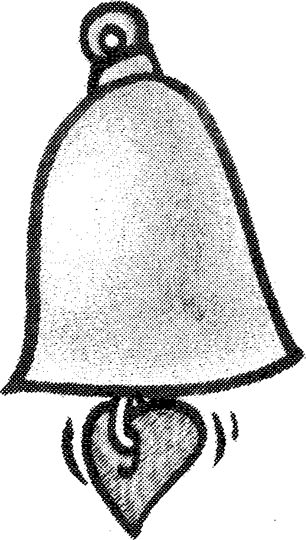

## 217 Nezná tu nikdo soužení mé

*Jiří Joran*

*Ref:* Nezná tu nikdo soužení mé, to zná snad jenom Ježíš. Nezná tu nikdo soužení mé, sláva, haleluja.

(1) Jsem nahoře a zase níž, Pane můj, a někdy zcela na dně již, Pane můj.

(2) Ač dále kráčet mne tu zříš, Pane můj, já stále vleču ten svůj kříž, Pane můj.

## 218 Než vykročil Pán na cestu

*Miroslav Čejka, Bohuslav Vik*

(1) Než vykročil Pán na cestu, nám svěřil velké jmění. Úžasné je to bohatství. Chce vidět, jak jsme věrní.

(2) Co máme s tím vším udělat, jak nezarmoutit Pána? Nechceme přece prodělat a shořet jako sláma.

(3) Snad všechno dobře zakopat, skrýt v zemi, mít to jisté, celý ten poklad zachovat a svědomí mít čisté?

(4) Musíme s tím jít do světa a uplatnit to směle, pro Krista blázny všem se zdát, své srdce dát mu celé.

(5) Pán chválí ty, kdo za ním jdou a za příklad ho mají, kdo s láskou stokrát prohráli s přece nezoufají.

## 219 Noc se ránu podobá

*Luděk Rejchrt*

(1) Noc se ránu podobá, světlem všechno krásní. Vyšla hvězda z Jákoba. Pryč, pastýři, s bázní!

*Ref:* Anděl radost oznámí: Narodil se Kristus Pán! Svět už není ve tmě sám. Hvězda vyšla nad námi!

(2) Aby vás i celou zem měl jako svůj podíl, přišel Boží Syn až sem. Z Marie se zrodil.

(3) Ježíši, tys hvězda ta, která ve tmě plane. Tvoje milost? Bohatá! Dary? Nečekané!

## 220 Zázrak

*Bohdan Pivoňka*

(1) Noc už temná padla v kraj, všechno tiše dříme. Mají lidé po okraj práce, vždyť to víme.

*Ref:* Celý kraj se rozzářil, ve tmě hvězda plane. Kdo se noc rušit odvážil? Já to nebyl, ba ne! To Boží Syn i do mých vin vnes světlo nevídané.

(2) Pastýři, ti závidí všem, co v klidu leží. Nic už kolem nevidí, čas tak líně běží.

(3) Josef pro svou Marii zase marně hledá, kde by nocleh dali jí. Sobců je až běda!

(4) K tomu ještě nemilá věc se přihodila. Marie právě v tu noc synka porodila.

(5) V jeslích spí a ve chladu Spasitel prý, Ježíš. Nemá žádnou parádu. Ptám se, zda mu věříš!

(6) Možná, že ti připadá, že jsi sám jak v noci. Pán Bůh ti však sílu dá, abys z noci procit.

(7) Noc už temná padla v kraj, všechno tiše dříme. Mají lidé po okraj práce, vždyť to víme.

*Ref:* Celý kraj se rozzářil, ve tmě hvězda plane. Kdo se noc rušit odvážil? Já to nebyl, ba ne! To Boží Syn i do mých vin vnes světlo nevídané.

(8) Pastýři, ti závidí všem, co v klidu leží. Nic už kolem nevidí, čas tak líně běží.

(9) Josef pro svou Marii zase marně hledá, kde by nocleh dali jí. Sobců je až běda!

(10) K tomu ještě nemilá věc se přihodila. Marie právě v tu noc synka porodila.

(11) V jeslích spí a ve chladu Spasitel prý, Ježíš. Nemá žádnou parádu. Ptám se, zda mu věříš!

(12) Možná, že ti připadá, že jsi sám jak v noci. Pán Bůh ti však sílu dá, abys z noci procit.

## 221 Noc v širý už padá kraj

*Luděk Rejchrt*

(1) Noc v širý už padá kraj a slunce v mraků dál zapadlo zvečera. (: A hvězdný padá třpyt, že šťastni můžem být, vypráví důvěra. :)

(2) Ztich´ svět a vše usíná, nad námi rozpíná Pán ruku laskavou. (: Ta jeho pravice hvězd vede tisíce a nám je ochranou. :)

(3) A když teď my půjdem spát, dej ráno zas nám vstát v své lásce nejvyšší. Buď stále s námi sám, nás buduj ve svůj chrám, ó Pane Ježíši. :)

## 222 Nocí temnou

*Jiří Joran, Jaromír Plíšek*

*Ref:* Nocí temnou nes pochodeň svou, (3x) světem světlo až září tvé.

(1) Vstaň, pojď se prát s tou dotěrnou tmou, (3x) světem světlo až září tvé.

(2) Vstaň, končí noc, den přichází k nám, (3x) světem světlo až září tvé.

## 223 Nová země

*Bohdan Pivoňka*

(1) Nová země, nové nebe, nové k nám zas přichází, zasahuje mne i tebe, vyvádí nás z nesnází.

(2) Nová země, nové nebe zárukou se stávají: smutku mráz když v duši zebe, ledy časem roztají.

(3) Nové nebe, nová země prorazí i zloby hráz. Beznaděj už padá ze mě – tvoříš, Pane, tolik krás.

(4) Nové nebe, nová země - v tom znamení zvítězíš. I když obzor vidíš temně, Boží sláva stoupá výš.

(5) Prosím tebe, Pane světa, odpusť moji slepotu. Nechť je se vším starým veta, nové daruj k životu.

(6) Nová země, nové nebe, nové k nám zas přichází, zasahuje mne i tebe, vyvádí nás z nesnází.

(7) Nové nebe, nová země prorazí i zloby hráz. Beznaděj už padá ze mě – tvoříš, Pane, tolik krás.

(8) Prosím tebe, Pane světa, odpusť moji slepotu. Nechť je se vším starým veta, nové daruj k životu.

## 224 Novou píseň

*Tomáš Najbrt*

(1) Ó hlavo plná trýzně, nečekáš na aplaus, kde najdeme tvou cestu z Golgaty do Emauz?

*Ref:* Ty skrytý právě skrytý i ve svém vzkříšení ba právě i tam zbitý pro naše spasení.

(2) Nic nevidět než rány, kdo vidíš je vem roha, je lépe nevěřit než vidět, nadarmo Krista Boha.

(3) = 1.

## 225 Ó hlavo plná trýzně

*Pavel Rejchrt, Jiří Scheider*

*Ref:* Novou píseň našim rtům naplň ruchem prázdný dům slabým nohám cestu novou probuď víru neduživou vrať svou láskou milostivou píseň našim rtům.

(1) V našem starém světě stále vyhlížíme čekáme tě který činíš všechno nové zpevni dílo nehotové aby oči vedly k cíli z poutí kde jsme zabloudili zjev se Pane jako píseň našim všedním dnům.

(2) Zaprášené staré zvyky pochyby a otazníky ruce v klíně smutně skleslé vítají jak chudé jesle naději pro unavené děťátko nám narozené zjev se Pane jako píseň našim všedním dnům.

(3) Kolem studně zástup stojí uzdrav Pane vodou svojí abychom už nežíznili pokojně se nasytili denně chleba načínáme každý jej ve spěchu láme zjev se Pane jako píseň našim všedním dnům.

## 226 Ó hleď, jak nádherné město

*Jaromír Plíšek*

*Ref:* Ó hleď, jak nádherné město, (3x) bran má město dvanáct, halelu.

(1) Je po třech branách na východ, jih sever i západ, (2x) však hradby mají přepevný na skále základ. Bran má město dvanáct, halelu.

(2) V tom městě svatém přebývá Bůh mezi lidmi, (2x) tam nevkročí ten, kterému v srdci pýcha bydlí. Bran má město dvanáct, halelu.

(3) A setře nám Pán tam u těch bran slzy z očí (2x) a světlo dá nám lepší než den, který končí. Bran má město dvanáct, halelu.

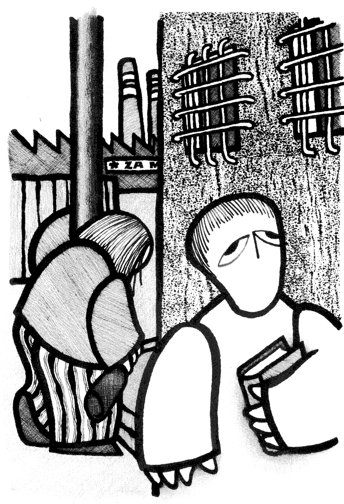
<i>...podél cesty necháváme zbitý ve křoví,
čistota nám brání vidět nuzný hladový...</i>

## 227 Ó já vím, že Pán

*Jiří Joran*

*Ref:* Ó já vím, že Pán, já vím, že Pán, já vím, že Pán, ten mi požehná. Ó já vím, že Pán, já vím, že Pán, já vím, že Pán, ten mi požehná.

(1) Kdy takový se zázrak stal, já vím… že chudým kázal Kristus král, já vím …

(2) Někteří Boha špatně ctí, já vím … den protlučou, noc promodlí, já vím …

(3) Můj Pán, co řek‘ to udělal, já vím … i mrtvému děl, aby vstal, já vím ….

## 228 Modlitba

*Bohdan Pivoňka*

(1) Ó Pane můj, nenech mne být, dej sílu žít a nezradit. Každý den ráno, večer, stále rač při mně bdít a nesoudit. Když teskný žal mně úsměv vzal, dej, bych tě znal a nereptal, Tvůj, Pane Ježíši, příklad dej bych sledoval.

(2) Ve všední den dej v klidu vstát a s radostí jít pracovat. V práci tvou pomoc, lásku všem lidem zjevovat a vytrvat. Když končí den v tmu pohřížen dej, Pane, jen být spokojen, Tvé dobroty síle věřit, že dáš dobrý sen.

## 229 Ó Pane, zhasíná den

*Ref:* Ó, Pane, zhasíná den, prosím, modlitbu mou slyš, ó, Pane, zhasíná den, prosím, modlitbu mou slyš.

(1) Písně radostný hlas, v chleba uzrálý klas, věrné přátelé své, vše zavírám ve svůj dík.

(2) Modrou nebeskou báň, jasnou sluneční pláň, bílá oblaka dne, vše zavírám ve svůj dík.

(3) Kvítím vonící zem, lesů na horách lem, řeky jiskřící proud, vše zavírám ve svůj dík.

(4) První večerní stín, teplý domova klín, božské večeře dar, zavírám ve svůj dík.

## 230 Obléká nás

*Jiří Joran*

(1) Obléká nás, obléká nás, obléká svoje děti Pán, až já přijdu do nebe, milost vezmu na sebe, před trůnem zazní: Svatý, svatý, svatý, každý nebe nespatří, kdo se svatě zatváří, svatý svatý, jen ten, kdo chodí v lásce tvé, ke svatý.

(2) Pod křídla svá, pod křídla svá, posbírá svoje děti Pán. Až já půjdu do nebe, zamáváme na sebe, před trůnem zazní: Svatý …

(3) On píseň dá, on píseň dá, radosti píseň moje zní, Až já půjdu do nebe, budu celý bez sebe, před trůnem zazní …

(4) Posílá nás, posílá nás, posílá do všech koutů Pán. Až já půjdu do nebe, nepůjdu tam bez tebe, před trůnem zazní...

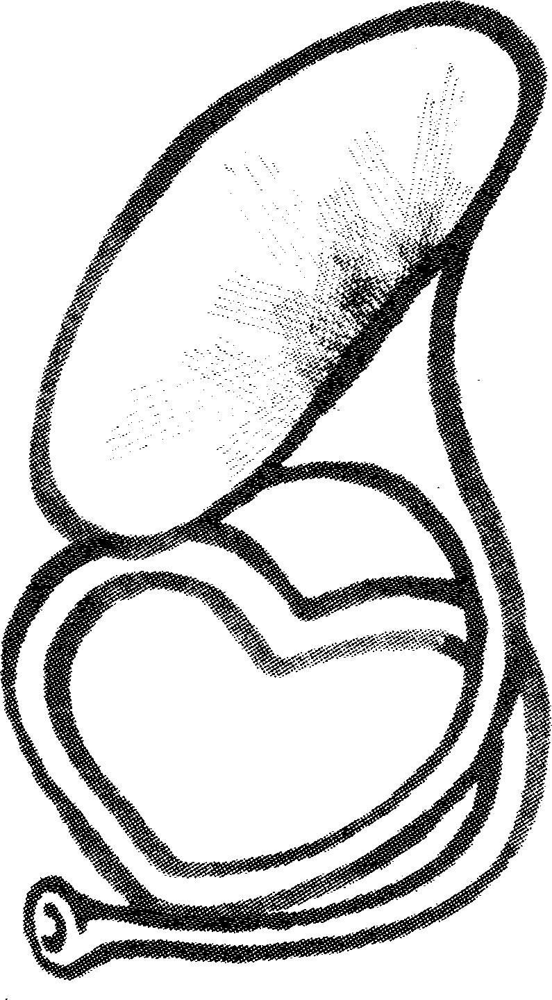

## 231 Ó přijď, ó přijď, náš Pane

*Miroslav Brož*

(1) Ó, přijď, ó přijď, náš Pane, k nám, a v srdcích našich měj svůj chrám a lidu svému v soužení dej radost, mír a spasení, a tam, kde lkáme úzkostí, těš nás svou vlídnou blízkostí.

(2) Ó, přijď, ó přijď k nám, Pane náš, jenž nám v své lásce shovíváš, a lid svůj ve tmách bloudící chraň světlem svým, drž pravicí, sviť nám, buď pravdou našich cest, ať slovem tvým se dáme vést.

## 232 Oči jsi mi dal

*Zdeněk Coufal*

(1) Oč jsi mi dal, vidět neumím, slepých lékaři, smiluj se nade mnou.

(2) Uši jsi mi dal, slyšet neumím; hluchých lékaři, smiluj se nade mnou.

(3) Ruce jsi mi dal, sloužit neumím; chromých lékaři, smiluj se nade mnou.

(4) Ústa jsi mi dal, chválit neumím; němých lékaři, smiluj se nade mnou.

(5) Život jsi mi dal, věřit neumím; vládce nad smrtí, smiluj se nade mnou.

(6) Bližní jsi mi dal, mít rád neumím; tvůrce zázraků, smiluj se nade mnou.

## 233 Odpusť

*Miloš Rejchrt*

(1) Odpusť, že dnes tak jako včera jsem tobě věrnost sliboval. (: Odpusť, že z rána do večera jsem tebe skutkem zrazoval. :)

(2) Odpusť, že jsem nevyslech' bratra, který se mne na radu ptal, (: odpusť, že jsem se díval spatra, na toho, který klopýtal. :)

(3) Odpusť, že nad svou hněvivostí nechal jsem slunce zapadnout, (: odpusť, že jsem dnes bez milosti slepého nechal upadnout. :)

(4) Odpusť mi, Pane, zase znova, odpusť mi každý lásky dluh, (: odpusť všechna zbytečná slova, odpusť, jenž slitovný jsi Bůh. :)

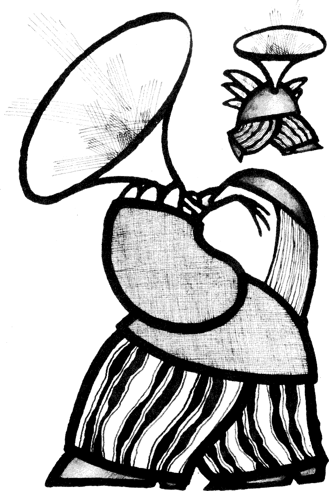
<i>...Petr se stal skálou a Pavel polnicí...</i>

## 234 Oheň plál

*Miloš Rejchrt*

*Ref:* Oheň plál, oheň plál, zpívej teď a Pána chval, vždyť oheň plál, oheň plál. Kudy kam a kudy dál, nestarej se, Pána chval, vzpomeň jen, že cestou oheň plál.

(1) Pouť ta pouští vede a tma padla zlá, z cesty svést nesvede, když nám oheň plá. Kudy kam a kudy dál, nestarej se, Pána chval, vzpomeň jen, že cestou oheň plál. Cesta za svobodou není na mapách, přesto pískem, vodou jen dál, žádný strach. Kudy kam a kudy dál, nestarej se, Pána chval, vzpomeň jen, že cestou oheň plál.

*Ref:* Oheň plál, oheň plál, zpívej teď a Pána chval, vždyť oheň plál, oheň plál. Kudy kam a kudy dál, nestarej se, Pána chval, vzpomeň jen, že cestou oheň plál.

(2) Šest let jsem se snažil a měl rád svůj džob, včera jsem narazil na kádrovej strop. Kudy kam a kudy dál… Moji kamarádi, moc prima lidi, jsou teď hrozně rádi, když mě nevidí. Kudy kam a kudy dál…

(3) Vesele si zrána běžím pro poštu. Ten dopis byl rána, škrt do rozpočtu. Kudy kam a kudy dál… Snad mě doktor zklidní... Právě naopak, nález pozitivní — a co bude pak? Kudy kam a kudy dál…

## 235 Oko za oko

*Štěpán Hájek*

(1) Oko-ko za oko zub za zub, prach-chy na ruku, krev za krev, leze, leze po železe, nekoukejte až tam vleze, Oko-ko za oko zub za zub, prach-chy na ruku, krev za krev, další článek do řetězu, když se bojím, sám tam vlezu.

(2) Válka-ka za válku, mír za mír, dělo - lo za dělo, smrt za smrt, jeden, dva, tři, čtyři, pět, cos to, Janku, cos to vypil, válka - ka za válku, mír za mír, dělo - lo za dělo, smrt za smrt, pro ten kousek šošovice ďábel pálí slivovice.

(3) Něco - co za něco, co za to, ku-kudy kam kudy, jak teď ven, kdo to nezná, ať to pozná, pro dobrotu na žebrotu, něco - co za něco, co za to, ku - kudy kam kudy, jak teď ven, jenom tvoje láska čistá po způsobu Pána Krista.

## 236 Králů král

*Bohumil Kejř*

*Ref:* On je králů Král, on je pánů Pán, první on i poslední, Ježíš jediný.

(1) Vím, Vykupitel můj je živ, Ježíš jediný, k lidem velmi milosti, Ježíš jediný.

(2) On v nebi město zbudoval, Ježíš jediný, zve do něj svaté ze všech stran, Ježíš jediný.

(3) Hříšníku, který k němu jde, Ježíš jediný, dnes Boží milost poskytne, Ježíš jediný.

## 237 Pánů Pán

*Miroslav Čejka*

*Ref:* On je pánů Pán, on je králů Král, proto miluj a zpívej, lidem radost vždy dávej, živote, svým celým stále Pána chval.

(1) I když přítele jsi ztratil, smíš se radovat, tomu, kdo tě neopustil, dík svůj vyzpívat.

(2) I když všechno vidíš černě a když chceš se vzdát, Pán tvůj jedná vždycky věrně, nemusíš se bát.

(3) I když sám jsi často zklamal, naději smíš mít, že Bůh také tebe přijal, chce ti odpustit.

## 238 Mexický otčenáš

*Jiří Veber*

(1) Otče náš, který jsi na nebesích, přesvaté budiž tvé jméno. Přijď tvé království, tvá vůle staň se, přesvaté budiž tvé jméno.

(2) Jako v nebi, tak i na zemi, … Náš denní chléb, Pane, dej nám dnes, …

(3) A odpusť nám i naše viny, … Též my odpouštíme svým viníkům, …

(4) A neuvoď nás v pokušení, … Ale vysvoboď nás od všeho zlého, …

(5) Neboť tvé jest království, tvá moc, … tvá moc, tvá sláva až na věky, amen, ... Amen.

## 239 Připravujte cestu

*Miloš Rejchrt*

(1) Otevřete brány hradeb kamenných, otevřete brány hradeb srdcí svých, otevřete, aby mohl dál. Nechte všeho, nechte obav, starostí, připravujte cestu jeho království, připravujte cestu, aby vejít mohl slávy král.

*Ref:* To kvůli Králi, Králi, Připrav každý cestu, cestu svou, To kvůli králi, králi, Naprav každý cestu, cestu křivou, cestu zlou.

(2) Pozdvihněte svoje srdce znavená, posilněte klesající kolena, otevřete, aby mohl dál. Není doba k spánku, je čas nabrat sil, pominula noc a den se přiblížil, připravujte cestu, aby vejít mohl slávy Král.

## 240 Ovečko ztracená

*Sušil*

(1) Ovečko ztracená, celá zarmoucená, sem ke mně pospíchej, nic se neostýchej

(2) Ach, já nesmím k tobě, stydím se v té době, těžce jsem zhřešila, tvou lásku ztratila.

(3) Pastvou tě nakrmím, svým tělem nasytím, navrať se brzičko, ztracená ovečko!

(4) Ráda bych šla blíže, nedá hříchů tíže. Podvést jsem se dala, na tebe nedbala.

(5) Tys drahý poklad můj a já jsem pastýř tvůj. Bok tobě otvírám a v stráž tě zavírám.

(6) Ruce roztahuji, sebe obětuji, přijmu tě na milost, odpustím ti vší zlost.

(7) Ach, já omámená, ovečka ztracená! Hle, zdaleka stojím, vrátiti se bojím.

(8) Neboj se, spanilá, pojď ke mně, rozmilá, vstaň, ó, vstaň od země a obrať se ke mně.

(9) Hleď, jak já pro tebe opustil jsem nebe. Pojď tedy brzičko, ztracená ovečko.

(10) . Ó, pastýři milý, miláčku spanilý! Slyším tvé volání, již činím pokání.

(11) . Prosím v truchlivosti, odpusť mně mé zlosti! A již mne ozdravuj, neb jsi ty lékař můj.

(12) . Byla jsem vyhnaná a hříchům prodaná, hynula jsem cele, na duši, na těle.

(13) . Již činím pokání, uděl smilování! Přijmi navrácenou, ovečku ztracenou.

(14) . O, vítej, ztracená, vítej, opuštěná! Vítej, holubičko, vítej, má ovečko!

(15) . Hlavu nakloňuji, v lásce se skloňuji, polib mne, dušičko, ztracená ovečko.

## 241 Pán Bůh sám

*Pavel Kočnar*

*Ref:* Pán Bůh sám kráčí k nám, trůn má tem, kde mír se nehlídá zbraní. Tam, kde pán si je rovný s paní, tam, kde vláda zlou mocí není. Pán Bůh sám kráčí k nám, dává zlato všem vděčným za chléb suchý, řeč němým o tóny hluchým. Pán Bůh sám kráčí k nám, vítá nás.

(1) Kdo loudá se a neběží, kdo této pravdě nevěří, život se mu nepodaří, záhy smrt se na něj zpytavě zatváří.

(2) Kdo život jemu zasvětí, kdo nelituje obětí, kdo zlobu láskou oplatí, takové schová Pán v laskavém objetí.

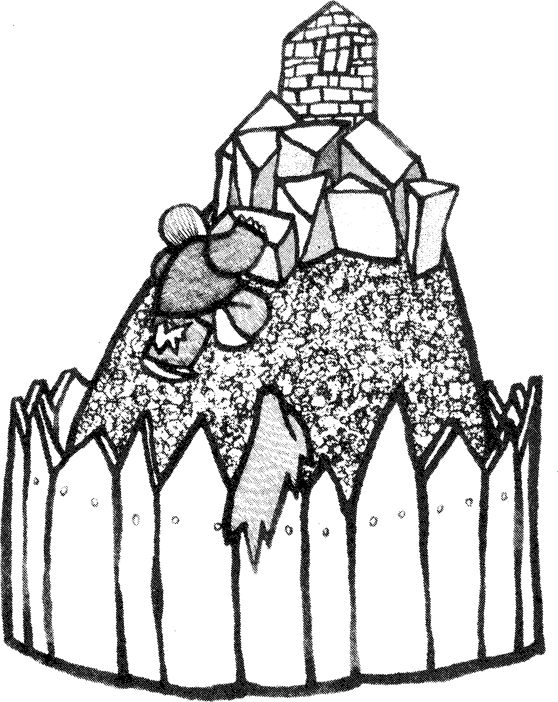
<i>...já nechci stavět na písku,
byť kolem skal byl plot...</i>

## 242 Pán je má síla

(1) Pán je má síla a hrad můj, on mi prostírá plný stůl, on dává sílu v čase zlém, dává všem, i nám, dává tam, kde se čeká v modlitbách.

(2) On slovo pravé dává nám, vždyť žádný z nás už není sám, on dává lásku v dobu zlou, dává lásku svou, dává tam, kde se čeká s pokorou.

Tak pojďme za ním všichni, služme s radostí, život nový žijme v jeho blízkosti.

(3) Pán je má síla a hrad můj, on mi prostírá plný stůl, on dává sílu v čase zlém, dává všem, i nám, dává tam, kde se čeká v modlitbách.

## 243 Pán z mrtvých vstal

*Jan Keřkovský*

(1) Pán z mrtvých vstal, na sebe vzal všechno, co člověk napáchal, pojďte za mnou, zve všechny hříšný, k sobě nás pozval králů Král.

(2) Tu neděli nám život dal, když starý hříchy odpáral, ukázal lidem novou cestu, k sobě nás pozval králů Král.

(3) Kdo pokání však nečiní, ten nevybředne ze svých vin, království Boží mizí v dálce, zůstane minulosti stín.

(4) Pán z mrtvých vstal, na sebe vzal všechno, co člověk napáchal, pojďte za mnou, zve všechny hříšný, k sobě nás pozval králů Král.

## 244 Pána vítej

*Míla Esterle*

*Ref:* Pána vítej, k nám se sklání, s láskou otvírá náruč svou, Pána vítej, k nám se sklání, světu přináší pokoj svůj.

(1) Bůh mluví stále k lidem svým hlasem mocným i laskavým: „Co svět ti dává, je jen klam.“ Slyš jeho slova – pokoj vám.

(2) Všechno, co vidím, musím mít, něco mi chybí, nenajdu klid. Stále za něčím pospíchám, najednou slyším — pokoj vám.

(3) Vše, co mi vládlo, čím jsem žil, všechno tvůj pokoj proměnil. Chtěl bych teď sloužit, pomáhat každému z lidí, pokoj znát.

## 245 Pane a Bože

*Petr Chlouba*

Pane a Bože, přijmi naše prosby.

Nebeský Králi, smiluj se nad námi.

Prosíme, Otče, vyslyš nás,

ve jménu Krista, amen.

## 246 Pane, dnešek je den chvály

*Karel Trusina*

(1) Pane dnešek je den chvály, dnes ti chceme děkovat; rádi bychom vyzpívali dík za to že nás máš rád.

(2) Pane, dnes zvlášť děkujeme za tvé evangelium. Dej, ať nezůstane němé, ať potěší každý dům.

(3) Pane, dnes ať nám všem zazní slovo, které pomáhá, těm, kdo zdoláni jsou bázní, ať se vrátí odvaha.

(4) Pane, dnes je tolik lidí, co nevědí kudy kam. Dej, ať aspoň na krok vidí, ať nikdo z nich není sám.

(5) Pane, dnes toužíme vědět, na čem nejvíc záleží. Ukaž nám, co potřebné je a co je jen přítěží.

(6) Pane, naplň pravým mírem srdce svého stvoření, ať náš hřích už v světě širém tvoji vůli nemění.

## 247 Pane, chci být dobrý křesťan

*Samuel Verner*

(1) Chci být, Pane, dobrý křesťan v srdci svém, v srdci svém, Pane, chci být dobrý křesťan v srdci svém. V srdci svém, v srdci svém, Pane, chci být, dobrý křesťan v srdci svém.

(2) Pane, chci být upřímnější v srdci svém, v srdci svém, Pane, chci být upřímnější v srdci svém. V srdci svém, v srdci svém. Pane, chci být upřímnější v srdci svém.

(3) Pane, chci mít více lásky v srdci svém, v srdci svém, Pane, chci mít více lásky v srdci svém. V srdci svém, v srdci svém. Pane, chci mít více lásky v srdci svém.

## 248 Pane, slyš náš hlas

*Miloš Rejchrt*

Pane, slyš náš hlas, chcem tě chválit zas,

za to, že máš v péči celý svět i nás,

za to, že máš v péči celý svět i nás.

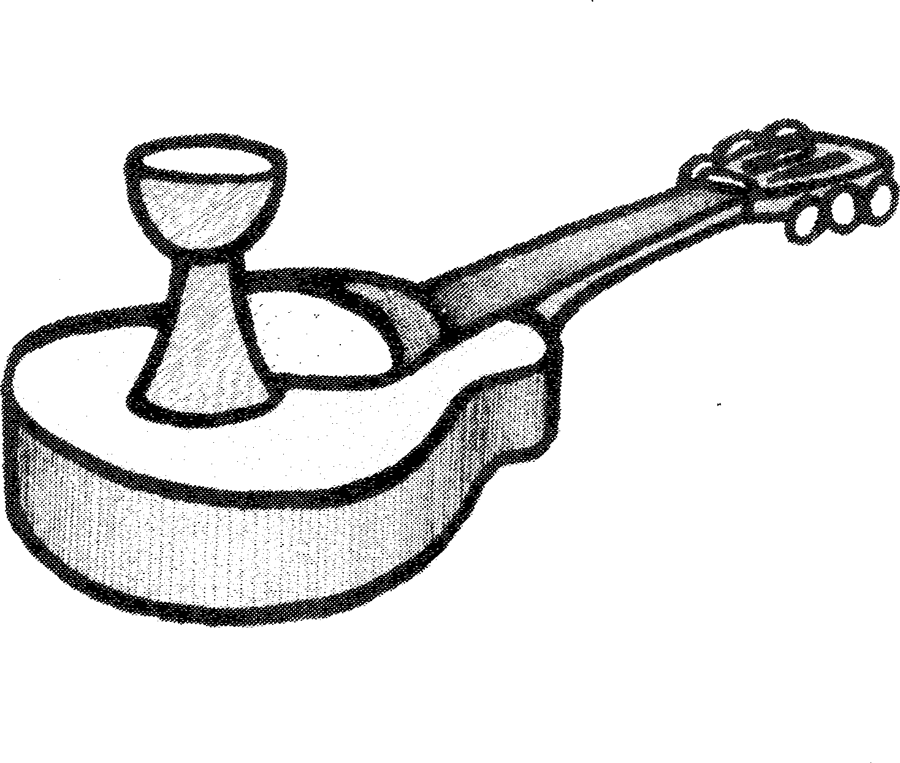

## 249 Pane, tobě chci zpívati

*Bohuslav Košťák*

(1) Pane, tobě chci zpívati na své cestě, Pane, tobě chci zpívati od rána celý den. Ty jsi Pán laskavý, pokoj tvůj uzdraví, Pane, tobě chci zpívati na své cestě!

(2) Pane, tebe chci chváliti na své cestě. Pane, tebe chci chváliti od rána celý den. Chválí tě stvoření, paprsek sluneční, jak bych neměla chválit tě na své cestě!

(3) Pane, tobě chci sloužiti na své cestě, vděčně na tvůj kříž vzpomínat od rána celý den. Odvahu z něho brát, potřebným pomáhat, Pane, jako ty sloužit chci na své cestě!

(4) Pane, tebe chci čekati na své cestě, čekat bez obav celou noc, od rána celý den. Naději slavnou mám, potkáš mne jako Pán, píseň novou ti zazpívám na své cestě!

## 250 Pane, ty mne znáš

*Daniel Raus*

(1) Pane, ty mne znáš, víš nač čeká srdce mé, víš že šťastné je když tebe nalezne.

*Ref:* Chci i zpěvem svým, Pane vzdát ti chválu svou, nehodnou.

(2) Vím, že v soužení znovu vždy mne navštívíš, láskou, milostí svou hojně obdaříš.

(3) Chci tě oslavit, i když nemám mnoho sil, život svůj ti dát, bys z něho viny smyl.

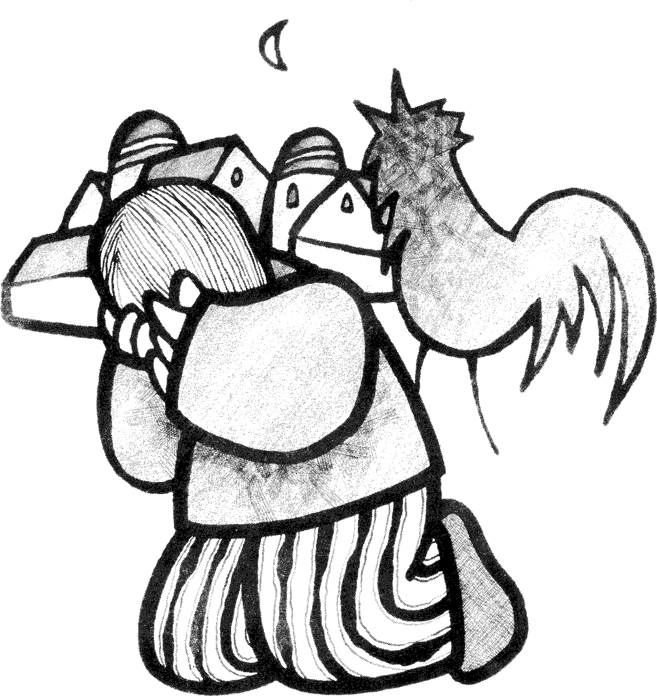
<i>...Petra v srdci zrada pálí...</i>

## 251 Dezertér

*Miloš Rejchrt*

(1) Pánové nahoře, já píšu Vám dnes psaní a nevím vlastně ani, budete-li ho číst. Přišlo mi ve středu do války předvolání, je to bez odvolání, tím prý si mám být jist. Pánové nahoře, už jsem ten papír spálil, už jsem si kufry sbalil, správcové klíč odevzdal. Pánové nahoře, uctivě se vám klaním a zítra vlakem ranním odjíždím o kousek dál.

(2) Co už jsem na světě, viděl jsem zoufat matky nad syny, kteří zpátky se nikdy nevrátí. Slyšel jsem dětí pláč a viděl jejich slzy, které snadno a brzy se z očí neztratí, znám vaše věznice, znám vaše kriminály, znám ty, kterým jste vzali život či minulost. Vím také, že máte solidní arzenály, ač už jste povídali o míru víc, než dost.

(3) Pánové nahoře, říká se, že jste velcí, a na věci to přeci vůbec nic nemění. Pánové nahoře, na to jste příliš malí, abyste vydávali rozkazy k vraždění. Musí- li války být, jděte si válčit sami a vaši věrní s vámi, ostatní, ty nechte být. A když mě najdete, tak vám mohu vyřídit: střílejte, neváhejte, já zbraň nebudu mít.

## 252 Pár bílých pozdravů

*Marie Čančíková, Věra Vaisarová-Vydrová*

(1) Pár bílých pozdravů dává den za oknem. Schoulená země zní nádherným vánočním chorálem. Pár bílých pozdravů na vločkách sněhových přikryje nečistá údolí, jak láska lidský hřích.

*Ref:* Ó Bože náš, vládneš od věků, jediný tvůrce jsi pokoje, život věčný dáš člověku.

(2) Tak se věci známé v tajemství promění. V tom čase Pán Bůh dal hříšnému člověku znamení. Do prostých jesliček se Boží Syn narodil. Tím svoji lásku k člověku Bůh znovu potvrdil.

## 253 Vánoční

*Tomáš Najbrt*

(1) Pastýři stáli na stráži, hlídali stádo své. Tmou hvězda náhle zazáří a na cestu je zve: Jen pojďte k městu Betlému, vzdát chválu Otci věčnému.

*Ref:* Zrodil se slávy Král. Buď Bohu čest.

(2) Hned k Betlému se vydali, vesele spěchají a Spasitele našeho tam svorně hledají. Jím podle slibů nebeských je dítě v plenkách na jeslích.

(3) Ti pastýři to uměli - děťátku chválu vzdát, i když se možná někomu malé jen mohlo zdát. My víme, že v něm přišel k nám náš Spasitel a Pán Bůh sám.

## 254 Po Vánocích

(1) Pastýři už zase pasou stáda, andělé už nezpívají sláva, do Betléma vcházejí vojáci, mají tu svou každodenní práci.

(2) Herodes dnes uspořádal jatka, nesmí je obměkčit žádná matka, a tak jdou dům od domu, smrt nesou, v Betlémě se všichni hrůzou třesou.

(3) Král musí být vždycky jenom jeden, jinak by z toho byl každý jelen, pro jistotu všichni zemřít musí, Herodes ví, jak naději zdusí.

(4) Netuší však, co se v noci stalo, co se ve snu Josefovi zdálo, ve tmě sedlá oslíka a tiše odchází pryč do egyptské říše.

(5) Kdo však zachrání nevinné děti, což jsou Bohu dobré jen k oběti, proč neposlal z nebe své anděly, proč nezkazil plány nepříteli.

(6) Proč dnes malé děti umírají a proč války lidé začínají, proč tomu všemu Bůh nezabrání, proč nesplní staré lidské přání.

(7) Apoštol nám píše ve svém listu, Bůh nás zachránil v Ježíši Kristu, co učinil pro něj, pro nás platí, z lásky nám všem život zpátky vrátí.

(8) Člověk neumírá bez naděje, i když není všechno, jak si přeje. Kristus žije, to nám přece stačí k potěšení těch, co ještě pláčí.

## 255 Plné ruce, plná ústa díků

*Tomáš Najbrt*

(1) Plné ruce, plná ústa díků, každý den vždy nový důvod mít chválu vzdávat bez frází a zvyků, nauč nás žít, nauč nás žít. Stěží chápem, co se denně stává, jenom vírou je to možné vzít, a kdo ví to, zpívat nepřestává.

*Ref:* Haleluja, my ty i já, haleluja, ať zní chvála jásavá. Haleluja, haleluja, haleluja, ať zní chvála jásavá.

(2) Plné oči, plná ústa chvály, tolik pěkných věcí kolem nás, nezahálí, kdo v životě chválí, dál půjde snáz, dál půjde snáz. Každému ať zazní dobrá zpráva, aby spásu nikdo nepropás, a kdo ví to, zpívat nepřestává.

*Ref:* Haleluja, my ty i já, haleluja, ať zní chvála jásavá. Haleluja, haleluja, haleluja, ať zní chvála jásavá.

(3) La-la, la-la, la-la, la-la, la, la, la-la, la-la, la-la, la-la, la, la-la, la-la, la-la, la-la, la, la, la-la-la, la, la-la-la, la, Všem lidem své dary Pán Bůh dává, není, kdo by s prázdnou musel jít, a kdo ví to, zpívat nepřestává.

## 256 Apoštolská

*Bohdan Mikolášek*

(1) Pohleď, jak můj život plný strastí, ve víně se zvolna rozplývá, je krásné držet sklenku, když se nikdo neptá, jak je venku a co dál, až dozpívám.

*Ref:* Vždycky jsem chtěl být jako apoštol, vím, že stačí chtít a jen si přát. V důchodu si budu klidně psát evangelium, aby další o mně mohli psát.

(2) Zazpívám si hory, doly, stráně, pomodlím se a pak půjdu spát. Síla zvyku tak jako chléb sládne na jazyku, zbytečné je brát si, co mám rád.

## 257 Jordán

*Jan Keřkovský*

*Ref:* Pojďte k Jordánu, pojďte k Jordánu, pojďte smýt své hříchy, halelu.

(1) Kam kráčíte, mí bratři, kam chcete jít? Ó bratře, k Jordánu chceme jít smýt své hříchy, k Jordánu je smýt.

(2) Kam kráčíte, mé sestry, kam chcete jít? Ó bratře, k Jordánu chceme jít smýt své hříchy, k Jordánu je smýt.

(3) Slyšeli jste o tom městě postaveném do čtyř stran? On řekl, že chce potka, potkat všechny lidi tam.

(4) Já vím, že se blíží ten den, kdy přijde soud, ó Pane, prosíme, odpusť nám naše viny, ať svobodně můžem žít.

## 258 Pojďte, věrní

*Bohuslav Košťák*

(1) Pojďte věrní, pějte chorál, jež by zatřás oblohou, chvála zněj za vykoupení a za milost přemnohou Bohu Otci, jeho Synu, (: oslavte je písní svou. :)

(2) Dřív než zvedla hory velké, rozměřila oceán, Láska věčná předurčila, aby zemřel žití Pán; na Golgatě za všechny nás (: trůn mu hrůzný přichystán. :)

(3) Pána zpěvem zvučným chvalte na hudební nástroje, divy jeho ohlašujte, ať se lidstvo raduje. Beránek že v oběť daný (: živ je, věčně kraluje. :)

## 259 Pokání čiňte!

(1) Pokání čiňte, blízko je království. (2x) blízko je království Boží. (2x)

(2) Poznáte pravdu, pravda vás osvobodí, Ježíš vás osvobodí.

(3) Kdo věří v něho, obdržel život věčný, Ježíš je život věčný.

(4) Poznáte lásku, láska vás promění, Ježíš vás láskou promění.

(5) Přijmete Ducha, budete svědkové. Budete svědkové Boží.

(6) Vejdete v slávu města Jeruzalém. Vejdete v Jeruzalém.

(7) Budete chválit po celou věčnost Boha, zpívati haleluja.

## 260 Zjevení 21

*Miloš Rejchrt*

(1) Pomine země, v suchopár proměněná vidinami horečnatých snů, pomine země, svědkyně zlořečená krvavých nocí, slzavých dnů.

*Ref:* Město nové, město bez žalářů, Jeruzalém nový viděl Jan, město bez armád a prosté lhářů, město věčně otevřených bran.

(2) Pomine nebe v mlčení zahalené, zajdou hvězdy, přijde jejich pád. Pomine nebe, modlitby oslyšené, nebesa hluchá, z nichž čiší chlad.

## 261 Pomoz mi, můj Pane

*Miroslav Heryán*

(1) Pomoz mi, můj Pane, abych nežil planě, abych nežil planě tam, kde chceš mne mít.

(2) Pomoz, Pane milý, abych měl dost síly, abych měl dost síly bližním odpustit.

(3) Pomoz, když se bojím, ať vždy pevně stojím, ať vždy pevně stojím tam, kde nutný jsem.

(4) Pane, slyš mé přání, vzdal vše, co mi brání, vzdal vše, co mi brání být tvým člověkem.

## 262 Pomoz Pane těm co smutek nosí

*Zdeněk Šorm*

(1) Pomoz Pane těm co smutek nosí pomoc Pane ty co mají žal co jsou v duši nahatý a bosí na který jsem se já věrnej vykašlal

(2) Pomoz Pane těm co strach ovládá který včera ten strach udolal kterým vina dneska spát nedává na který jsem se já věrnej vykašlal

(3) Pomoz Pane těm co v pravdě stojí který vládce světa sejmout dal kteří trpí za ty co se bojí na který jsem se já věrnej vykašlal

(4) Pomoz Pane těm co hledaj tebe každej z nich se prázdnejch jistot vzdal v zmatku sebe hledaj nově nebe a já se na ně ortodoxně vykašlal

(5) Pomoz Pane těm co jsou si jistý že jen jim jsi pravdu poznat dal kteří jasně věděj co je čistý na který jsem se já věrnej vykašlal

(6) Pomoz Pane ať nám tyhle slova připomínaj cos nám ukázal že je třeba pořád zas a znova aby nikdo na nikoho nekašlal

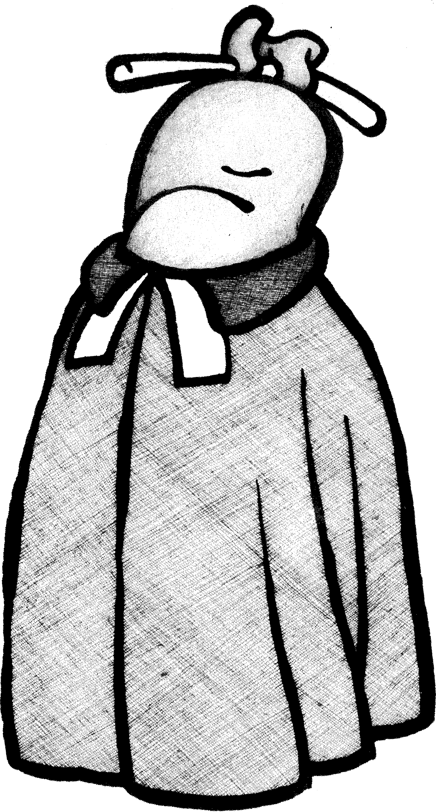
<i>...byl tu s námi taky farář,
zamračený jelito...</i>

## 263 Pan Maňátko

*Štěpán Hájek*

(1) Porád někam běhá pan Jaroslav Maňátko běhá dokud nemá peněz plný prasátko na co je to když se ptám žádnejch slov se nedočkám v konci tvýho věka tam tě stejně čeká krematorium

(2) Manželka je bledá a nemůže v noci spát pan Maňátko hledá jak by se moh' slavným stát na co je to když se ptám …

(3) Pan Maňátko touží uskutečnit skvělej plán lidi ať mu slouží a on bude moci pán na co je to když se ptám …

(4) Mariáno nazdáár dobrý ráno hašiši každej den se naschvál nafetujou fetiši aby nemuseli žít v tomhle světě hrůz a bíd tak se neboj světa zůstala v něm věta Kristus z mrtvejch vstal

(5) Co ta věta značí těžko se mi povídá jedna věc mi stačí kterou se z ní dovídám že už nemusím se bát až na Olšana půjdu spát v konci tvýho věka tam na tebe čeká ten co z mrtvejch vstal

## 264 Poslal Bůh anděla

*Miroslav Brož*

(1) Poslal Bůh anděla, jméno má Gabriel, navštíví s poselstvím zem zvanou Izrael. Tam čeká Marie v městečku Nazaret, syn se jí narodí, vykoupí celý svět.

(2) Cestu mu připraví hlas Božích proroků, jež nás zvou k pokání, vzdát se svých nároků. Vždyť se Bůh vzdal svých práv, slávy trůn nečeká, přichází s námi být jako Syn člověka.

(3) Proto dnes s Marií duše má velebí: Ty jsi Bůh spasení, světlo mé na nebi. S královstvím pokoje přichází také k nám, srdce své, Pane můj, pro tebe přichystám.

## 265 Postil se-tě Pán Bůh

*Sušil*

(1) Postil se tě Pán Bůh čtyřiceti dní, (2x) čtyřicet dní, čtyřicet nocí. (2x)

(2) A přišel-tě k němu pokušitel zlý, přišel k němu ďábel šeredný.

(3) Zkoušel Pána Krista, zkoušel po první, vyvedl ho k hromadě kamení.

(4) Jsi-li, Jezu Kriste, jsi-li Syn Boží, udělej mně chleba z kamení.

(5) Není jenom člověk samým chlebem živ, je živ také tím slovem Božím.

(6) Zkoušel Krista Pána, zkoušel po druhý, vynesl ho na chrám vysoký.

(7) Aj, jsi—li ty, Kriste, jsi—li Syn Boží, spusť se dolů a staň na nohy, zadrží tě andělé tvoji.

(8) Netřeba mně, ďáble, dolů spouštěti, mám své nohy, můžu choditi.

(9) Zkoušel Pána Krista, zkoušel po třetí, vynesl ho na kopec vysoký.

(10) . A z té milé hory mnoho viděti, mnoho světa, drahého květa.

(11) . Chceš—li se mně, Kriste, chceš—li klaněti, volím tobě to všecko dáti.

(12) . Všecko je to, ďáble, všecko je to mý, i tady to drahé kamení.

(13) . Kopnul Pán Bůh ďábla pravým kolenem, hleď, ďáble, hleď do své propasti, nemáš ty mě v ničem podvésti.

## 266 Daniel

*Jiří Gruber, Jiří Joran*

*Ref:* Proč by zachráněn měl být jen ten Daniel, jenom ten Daniel, jenom ten Daniel? Proč by zachráněn měl být jen ten Daniel, a proč ne i kdokoli z nás.

(1) Daniel byl ze lví jámy zachráněn, také Jonáš z útrob velrybích a tři mládenci vyšli z ohnivé pece, a proč ne i kdokoli z nás?

(2) Farao se v moři s vojskem utopil, Goliáše David porazil, ve všem trápení chválil Job svého Boha, a proč ne i kdokoli z nás?

*Ref:* Proč by zachráněn měl být jen ten Daniel, jenom ten Daniel, jenom ten Daniel? Proč by zachráněn měl být jen ten Daniel, a proč ne i kdokoli z nás.

(3) Noe v korábu všem život zachránil, Ježíš za nás zemřel na kříži a pak třetí den ráno z mrtvých vstal, a proč ne i kdokoli z nás?

(4) Daniel byl ze lví jámy zachráněn, také Jonáš z útrob velrybích a pak třetí den Ježíš z mrtvých vstal, a proč ne i kdokoli z nás?

## 267 Proč jen mlčíš, Pane

*Miloš Rejchrt*

*Ref:* Proč jen mlčíš, Pane, když zloba lidská život maří? Proč se nezastane pravdy tvá moc?

(1) Když tě jako lotra zatýkali, moh´s je o své síle přesvědčit, Petra v dlani meč teď přímo pálí, a přece´s mu zakázal se bít. Ref.

(2) Zakusils, Pane, nelidská muka, když ti důtky záda rozbily, zakusils, co umí lidská ruka, když člověka pravda rozčílí.

(3) Poznals, Pane, co je přízeň davu, v této chvíli žádá život tvůj, když ti včera provolával slávu, pro změnu dnes křičí „ ukřižuj“.

(4) Dnes jako dřív nad světem kříž stojí, na tom kříži umírat tě zřím a odpověď na otázku svoji z tvé zsinalé tváře vyčíst smím.

## 268 Vánoční

(1) Proč jsou jen lidé zlí, já ptám se proč se nenávidí já ptám se proč si jen pořád lžou a Boží lásku nevidí, nevidí.

(2) Proč kytky nekvetou, já se ptám, proč vodu nelze pít, já se ptám proč lesy nešumí, když Bůh chtěl, aby všichni mohli žít, mohli žít.

(3) Proč pravda mlčívá, já se ptám, proč láska odchází, já se ptám, proč naděj umírá, když Boží vláda přichází, přichází.

(4) Proč víra usíná, já se ptám, proč radost nezpívá, já se ptám, proč milost nezáří, když světla v zimě přibývá, přibývá.

(5) Proč pastýři ne troubí, já se ptám, proč vládci neklečí, já se ptám, proč ty se neměníš, když narodil se Pán Ježíš, Pán Ježíš.

## 269 Proč pro Krista neměli místa

*Bohdan Pivoňka*

*Ref:* Proč pro Krista neměli místa, proč přehlédli to, co se chystá, proč ho vůbec nemohli vystát, proč?

(1) Byli tenkrát lidé divní asi jako dnes, po Ježíši přece neštěk‘ ani jeden pes, a když jim chtěl podat ruku, pomoci jim vstát, začali ho ve svém shluku sprostě křižovat.

(2) Dneska máme jiné formy jak dát Kristu znát, že musíme plnit normy - není čas se kát. Křižování vymizelo, zato svedem lhát, po zádech mu pro pár drobných k ďáblu vyšplhat.

(3) Mám takový divný pocit, když se tážu proč – vždyť by z toho mohl povstat pěkný kolotoč. S ďáblem já se v kole točím, pak nemohu spát, z hlavy mně už vůbec nejde: proč mě Pán má rád.

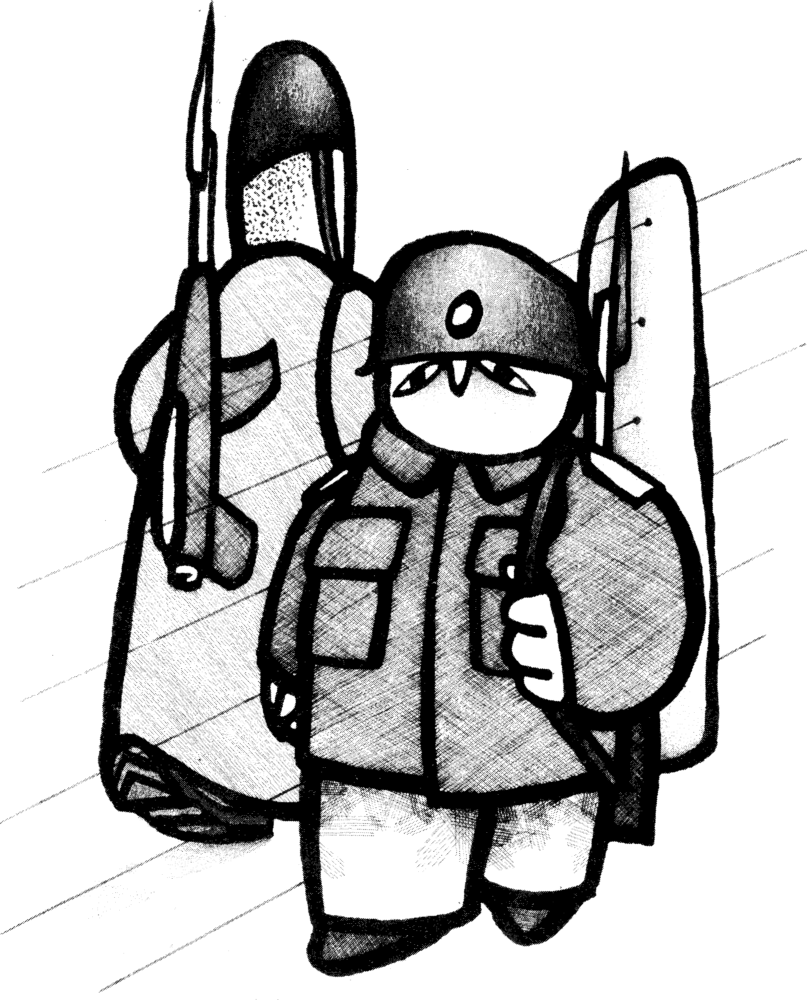
<i>...válka za válku, mír za mír...</i>

## 270 Zamyšlení nad 2. žalmem

*Jaromír Plíšek*

Proč se bouří národové, radí se o věcech zlých, prahnou jako řvoucí lvové kořist třímat v drápech svých? Panovníka k smíchu nutí nesmrtelní vládci dnů, kteří zdávna touží zvrátit Boží trůn.

(1) Jako hrnčíř v hněvu tříští džbány prutem železným, hněte hlínu pro čas příští, mluví Bůh se světem svým. Králi věků, tichý Králi, cesty tvé jdou mnohem dál, než kam dohlédnem my malí, dřív než svět byl, tys tu stál.

(2) Novou zemi, nové nebe zaslíbil Bůh pokojným. Držte dobré, stůjte v pravdě, služte slabým, nesvorným. Nedoufejte v moudrost lidí, v sílu paží, mečů svých, jen kdo v bázni Boží chodí, světlo spatří, pravý mír.

## 271 Žalm 2

*Bohdan Pivoňka*

(1) Proč se bouří národy a lidé marně myslí, proč konají závody, kdo dřív zmate smysly?

(2) Proč se radí knížata, vůdcové a páni, jak natáhnout tenata, která Boha zraní?

(3) Hrajou si jen na pány, Pán - ten sídlí v nebi, ať jsou mu pocty vzdávány, či ať jen slyší kletby.

(4) Zatímco se motají lidé pořád v kruhu, Bůh se směje potají, jak jde jim vláda k duhu.

(5) Jeho smích však za chvíli může taky přestat; potom země zakvílí, když ji začne trestat.

(6) Vemte rozum do hrsti, všichni lidé světa, nechlubte se hrdostí, sic je po nás veta.

Blahoslavení jsou ti, blahoslavení jsou ti, blahoslavení jsou ti, kdo v něho věří.

## 272 Proč vítr zháší plamen

*Jaromír Křivohlavý*

(1) Proč vítr zháší plamen a štíhlá svíce zhasne? Proč srdce ztvrdne v kámen, pak přejdou chvíle krásné? Proč končej šťastný chvíle a zůstane jen stesk? Proč nedíváš se mile a z očí zmizí lesk?

Vykroč dál, nejsi zrnko v prachu u cesty, po kterém lidi šlapou. Vykroč dál, směr ti udává slovo laskavé, Bible bude ti mapou. Vykroč dál.

## 273 Přemýšlej, děkuj a služ

*Zdeněk Svoboda*

(1) Proč zvykli jsme si snadno žít a málo přemýšlet, oč v budoucnosti má nám jít a jak se změnil svět?

*Ref:* Proto přemýšlej, proto díky vzdej a všem lidem pomoz rád. Zkus jednou vážně víru brát, člověkem se stát.

(2) Bůh přišel v Kristu na dotek, jak máme děkovat? Kdo poznal, že je Kristus Rek, ten umí díky vzdát.

(3) Kdo o Bohu jen vypráví a nesplácí mu dluh, ten o tajemství sotva ví, že v bližních je skryt Bůh.

## 274 Apoštolská

(1) Prosíme tě, dej nám, Pane, sílu, chceme začít podle slov tvých žít, věříme, že jednou budem v míru společně u tvého stolu víno pít.

(2) Dívej se na všechny naše zkoušky, jak se utápíme v starostech, bez tebe by svět byl jenom pouští, bez tebe by život neměl vůbec žádný cíl.

(3) = 1.

## 275 Ranní prosba

*Bob Fliedr*

(1) Prosíme tě, Pane, buď s námi celý den, ať ve všem, co se stane, jsi námi oslaven.

*Ref:* Pane náš, prosíme, dej, ať smutek není králem a bolest princeznou, slunce ať má správný jas, v tobě pravou radost ať smutní naleznou, prosíme tě, vyslyš nás.

(2) Ať přestanem se mračit a dokážem se smát, ať umí znovu začít ten, koho zastih‘ pád.

(3) Ať postavíme chrámy z tvé lásky v srdcích svých, buď celý dnešek s námi, ať přemůžeme hřích.

(4) Ať nejdem spát s otázkou, co ty nám zítra dáš, ať všechno přijmem s láskou, jak ty nás přijímáš.

## 276 Před tvou tváří, Pane

*Bohdan Pivoňka*

V Písmu svatém čteme, že Ježíš zvěd' svůj hlas (: panství Boží blízko, vrať se, teď je čas. :)

*Ref:* Před tvou tváří, Pane, nemám vůbec nic, jen tvé slovo dané: Jdi a nehřeš víc, jen tvé slovo dané: Jdi a nehřeš víc.

(1) Jako Mojžíš váhám, nemám vůbec nic. (: Bůh však vodu dá nám. Jdi a nehřeš víc. :)

(2) S Jonášem chci utéct, nemám vůbec nic. (: Úkol dá se unést. Jdi a nehřeš víc. :)

Ref.

(3) Jako žena lehká nemám vůbec nic. (: S láskou se však setkám. Jdi a nehřeš víc. :)

(4) Pyšně sbohem dávám, nemám vůbec nic. (: Díky ti, zas vstávám. Jdi a nehřeš víc. :)

Ref.

## 277 Přicházím

*Eliška Hamerová, Eva Hamerová*

*Ref:* Přicházím k tobě, Pane, hříšník jsem, to víš, přicházím denně, pokaždé mi odpustíš, přichází jiní a co s nimi uděláš? Rád je vždy vyslechneš a pomoc jim dáš.

(1) Ať jsem sám nebo s někým, já přicházím, za sebe i za ostatní stále prosím. Ať je léto nebo zima, já přicházím, za toho, kdo starosti má, stále prosím.

(2) Ať je večer či den bílý, já přicházím, za ty, jimž naděje chybí, stále prosím. Ať jsem doma nebo v práci, já přicházím, za ty, jimž se radost vrací, stále prosím.

(3) Ať jsem v kterémkoliv místě, já přicházím, za všechny, jež znám i neznám, stále prosím. Na cestách za přáteli, já přicházím, za ty, kdo o tobě neví, stále prosím.

Přicházíš ke mně, Pane, hříšník jsem, to víš, přicházíš denně, pokaždé mi odpustíš. Přicházíš k jiným a co s nimi uděláš? Rád je vždy vyslechneš a pomoc jim dáš.

## 278 Prosba

*Miloš Rejchrt*

(1) Přijď již, přijď, Duchu stvořiteli, Duchu smíření. Přijď již a proměň svět náš celý v nové stvoření.

*Ref:* Duchu svatý, nás svou mocí v lásce obnovuj. Nezanech nás bez pomoci, daruj pokoj svůj.

(2) Probuď svým dechem kosti suché, zažeň temnotu. Najdi zbloudilé, oslov hluché, žehnej životu.

(3) Probuď svědomí otupené, sbližuj národy, zavěj a přiveď zotročené v říši svobody.

## 279 Přijď k nám

*Ref:* Přijď k nám, tvůj lid tě čeká, přijď k nám jako přítel náš, tak přijď k nám, tvůj lid tě čeká, přijď k nám jako přítel náš.

(1) Já tančím a štěstím moje srdce hoří, přijď k nám jako přítel náš. Má radost, Pane, hradby smutku zboří, přijď k nám jako přítel náš.

(2) Já stokrát když padám, otrok cizích lidí, přijď … A vstávám znova, moje oči vidí, přijď …

(3) Mou cestou jdou mnozí steskem omrzelí, přijď … Tak zboř ty hradby, co nás ještě dělí, přijď …

## 280 Přijď království tvé

*Miloš Rejchrt*

Přijď království tvé přijď království tvé, přijď království tvé, amen.

Na dně mých sil - mám-li všeho dost - přijď království tvé

Vládne-li lež - vládne-li strach - v lhostejném klidu - přijď …

Chybí-li radost - chybí - li láska - v naší nedověře - přijď ….

Do kostelů - do modliteb - do našeho zpěvu - přijď …

Do našich srdcí - do našich rukou - do našich očí – přijď …

Mezi nemocné - mezi osamělé - mezi vězněné – přijď …

## 281 Přijď, přijď, přijď

*Bohdan Pivoňka*

*Ref:* Přijď, přijď, přijď, přijď už, Pane, také k nám. Přijď, přijď, přijď, přijď a veď nás k výšinám. Potěš srdce zoufalé, pomoz víře nestálé, přijď už, Pane, také k nám.

(1) Vzpomínáme na den, kdy se chudý král vzdálen od mocných narodil, na den, kdy se Pán raděj slávy vzdal, by každému dobře poradil.

(2) Kristus věděl, že pravda se neváže na to, co soudí světský pán. Našel v síle víry dost kuráže říci to, i když byl bičován.

*Ref:* Přijď, přijď, přijď, přijď už, Pane, také k nám. Přijď, přijď, přijď, přijď a veď nás k výšinám. Potěš srdce zoufalé, pomoz víře nestálé, přijď už, Pane, také k nám.

(3) Když pak nebe zcela zakryl černý kříž a ty upřímné vyděsil, zdálo se, že Pán prohrál, ale víš, že nad smrtí provždy zvítězil.

(4) Za to, že jsi světlo přines', měj náš dík, světlo, jež tmy mříž rozláme. Hle - již začal kvést dávno suchý fík! Chudý Králi, k tobě voláme.

## 282 Připojte k loutnám zvony

(1) Připojte k loutnám zvony, ať díků tóny mohou zase znít. Ať s touhle písní novou lidé mohou do života jít.

Zazvoňte na poplach, světlo se ztrácí, zazvoňte silněji, tam se k nám vrací, probuď se, člověče, nezůstaň stát, vždyť žít, to znamená cestou se dát.

(2) Popros v těžké době, ať také tobě světla přidá Pán, ať každý s jeho slovem v duchu novém nese tíhu ran.

Ať lidmi otřese, když u nich zazní: „Zhyne, kdo nehne se, stůjte si, blázni. Tak, jako Babylon, postavte věž, ať lidi zastraší pýcha a lež.“

(3) Připojte k loutnám zvony, ať díků tóny mohou zase znít. Ať s touhle písní novou lidé mohou do života jít.

## 283 Půjdu já

*Ref:* Půjdu já, půjdu já, půjdu já tam domů, Půjdu já, půjdu já, půjdu já tam. Tady se můj čas krátí.

(1) Můj Pán mě volá, už v dáli hřmí a blýská. Zvuk fanfár zní dnes v duši mé, zní. Tady se můj čas krátí.

(2) Skláním se k zemi teď s bázní a chvěním. Zvuk famfár zní dnes v duši mé, zní. Tady se můj čas krátí.

*Ref:* Steal away, steal away, steal away to Jesus, steal away, steal away home. I ain't got long to stay here.

(3) My Lord, he calls me, he calls me by the thunder. The trumpet sounds within - a my soul. I ain't got long to stay here. Ref.

(4) Green trees a - bending, poor sinners stand a - trembling. The trumpet sounds within - a my soul. I ain't got long to stay here.

## 284 Radujte se, bratři

*Ref:* Radujte se, bratři neboť blízko je Pán, blízko je Pán, blízko je Pán. Radujte se, bratři neboť blízko je Pán, neboť blízko už je Pán.

(1) O nic se nestrachujte, on dobře o vás ví, jen v modlitbě ho proste a on vám odpoví.

(2) Jen spolu v lásce žijte, i když je doba zlá a vzhůru pozdvihněte svá srdce znavená.

(3) On slabým dodá sílu, že půjdou zase dál, a každou bolest ztiší a v radost změní žal.

## 285 Šťastné staré slunce

*Ref:* no je smutné, jdu z práce domů a jako dřív musím si říct: to slunce se má - to nedělá nic jen bloumá po nebesích

Dřu se na jiné a já trpím hlad mé děti ty neznají smích to slunce se má - to nedělá nic jen bloumá po nebesích

(: Můj Bože tam v nebi vyslyš mé přání vždyť znáš můj veliký žal Tak pošli ten oblak pro mne za svítání a dej mi poznat ten ráj

Zbav mě mých strastí a utiš můj pláč dej mi to po čem toužím: jak slunce se mít a nedělat nic jen bloumat po nebesích :)

## 286 Rok za rokem

*Ref:* Rok za rokem roky, léta jdou, k roku rok, v ruku laskavou, ó Pane, v ruku tvou, vkládám dny a roky tak, jak jdou.

(1) Znám časy, kdy tě smích opustí, vím o těch dobách zlých, vím o úhoru, bodláčí, o dechu, který nestačí.

(2) Znám léta zářivá, hojný stůl a kalich oplývá a píseň chválí růst i žeň, na tisíckrát jsi obdařen.

(3) Svou ruku do dlaní silnějších, než je mé doufání, já vložím s dechem posledním, za řekou času zemi zřím.

## 287 Podobenství o zrnu a koukolu

*Svatopluk Karásek*

(1) Rozsévač sil ve světle dne to zrno dobré na pole své. Když byla noc, jemu navzdory ďábel prokletou setbu tam vsil.

(2) Ta setba noci s tou setbou dne v kořenech svých jsou prorostlé teď chceš plejt koukol jseš chorý to máš jako bys to pole zryl.

(3) Nechte to růst po mnoho dní vše musí uzrát až v době žní dá Pán do stodol zrno dobrý plevel dá na hnůj aby tam shnil.

(4) To pole je náš svět a v něm roste ďáblova setba i setba dne mnohé jsou teď spory zrnem kdo by kdo koukolem byl.

(5) Vždyť je tu ten co sil když byla noc a jeho lidi když získaj moc stavěj lágry a komory plevel lidskej aby oddělen byl.

(6) Přicházej mnozí a pod různou lstí tu lidskou setbu že pročistí pak natáhne bačkory za plevel kdo by označen byl.

(7) A jak v celém poli tak i v duši tvé je dobro se zlem fest prorostlé tak sme dobrý i potvory vždyť Bůh i ďábel přeci v srdci tvém sil.

(8) Dyby tak přišli ňáký nemehla že náš svět zbaví od všeho zla řek bych vy blázni to sou fóry kdo z nás by pak v tom poli zbyl

(9) Kdo je zrnem dobrým a kdo patří na hnůj do toho Bohu ty nefušuj my můžem třídit brambory a nás si po žních přebere Bůh.

(10) . Nechte to růst jen to nech růst ať spolu roste vše co má vzrůst vždyť všechny hrůzy a horory byly v touze by svět očištěn byl.

## 288 Svobodná zem

*Jiří Tichota*

(1) Řek Mojžíš jednou lidu svému přišel čas, dnes v noci tiše vytratí se každý z nás. Mává, mává nám všem svobodná zem. Já říkám rovnou každý ať s tím počítá, že cesta ke štěstí je trnitá. Mává, mává nám všem svobodná zem.

*Ref:* Kdo se bojí vodou jít, ten podle tónů faraónú musí žít, mává, mává nám všem svobodná zem.

(2) Až první krůček bude jednou za námi, tak nikdo nesmí zaváhat, dát na fámy. Mává, mává... A tenhle vandr všem potomkům ukáže, že šanci má jen ten, kdo má dost kuráže. Mává, mává...

(3) Ten starý příběh z Bible vám tu vykládám, ať každý ví, že rozhodnout se musí sám. Mává, mává...

## 289 Řekni, v co doufá srdce tvý

*Jaromír Plíšek*

(1) (: Řekni, v co doufá srdce tvý, :) čistý ruce, čistej stůl, života půl, řekni, v co doufá srdce tvý

(2) (: Koukni, co zbylo z lásky tvý, :) vlastní mozek, vlastní vůz, víš, co je blues, ale už nezní v duši tvý.

(3) (: Koukni, co zbylo z víry tvý, :) kříž, co tlačí, nechceš nýst, chceš mít co jíst, pro sebe i pro děti svý.

(4) (: Koukni, co zbylo z lásky tvý, :) břímě těžší kříže máš, strach o garáž, o čest a o známý vlivný.

(5) (: Řekni, v co doufá srdce tvý, :) sůvy hlas ti nedá spát, bude se ptát, řekni, v co doufá srdce tvý.

## 290 Děkovná

*Eva Hřibová-Budzáková, Tomáš Novotný*

(1) Říkají lidé častokrát, že není za co děkovat. Prý jsi nám, Pane, všechno vzal a za to příliš málo dal. (: Dej, abych vždycky najít znal,

(2) Za tmavou noc i slunce jas i že má každá věc svůj čas, za ptačí chorál v alejích, za úsměv lidí přátelských, (: za vše, co mám i nemám rád, není dost slov ti děkovat. :)

(3) Za první sníh i první květ i za moudrost, za celý svět, za hukot měst i ticho skal, za schopnosti, jež jsi mi dal, (: za to, co smím i nesmím znát, není dost slov ti děkovat. :)

## 291 Svatí blázni

*Renatus Schiller*

(1) Říkají nám pohané stále stejné, to samé, že jsme svatí blázni, ustrnulí v bázni, za pár let tu, za pár let tu, za pár let tu nebudem.

(2) Pravdu ale nemáte, jenom se vychloubáte; co dnes sladkou vůní, zrádnou bývá tůní; Hospodina, jeho Syna, Hospodina neznáte.

(3) K poslednímu troubení chceme být připraveni. Až opona spadne, co je slavné, zvadne, my žít budem, my žít budem, my žít budem, křesťané.

## 292 Blues nevěřícího Tomáše

*Tomáš Najbrt*

(1) Říkám si má to vůbec cenu když hledám zpěvník ráno v neděli Říkám si má to vůbec cenu nebo mám zůstat ležet v posteli A když tak zkoumám váhu věcí nad vším už zlomit hůl se přichystám Přemítám čemu ještě věřit a nakonec se v tom sám nevyznám

Přichází zavřenejma dveřma a povídá všem vevnitř „Pokoj vám“ koukám a vidím že svý ruce zastrčený v jeho ranách mám

(2) Říkám si má to vůbec cenu když slyším: hlavou zeď neprorazíš Říkám si má to vůbec cenu když napřed slyším: tím nic nespravíš A když jim vysvětluju jak to myslím vidím jedno – pořád nechápou V životě nemůžem se domluvit maj vlastní pravdu a já zase svou

Přichází zavřenejma dveřma a povídá všem vevnitř „Pokoj vám“ koukám a vidím že svý ruce zastrčený v jeho ranách mám

(3) Říkám si má to vůbec cenu všechno to proč jsem vlastně dodnes žil Říkám si má to vůbec cenu vtom přišlo co bych ve snu netušil všechno se v radost mění i blues Tomáše který nevěřil

## 293 David

*Míla Esterle*

*Ref:* S Davidem jdem teď píseň hrát, halelu, halelu. S Davidem jdem teď píseň hrát, halelu, halelu.

(1) Jako malej David vždycky odvahu mít, s sebou víru vzít, jen zpívat a jít.

(2) Když se s tebou prát zas chystá Goliáš, neztrácej hlavu, prak a píseň máš.

*Ref:* Davide, hraj, na harfu hraj, halelu, halelu. Davide, hraj, na harfu hraj, halelu, halelu.

(3) Malý David býval pastýř stád, když padl Goliáš musel se smát.

(4) Jozue syn Noa byl zván, ten mohl být za příklad v práci dán.

## 294 Vím, že jednou

*Ref:* S sebou vláčím, s sebou vláčím břímě těžké, Pane můj. S sebou vláčím, s sebou vláčím břímě těžké, Pane můj.

(1) (: Vím, že jednou :) před tvým trůnem budu stát, (: vím, že jednou :) před tvým trůnem, Pane můj.

(2) (: Vím, že jednou :) přijdu k tobě v radost tvou, (: vím, že jednou :) přijdu k tobě, Pane můj.

## 295 Sanctus

*Bohdan Pivoňka*

(1) Sanctus, sanctus, sanctus, sanctus Deus Sabaoth pleni sunt coeli et terra gloria eitus

*Ref:* Haleluja, haleluja, haleluja, haleluja.

(2) Svatý, svatý, svatý Pán Bůh náš z hrobu vstatý. Sláva jeho jména není odstraněna.

(3) I kdyby se peklo sebevíce vzteklo, nedokáže více, jenom zhasit svíce.

(4) Kristus je tím světlem, opustil svůj Betlém, aby s novou tváří vrátil svícím záři.

## 296 Řekni ne ďáblu

*Svatopluk Karásek*

(1) Say no to the devil, say no, say no to the devil, say no, the devil is deceiver, he won‘t treat nobody right, say no to the devil, say no.

(2) (: Sejmou ti podobu sejmou :) tvář tvou zmažou ti hlínou chtěj mít jen masku posmrtnou sejmou ti podobu sejmou

(3) (: Sejmou tvou bustu sejmou :) čas už hází proti skále ty tvý hlavy sádrový sejmou tvou bustu sejmou

(4) Ze zdi tvý obrazy sejmou, sejmou tvý obrazy sejmou svezou je na velkou louku shořej v moři ohnivým sejmou tvý obrazy sejmou

(5) Pak se pod zdí prázdnou sejdou koho teď tak karty sejmou teď padlo jim žaludský eso tak ho hned do rámu daj sejmou nám karty sejmou

(6) (: Sejmou ti otisky sejmou :) pak teprve poznáš ďábla v hlavě se ti rozsvítí sejmou ti otisky sejmou

(7) Say no to the devil, say no, say no to the devil, say no, the devil is deceiver, he won‘t treat nobody right, say no to the devil, say no.

## 297 Balada velkopáteční

(1) Shromáždil člověk prý moudrosti své poklad, uložil jej do svých přísloví. A kdo chce pravdu snad o životě poznat, k tomu ať ten poklad promluví. Chcete-li však takto dojít poučení, nezůstaňte v půli cesty stát, snažte se naslouchat jen plnému znění, půlka pravdy může taky lhát.

(2) Do jámy upadne, kdo jiným ji chystá, sejde mečem, kdo s ním zachází, pravda však bývá jen pouze tehdy jistá, když jí jedna půlka neschází. Slyšte proto všichni druhou polovinu, je v ní skryta moudrost odvěká, ten, kdo meč odmítá, ten na kříži sejde, slyšte, lidé, moudrost člověka.

## 298 Skončil den a přijde noc

*Luděk Rejchrt*

(1) Skončil den a přijde noc, celý svět jde spát. I nad námi Boží moc na stráži chce stát.

(2) Jeden bdí a nese sám, co nás trápí, vše. Ve dne v noci dává nám pomoc v samotě.

(3) Kriste, světlo života, vyslyš prosbu mou: dej mi tvoje dobrota teď noc pokojnou!

(4) Když tvá věrnost zůstává, smím být svoboden od bázně: noc laskavá přejde v dobrý den!

## 299 Sláva budiž na nebi

(1) Sláva budiž na nebi, Pánu Bohu, a na zemi pokoj, a na zemi pokoj, všemu lidu, a na zemi pokoj, a na zemi pokoj, všemu lidu.

(2) Povstaňte pastuškové s ochotností, zvěstujme novinu, zvěstujme novinu všem k radosti, zvěstujme novinu, zvěstujme novinu všem k radosti.

(3) Narodil se v Betlémě Imanuel, všechněm žádostivý, všechněm žádostivý Vykupitel, všechněm žádostivý, všechněm žádostivý Vykupitel.

(4) Vzhůru, vzhůru bratrové se zdvihejte, rychle do Betléma, rychle do Betléma pospíchejme, rychle do Betléma, rychle do Betléma pospíchejme.

## 300 Radostná

*Bohdan Pivoňka*

*Ref:* Sláva, vstává už z bázně Boží lid, chválu vzdává, že víru si nedá vzít. Chválu vzdává Pánu, Bohu zástupů, jenž odnímá důvěřivých potupu.

(1) Mrazem, vedrem, nocí, tmou ty povedeš mě dál. A i kdybych sám stál, pročpak bych se bál, tvoje svatá vůle zárukou je mou, že mě držíš i nad hloubkou bezednou.

(2) A když budu zoufalý a nekonečně sám, otevři mi oči a ukaž mi svůj chrám, do něhož se proudy, proudy pohrnou, tak že mocní beze slova ustrnou.

(3) Svoji církev křehoučkou jak sněhobílý květ opatruj, tak prosím, by neklesla zpět, aby v dobrém stála, pravdu zdvihla výš, dřív, než ji sám přijmeš ve svou slávy říš.

## 301 Slyš nás, ó Pane

*Dana Vejborová-Tesařová*

*Ref:* Slyš nás, ó Pane, na výsosti, voláme z hloubi strastí. Slyš nás, ó Pane, na výsosti, shlédni na nás v nouzi naší.

(1) Pln neklidu jsem, vzdálený, Bože můj, tvůj hlas už ve mně sotva zní, Bože můj. Když od tebe mne nese proud, Bože můj, ty sám mne nenech zahynout, Bože můj.

(2) Mé dávné štěstí hřích mi vzal, Bože můj, a zanechal mi jenom žal, Bože můj. Tak do tvých rukou teď jsem hnán, Bože můj, však příliš malé srdce mám, Bože můj.

(3) Po nových cestách jiti mám, Bože můj, však kroků vpřed se obávám, Bože můj. Když strach mne svírá poutem zlým, Bože můj, ó, veď mne hlasem laskavým, Bože můj.

## 302 Rozbij ty chmurné hradby

*Luboš Svoboda, Pavla Zachařová*

Smiluj se, zbav mne samoty, chtěl bych se vzepnout tam, kde s člověkem se setkáš ty, o tobě snil jsem jen a dál byl sám. Rozboj ty chmurné hradby, ó rozbij hradby mého já.

(: Tak otevři ty dveře, za nimiž stojí Pán, tak otevři ty dveře, neslyšíš v modlitbách, ten tlukot Pána svého, tvým hostem chce se stát, až otevřeš ty dveře, nastane hradby pád. :)

## 303 Spí, vždyť jenom spí

*Bohdan Pivoňka*

*Ref:* Spí, vždyť jenom spí, neplačte spí, to dcera tvá, ó Pane, sní, že přijdeš k ní a v krásném dni, že bude žít.

(1) Zástupy plaček a černých rytířů dům plní zcela, zříš je z vikýřů, pláčou tam žalem, či snad radostí, lásce je konec, vítej žádosti.

(2) Tvé, Pane, slovo když začalo znít, stíny všech plaček chtělo zaplašit. Dům plný strachu začal bouří řvát, smích černých mágů dopřál smrti vát.

*Ref:* Spí, vždyť jenom spí, neplačte spí, to dcera tvá, ó Pane, sní, že přijdeš k ní a v krásném dni, že bude žít.

(3) Vítězství v bouři patři tobě jen, mágy i plačky sám's vykázal ven. Nádherné ticho zázrak provází — vstává tvá dcera ze svých nesnází.

(4) V úděsném domě bydlí dnes tvůj lid, víru už ztrácí, že snad bude žít. Nás, Pane, potěš, vyžeň plačky ven! Přízraky zažeň, probuď nový den.

## 304 Spoj nás v jedno, Pane

*Vlastimil Maláč*

Spoj nás v jedno, Pane, spoj nás v jedno poutem, jež nemůže být zlámáno. Spoj nás v jedno, Pane, spoj nás v jedno, Pane, spoj nás v jedno láskou svou.

Je jen jeden Bůh, je jedno jedno tělo, je jen jeden Král, proto zpíváme.

Spoj nás v jedno, Pane, spoj nás v jedno poutem, jež nemůže být zlámáno. Spoj nás v jedno, Pane, spoj nás v jedno, Pane, spoj nás v jedno láskou svou.

## 305 Spolu lámejme chléb na kolenou

*Miroslav Gallus*

(1) Spolu lámejme chléb na kolenou.

*Ref:* Když já (:na kolenou zřím, jak slunce vychází, ó smiluj se, Pane, nade mnou.:) Boha prosme na kolenou. Pána vzývejme na kolenou. Když já (:na kolenou zřím, jak slunce vychází, ó smiluj se, Pane, nade mnou.:)

(2) Spolu víno pijme na kolenou.

(3) Spolu odpouštějme na kolenou.

## 306 Někdo hodil kámen

*Jaromír Plíšek*

(1) Spravedlivě soudí, kdo svou pravdu má, pomsta bývá sladká, prázdnotě cíl dá. Když nejede tramvaj, řidič vinu má, to jasný je jak facka tomu, kdo ví a zná.

Někdo hodil kámen a někdo to dostal, ten ten šutr zvednul a hodil ho zas dál, jenomže ne po tom, od koho to dostal, ten byl dávno v prachu, protože se ho bál.

(2) Spravedlivě soudí, kdo svou pravdu má, pomsta bývá sladká, prázdnotě cíl dá. Co teď jak bažant schytám, za rok další poznají. To jasný je jak facka tomu, kdo zná a ví.

Koho trefil kámen, děsnej vztek dostal, koukal, jak se pomstít, a hned ho hodil dál a pak mu blesklo hlavou - pořádek musí bejt, mě nikdo mlátit nesmí - a hodil dalších pět.

(3) Spravedlivě soudí, kdo svou pravdu má, pomsta bývá sladká, prázdnotě cíl dá. Když vobrátí se karta, všechno se splatit má. To jasný je jak facka tomu, kdo ví a zná.

Až se našel jeden, kdo ten kámen vzal, do řeky ho zahodil, na prsty zahvízdal. Hej, pojďte ke mně všichni, kdo zarmoucení jste, zatlačte si boule, šutry svý zahoďte.

(4) Spravedlivě soudí, kdo svou pravdu má, pomsta bývá sladká, prázdnotě cíl dá. Chápat kdo to nechce, na kříži skončí. To jasný je jak facka tomu, kdo zná a ví...

<i>...kouhout už jen chroptí...</i>

## 307 Srdce lidské

*Renatus Schiller*

(1) Srdce lidské tvrdé bývá, nikde není místa, kde by Panna čistá dítě zrodila, kam položila. Srdce lidské tvrdé je, kdo se nad Marií smiluje?

(2) Srdce lidské tvrdé bývá, není v světě místa pro Ježíše Krista, aby s námi byl a nás zachránil. Srdce lidské tvrdé je, Ježíš sám se nad ním slituje.

## 308 Stádo

*Pavel Kočnar*

*Ref:* Stádo, stádo ovcí máš, Pastýři jakej div, že se v něm vyznáš, Pastýři za málo, za málo‘s mu stál, jakej zázrak, že mě stále čekáš, víš, co jsem zač.

(1) Vlastním autem, vlastní cestou stíháme svůj vlastní cíl, v touze stát na vlastní noze nešetříme vlastních sil, něco ex pro sebe mít, jen se tlačit, jen se bít, vlastní to lidskej nápad byl.

(2) Vsadil jsem na vlastní rozum, nic nenechám náhodám, žiju si na velký noze, ouzkejm cestám uhejbám, ve svý vlastní víře, pást se bez Pastýře, hloupý se ovci podobám.

## 309 Stál jsem u hrobu

(1) Stál jsem v tu dobu, stál jsem u hrobu, znenadání jsme tu sami, naděje byla jen klam. A přece:

*Ref:* Kámen odvalen, svítá nový den, hleď, ať tahle novina, že se znovu začíná, nezůstane tvojí jen.

(2) Ať v tuhle dobu z tohoto hrobu do srdcí i po vší zemi naděje jas je šířen. Protože:

*Ref:* Kámen odvalen, svítá nový den, hleď, ať tahle novina, že se znovu začíná, nezůstane tvojí jen.

## 310 Stále jen chceme zpívat

*Ref:* Stále jen chceme zpívat (3x) že Pán zde mez námi je.

(1) My často vzdálili se a nechali jej stát, on přesto vždy se vrací, je mezi námi rád.

(2) On nestaví si domy, zámek jej nestřeží, když k sobě lásku máme, jsme jeho přístřeší.

(3) Udeřte slavně v bubny, zpívejte, kdo jste kde, do dlaní zatleskejte, volejte: Pán je zde!

## 311 Duha

*Jan Keřkovský*

(1) Stará archa chrání Noa před vodou, Bůh duhu na oblohu dá, bouře valí se pod temnou oblohou, Bůh duhu na oblohu dá.

*Ref:* (: Když černej mrak na nebi slunce zakrejvá, :) navzdory černejm tmám duha nám jak slunce září Bůh duhu na oblohu dá.

(2) Jít se dá i v poušti sluncem spálené, Bůh... kdo jde za ní, dojde k zemi slíbené, Bůh...

(3) Kalný Jordán přejít brání dravý proud, Bůh... kdo jde za ní, ten nemůže utonout, Bůh...

## 312 Stárne láska jako víno

*Jaromír Křivohlavý*

*Ref:* Stárne láska jako víno, časem získá lepší chuť, kráčíš dál a dny jdou mimo, i ty lepším vínem buď.

(1) Hoň se a látej, ať stihneš, co se dá, v honu se zmítej a usne to láska tvá.

(2) Vybírej, ber si tu lepší, než kterou máš, předstírej, hřej si, vždyť přece vybíráš.

(3) Až jednou zjistíš, že chybu má každý z nás, možná, že změkneš a ztichne tvůj jistý hlas.

(4) Milovat musíš života dlouhej díl, nelze mít lásku nakrátko, na pár chvil.

(5) Broj proti kazům, vždyť láska je křehká věc, vystav ji mrazům a zmrzne, než řekneš švec.

(6) Na obou z vás teď leží už stejnej díl, žije se snáz a zbejvá jen mít dost sil.

## 313 Stín kříže

*Bohumil Kejř*

(1) Stín kříže do daleka padá na cesty zbloudilých, tak láska Boží vyhledává, ty které zajal hřích.

*Ref:* Kam padá kříže stín, je ještě naděje. Tím křížem mluví Boží Syn a k sobě lidi zve.

(2) Stín kříže chce tvou cestu změnit, vést chce ke Golgatě, tam dáno Boží odpuštění a milost čeká tě!

(3) Když kříže stín tvou cestu zkříží, nechtěj ho obejít! Slož na Golgatě hříchu tíži a získáš radost, klid.

## 314 Svatý

Svatý, svatý, svatý Pán, Bůh zástupů.

Nebe i země plné jsou slávy tvé.

Svatý, svatý, svatý Pán, Bůh zástupů.

Nebe i země plné jsou slávy tvé.

Hosana, hosana, Bohu na výsostech.

Hosana, hosana, Bohu na výsostech.

## 315 Světem běžím dál

(1) Světem běžím dál jen s tebou, věčný Pane můj, na cestu mi svítí Slovo tvé, pokrm můj, můj nápoj je vždy konat vůli tvou, zbraní mou je svaté jméno tvé.

*Ref:* Já nemohu říct, že bys mi někdy něco vzal, vždyť všechno, co mám, je vlastně tvé, já mohu jen říct, že mi dáváš stále víc, nekonečné množství lásky nezměrné.

(2) Šťasten běžím dál, když slunce svítí nad hlavou, s vírou běžím dál, když přijde mrak, kam bych jinam šel, když znám teď cestu za tebou, v lásce tvé jsem svobodný jak pták.

(3) A tak běžím dál jen s tebou, věčný Pane můj, na cestu mi svítí Slovo tvé, srdce chválí, ústa slaví tebe, Pane můj, s tebou život nikdy nezšedne.

## 316 Svítá novej den

*Jaromír Plíšek*

Svítá novej den, svítá den.

(1) Je v sutinách město, je zbořenej chrám, je zdrcený ticho a tmy vládnou tmám. Vtom paprskem jitřním, slunečním, zalesk se střep, co z rozvalin ční.

*Ref:* Svítá novej den, svítá den. Svítá novej den, svítá den.

(2) Pad vichřicí strom, ptáci vypadli z hnízd, slyšíš jejich křik, nemaj si kam vlízt. Vtom v kořenech starých pupen prask, hle, zelenej proutek, kde prach čekals.

(3) Poutník, co šel cestou, hložím podél skal, teď leh a spí, neví kudy dál. Vtom hlas tichý, temný zašeptal: jen vstaň a pojď...

## 317 Svobodu nám dá

Svobodu nám dá, svobodu nám dá, vím, tak jak Daniel, když nápis uviděl, svobodu nám dá.

Vzpomeňte jen na nápis ze stěny, vzpomeňte jen, že ruka píše dál, vzpomeňte jen, že dny jsou sečteny, svobodu nám dá.

Shledán jsi lehký, i když moc máš, jsi starý, vetchý, věčný se jen zdáš, ruka tiše, co chce píše, skládá znova divná slova, já vím, že zvěstují tu velkou naději, svobodu nám dá.

## 318 Vinný kmen

*Jaromír Plíšek*

Svou sílu nám dáváš jak vinný kmen mízu svou dá výhonkům. Svou sílu nám dáváš jak vinný kmen mízu svou dá výhonkům.

Dej nám jít v lásce své, dej nám jít v síle své. Svět pozná nejde to žít bez plodů té révy tvé výborné.

Svou sílu nám dáváš jak vinný kmen mízu svou dá výhonkům.

## 319 Vzdejme Pánu díky

*Bob Fliedr*

*Ref:* Svý kroky rozezpívej, rozezpívej, rozezpívej, chválama rozezpívej, rozezpívej, rozezpívej.

(1) Vzdejme Pánu díky, za vše, co nám dává, za vše, co nám bere patří Pánu sláva. Vzdejme Pánu díky, že se stará, aby nepropadli smrti jeho lidé slabí.

(2) Vzdejme Pánu díky, novou cestu klestí v době, která zná jen pomíjivé štěstí. Vzdejme Pánu díky, křížem přišel říci, já jsem cesta, pravda osvobozující.

(3) Vzdejme Pánu díky, zdroji pravé spásy, doutnající oheň láska neuhasí. Vzdejme Pánu díky, jako děti Boží, že v člověku láska lásku stále množí.

(4) Vzdejme Pánu díky, burcuje svým slovem, starý svět už umřel, my žijeme v novém. Vzdejme Pánu díky, mění dávné řády, Bůh už není v dálce, Kristus žije tady.

## 320 Syn Boží se nám narodil

*Jan Seidl*

(1) Syn Boží se nám narodil a nás hříšné vysvobodil. Vítej, Pane, vítej.

(2) Dítě narozené, krásné, jako slunce čisté, jasné. Vítej, Pane, vítej!

(3) Andělé nám dali radu, abychom mu vzdali chválu. Vítej, Pane, vítej!

(4) Protož i my se radujme, s anděly jemu zpívejme. Vítej, Pane, vítej!

## 321 Gloria tibi Domine

(1) Syn, jehož Panna povila, nás vysvobodí ze všech hrůz, vstříc zní mu píseň nesmělá: Veni Creator Spiritus.

(2) To v betlémě, jak slíbil Pán, teď v jeslích leží, šíří jas, již přichází lid ze všech stran: O lux beata Trinitas.

(3) I králové jej nalezli a těšili se upřímně: ten, jemuž dary přinesli: A solis ortus cardine.

(4) Však pastýři se zděsili, když sláva osvítila je, než anděl řekl po chvíli: lam ortus solis cardine.

(5) Hned zjevili se andělé, zní všude písně radostné, už jásá srdce nesmělé: Gloria tibi Domine.

## 322 Šemá Jisrael

*Jan Bíca*

(1) Šemá Jisrael Adonaj elohénú Šemá Jisrael Adonaj echad.

*Ref:* Haleluja, haleluja, haleluja.

(2) Slyš, Izraeli, Hospodin, Bůh tvůj. Slyš, Izraeli, Hospodin jeden jest.

## 323 Šest věcí

*Jiří Scheider*

Šest věcí nenávidí Hospodin:

oči vysoký, který neviděj Boha,

jazyk prolhaný, co plodí naše slova,

i ruce krvavý, vždyť zabíjí už naše mluva,

srdce nepravý, ve větru lehký jako pleva,

nohy toulavý, co rády k hříchu berou roha,

svědka lživýho, co svým životem nectí Boha.

## 324 Šly zrána ke hrobu

(1) Šly zrána ke hrobu Marie Magdaléna a matka Jakuba a ještě jedna žena sobě pro útěchu, mrtvému na památku šly zrána ke hrobu dva dny po Velkém Pátku.

(2) Šly z rána ke hrobu, sotva se rozednilo, oživit vzpomínku, namazat mrtvé tělo, balzámem zpomalit zánik a zapomění, na chvíli podržet, co bylo a co není.

(3) Šly zrána ke hrobu a hrob byl otevřený tak dovnitř vstoupily zmíněné již tři ženy kam jen se poděl ten, za nějž šly držet smutek, chtěly mu prokázat poslední dobrý skutek.

(4) A když si říkaly, že to snad není k víře, bázeň na ně padla jak kdysi na pastýře, dva muži stáli tu, šat sněhobílý měli a světlo svítilo, až oči přecházely.

(5) Tu ženy poklekly, sklonily tváře k zemi a muži řekli jim: zbytečně mezi těmi, co v prach se navrací, hledáte Pána svého, hroby jsou pro mrtvé, ale ne pro živého.

(6) Vzpomeňte, co slíbil, váš mistr Ježíš živý a znovu čekejte veliké boží divy, k čemu jsou balzámy, hroby a mauzolea, když je dnes před námi svátek vzkříšení těla?

## 325 Tak dej mi, Pane, sílu

*Daniela Novotná-Vojtíčková*

*Ref:* Tak dej mi, Pane sílu, smiluj se nade mnou, ó, tak dej mi, Pane, sílu, když chci jít za tebou. Tak dej mi, Pane sílu svou a smiluj se nade mnou, a dej mi k tobě lásky víc, ať chci jít za tebou.

(1) Když na sebe se podívám, tak hodně blízko k pláči mám, vždyť takhle přece nejde, takhle nejde žít. A proto oči zavírám, před skutečností utíkám, však ty mne, Pane, nenecháš, ty nenecháš mne být.

(2) Já po sté snad už začínám a vždycky dobrou vůli mám, že nechci více hřešit, že budu svatě žít. A vždycky znovu podléhám, když pokušením projít mám, a před tebou se, Pane můj, zas musím pokořit.

## 326 Ježíš je pánů Pán

*Tomáš Novotný*

*Ref:* Tam, kde nad námi rádi si na pány hrají, Ježíš je pánů Pán, tam, kde se nám zdá, vládu že v rukou mají, Ježíš je pánů Pán.

(1) Kde by pánem chtěl být sex a chtění, Ježíš je pánů Pán. Cé dvě há pět ó há už pánem není, Ježíš je pánů Pán.

(2) I když se Freud s ďáblem o mě perou, Ježíš je pánů Pán, I když nad mou církví mě nervy berou, Ježíš je pánů Pán.

(3) V noci strach, děs, stres, když na mě padnou, Ježíš je pánů Pán. Kde je velkej Pá, malý už nevládnou, Ježíš je pánů Pán.

## 327 De profundis

(1) Temnou, divnou mlhou bloudím sem a tam, černá s bílou smíchaly se spolu. Nevidím už, co je pravdy, co je klam, nevím, jdu-li nahoru či dolů.

*Ref:* Řekni slovo, řekni slovo, Pane, ať pomine tahle šedá tma, řekni slovo a zázrak se stane, uzdravena bude duše má.

(2) Nerozeznám dobře okraj propasti, nevím, je-li na krok dosti místa. Strach mám, abych neupadl do pasti, kterou na mne pokušení chystá.

(3) Přízrak noční sleduje mne potají, divné hlasy otázku mi kladou, divné hlasy otázku mi šeptají, k čemu věrnost, nač pohrdat zradou.

## 328 Babylon

(1) Ten obraz zlatý, obraz se k nebi tyčí, zář oči oslepí, zář jeho oči ničí, do snů se vkrádá, vrývá se do paměti. Babylon hold si vzdává, Babylon sebe světí.

*Ref:* Ač z pece ohnivé žár stoupá žhavý a obraz zlatý dotýká se hvězd, Hospodin zástupů je Králem slávy, jen Bohu samému vzdáváme čest.

(2) Tympány, housle, hudba, zpěv v jednom tónu, cimbály, pozouny, klaňte se Babylonu. Ať lidská srdce v jediném rytmu buší, Babylon poctu žádá, Babylon žádá duši.

(3) Babylon dává poslední příležitost, výjimky z pravidla, máte čas doznat lítost. Teď cesta zpátky ještě je otevřena: uznejte vládu sochy, padněte na kolena!

## 329 Blues čekajícího vlaku

*Jaromír Plíšek*

(1) Ten vlak už připravenej stojí a je v něm ještě spousta míst, výpravčí po peroně chodí a nemá se k tomu, aby hvízd. Zdá se, že čeká ještě na ty, co zašli do bufíku jíst.

*Ref:* A tak si zpívám dlouhý blues.

(2) Osobní vlak směr pokoj, štěstí je připraven - už po nádraží zní, však v amplionech něco chřestí, pro hluk a zmatek nikdo neslyší. Každej si davem cestu klestí anebo na lavičce spí.

(3) Jedinej vlak, co jede někam, kam cenu má svý líný kosti hnát, jedinej vlak, co na tě čeká, i když sis poplet jízdní řád. Jedinej vlak – a já si brkám v prázdným kupé sám.

(4) Snad mý blues oknem bude slyšet, když ne, tak půjdu na schůdky ho hrát, mý blues bude křičet a naříkat a řvát. A snad se zvedne celej výčep, dřív než výpravčí odjezd dá.

*Ref:* A tak si zpívám dlouhý blues.

## 330 Velikonoční prozpěvování

*Luděk Rejchrt*

(1) Tmavým ránem kráčí žena k hrobu pod křížem. Cítí se tak opuštěna mrtvým Ježíšem.

*Ref:* Ale ještě dřív stal se tento div: Boží sláva z hrobu vstává Pán Ježíš je živ!

(2) K hrobu dali těžký kámen, těžký jako žal, který šeptá: už je ámen s Tím, kdo miloval

(3) A nad městem z mrtvé dáli kohout kokrhá. Petra v srdci zrada pálí už tři jitra zlá.

(4) Rybáři nad chudým lovem smutně hledí v dál. Není už, kdo dobrým slovem by je litoval.

(5) Někdy jsme jak smutní ptáci, sami v zahradách. Světlo se nám v dálce ztrácí a zůstává strach.

## 331 To já ó Pane můj

*Svatopluk Karásek*

*Ref:* (:To já, ó Pane můj, půjdu, když mě posíláš.:)

(1) Koho pošlu kdo se hlásí je tu cesta má půjdu když mě posíláš chceš jít se mnou strach ti brání dát i kůži svou půjdu když mě posíláš.

(2) K svému knězi k svému vládci a tak půjdu já půjdu když mě posíláš k těm co soudí co vše vědí a tak půjdu já půjdu když mě posíláš.

(3) K těm co myslí že jsi mrtev a tak půjdu já půjdu když mě posíláš k těm co tvoří tvoji církev a tak půjdu já půjdu když mě posíláš.

## 332 To anděl kámen odvalí

*Jiří Joran*

*Ref:* To anděl kámen odvalil, to anděl kámen odvalil, to bylo za jasného rána, když trumpeta začla znít, to anděl kámen odvalil.

(1) Sestra Máří z rána běží, to vám povídám, nese zprávu z nebe, že kámen je ten tam.

(2) Já Spasitele hledám, kam se poděl nám, vysoko tam v horách, že kámen je ten tam.

(3) Tam kolem samý voják, ti tam drží stráž, co je jim to platné, když kámen je ten tam.

(4) Však ani rádci moudří, ani Pilát sám, s tím si rady neví, že kámen je ten tam.

## 333 To já, ó Pane můj

*Jiří Joran*

To já, ó Pane můj, stojím tady v modlitbách. To já, ó Pane můj, stojím tady v modlitbách.

Ani matka, ani otec, ale jsem to já, stojím tady v modlitbách.

Ani kněz můj, ani vládce, ale jsem to já, stojím tady v modlitbách.

To já, ó Pane můj, stojím tady v modlitbách. To já, ó Pane můj, stojím tady v modlitbách.

## 334 To je ten den

(1) To je ten den, to je ten den, který Pán nám dal, který Pán nám dal, Radujme se, veselme se, pějme píseň chval, pějme píseň chval. To je ten den, který Pán nám dal, radujme se, pějme píseň chval. To je ten den, to je ten den, který Pán nám dal.

(2) Dnes je ten den, dnes je ten den, který Pán nám dal, který Pán nám dal, Radujme se, veselme se, pějme píseň chval, pějme píseň chval. Dnes je ten den, který Pán nám dal, radujme se, pějme píseň chval. Dnes je ten den, dnes je ten den, který Pán nám dal.

## 335 To něco stojí

*Miloš Rejchrt*

*Ref:* To něco stojí, to něco stojí, to něco stojí, říkám vám, to něco stojí, to něco stojí, to něco stojí, když mocné činy při nás koná Pán.

(1) Jen hrob mu byl domovem, neznal světlo dne, přesto volal nechoď sem, jdi pryč, netrap mne.

(2) Už přivykl temnotě, má z ní vyjít ven, s touhle změnou v životě, není srozuměn.

(3) Znal jen sílu, křik a zlost, rozbil, na co sáh‘, má z´tratit svou posedlost, nepůjde z něj strach.

(4) Ti duchové nečistí vešli do prasat, stádo třeba přičísti do výkazu ztrát.

## 336 To tys vše učinil

*Daniela Novotná-Vojtíčková*

*Ref:* To tys, můj Pane, všechno učinil, hříchy moje smysl jsi sám. To tys, můj Pane, všechno učinil, svůj život teď ti dám.

(1) To tys dal vodu žíznícím, hladové nasytil. To tys dal pokoj trpícím a hříchy mé jsi smyl.

(2) To ty sám dal jsi slepým zrak, nemocné uzdravil. Ty rozptýlil jsi každý mrak a hříchy mé jsi smysl.

(3) To ty sám dal jsi hříšným klid, sám za nás umíral. To ty jsi učil všechen lid, dej, by tě miloval.

## 337 To všecko vodnes čas

*Bohdan Pivoňka*

*Ref:* To všechno vodnes‘ čas, čas, čas, čas.

(1) Myslíš si, je to tak lepší, vědět, že časem vše zvetší, i kaše, z níž se teď kouří, zmrzne jak sníh v zimní bouří. A proto zpíváš si zas, že všechno vodnes‘ čas.

(2) Máš za to: jak tak čas plyne, přináší poznatky jiné. Cos včera zkazil a poplet, dneska jsi výmluvou oplet‘. A proto zpíváš si zas, že všechno vodnes‘ čas.

(3) Čas vodnes‘ včerejší sliby, proč tedy nedělat chyby. Kdybych jen moh, ach, kdyby – chytil bych tak velké ryby. A proto zpíváš si zas, že všechno vodnes‘ čas.

(4) Pozor však: na čas kdo hřeší, problémy hravě si řeší, pozná, že marně žil dodnes, že čas i žovopt už vodnes‘. Věz tedy, když nezvedneš hlas, co všechno vodnes‘ čas.

## 338 Tobě, Pane, dík

*Jaromír Křivohlavý*

*Ref:* Tobě, Pane, dík, že dal jsi perlu krásnou, tobě, Pane, dík, že květy mohou kvést, tobě, Pane, dík, u vidím hvězdu jasnou, tobě, Pane, dík, chceš s námi tíhu nést.

(1) Do šera, do tmy hvězda nám svítí, do temna noci jasný cíl. V tom světle člověk naději cítí, ze světla čerpáš nejvíc sil.

(2) Pozdvihni oči, pro tebe taky ta hvězda svítí - nejsi sám. I když ji někdy zakryjí mraky, ozve se znovu - pokoj vám.

## 339 Hvězda

*Miloš Rejchrt*

(1) Tomu, kdo pro žal hlavu věší,

na nebi hvězda září,

zahání strach a smutné těší,

osuší slzy z tváří.

(2) Sníh na dlani tě bude hřát

a mráz, ten nespálí tě,

vlk s beránkem si bude hrát

a králem bude dítě.

## 340 Tou cestou dál

*Jiří Gruber*

*Ref:* Tou cestou dál pojď a doufej, tou cestou dál pojď a doufej, tou cestou dál pojď a doufej, už se nikde netoulej.

(1) Ježíš volá pojďte za mnou, než vás jiné věci zajmou, než vás cizí lidé najmou, já vám dávám stokrát víc.

(2) Pán dá sílu unaveným, svobodu všem uvězněným, odpuštění zarmouceným, pro každého lásku má.

(3) Kdo je pyšný, že si stačí, kdo se všude jenom tlačí, úspěšně vždy s dobou kráčí, ten již má odměnu svou.

## 341 Tři mládenci

*Tomáš Najbrt*

(1) Tři mládenci veselí v peci jsou a v poutech,

volní jsou, svobodní, procházejí mezi ohněm, na rtech žádný povzdech,

volní jsou, svobodní, ani vlásek nezkřiví se, aniž se co změní,

volní jsou, svobodní, tři mládenci veselí, vyšli zachránění,

volní jsou, svobodní.

Pročpak byli zachráněni a proč ne někdo z nás?

(2) Před obrazem zlatým stály, chvíli neváhali, kolem nich se v prachu válí, však mládenci stáli. Buďto že Bůh, jehož ctíme, chce nás nechat živé, nebo nám je lepší zemřít, ztratit pomíjivé.

Ani chvíli neváhali - a proč ne někdo z nás, před tím králem pevně stáli - a proč ne někdo z nás.

Do svaté lodi nastoupil jsem a proč ne někdo z nás, jak jsem vkročil hned se jelo, spásu jsem nepropás. Ani chvíli neváhali, už tam stál každej z nás, zlatej rám a prázdno halí, už tam stál každej z nás.

(3) Tři mládenci veselí v peci jsou a v poutech,

volní jsou, svobodní, procházejí mezi ohněm, na rtech žádný povzdech,

volní jsou, svobodní, ani vlásek nezkřiví se, aniž se co změní,

volní jsou, svobodní, tři mládenci veselí, vyšli zachránění,

volní jsou, svobodní.

## 342 Sedm radostí

*Michaela Slámová-Prentisová*

(1) Tu první radost Marii andělů nesl hlas, že narodí se dítě jí, slíbený Mesiáš.

*Ref:* Slíbený Mesiáš. Ó chválu vzdávejme mu národy, i Otci i Synu, též i Duchu, dnes a navěky.

(2) Pak druhá radost Marii zrak plní dojetím, Kol Písma starců moudrých kruh a dítě radí jim.

(3) Tu třetí radost Marie z nás každý dobře zná. Když v Káni víno nemají, Ježíš jim nové dá.

(4) Pak čtvrtou radost Marie kdo slovy vypraví. Tu Ježíš slepým vrací zrak a skáčou kulhaví.

(5) Pátou radost má Marie, že spásy nastal čas. Kristus dá zdraví šíleným a mrtví žijí zas.

(6) S bolestí šestá radost je Marii spojená, když Boží Syn za všechny nás na kříži umírá.

(7) Nakonec sedmou radostí slib Boží naplněn, v Kristově slavném vzkříšení všem nový svitne den.

## 343 Tuhletu píseň

*Tomáš Najbrt*

(1) Tuhletu píseň račte znát, byla už zpívaná snad stokrát nebo tisíckrát, i když je vohraná. Zpívá ji kdekdo na světě, všude ji uslyšíš, záleží jak se rozhodneš a kam se obrátíš.

(2) Pěkně a nahlas mluví ti, co moudří sobě jsou, jen láska že je řešením tou cestou jedinou. Nejdřív to snadně vypadá, buďte opatrní a místo růží zvykejte si čekat na trní.

(3) Škoda, že nemám tváří víc, další bych nastavil a nebohou svou druhou líc v klidu si zotavil. Že dojdu s poctivostí nejdál to svatá pravda je a ve dvacátým století určitě do háje!

(4) Vítězit nebo prohrávat, ta otázka má rub: Hej, nestůj, klacku, vrať mu facku anebo zub za zub. Zatímco kdo se nebrání, tak na to doplatí, láska je zbraň, co nezraní, každej mu namlátí.

(5) Teď musíte si rozmyslet, co jim pak povíte, až chytnou vás a zeptaj se: Ke komu patříte? Seš a náma nebo proti nám? Co pak jim odpovíš? Jediníé jenom smysl má – bejvá s tím ale kříž.

## 344 Tvá svoboda

*Pavel Otter*

(1) Tvá svoboda, tvá svoboda, tvá svoboda nade mnou.

*Ref:* Než abych byl otrokem chci být pohřben v hrobě svém, půjdu k Pánu, kde budu svoboden.

(2) Žádný nářek . . .

(3) Zazpívejte . . .

(4) Zvony zvoňte . . .

(5) Slituješ se . . .

(6) Haleluja . . .

## 345 Píseň rodiny Boží

*Michael Otřísal*

(1) Tví jsme my, nás shromáždila v jedno láska tvá, tví jsme my, rodina tvých dětí, zpívá Králi náš. Volá: Abba, Otče, velká moc je tvá, Abba, Otče, velká moc je tvá.

(2) Tví jsme my, zpíváme, vždyť nám vládne láska tvá. Náš hlas zní, rodina tvých dětí zpívá, Králi náš. Zpívá: Abba, Otče, svaté jméno tvé. Abba, Otče, svaté jméno tvé.

## 346 Tvoje, Pane Kriste, dobrota

(1) Tvoje, Pane Kriste, dobrota, nám všem dává smysl života. Chcem být tvými následovníky, věrnými učedníky.

(2) Příkaz, který jsi nám , Kriste dal, chceme plnit, jaks nám ukázal: milovat svého bližního, nést bolest i žal jeho.

(3) Uč ná, Pane, říci v pravý čas, pravé slovo, jindy mlčet zas. Ať jsme svým bližním ku pomoci z tvé síly a tvé moci.

(4) Dej nám, Pane, k věření snahu, sílu, moudrost, k skutkům odvahu. Nedovol nám nikdy sejít z cest, po kterých ty nás chceš vést.

## 347 Ty musíš jít

*Pavel Javornický*

(1) Ty musíš jít tam do údolí, samoten jít, ač nemáš sil. Všemocný Vládce nedovolí, aby tě přítel zastoupil.

(2) Stvořitel ví, proč slunce svítí, on život tvůj ti daroval. Požádá účty tvého žití, chce, abys sám tam před ním stál.

(3) Sám musíš stát před soudem Božím, počestnost tvá byl jenom klam. Jen řekni: „Hřích svůj k tobě složím, Ježíši můj, nemohu sám.“

## 348 Ty víš

*Štěpán Hájek*

(1) (: Ty víš, jak to bolí, když s tebou nepočítaj, ty víš, jak to bolí, když si tě nevšímaj :) a právě tobě zpívám tohle smutný blues, tobě kterej všimne si a s každým počítá.

(2) (: Ty víš jak to chutná když votočej se zády ty víš jak to chutná když se ti vyhejbaj :) a právě tobě zpívám tohle smutný blues tobě kterej na věky pro všechny lásku má

(3) (: Ty víš jak to pálí když do tváře ti plivaj ty víš jak to pálí když se ti posmívaj :) a právě tobě zpívám tohle smutný blues tobě kterej s radostí se slabejch ujímá

(4) (: Ty víš jak to končí když přibíjej tě na kříž ty víš jak to končí když zůstaneš tu sám :) a právě tobě zpívám tohle smutný blues tobě kterej znemožnil i tu smrt smrťoucí

(5) (: Ty víš jak to svrbí když skrz prsty se dívaj ty víš jak to svrbí když někdy pomlouvaj :) a právě tobě zpívám tohle smutný blues tobě kterej všechno ví a vo mně pravdu zná

## 349 Srdce čisté

*Miloš Rejchrt*

(1) Uhni se stranou, ztratíš jen chvíli, vedlejší cestou spíš dojdeš k cíli, proč do zdi hlavou, proč nejít kolem, proč manu čekat nad prázdným stolem.

*Ref:* Srdce čisté stvoř mi, ó Bože, a obnov ve mně ducha přímého.

(2) Opusť vše staré a zanech snění, doba je jiná, všechno se mění, dnes jenom blázen pro pravdu hyne, pravd bylo mnoho, teď jsou zas jiné.

(3) Proč den si dělat zbytečně perný, nezkusit všeho a proč být věrný, ber život lehce, láska je hravá, oddej se chvilce, vem, co se dává.

(4) V neděli k nebi pozdvihni hlavu, v pondělí hleď zas ztratit se v davu, na nebi žijí andělé svatí, na zemi jiné zásady platí.

## 350 Motlitba

*Tomáš Butta, Alena Kaňáková*

(1) Ústa jsou oltář kamenné tísně, ruce jsou křídla přetěžké písně, srdce je plamen (á-á) v zajetí ramen.

(2) Na milost čekám, na milost Boží, až se mi slova v kytičku složí, podám ji Pánu zrosenou k ránu.

(3) Nauč mne, Bože, věrnosti zraků, na nebi přistát lehkostí ptáků, na jarním listí poselství čisti.

(4) Nauč mne, Bože, tvrdosti klasů, v slunečním ohni uhájit krásu, pro ústa dětí chlebem se státi.

## 351 Majim, majim

*Tomáš Novotný*

(1) Ušavtem majim besasón mimajnej haješúa. Ušavtem majim besasón mimajnej haješúa. Majim, majim, majim, majim, hoj, majim besasón. Majim, majim, majim, majim,

hoj, majim besasón. Ha, ha, ha, ha. Majim, majim, majim, majim, majim, majim besasón. Majim, majim, majim, majim, majim, majim besasón.

(2) I my jsme vzali vodu živou ze studnice spasení. I my jsme vzali vodu živou ze studnice spasení. Vodu, vodu, vodu, vodu, hoj, vodu spasení, vodu, vodu, vodu, vodu, hoj, vodu spasení, živou vodu. Vodu, vodu, vodu, vodu, vodu, vodu spasení, vodu, vodu, vodu, vodu, vodu, vodu spasení.

## 352 Proroctví o příchodu Mesiáše

*Antonín Bílý, Vratislav Brabenec*

(1) Uváže oslátko ke kmeni vinnému k révoví dobrému oslátko své.

(2) Práti bude pak ve víně roucho své ve víně rudém knížecí šat.

(3) Ta barva vína v očích mu zůstane nad mléko bělejší zuby jeho.

## 353 Už mi oči tíží sen

*Luděk Rejchrt*

(1) Už mi oči tíží sen a já spát jdu unaven. Buď mou věrnou stráží sám, (: Otče, proti nočním tmám. :)

(2) Na zlé, co jsem udělal, nevzpomínej, Pane, dál. Pro Ježíše, jeho kříž, (: všechno v dobré obrátíš. :)

(3) A ty, které mám tak rád, rač mi, Pane, zachovat. Nad svým světem lítost měj. (: Všechněm lidem pomáhej. :)

(4) Srdcím nešťastným dej klid, smutné, ty rač potěšit. Pane Bože, tvoje moc (: dej nám všechněm dobrou noc. :)

## 354 Už proroctví Daniele

*Luděk Rejchrt*

(1) Už proroctví Daniele zvěstuje věci veselé. Hle, dítě teď porodila matka, jíž jméno Maria.

*Ref:* Jásot, jásot zní, přišli dnové spásy a potěšení, svoboda nám vzchází. Ten předpověděný narodil se z ženy, syn tak vytoužený. Nám dán z růže květ.

(2) Pastýřům zní teď zpráva ta a je to radost úžasná: prchá smrt zlá i zákon sám. Milost a život už jde k nám!

(3) A Pánu, jenž vždy zůstává, patří čest, chvála oddaná, v Trojici, jenž je jeden Bůh, Otec i Syn i svatý Duch.

## 355 Vlak Boží

*Jiří Joran*

(1) Už přijíždí vlak Boží, je slyšet stále blíž a rachot kol jeho vozů nese krajinou se již.

*Ref:* Nuže dál, vstupte děti milé dál, vstupte, děti milé, dál, děti milé, zde každý místo své má.

(2) Já slyším, jak tam píská, když do zatáčky vjel a uhání plnou parou, jak by roztrhnout se chtěl.

(3) Vstupte, jízda s ním je levná, jet každý může v něm, tam druhá třída není, ani rozdíl v cestovném.

## 356 Ambrožova ranní píseň

*Marie Monárová, Luděk Rejchrt*

(1) Už svítá jasný bílý den. Já k Bohu v duchu pokorném se modlím: tvá se vůle staň! (: Buď ty má stráž, buď ty můj Pán. :)

(2) Ať na rtech nemám slovo zlé a srdce záštím prolezlé, ať nezotročí pohled můj. (: Když marnost láká, při mně stůj. :)

(3) Ať přímost mého jednání přec tvrdosti se ubrání. Co tělo chce, to zlom a ztiš. (: Hlad, žízeň nebuď na obtíž. :)

(4) Až potom slunce zapadne a tma se vkrade v soumrak dne, všech břemen svých a strachu prost (: zazpívám chválu za milost. :)

(5) Buď chvála Otci našemu a Synu jeho milému i Duchu, v němž je útěcha (: budoucí, dnešní, odvěká. :)

## 357 Už svitlo jitro nedělní

*Luděk Rejchrt*

(1) Už svitlo jitro nedělní a už je bílý den. (: Pojďte se na to podívat, kámen je odvalen :)

(2) Marie očím nevěří, zdá se jí to jak sen: (: u hrobu vidí anděly a kámen odvalen. :)

(3) „Pán Ježíš dávno z hrobu vstal, my jsme tu zbyli jen.“ (: A řekli jí ať pohledí. že kámen odvalen. :)

(4) Když to pak všechněm říkala, tu Petr vyběh‘ ven (: a spatřil též, že Pán je živ a kámen odvalen. :)

(5) Ó živý Pane Ježíši, i my ti děkujem, (: že mocí tvou smí hrob nás všech mít kámen odvalen. :)

## 358 Vánoční

*Tomáš Najbrt*

*Ref:* V chudých jeslích kdybychom se mohli znovu narodit, všechnu tíži bohatství a lží dovedli zahodit, jako dítě zdát se chudí, přece dávat štědré dary, zlato náhle jenom studí, sláva je jak otep slámy. U tvých jeslí kdybychom se mohli znova narodit, poznat cestu z temnoty a po jiné už nebloudit.

(1) Chtěli jsme jít za ním s díkem, teď vidíme, co nám schází, přinesli jsem jenom bídu, ta nás věrně doprovází.

(2) Chtěli jsme jít s hudbou, světly ozářit kout prosté chýše; zatím on je Králem tichým a my zmlkli v marné pýše.

## 359 V království Božím

*Svatopluk Havelka, Miloš Rejchrt*

*Ref:* V království Božím místa dost, dál kdo chce vejít, vzácný host. Místa je dost i pro hříšníky, vstupným je smysl pro radost. Zpívejte píseň chvály, vzdejte díky, Pán zve nás dál, Pán zve nás dál.

(1) Reptající zákoníci netají svou zlost. Je jim k zlosti, že tu hostí divnou společnost. Zpívejte píseň chvály, vzdejte díky, Pán zve nás dál, Pán zve nás dál.

(2) Slyšte jen, jak ven se nese jásot, zpěv a smích. Vprostřed otec raduje se z synů ztracených. Zpívejte píseň chvály, vzdejte díky, Pán zve nás dál, Pán zve nás dál.

*Ref:* V království Božím místa dost, dál kdo chce vejít, vzácný host. Místa je dost i pro hříšníky, vstupným je smysl pro radost. Zpívejte píseň chvály, vzdejte díky, Pán zve nás dál, Pán zve nás dál.

(3) Nalezen je, zase ožil ten, kdo zahynul. Nachystejte roucho bílé, prostírejte stůl. Zpívejte píseň chvály, vzdejte díky, Pán zve nás dál, Pán zve nás dál.

(4) Na nebi i na zemi teď stejná píseň zní: Bude první ten, kdo přišel jako poslední. Zpívejte píseň chvály, vzdejte díky, Pán zve nás dál, Pán zve nás dál.

*Ref:* frén

## 360 V nebi je trůn

*Svatopluk Karásek*

*Ref:* V nebi je trůn, v nebi je trůn, v nebi je trůn pravdy hlavní sídlo, v nebi je trůn, v nebi je trůn všem vladařům připomínej.

(1) Člověče, chceš být vládcem, chceš vrýt svůj obraz dnům, jen seď na zemi blázne a nesedej na ten trůn.

(2) Neumí člověk vládnout zpije se mocí svou má pravdu pevně v rukou raději než nad sebou.

(3) Vládce co k davům mluvíš co kdybys jednou ztich co kdybys tak jednou poklek hlavu svou ve dlaních?

(4) Ani král ani rada moudrých ani kněží ani lid jen ten Beránek zbitý je hoden tu moc vzít.

(5) Kdo jsou ti krásní lidé v šat bílý odění lidé co k trůnu přišli z velikého soužení.

(6) Já padl k jeho nohám On za ruku mě zdvih řek já jsem služebník tvůj a tvých bratří bezmocných.

## 361 Sisyfos

*Jiří Scheider*

V pokušení žít, odolávat splínu, nežít hřích a zachovat víru, to chce sílu, to chce ruce k dílu hotový.

Kolem sebe sít a nejenom orat, druhým dávat pít, k pramenům je volat, to chce sílu, to chce ruce k dílu hotový.

Sisyfův kámen tlačíme, že pod ním padnem, tušíme, tak radši Boha prosíme, v jeho sílu ať doufat smíme.

V pokušení žít, odolávat splínu, nežít hřích a zachovat víru, to chce sílu, to chce ruce k dílu hotový.

Kolem sebe sít a nejenom orat, druhým dávat pít, k pramenům je volat, to chce sílu, to chce ruce k dílu hotový.

## 362 V tiché kraje

*Věra Vaisarová-Vydrová*

(1) V tiché kraje s nebe sestoupil Ježíš Boží Syn jak dítě malé on syn Krále ve chlévě se narodil. Té noci temné hvězdy zář pastýře k jeslím dovede andělských sborů slyší hlas: Syn Boží přišel pro tebe.

*Ref:* Jen Boží láska nádherná každému pokoj vrátí přišla jak vločka sněhová v tichý čas vánoční.

(2) Vesmír věčný mír nekonečný hříšných lidí proud Bůh srdce hojí v lásce svojí nenechá je zahynout. A proto svého Syna dal v jesličkách prostých na slámě tak chudým pastýřem se stal Král narozený v Betlémě.

## 363 V tobě je radost

V tobě je radost, jinde jen žalost,

Pane drahý, Ježíši.

Od tebe máme dary, neznámé

tomu, kdo tě neslyší.

Zbavuješ viny, vždycky jsi činný.

Kdo se ti dává, tomu zůstává

svoboda jistá. Haleluja.

I v téhle době hledíme k tobě.

Ať umíráme, na tebe dáme,

Pána a Krista. Haleluja.

## 364 Nové přikázání

*Miroslav Heryán, Amedeo Molnár*

(1) (: Vám dávám nový příkaz svůj: „Lásku mějte jedni k druhým.“ :) (: Jako jsem miloval já vás, jako jsem miloval já vás, lásku mějte jedni k druhým. :)

(2) (: A lásku dávat srdcem svým máme - ne jazykem lživým, :) (: abychom v den Krista Pána abychom v den Krista Pána mohli v jeho slávu vejít. :)

(3) (: Kdo svého bratra nemá rád, svého Boha marně volá. :) (: Pán neslyší naše prosby, Pán neslyší naše prosby, nežijem - li v míru spolu. :)

## 365 Sláva na výsostech Bohu

*Miroslav Heryán, Luděk Rejchrt*

(1) Ve stáji děťátko chudé spí, hle jaký to děje se div. Bůh dal mu slávu a království, svět není už jaký byl dřív.

*Ref:* Sláva na výsostech Bohu a lidem na zemi pokoj.

(2) To přišel na zem k nám Boží Syn, hle, … ukázat cestu všem ztraceným, svět ...

(3) Pastýři přišli se poklonit, hle, … na cestu zářil jim nebes svit, svět …

(4) Mudrci poklekli u jeslí, hle, … svou moudrost v oběť mu přinesli, svět …

(5) Dejme se na cestu k Betlému, hle, jaký to děje se div, svěřme své doufání jen jemu, ať není svět, jaký byl dřív. Ref

## 366 Vedou tě v poutech

*Miroslav Heryán*

(1) Vedou tě v poutech podél Cedronu, jako bys spáchal zločin někomu.

(2) Ty jdeš tak sám a všichni utekli, jen anděl sdílí s tebou úděl zlý.

(3) Čeká tě těžká cesta bolesti, ty břímě kříže musíš unésti.

(4) Poslušně kráčíš cestou určenou, jako bys pykal za svou vinu zlou.

(5) Jak měl bych, Pane, vděčnost dokázat, svým bratřím také chci svou lásku dát.

## 367 Věříme, vládne Hospodin

*Jiří Pumr*

(1) Věříme, vládne Hospodin, věříme Kristu, Boží Syn, z věčného Boha zrozený, je mocný blahoslavený.

(2) Věříme, že nás svatý Duch, těšitel, učí, co chce Bůh, on věje, kam chce, bez mezí, v něm ten, kdo klesá, vítězí.

(3) Bůh Otec slovem, pokynem dal světlo ve tmách, nezhynem. Syn jeho přijal naši tíž, naši smrt trpěl, náš nes' kříž.

(4) A v peklo vstoupil, z mrtvých vstal, by všemu světu kraloval, on přijde v předurčený den, svět soudu bude podroben.

(5) Duch život nový umí dát, chce z nás svou církev budovat. Z vin, omylů nás vyprostí, dá žít ve věčné radosti.

Amen.

## 368 Víc, než oko spatřit smí

*Miloš Rejchrt*

*Ref:* Víc, než oko spatřit smí, víc, než slovo vypoví, víc, než srdce toužit zná, Bůh ti dá, Bůh ti dá, Bůh ti dá.

(1) Sbíráš funkce, tituly, v garáži máš žiguli, zůstáváš dál žebrákem před Bohem i v srdci svém.

(2) Prémie a přesčasy ukládáš si do kasy, peníze i s pokladnou zloději ti ukradnou.

(3) Ze tvých jistot leckteré prachsprostý mol sežere a co ten brouk nestráví, voprejská a zrezaví.

(4) Někdo jsi a něco znáš, k tomu i dost vyděláš, ve slovníku najít zkus význam slova "exitus".

## 369 Více lásky

*Miroslav Gallus*

(1) Více láskou dej mi, Pane, žít, více síly po tvé cestě jít. Já vím, že sám nic nejsem, jenom hříchy mám, stále začínám.

(2) Více víry dávej, Pane, nám, více vůle k cestě, kterou znám. Já vím, že sám nic nejsem, jenom hříchy mám, stále začínám.

(3) Ve jménu tvém chci na cestu se dát, tvým svědkem být a k tobě lidi zvát. Já chtění mám, však činit víc nenalézám, na tom přestávám.

(4) Proto tě prosím, Spasiteli můj, dej více lásky, ty sám při mně stůj. (: Ať slovo tvé mě dnes i zítra spoutává, sílu dodává. :)

## 370 Viděl jsem tě Pane

*Zdeněk Šorm*

(1) Viděl jsem tě Pane jaks u silnice stál a kolem s rachotem se proud auťáků hnal a já to taky valil zastavit jsem se bál viděl jsem tě Pane jaks u silnice stál

(2) Viděl jsem tě Pane jak v bufíku jsi stál a kolem tebe každej se něčím ládoval a když jsi ke mně přišel stoup' jsem si o kus dál viděl jsem tě Pane jak v bufíku jsi stál.

(3) Viděl jsem tě Pane jak nemáš kde bys spal a kolem každej dveře na noc už zamykal a já si taky zamknul dobrou noc mámě dal viděl jsem tě Pane jak nemáš kde bys spal.

(4) Viděl jsem tě Pane jak před soudem jsi stál soudce zákonem moci zákon si falšoval a já tam jenom mlčel promluvit jsem se bál viděl jsem tě Pane jak před soudem jsi stál.

(5) Viděl jsem tě Pane jak v mundůru jsi stál každej mírovou snahu armádou futroval a já si sehnal modrou vo víc se nestaral viděl jsem tě Pane jak v mundůru jsi stál.

(6) Viděl jsi mě Pane jak nemůžu už dál viděls jak tvou lásku jsem tady promrhal a tys mi klidně z lásky vždy novou šanci dal viděl jsi mě Pane jak nemůžu už dál.

## 371 Vím, Pane, sám

*Bohdan Pivoňka*

*Ref:* Vím, Pane, sám že nemám sílu žít právě tak, jak sis to přál, divém se moc, že k svému dílu a ne k vodě pouštíš mne dál.

(1) Ruce stále prázdné mám, nohy roztřesené. Oči k nebi pozvedám, zda se ještě klene.

(2) O srdci už nemluvím, to je plné krachů. Všechen svůj čas utratím snahou utéct strachu.

(3) O bližního pečovat, to je v církvi pojem. Jak jen sám sebe mít rád a přitom vzbudit dojem?

(4) Přiznal jsem už tolikrát svoje neschopnosti. Teď jen tebe vážně brát - a umět říci dosti!

## 372 Víru nám dej

*Pavel Otter*

*Ref:* Víru nám dej, co úskalí zdolává, k doufání měj, když prchá z nás odvaha, lásku rozdávej.

(1) Tma vůkol děsí, však nabízí sen: z časů zlých bouří být pryč odveden, skrýt se před nouzí, v ní pohřbít soucit. Až sen ráno pomine, dál není kam jít.

(2) Až půjdou kroky dál příštím dnům vstříc, slovům kde schází, co chtějí nám říct, vzdávat hned zápas, když stojí dost sil. Kde vzít splátku za život, prázdný pokud zbyl?

(3) Však míra věků ne tak vzdálených zeptá se bližních, zda byls jedním z nich. Zůstaň, kde druhý tě nalézat smí, abys lépe vyhlížel příští dny soudní.

## 373 Nedělní chvalozpěv

*Miloš Rejchrt*

(1) Vítězi k poctě zpívejme, velebme Jej hned zrána. V radosti spolu slavme dnes den vzkříšeného Pána!

*Ref:* Radujme se, veselme se, chválu vzdávejme.

(2) Obětí, kterou dokonal tam na oltáři kříže, Kněz pravý Bohu nazpět dal, co držel světa kníže.

(3) Anděla zhoubce tato noc srazila v jeho pýše. Vyvedla nás ven z poroby faraonovy říše.

(4) Úzkostmi moře rudého prošli jsme v jeho síle. Beránek zve nás k hostině, oblečme roucho bílé.

(5) Proniká temnem světla svit, bázeň zahání víra. Tvé Jméno chválí Boží lid, ó Tvůrce všehomíra!

## 374 Vítr se ztiší

*Jaromír Křivohlavý*

*Ref:* Vítr se ztiší, přestane bouřit moře. Ať hluší slyší, už končí jejich hoře. Vítr se ztiší, přestane moře dout. Ať hluší slyší zbaveni těžkých pout.

(1) Proč svět je šedý ve tváři, kdy už k oslavě zazáří, proč tone ve tmě hlavní sál? Proč nezřím průvod pochodní? Snad cítíte se nehodni jít vítat, když jde králů Král.

(2) Jen moudří přišli ke Králi, aby mu poctu vzdávali, jen zlomek těch, co měli jít. Tak tiše, skromně přišel k vám Bůh – člověk, vládce světa sám a nikdo nechce svědkem být.

## 375 Volný jsem

*Pavel Dvořáček*

*Ref:* Volný jsem, volný jsem, Bohu díky volný jsem.

(1) Mně dávno vládl už jen strach, pak dal mi kdosi zbraň Bohu díky volný jsem já ležel jsem už na marách on klidně řekl vstaň Bohu díky volný jsem.

(2) Já kdybych všechna tajemství a strategie znal Bohu díky volný jsem zbylo by jen zoufalství lásku kdybych vzdal Bohu díky volný jsem.

(3) Dům opuštěný na skále je smutnější než hrob Bohu díky volný jsem já nechci stavět na písku byť kolem skal byl plot Bohu díky volný jsem.

## 376 Vracím se tmou

*Tomáš Najbrt*

(1) Vracím se tmou, vlakem ranním, vracím se tmou, vlakem ranním, mířím teď domů prvním vlakem ranním já nastoupil jsem dávno před svítáním už mě mý hříchy netíží už netíží

(2) Vracím se tmou venku ještě spí málokdo jen k nám přistoupí jen málo lidí dneska vlak vyhlíží nedělní nádraží je prázdný perón tichý už mě mý hříchy netíží už netíží.

(3) Vracím se tmou vlakem ranním vracím se tmou vlakem ranním je to vlak do pokoje do svobody míří za okny známý město z dálky už se blíží už mě mý hříchy netíží už netíží.

A. Když jsem se ohlíd' jednou kdo to za mnou stál sám ďábel tajně na mě sítě přichystal. Odjíždím na pouť svou dlouhou dlouhou dlouhou odjíždím na pouť svou dlouhou.

B. Ďábel tichou chůzi sladký řeči má – brzy pozná každej kdo si zahrává. Odjíždím na pouť svou dlouhou dlouhou dlouhou odjíždím na pouť svou dlouhou.

(4) Vracím se tmou vlakem ranním vracím se tmou vlakem ranním. Mířím teď domů prvním vlakem ranním já nastoupil jsem dávno před svítáním už mě mý hříchy netíží už netíží.

## 377 Vozíčku, ke mně leť

*Jiří Joran*

*Ref:* Vozíčku, ke mně leť, nyní vézti domů mne máš, vozíčku, ke mně leť, nyní vézti domů mne máš.

(1) Já za Jordán hledím za řeku svou. nyní vézti domů mne máš, hle, andělé teď pro mne si už jdou, nyní vézti domů mne máš

(2) Když ty dřív než já se dostaneš tam, nyní vézti domů mne máš, mým známým řekni, že k nim přijdu sám, nyní vézti domů mne máš.

*Ref:* (: Swing low, sweet chariot, coming for to carry me home, :)

(3) I looked over Jordan an' what did I see, coming for to carry me home. A band of angels looking after me, coming for to carry me home.

(4) If you get there before I do, coming for to carry me home, tell all my friends I'm coming to, coming for to carry me home. Ref.

## 378 Vstal a myl

*Tomáš Novotný*

*Ref:* Vstal a myl nohy svým druhům unaveným, službu tak povýšil na poslání. Vstal a myl nohy svým druhům unaveným, kázal jim beze slov kázání.

(1) Mistře, ne, nohy mé jsou tuze špinavé, ruka Tvá je přesvatá, ať se jich nedotkne. Mistře, ne, přece ne, no to je zhola nemožné, nohy mé jsou ruky tvé, zcela nehodné.

(2) Petře mlč, vždyť mnohý král by lépe udělal, kdyby v kleče lidem nohy myl, než z trůnu kraloval. Petře mlč, vždyť přece víš, že vždy je mnohem víc, chtít lidem něčím posloužit, než chtít z nich něco mít.

*Ref:* Vstaň a myj nohy svým bratřím unaveným, služba je někdy víc než vyznání. Vstaň a myj svým bratřím unaveným, kaž jim tak beze slov kázání.

## 379 Vstaň a hledat pojď tu zem

*Tomáš Najbrt, Jaromír Plíšek*

(1) Vstaň a hledat pojď tu zem, vstaň a hledat pojď tu zem, vstaň a hledat pojď tu zem kam jdu já. Vstaň a hledat pojď tu zem, cestu z bludných kruhů ven, vstaň a pojď tam, kam my jdem, kam jdu já.

(2) (: Bratry své tam naleznem, :) kam jdu já, bratry své tam naleznem, cestu z bludných kruhů ven, …

(3) (: Novou sílu naleznem, :) kam jdu já, novou sílu naleznem, cestu z bludných kruhů ven, …

(4) (: Lásku stálou naleznem, :) kam jdu já, lásku stálou naleznem, cestu z bludných kruhů ven, …

(5) (: Živou víru naleznem, :) kam jdu já, živou víru naleznem, cestu z bludných kruhů ven, …

(6) (: Poznám tam, jak na tom jsem, :) kam jdu já, poznám tam, jak na tom jsem, cestu z bludných kruhů ven, …

## 380 Vstoupí Mojžíš

*Jiří Joran, Jaromír Plíšek*

*Ref:* Vstoupí Mojžíš do země egyptské, volá: Farao, pusť nás ze svých pout.

(1) Když Izrael žil v otroctví, pusť nás ze svých pout, už nemoh snášet útlak zlý, pusť nás ze svých pout.

(2) Mojžíše s knězem Áronem, poslal Bůh za faraonem. - Refrén.

(3) Faraon na to neslyší, jen v robotách jim přitíží.

(4) Jen ten, kdo málo práce má, na divné věci myslívá. – Refrén

(5) Faraon pyšný nevěří, co všechno ještě udeří.

(6) A stane se posledního dne, co všem se zdálo nemožné. – Refrén

## 381 Synové Boží

*Michaela Slámová-Prentisová*

*Ref:* Všichni dnes, slyšte Boží hlas, pospěšte, on prostřel lásky stůl. Ježíš tělo, krev svou dal, jez a pij a Pána chval. Halelu, halelu, halelu, haleluja.

(1) Bratře, sestro, přistup blíž. Pro Ježíše Krista kříž i ty nově začít smíš a s ním žát pak věčně.

(2) Volej k Bohu ze všech sil, hříchy aby odpustil, jak sám z dávna přislíbil, a dal život věčný.

(3) Kdo chce s Kristem vítězit, svůj i cizí kříž má vzít. V lásce přikázal nám být jako bratři věčně.

(4) Z kříže tíhy neměj strach. Ten, jenž chodil po vlnách, má moc tobě sílu dát. S ním budeš žít věčně.

## 382 Vy silní ve víře

*Svatopluk Karásek*

(1) Vy silní ve víře, v Písmu kovaný, (: když začnou bít pastýře, kde jste schovaný :)

(2) Tam k místu lebek sám nese svůj kříž (: a ty se zas krčíš v davu zas jen přihlížíš :)

(3) Vždyť už fakt nemůže jak^ to můžeš snést (: Šimone ty z Cyrény jdi a pomoz nést :)

(4) I tam ten páni kněží tak často s ním byl (: co blázníš já toho chlapa nikdy nespatřil :)

(5) Kohout už jen chroptí už ztratil svůj hlas (: protože Krista zrazuje každý každý z nás :)

## 383 Kázání o zkáze Sodomy a Gomory

*Svatopluk Karásek*

(1) (: Vynes Bůh soud vyhladit to město hříchu :) tu Sodomu Sodomu i Gomoru.

(2) (: Nemohu déle zvrácenost lidí snášet :) zničím ohněm to město i lidi v něm

(3) (: Bože meč tvůj v tom městě všechny sejme :) ty zlosyny i ty co jsou bez viny

(4) (: Co když v tom městě je padesát duší věrných :) Bože ty chceš těch padesát zničit též

(5) (: Najdu - li tam těch padesát spravedlivých :) pro ne ti dím to město nevyhladím

(6) (: Co když můj Bože pět lidí chybět bude :) soud vemu zpět když najdu jich čtyřicet pět

(7) (: Co když třicet neb dvacet věrných najdeš :) já život tam i pro deset zachovám

(8) (: Jen hrstka bláznů nakazí celý město :) pár statečných spasí město v dobách zlých

(9) (: Nenašel Bůh těch potřebnejch deset :,/ města se vzdal život z něj odvolal

(10) . (: I v našem městě hledá Bůh aspoň těch deset :) nenajde - li pak je všechno ….

## 384 Vzácná perla

*Renatus Schiller*

Vzácnou perlu já chci koupit, ale vše, co k tomu mám, je jen starý, zašlý, špatně zásobený krám.

Všechno jenom stará veteš, na níž neustále lpím, však já vám, však já vím, však já vím, že prodat bych vše musela, všeho zříct se docela, pak si krásnou perlu koupit, vstupenkou, s níž mohu vstoupit za oponu, kde je králem sám ten křižovaný Pán, však já vám, však já vím, však já vím.

## 385 Vztáhne

*Tomáš Najbrt*

*Ref:* Vztáhne jednou ruce své na mne chladná smrt, Pane můj, vztáhne jednou ruce své na mne chladná smrt.

(1) Když jednou zrána šel jsem sám, já uslyšel hlas tajemný: Jdi v pokoji a nehřeš víc, vše odpuštěno duši tvý. Jednou zrána budou hledat mě, ale já už budu dávno pryč. Jednou zrána blízko k poledni já dám světu pozdrav poslední.

(2) Ó, dávej pozor, bratře můj, na kroky své, ať nebloudíš. Vyhni se bráně pekelné, jdi v pokoji a nehřeš víc. Opouštím teď svý dny marnosti, k Ježíši chci do slávy jít, pak všichni budou hledat mě, jenže já už budu nově žít.

(3) Jednou na mne vztáhne ruce chladná smrt,

to já už budu za řekou, tam věčnej život dostat mám, až přejdu tu pouť dalekou. Když svý dávný známý potkávám, každej mě hnedka nepozná, jim zmatek tváře zastírá a v očích stojí smrt hrozná.

## 386 Víra

*Svatopluk Karásek*

(1) Z celého srdce snad miluješ Boha svého, snad v rachotu slyšíš ten tichý hlas jeho, když nebe se zatmí a pak v tobě něco zmírá, pak zprubuješ ohněm sám sebe, a zrodí se víra.

(2) Jsi tu obehnán pevnou železnou stěnou, železný tyče tě postrkem blíž ke zdi ženou, v tý zdi je řetěz, kterej kruh uzavírá, tak vyrvi ten řetěz, zbyde tu hromada šrotu, a to vedle je víra.

(3) Jsi tu oproštěn v ruinách a Boha se zas ptáš, jestli už navždy sám ve všem zůstat máš, hle, támhle se zbitej jako ty ze země sbírá, tak řekni, ty, cos prošel peklem, pojď, jdem dál a zbyde ti víra.

(4) Člověk vyhlásil, že Bůh prostě není, a jeho dílo svou tvrdou rukou plení, hory jsou lysé a v ozónu je díra, tak zničí člověk zemi, kořist svou a zbude mu jen víra.

## 387 Přímluvný zpěv

*Luděk Rejchrt*

(1) Za ty, kdo hladem trpí a bídou, prosíme: Zjev svoji slávu! Za ty, kteří druhými jsou odmítání, prosíme: Zjev svoji slávu!

(2) Za ty, kdo bolest mají a pláčí, Také za ty, kteří jsou svázáni pouty!

(3) Za ty, kdo Slovo svaté tvé káží. Za ty, kteří ve jménu tvém bližním slouží.

(4) Za ty, kdo světem bez lásky bloudí. Za ty, kteří jsou stále nám protivníky.

(5) A tak pro Krista, svatého Pána. Učiň: celý svět náš ať v míru tě chválí! Amen.

## 388 Za všechny zvony katedrál

(1) Za všechny zvony katedrál, za hrdost našich starých měst, za šíři řeky v rovinách , za dravost horských potoků, za slůvko „doma“, za modrou barvu hor chci, Pane, tobě vzdát svůj dík, za všechnu lásku, krásu setkání chci, Pane, tobě děkovat.

(2) Za všechny věže kostelů, za hravý půvab úzkých cest, za mocné hradby oblaků, za ticho, které pomáhá, za slůvka „přijeď, jak se máš, napiš hned, pomalu jeď a neriskuj“, za to, že můžu rád si hrát, chci, Pane, tobě děkovat.

(3) Za to, že nejsem vůbec sám, že mnoho dobrých bratří mám, za každý nový dlouhý den, za rok, za měsíc, za týden, za slova „láska, přátelství, jednota," za všechny dary, které mám, za tvoji moudrou vůli, jistotu, chci stále znovu děkovat.

## 389 Zachovej nám víru

*Jaromír Plíšek*

*Ref:* Zachovej nám víru dobrou, (3x) jenom z ní budem žít.

(1) Byla dobrá pro Izáka, (3x) jenom z ní budem' žít. Ref.

... pro Jákoba, Josefa, Mojžíše, Jozua, Davida, Matouše, Lukáše, Lazara, Štěpána, Šimona,...

(2) . Byla dobrá celé věky, jenom z ní budem' žít.

## 390 Zapadlo již slunce

(1) Zapadlo již slunce, všude nastal klid. Jsme však v Boží ruce, nepřestal Pán bdít.

(2) Dobrý pastýř - Ježíš lidi miluje, když se jemu svěříš, (: světlo daruje. :)

(3) Temnot dlouhé noci nemusíš se bát, ať máš ještě práci, (: nebo ať jdeš spát. :)

(4) Až po noci temné nový svitne den, chce být Ježíš věrně (: tebou oslaven. :)

(5) Jsme teď v Boží ruce, když je všude klid. Zapadlo již slunce, (: nepřestal Pán bdít. :)

## 391 Zas Pána křižujou

*Míla Esterle*

(1) Zas Pána křižujou, žádnej z nás si nechce spálit dlaň svou. Zas Pána křižujou, žádnej z nás si nechce spálit dlaň svou. Nechápou, nechápou, nechápou.

(2) (: Kámen přivalujou, žádnou moc už nechtěj znát nad tou svou :) krutou hrou, krutou hrou, krutou hrou.

(3) (: Na pár trámů přibijou svýho krále, s ním i naději svou. :) Čeká soud. Čeká soud. Čeká soud.

## 392 Velikonoční

*Tomáš Najbrt*

(1) Zas v nové síle povstáváme. Ze tmy nás budí tichý svit, čekáme rozednění, vítězné světlo denní, s Kristem chcem zvítězit.

(2) Černá noc hříchů pominula zasvítil se nám jasně ten jenž je sám žhavé slunce slunce spravedlnosti slavme ten skvoucí den!

*Ref:* Divný to boj byl: Život se smrtí krutě se utkávaly v něm. Jak slavná zpráva, po třech dnech stal se život nad smrtí vítězem

(3) Náš Pán vstal z hrobu slavný vítěz kéž také z hříchů vstáváme. U Boha odpuštění v lítosti každodenní život svůj hledáme! Ref.

(4) = 1.

## 393 Velikonoční prosba

*Václav Hálek, Bohumil Kejř*

(1) Zástupy kol jeslí hluché neslyší spásy zvon, že přišel Kristus, to vědí jen Anna, Simeon.

*Ref:* Dej, abych poznal jako Anna, viděl jak Simeon, že lidstvu spása dána, že přišel opravdu on.

(2) Jen ti, kdo otevřou srdce v radostném divení, dnes Pána v dítěti spatří a přijmou spasení.

(3) Simeon vyhlížel Krista, čekal až do šedin a nás dnes v Betlémě čeká sám on, sám Boží Syn.

## 394 Zdrhám

*Zdeněk Šorm*

(1) Zdrhám jó zdrhám zdrhám před svou vlastní myslí zdrhám jó zdrhám před duchovní kapsou syslí před chladnou samotou před dusnem z lidí před lásky lakotou, co oči vidí

(2) Zdrhám jó zdrhám zdrhám jenom se svou duší zdrhám jó zdrhám a v kalhotech mi srdce buší před sexu prázdnotou před strachem z těla před hranou svobodou ničí co chtěla

(3) Zdrhám jó zdrhám zdrhám před tím kdo je free zdrhám jó zdrhám před zákonictvím prolhaným tou chladnou samotou tím dusnem z lidí tou lásky lakotou co oči vidí

(4) Zdrhám jó zdrhám zdrhám s touhou po tvé ruce zdrhám jó zdrhám s pocitem ztracené ovce s duší svou hladovou za láskou prostou před láskou stádovou před láskou sprostou

## 395 Svatý jméno

*Míla Esterle*

Znám tisíc jmen, jediný z nich je svatý, ó

*Ref:* Čas tvůj k nám se vrátí, já znám, znám to jméno svatý. Čas tvůj k nám se vrátí, jdu s jménem tvým.

(1) Kde vládnou jména lidí, tam znám, znám to jméno svatý. Kde vůlí zlou se řídí, jdu s jménem tvým.

(2) Kde žal a pláč jen zbejvá, tam znám, znám to jméno svatý. Kde bázeň víru skrejvá, jdu s jménem tvým.

## 396 Zněl pláč v noci té

*Miroslav Brož*

(1) Zněl pláč noci té, když se narodil a měl jenom tu stáj a bez nároků žil. Zněl pláč noci té, tam Bůh našel nás, kde pláč je nám domovem.

(2) Měl rád bližní své, ale hněvem vzplál, když zřel, jak hromadí, kdo mnohým oplývá. Měl rád bližní své, vždyť Bůh našel nás, kde hlad je nám domovem.

(3) Když pláč noci skryl svědky bázlivé a sám Ježíš pak stál a Pilát soudil jej, když soud noci zrál, tu Bůh našel nás, kde strach je nám domovem.

(4) Hle, Pán nesl kříž místo slávy své, však tím byl lidem blíž než slavní králové. Hle, Pán nesl kříž a Bůh našel nás, kde kříž je nám domovem.

(5) Pak v úsvitu hlas ženám zprávu dal: Kdo tvář jeho chce zřít, ten k lidem vrať se zas. Vždyť Pán z mrtvých vstal, tak Bůh našel nás a nám se stal domovem.

## 397 Na všech cestách

*Miroslav Brož*

*Ref:* Zní na loukách zpěv, tam zpívá si květ, já v srdci radost mám; zní na loukách zpěv, tam zpívá si květ, a já v svém srdci radost mám.

(1) Na všech cestách v tomto světě Pán tě vede k nebi blíž a svým Duchem přivede tě k slunci, které uvidíš.

(2) Na všech cestách naší země najdeš pouta přátelství, potkáš bratra, jemuž denně také můžeš bratrem být.

(3) Na všech cestách širé vlasti jeden cíl je před námi, zve nás přes radost i strasti k velikému setkání.

(4) Na všech cestách v tomto světě nač se bát, jen doufej dál; Pán tě vede, k víře zve tě, pokoj tobě přichystal.

## 398 Zní, zní, zní

*Miloš Rejchrt*

*Ref:* Zní, zní, zní hlas temný, tichý, zní, zní, zní, v poušti volání. Zní, zní, zní: „Zvažte své hříchy, ještě pozdě není, je čas pokání.“

(1) Už se zvedá vítr, plevy rozežene, vítr soudce, který sklizeň provívá. Sekera se zatne do suchého kmene, žárem sálá výheň, výheň ohnivá.

(2) Už se zvedá vítr, který zrno čistí, žeň hospodáře čeká, sýpky nachystal, běda všechněm, kteří jsou si sebou jistí, běda tomu domu, co na písku stál.

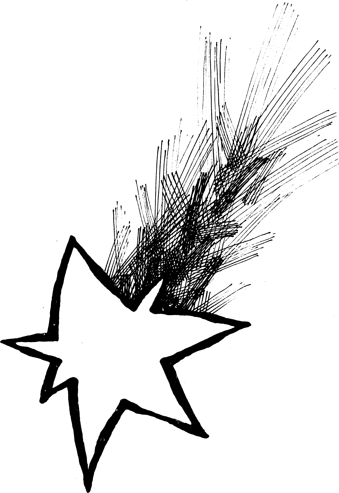
<i>...tomu, kdo pro žal hlavu věší,
na nebi hvězda září...</i>

## 399 Zpívám, Pane

*Jiří Gruber, Jiří Joran*

*Ref:* (: Zpívám, Pane, meč v ruce mám. :)

(1) Nebe i země, stvoření tvé, chválí tě zpěvem svým, já s nimi zpívám k slávě tvé, vždyť (: kdo tě chválí, meč v ruce má. :) 4x

(2) Každé tvé slovo, které já znám, dává mi sílu žít, svítí nám ve tmě pravda tvá, vždyť (: kdo zná pravdu, meč v ruce má. :) 4x

(3) S důvěrou volám, bídu svou znám, tvou pomoc vyhlížím, zní prosby mé až před trůn tvůj, vždyť (: kdo se modlí, meč v ruce má. :) 4x

*Ref:* (: Zpívám, Pane, meč v ruce mám. :)

(4) Pán Ježíš zemřel, odpustil nám, má zloba utichá, každý bližní je bratr můj, vždyť (: kdo odpouští, meč v ruce má. :) 4x

(5) Ráno až přijdeš, utišíš pláč chudých, tichých, plačících, skončí mé dlouhé čekání, vždyť (: ten, kdo doufá, meč v ruce má. :) 4x

(6) Vítězná píseň, kterou já znám, dál nese radost mou, zní andělů zpěv, zpívám též, vždyť (: kdo ti zpívá, meč v ruce má. :) 4x

## 400 Zrána cestou sotva známou

*Jaromír Plíšek*

(1) Zrána cestou sotva známou vzhůru mě potáhnou, (: cestou sotva známou vzhůru mě potáhnou, :) z dáli slyším trouby znít.

(2) Já však věřím, že se sejdem s mými bratry v ten den, (: věřím, že se sejdem s mými bratry v ten den, :) z dáli slyším trouby znít.

(3) Já však věřím, že se sejdem s tvými posly v ten den, (: věřím, že se sejdem s tvými posly v ten den, :) z dáli slyším trouby znít.

(4) Já však věřím, že se sejdem s Pánem Kristem v ten den, (: věřím, že se sejdem s Pánem Kristem v ten den, :) z dáli slyším trouby znít.

(5) Zrána cestou sotva známou vzhůru mě potáhnou, (: cestou sotva známou vzhůru mě potáhnou, :) z dáli slyším trouby znít.

## 401 Zůstaň s námi

*Miloš Rejchrt*

*Ref:* Zůstaň s námi, Pane, když se stmívá, zůstaň s námi, den se nachýlil. Zůstaň s námi, už se připozdívá, zůstaň s námi, když ubývá sil.

(1) Nad bázlivou duší a nad slabým tělem slituj se, Pane, lačným chléb svůj dej, u svého stolu teď buď nám hostitelem a v prázdný kalich nové víno vlej.

(2) Otevírej oči, které nevidí tě, nevidí pravdu, znají jenom klam. Důvěru probuď v nás, jakou mívá dítě, promluv k nám, Pane, řekni Pokoj vám!

(3) Do svých ran vlož ruce skleslé pochybností, zrno v zem vsáté zas nám připomeň, pozvání k slávě tvé, bílé roucho hostí, čas, který chystá přebohatou žeň.

## 402 Zůstávej s námi, Ježíši

*Luboš Svoboda, Pavla Zachařová*

(1) Zůstávej s námi, Ježíši, ať stále o tom vím, že ruka moje v ruce tvé a život můj je darem tvým.

*Ref:* Ježíši, s námi zůstávej, ať stále o tom vím. Svou blízkost najevo mi dej, já na věky chci býti tvým.

(2) Zůstávej s námi, Ježíši, buď stále prostřed nás, v spojení tří anebo dvou ve jménu tvém zní spásy hlas.

(3) Zůstaňte v milování mém, tak voláš ty nás sám, včera, dnes, zítra stále týž, můj Ježíši, buď Pánem nám.

## 403 Sám nám všechno dá

*Jaromír Plíšek*

(1) Zve nás, a sám, zve nás, a sám, zve nás, a sám nám šaty dá.

*Ref:* U bran jeho království se pustíme strachů svých půjdem dál jenom s vírou, s vírou, s vírou, těžko na to vyzrajem, náš Bůh zve nás jen s vírou, s vírou, den co den můžem dál jenom s vírou.

(2) Zve nás, a sám, zve nás, a sám, zve nás, a sám nám boty dá.

(3) Zve nás, a sám, zve nás, a sám, zve nás, a sám nám pokoj dá.

## 404 Vlak

*Míla Esterle*

*Ref:* Zvedej se z pózy pohodlný, těžký je dnes za bráchou jít. Tvůj Pán tě volá , vstávej, vlak ti ujíždí, jo tak se zvedej.

(1) Každej den potkáš tolik lidí, vidíš jen tváře lhostejný, svůj úsměv schováváš, tvář stejnou nasadíš, za co se stydíš?

(2) Potkáš sem tam i tváře známý, hledáš pár slůvek příjemných. Spěcháš a nemáš čas kus místa v sobě mít, radši se klidíš!

(3) Přečíst si zkoušej slova svatý, v bližních že Pána potkat smíš. Svou bránu zavřít chceš jim, nebo otevřít, sám jednou sklidíš!

*Ref:* Zvedej se z pózy pohodlný, těžký je dnes za bráchou jít. Tvůj Pán tě volá , vstávej, vlak ti ujíždí, jo tak se zvedni a za bratrem kráčej, koukej jít, proč jinak na světě chtěl bys být? Všechno, co potřebí, máš, slyšíš to volání.

## 405 Milosrdný samaritán

(1) Že celý svět jsi odkázal nám, známe, však přece často nečiníme nic, co by se tobě mohlo líbit, Pane, dej do našeho srdce lásky víc.

*Ref:* Víru nám dej, slávu tvého jména ať spatří celý svět.

(2) A tam, kde trpí někdo z našich bližních, ať nevšímavě nejdem' kolem něj. Nauč nás činit svoji svatou vůli, odvahu k službě lásky sám nám dej.

(3) Pomoz nám, když jdem tímto dnešním světem, vidět a přijmout svatou vůli tvou. Jít s tebou ke všem nemocným tvým dětem a podat tvoji ruku pomocnou.

(4) Dej naději nám pro celý svět, Pane, ať není místa bez tvé pomoci, ať přestanou - kde tvá se vůle stane, rozbroje, války, hlad a nemoci.

## 406 Ty i já

*Josef Dolejš, Zdeněk Svoboda*

(1) Že jsou mezi námi smutné děti, kterým vzali zář, jež s nebe letí,

*Ref:* Za to nesem vinu všichni, ty i já, za to nesem vinu všichni, ty i já!

(2) Že těm, kteří umírají hladem, bez milosti misku s rýží kradem,

(3) Že se lidé denně zabíjejí a že žijí v černé beznaději,

(4) Že je hvězda lidství potemnělá, ačkoliv by jasně zářit měla,

(5) Že náš svět má otevřené rány a že k řetězům je přikovaný,

## 407 Návštěva v pekle

*Svatopluk Karásek*

(1) Že už mám po smrti měl jsem sen jsem v nebi nebo v pekle kde to jsem (: hle dva muži stojí po levici mojí to Jidáš a Ježíš spolu tiše rokují. :)

(2) Andělé lidi a čerti rohatí muži ženy děti a všichni tu jsou nahatí (: je to nebe nebo peklo sláva či soud lidí od ohňů je tu teplo a nikdo se tu nestydí :)

(3) Sem v nebi nebo v pekle kde to sem Kriste ty mně pověz kde to sem (: už tady neotravuj s tou starou otázkou raději si poskoč vešels v radost mou :)

(4) Řikaj že jak jsem z kříže sestoupil že prej sem na nebe vystoupil (: to však není pravda já nešel k Otci nahoru já z pekelný brány šel navždy strhnout závoru :)

(5) Vstoupil jsem do pekel nejhlubších vyhlásil jsem v místech nejtvrdších dost skřípění zubů dost duší smažení staré viny nemaj váhu všichni maj bejt blažení pryč je doba kdy za hřích duše hynula odpouštějí se vám provinění minulá

(6) Mistře já jsem trochu naštvaný jak je to tady všechno srovnaný (: vždyť jeden za pravdu trpěl a věděl proč a zač druhej po ní šlapal a ve svých dnech byl jenom sráč. :)

(7) Kdo hledá a najde a vejde v radost mou kdo se dá marnosti zůstane před branou (: a kdo z vás už našel kdo staré opouští ať netížej ho viny kterých se denně dopouští :)

(8) Jdi a nehřeš více halelu jdi a nehřeš více halelu (: dneska na hřích kašlou lidi z panelů ty jdi a nehřeš více a Bohu zpívej halelu :)

## 408 Ženeme se sami

*Jaromír Křivohlavý*

*Ref:* Ženeme se sami v sobě moudří, před tvou tváří neumíme stát, odedávna pohrdáme bouří, neumíme milost přijímat.

(1) Tvá láska dopadá na neúrodnou zemi, prosíme, otevři ji cestu mezi všemi.

(2) Ó, Pane, smiluj se, my taky nejsme jiní, vždyť nikdo neslyší, když řekneš, že jsme vinni.

(3) Jen těžko přijímá, kdo neví, jak se dává, když lásku nabízíš, je ticho, to se stává.

## 409 Živý je Pán

*Ref:* Živý je Pán, živý je Pán, živý je Pán na věky věků.

(1) Nenarodí-li se kdo z vody a z Ducha, nemůže vejít do Království, jistě žádný neuvidí nebeské království, jestliže se znovu nenarodí.

(2) Nebo tak Bůh miloval svět, že syna svého jednorozeného za nás dal, aby každý, kdo uvěří v něho nezahynul, ale měl s ním život věčný v nebi.

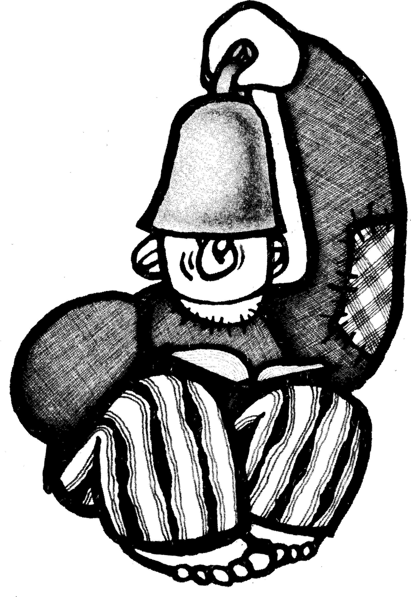

## 410 Blahoslavení čistého srdce

Blahoslavení čistého srdce,

Nebo oni Boha viděti budou.

Amen, amen, amen.

## 411 Bratři, pokoj vám

Bratři, pokoj vám, bratři, pokoj vám, sbohem sbohem,

bratři, pokoj vám, bratři, pokoj vám, sbohem, sbohem.

## 412 Čeho třeba

Čeho třeba, Bůh nám dá,

chléb i srdce radostná.

## 413 Dnes chvalte Pána

Dnes chvalte Pána všichni lidé, všichni lidé,

dnes chvalte Pána všichni lidé.

Dnes chvalte Pána, dnes chvalte, dnes chvalte,

dnes chvalte, dnes chvalte Pána všechny národy.

## 414 Dona nobis pacem

Dona nobis pacem, pacem, dona nobis pacem.

Dona nobis pacem, dona nobis pacem.

Dona nobis pacem, dona nobis pacem.

## 415 Gloria

Gloria, glorie, soli Deo Gloria, gloria,

soli Deo, soli Deo, soli Deo Gloria, soli Deo gloria,

Soli Deo, soli Deo, soli Deo gloria, gloria, gloria, gloria.

## 416 Ha šalóm

Ha šalóm l maan ha amin, ha amin l maan ha šalom.

Dzum gali gali gali dzum gali gali.

Dzum gali gali gali dzum gali ga.

## 417 Chvalte Pána

(1) Halelu, halelu, halelu, haleluja, Pána chvalte. Halelu, halelu, halelu, haleluja, Pána chvalte.

(2) Pána chvalte, haleluja, Pána chvalte, haleluja, Pána chvalte, haleluja, Pána chvalte.

(3) Lobet den Herrn

(4) Lopuez le Seigneur

(5) Praise the Lord

(6) Miro Devloro

## 418 Chval Pána svého

Chval Pána svého písní

a jásej radostí a jásej radostí.

## 419 Chvála má

*Petr Chlouba*

Chvála má buď vzdána Pánu, vládne sám je Král všech králů.

Tvá je moc, čest i sláva, která nepřestává.

Smrt, život, andělé, mocnosti zlé neodloučí nás od lásky tvé, proto:

## 420 Chvalte jméno Pána

*Tomáš Najbrt*

*Ref:* Chvalte jméno Pána, chvalte jeho jméno nad zem, nebe vznešené, nad vše, co je stvořené, haleluja, chvalte jeho jméno.

(1) Hlaholem trub chvalte Pána, citerou ho chvalte, chvalte ho též strunami, flétnou chvalte, chvalte nebes Pána, chvalte ho tam na výsostech, chvalte země Pána sníh, oheň, hlubiny mořské.

(2) Tóny bubnů chvalte Pána, mládenci a dívky, chvalte jej cimbály zvučné, starci s dítky. Všeliký duch chvály vzdávej, žalmy znamenité. Zástupové slávy chvalte jej z moci hlasité.

## 421 Chvalte Pána

Chvalte Pána, chvalte jej

a oslavujte jeho jméno každé ráno znovu,

radostně jemu zpívejte.

## 422 Jak dobré a utěšené

(1) Jak dobré a utěšené, žijí-li bratři v lásce, jak dobré a utěšené, žijí-li bratři v lásce. Radost mají, v lásce když přebývají, radost mají, v lásce když přebývají.

(2) Jak dobré a utěšené, žijí-li sestry v lásce, jak dobré a utěšené, žijí-li sestry v lásce. Radost mají, v lásce když přebývají, radost mají, v lásce když přebývají.

(3) Jak dobré a utěšené, žijí-li všichni v lásce, jak dobré a utěšené, žijí-li všichni v lásce. Radost mají, v lásce když přebývají, radost mají, v lásce když přebývají. chad

(4) Hinne ma tov umma najim, ševet achim gam jachad.

## 423 Jak dobré slavit Pána

Jak dobré slavit Pána a v srdce zátiší tvé jméno, Nejvyšší,

ctít zpěvem žalmů zrána, zrána.

## 424 Ježíš Kristus je tentýž

Ježíš Kristus je tentýž včera i dnes i na věky.

Haleluja, amen.

## 425 Jubilate Deo

Jubilate Deo, jubilate Deo, alleluia.

## 426 Každý kout má prozářit

*Miroslav Heryán*

Každý kout má prozářit nedělního jitra svit,

Ježíš slavně z hrobu vstal, nad smrtí je Pán a Král.

## 427 Můj klenote nejkrásnější

Můj klenote ze všech nejkrásnější,

můj dobrý Pane Ježíši,

jak dobrá je tvá vláda.

## 428 Můj Pane, tobě budu zpívat

Můj Pane, tobě budu zpívat,

Neb den co den jsi Bohem věrným byl.

Jen tebe chci svým hlasem vzývat,

dej by tvůj Duch mě silou obdařil.

## 429 Neboj se nic!

*Miroslav Heryán*

Neboj se nic, já s tebou jsem.

Neboj se nic, neb já s tebou jsem, neb já s tebou jsem.

## 430 Od východu slunce

Od východu slunce až do jeho západu

oslavujte Hospodina, oslavujte Hospodina.

Vom Aufgang der Sonne bis zu ihrem Niedergang,

sei gelobet der Name des Herrn,

sei gelobet der Name des Herrn.

## 431 Pána chval

Pána chval, Pána chval,

neboť on je dobrý,

jeho milosrdenství

trvá na věky.

## 432 Pane, zůstaň s námi

Pane, zůstaň s námi,

vždyť už je k večeru

a den se schyluje.

## 433 Píseň novou Pánu zpívejte

Píseň novou, novou, Pánu zpívejte.

## 434 Sanctus

Sanctus. Sanctus. Sanctus. Sanctus.

## 435 Surrexit Christus hodie

Surrexit Christus hodie.

Allelujah, allelujah allelujah, allelujah.

## 436 Úzkou bánou

*Bohdan Mikolášek*

Úzkou bránou půjdu raději, nebudu sám, znám tvou naději

půjdu tam, tam kde sálá, tam, kde je naděje, láska stálá,

úzkou bránou, úzkou bránou.

## 437 Vše marnost pouhá

*Míla Esterle*

Vše marnost pouhá, ty zůstáváš, i nás v život nový povoláš.

Ty zůstáváš, ty zůstáváš, všem marnost pouhá, ty zůstáváš,

ty zůstáváš, ty zůstáváš, i nás v život nový povoláš.

## 438 Vzdejte chválu Hospodinu

Vzdejte chválu Hospodinu!

## 439 Za milost tvou

(1) Za milost tvou a pokrm tvůj buď tobě dík náš vzdán.

(2) Za slovo tvé a denní chléb buď tobě dík náš vzdán.

## 440 Adoramus te Domine

Adoramus te Domine.

## 441 Agnus Dei

Agnus Dei qui tollis peccate mundi. Miserere nobis.

Agnus Dei qui tollis peccate mundi. Miserere nobis.

Agnus Dei qui tollis peccate mundi. Dona nobis pacem.

## 442 Benedictus

Benedictus qui venit, benedictus qui venit

in nomine, in nomine, in nomine Domini.

## 443 Zůstaňte zde (Bleibet hier)

Zůstaňte zde a bděte se mnou, bděte a proste, bděte a proste.

Bleibet hier und wachet mit mir, wachet und betet, wachet und betet.

Stay with me, remain here with me, watch and pray, watch and pray.

## 444 Bless the Lord

Bless the Lord, my soul

and bless His holy name

Bless the Lord, my soul

He rescues me from death.

## 445 Cantate Domino

Cantate Domino, alleluia, alleluia!

Jubilate Deo.

## 446 Credo

Credo in unum Deum, credo in unum Dominum,

credo in unum Deum, Credo in unum Spiritum.

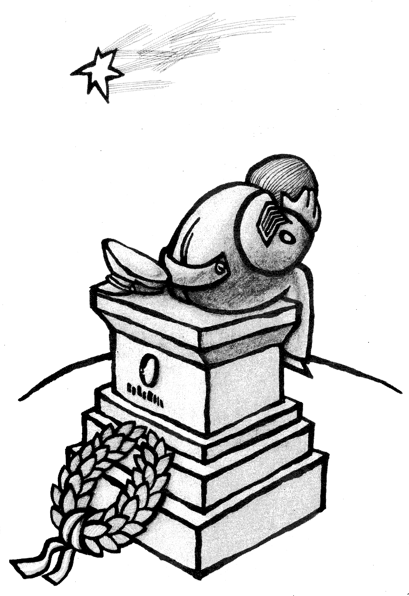
<i>...člověče, chceš být vládcem, chceš vrýt svůj obraz dnům...</i>

## 447 Každý den (El Senyor)

*Miroslav Heryán*

Každý den Pán mi sílu dává, písní mou je můj Pán. On se stal mým spasením, když kráčím s ním, nemusím se bát, když kráčím s ním, nemusím se bát.

El Senyor és la meva força, el Senyor el meu cant. Ell m'ha estat la salvació, (: en Ell confio i no tinc por. :)

In the Lord I'll be ever thankful, in the Lord I will rejoice, Look to him, do not be afraid, (: in him rejoising the Lord is near. :)

Pan jest mocą swojego ludu Pieśnią moją jest Pan, moja tarcza i moja moc On jest mym Bogiem nie jestem sam w Nim moja siła nie jestem sam

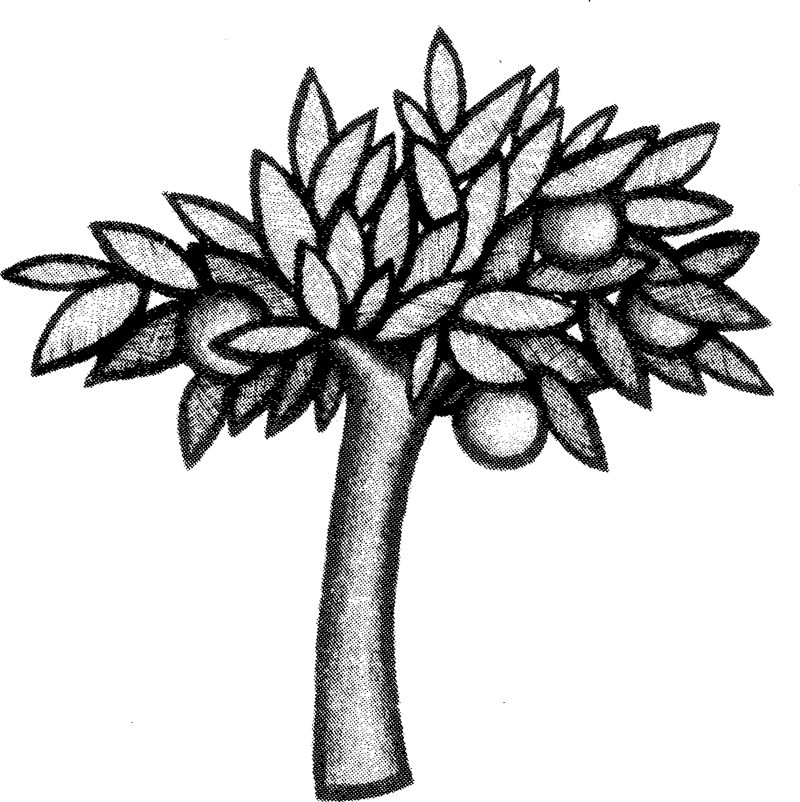

## 448 Gloria (1)

Gloria, gloria, in excelsis Deo,

Gloria, gloria, alleluia!

Et in terra pax hominibus

bone voluntatis.

## 449 Gloria (2)

Gloria, gloria in excelsis Deo,

gloria, gloria, alleluia, alleluia.

Sláva buď, sláva buď na výsostech Bohu.

Sláva buď, sláva buď, haleluja, haleluja.

## 450 Hosana

Hosana, hosana, hosana in excelsis.

Hosana, hosana, hosana na výsostech.

## 451 Jubilate Deo

Jubilate Deo omnis terra.

Servite Domino in leatitia.

Alleluia, alleluia, in leatitia,

alleluia, alleluia, in leatitia.

## 452 Kyrie eleison (1)

Kyrie, Kyrie, Kyrie eleison.

Kyrie, Kyrie, Kyrie eleison.

## 453 Kyrie eleison (2)

Kyrie, Kyrie, eleison.

## 454 Kyrie eleison (3)

Kyrie eleison, eleison.

## 455 Kyrie eleison (4)

Kyrie, Kyrie, Kyrie eleison,

Kyrie eleison, eleison.

## 456 Před tebou (La ténèbre)

*Miroslav Heryán*

Před Tebou, Pane, temno ztrácí sílu svou,

noc odchází a den jasně září.

La ténèbre n'est point ténèbre devant toi:

la nuit comme le jour est lumière.

## 457 Laudate omnes gentes

Laudate omnes gentes, laudate Dominum,

laudate omnes gentes, laudate Dominum.

Oslavte Hospodina, všichni národové,

Oslavte Hospodina, všichni národové!

## 458 Magnificat

Magnifica, magnificat,

magnificat anima mea Dominum,

Magnifica, magnificat,

magnificat anima mea.

Magnificat,

magnificat,

anima mea Dominum, anima mea Dominum

## 459 Miseriordias Domini

Misericordias Domini in aeternum cantabo.

## 460 Nada te turbe

Nada te turbe, nada te espante:

Quien a Dios tiene, nada le falta.

Nada te turbe, nada te espante:

Solo Dios basta.

## 461 Nebojte se

Nebojte se, radujte se,

Kristus slavný vítěz z hrobu vstal.

## 462 O Lord, hear my prayer

O Lord, hear my prayer,

o Lord, hear my prayer,

when I call answer me.

O Lord, hear my prayer,

o Lord, hear my prayer.

Come and listen to me.

## 463 Ostende nobis

Ostende nobis Domine, misericordiam tuam.

Amen, amen. Maranatha, maranatha.

## 464 Salvator mundi

Salvator mundi, salva nos,

Salvator mundi, salva nos,

salva nos, salva nos,

Salvator mundi, salva nos.

## 465 Sanctus

Sanctus, sanctus, sanctus Dominus,

Deus Sabaoth, Deus Sabaoth.

Svatý, svatý, svatý Hospodin,

Pán Bůh zástupů, Pán Bůh zástupů.

## 466 Surrexit

Surrexit Dominus vere, alleluia, alleluia,

Surrexit Christus hodie, alleluia, alleluia.

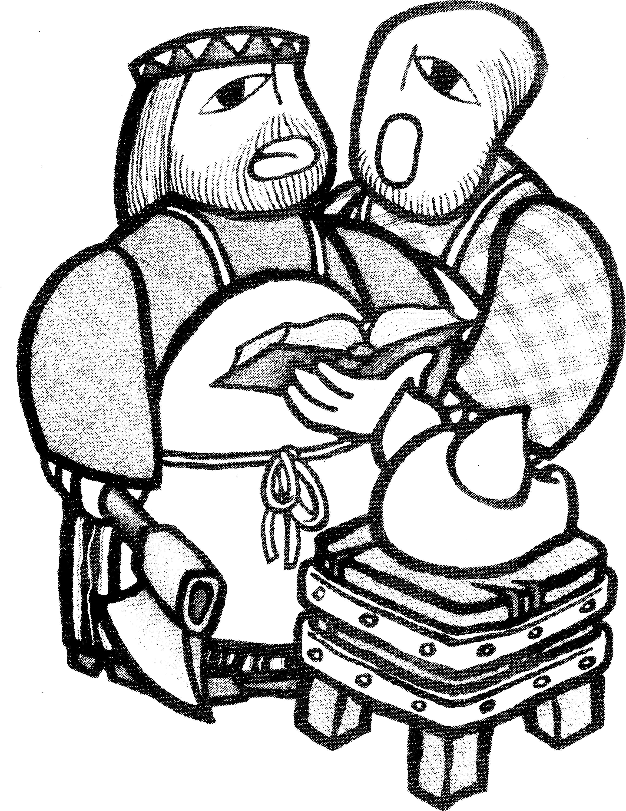
<i>Kristus je má síla
KANCIONÁL ŘEZNÍKŮ NOVOMĚSTSKÝCH</i>

## 467 Ubi caritas

Ubi caritas et amor, ubi caritas, Deus ibi est.

Kde je dobrota a láska, kde je dobrota, tam je také Bůh.

## 468 Uže ně ja živu

Uže ně ja živu, no řivjot vo mně Christos,

živjot vo mně Christos, živjot vo mně Christos.

## 469 Veni Creator

Veni Creator, veni Creator, veni creator Spiritus.

Duchu svatý přijď, Duchu svatý přijď, Tvůrce Duchu svatý přijď.

## 470 Veni Sancte Spiritus

Veni Sancte Spiritus.

Tvůrce Duchu svatý přijď.

## 471 Haleluja

*Dorothea Kellerová*

Haleluja, haleluja, haleluja, haleluja, haleluja, haleluja, haleluja, haleluja, haleluja.

## 472 Kyrie

*Dorothea Kellerová*

Pane, smiluj se, smiluj se, Kriste, smiluj se, smiluj se, Pane smiluj se, smiluj se. Amen.

## 473 Gloria

*Dorothea Kellerová*

Sláva na výsostech Bohu, sláva na výsostech Bohu, a na zemi pokoj lidem dobrá vůle. Sláva na výsostech Bohu.

## 474 Credo

*Dorothea Kellerová*

Věřím, věřím v Boha Otce všemohoucího, Stvořitele nebe i země, i v Ježíše Krista, Syna jeho jediného, Pána našeho, jenž se počal z Ducha svatého, narodil se z Marie Panny, trpěl pod Pontským Pilátem, byl ukřižován a umřel a byl pohřben, sestoupil do pekel, třetího dne vstal z mrtvých, vstoupil na nebesa, sedí na pravici Boha, Otce všemohoucího, odkud přijde soudit živé i mrtvé. Věřím v Ducha svatého, svatou církev obecnou, svatých obcování, hříchů odpuštění, těla z mrtvých vzkříšení a život věčný. Amen.

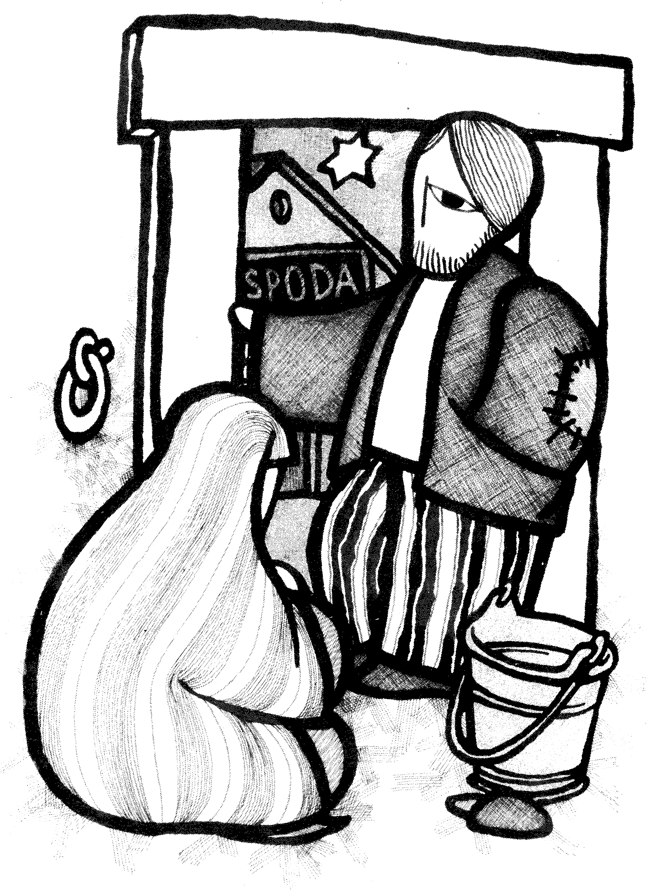
<i>...srdce lidské tvrdé bývá, není v světě místa...</i>

## 475 Sanctus

*Dorothea Kellerová*

Svatý, svatý, svatý, svatý je Hospodin zástupů, celá země je plná jeho slávy.

## 476 Agnus Dei

*Dorothea Kellerová*

Beránku Boží, Beránku Boží, který snímáš hřích světa, smiluj se nad námi. Beránku Boží, Beránku Boží, který snímáš hřích světa, smiluj se nad námi. Beránku Boží, Beránku Boží, který snímáš hřích světa, daruj nám pokoj.

## 477 Domine non sum dignus

*Dorothea Kellerová*

Pane nejsem hoden, Pane nejsem hoden, abys vstoupil pod mou střechu, ale řekni jen slovo a má duše bude uzdravena.

## 478 Magnificat anima mea

*Dorothea Kellerová*

Duše má velebí Pána, duše má velebí Pána a duch můj jásá v Bohu Spasiteli, že se sklonil ke své služebnici v ponížení, že se mnou učinil veliké věci, ten které je mocný

## 479 Amen

*Dorothea Kellerová*

Amen, amen, amen, amen, amen.

## 480 Vstup

*Petr Eben, Zdena Lomová*

*Ref:* Čeká mě den a když Tě potkám, Pane, ponesu lehčej jeho žár. Čeká mě noc a cokoliv se stane, nestihne moji duši zmar.

(1) (: Už spojily se naše cesty, Tys nám dal prohlédnout. :) A bratru platí odpuštění, úsměv můj a pozdravení, k bratru chci teď usednout.

(2) (: Už spojily se naše cesty, tys nám dal prohlédnout. :) A tobě platí naše prosby, bychom byli společenství, kterému dáš pomoc svou.

(3) (: Už spojily se naše cesty, tys nám dal prohlédnout. :) A upřímné jsou naše prosby, abys nám dal odpuštění, mysl vždycky pokornou.

## 481 Mezizpěv

*Petr Eben, Zdena Lomová*

(1) Nám radostí jsi, Pane, ty, a já to dlouho nevěděl, snad proto,že jsem neviděl, jak slza v slunci roztávala. Nám radostí jsi, Pane, ty, jsi, Pane, ty.

(2) Nám radostí jsi, Pane, ty, a já to dlouho nevěděl, snad proto, že jsem necítil, že dětská ruka je tak malá. Nám radostí jsi, Pane, ty, jsi, Pane, ty.

(3) Nám radostí jsi, Pane, ty, a já to dlouho nevěděl, to proto, že jsem nepřijal slova, jež pokoj znamenala. Nám radostí jsi, Pane, ty, jsi, Pane, ty.

## 482 Obětování

*Petr Eben, Zdena Lomová*

*Ref:* Chleba a víno neseme, přijmi ty dary, prosíme.

(1) Mám prázdné ruce, Pane, že skutkem jsem je nenaplnil, mám těžké nohy, Pane, bližnímu jsem se nepřiblížil.

(2) Mám němá ústa, Pane, vždyť soucit svůj sem odepřel, jsem uzavřený, Pane, dej, abych všem se otevřel.

(3) Mám v sobě bolest, Pane, že tolik věcí zranilo, mám také touhu, Pane, aby tě srdce poznalo.

<i>...Petra v srdci zrada pálí...</i>

## 483 Přijímání

*Petr Eben, Zdena Lomová*

V čas úzkosti, v čas podmračený, ať, Pane, jedno jsme, čas naděje je neproměnný, před Tebou stojíme. Ať přijímám Tě jako lék na každou starost, zármutek a v neštěstí se svěřuji. V čas úzkosti, v čas podmračený, ať, Pane, jedno jsme, čas naděje je neproměnný, před Tebou stojíme.

V čas jásavý, v čas rozjasněný ať, Pane, jedno jsme, čas naděje je neproměnný, před tebou stojíme. Ať na tebe zas těším se a s radostí svou svěřím se, shledání s tebou oslavím. V čas jásavý, v čas rozjasněný ať, Pane, jedno jsme, čas naděje je neproměnný, před tebou stojíme.

## 484 Závěr

*Petr Eben, Zdena Lomová*

(1) Za to, že v stromech přečtu život a jaro v pevné závěji, že potkal jsem tě dneska ráno, za to ti, Pane, děkuji.

(2) Za to, že mnoho věnovals mi, chválit tě mohu vroucněji, že vzal sis, co by tížilo mne, za to ti, Pane, děkuji.

(3) Za to, že doved jsi mě blízko, s bratry i já tě miluji, že potkal jsem tě také večer, za to ti, Pane, děkuji.

## 485 Vstup

*Václav Renč, Jan (Křtitel) Václav Renč*

(1) Omyjte prach a smutek z tváří, popsaných neklidem, vychází slunce na oltáři, otvírá v duši den. Omyjte prach a smutek z tváří, spojte se s Ježíšem, vychází slunce na oltáři, nad celou Boží zem.

Můj bratr strom, a můj bratr pták, zpívají Pánu světa dík, já v chóru tom jsem jen tichý žák a Boží lásky učedník.

(2) Jsem jenom klásek mezi klasy, tvoříme Boží lán, jak pro zpěv lásky mnohohlasý volá Své děti Pán. Jsem jenom klásek mezi klasy, chci v jeho Slunci zrát, a pro zpěv lásky mnohohlasý, celý se nachystat.

Vím o sestrách, vím o bratřích, co zatím nenašli Tvůj dům, brání jim strach, a snad i můj hřích, zpívám i za ně k nebesům. Amen.

## 486 Mezizpěv

*Václav Renč, Jan (Křtitel) Václav Renč*

(1) Jednou, jednou toužím slyšet hlas, hlas který nezaniká, jednou, jednou a vždycky znova zas. Hlas, který nezaniká na poušti, hlas, který laská a odpouští.

*Ref:* Hlas tvůj, Pane můj, prameni věčně nových sil. Hlas tvůj, Pane můj, abych žil. Hlas Tvůj, Pane můj, prameni věčně nových sil. Hlas Tvůj, Pane můj, abych žil.

(2) Nyní, nyní z mraků kolem nás, vyšlehne rosa a zář. Nyní, nyní se ozve živý hlas. Hlas, který nezaniká na poušti, hlas, který laská a odpouští.

## 487 Obětování

*Václav Renč, Jan (Křtitel) Václav Renč*

(1) Každé ráno dostávám darem nový den, budou v něm růže, bude v něm trní, já vím. Každý večer poznávám, jak byl naplněn, byly v něm růže, bylo v něm trní, a já si o něm s Tebou vyprávím, s Tebou vyprávím.

Já vím, ty dny i s růžemi a trním, já vím, jenže sám je nikdy nenaplním, jen Tvá láska, ta naplňuje každý den, jen Tvá láska, ta naplňuje každý den.

(2) Kamkoliv jsem ruce vztáh' v proudu jar a zim, chtěl jsem jen růže, a žádné trní či vzlyk. Teď vím, i když po cestách růže vysázím, bez tebe může vzejít jen trní. Ty sám buď mého srdce zahradník, buď můj zahradník.

Sám víš, jak těžce rodí země lidí, sám znáš tu trpkou žeň, co pýcha sklidí, jen tvá láska mě zúrodňuje každý den, jen tvá láska mě zúrodňuje každý den.

(3) Nyní k tobě přicházím se vším, cos mi dal, nesu ti růže, nesu ti trní, ty víš. Rozumíš mým nesnázím, zpěvu slz i chval, všechny mé růže, všechno mé trní svou láskyplnou rosou napájíš, rosou napájíš.

Jen v ní, v té rose, která nevysychá, jen v ní mé srdce jako ditě dýchá a tvá láska mě proměňuje každý den, a tvá láska mě proměňuje každý den.

## 488 Přijímání

*Václav Renč, Jan (Křtitel) Václav Renč*

(1) Ústa otvírám jen pro píseň lásky, Králi tichý, píseň má jsi ty sám. Jako tvé nebe a země, jsem i já tvůj chrám, chrámem duše ve mně ty sám.

*Ref:* La, la, la, la, la, má duše zpívá hosana, La, la, la, la, la, la, že byla k svatbě pozvaná. Hosana, hosana, hosana a s tebou smí žít.

(2) Ústa otvírám dnes pro pokrm věčný, opojený vínem z tvých svatých ran, když mě z trůnu svého kříže zveš do věčných bran, stále blíž a blíže, můj Pán.

(3) Ústa otvírám jen pro poselství lásky, lásko živá, skutky mluvící k nám. Z oblaků, květů i lidí tvůj dech přijímám, kéž i v bratru vidím tvůj chrám.

<i>...saka ani srdce nemaj upjatý...</i>

## 489 Závěr

*Václav Renč, Jan (Křtitel) Václav Renč*

(1) Věčně krásný Stvořiteli moří, k tobě plyne řeka za řekou. Kapky rosy, které v slunci hoří, svítí jim na cestu dalekou.

(2) Kapky rosy tvého požehnání zavlažují všechny moje dny a já si ji ve svém srdci chráním pro dnešek i pro den poslední.

(3) A můj bratr a má sestra také, sbíháme se k tobě ze všech stran, my jsme tvoje řeky křivolaké, ty jsi těch řek cíl a oceán.

(4) Nejsme však jen řeky, které plynou, řídíme je podle vlastních sil. Pomoz nám, ať nikdy naší vinou žádná řeka nemine svůj cíl.